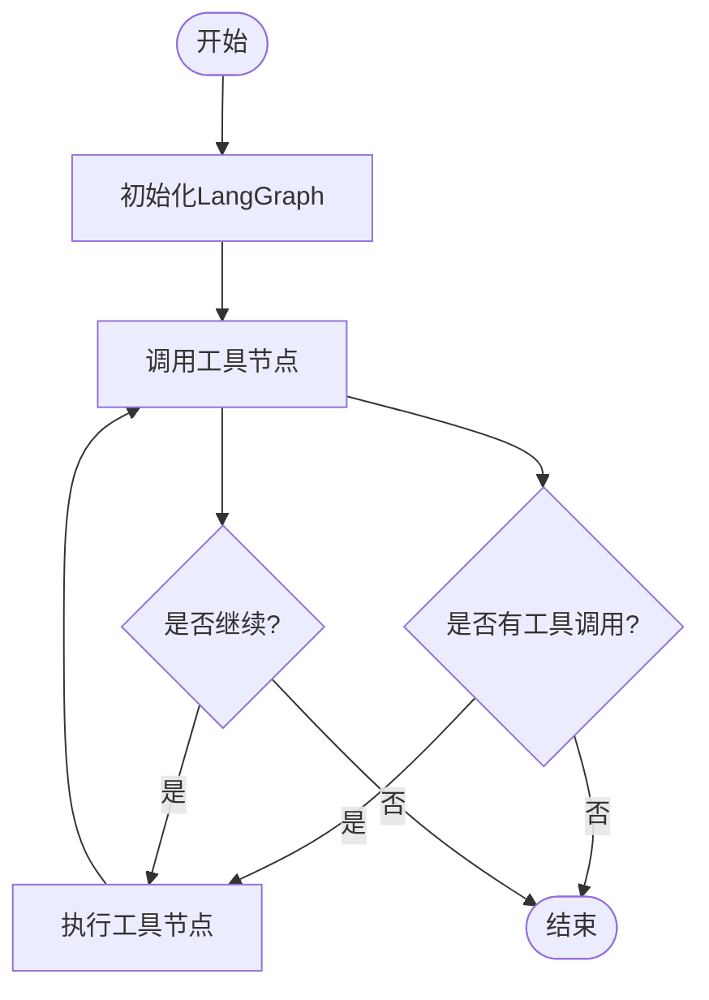
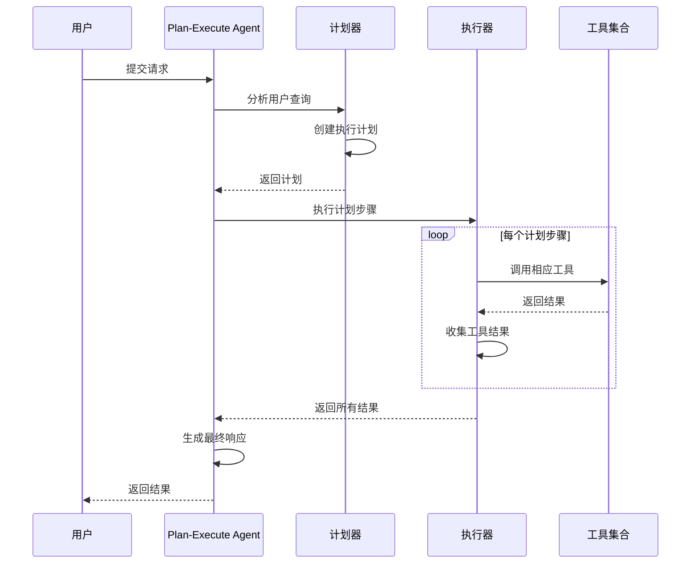
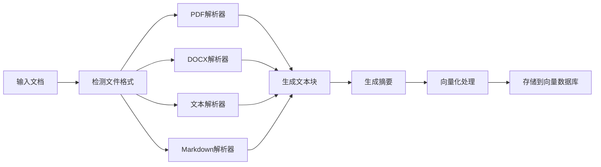
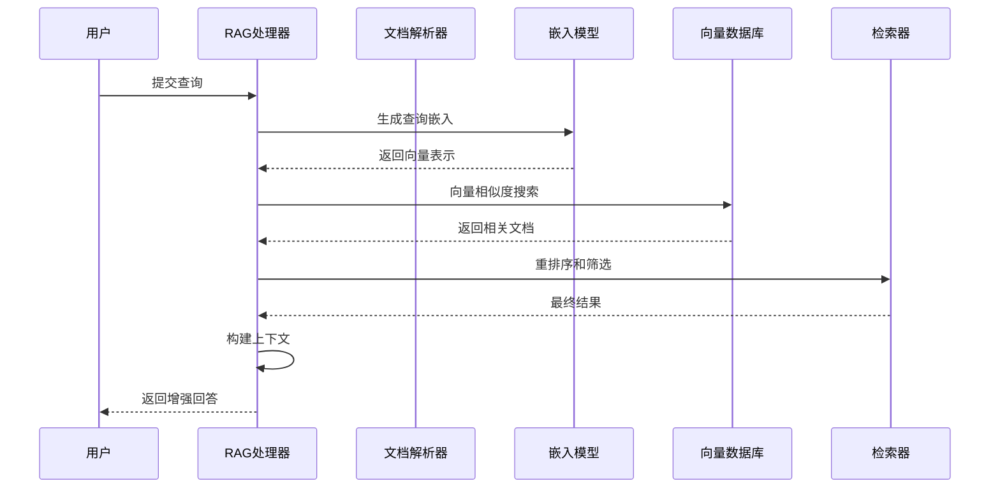
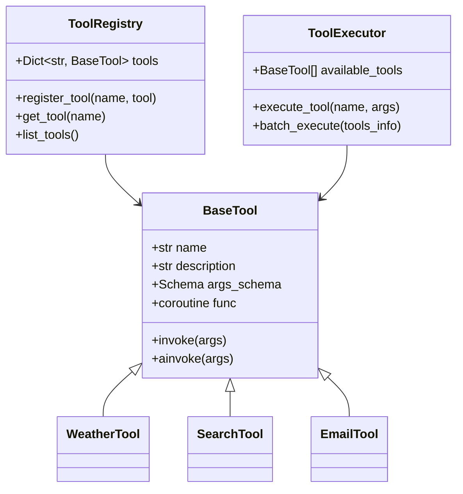
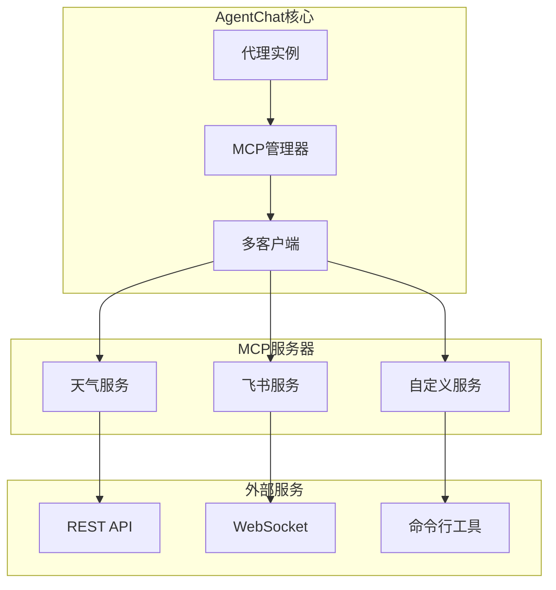
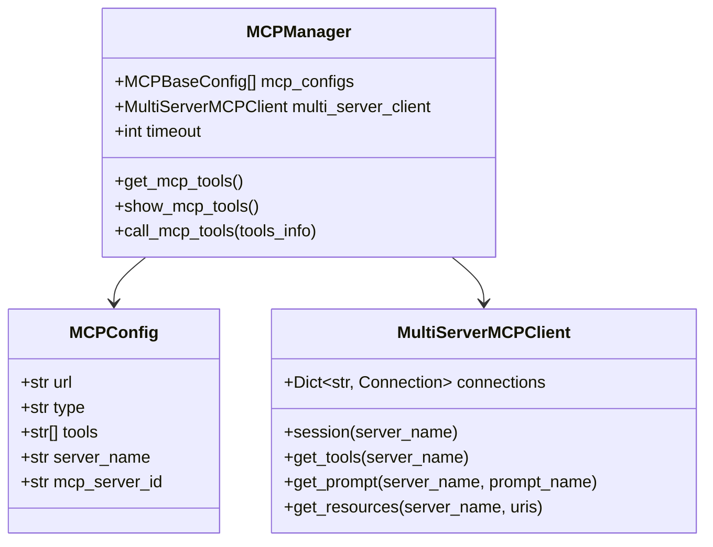
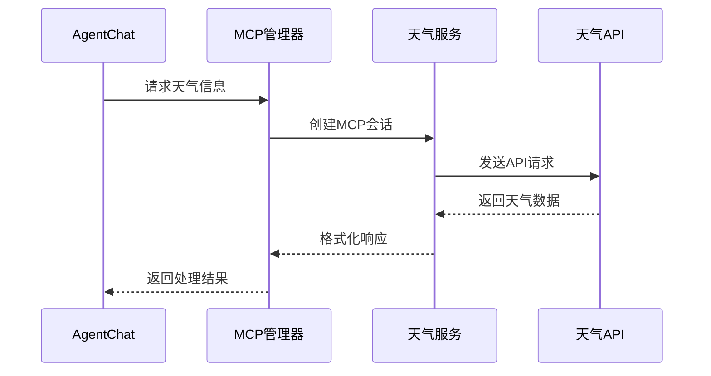
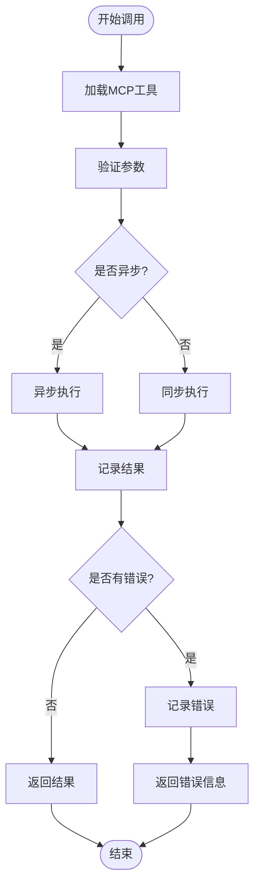
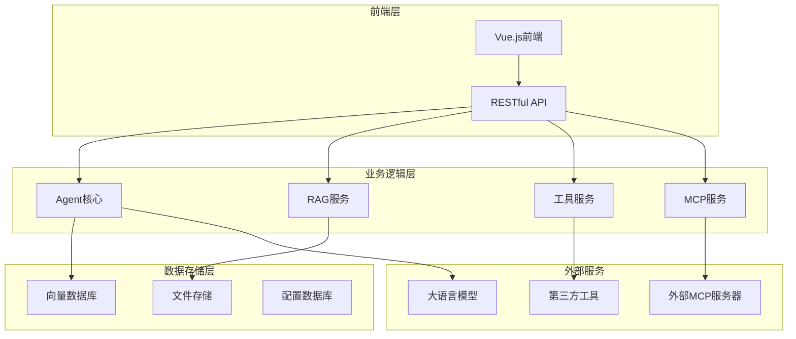

# AgentChat核心功能模块深度解析

**本文档引用的文件**

- [react_agent.py](https://github.com/Shy2593666979/AgentChat/tree/main/src/backend/agentchat/core/agents/react_agent.py)
- [plan_execute_agent.py](https://github.com/Shy2593666979/AgentChat/tree/main/src/backend/agentchat/core/agents/plan_execute_agent.py)
- [mcp_agent.py](https://github.com/Shy2593666979/AgentChat/tree/main/src/backend/agentchat/core/agents/mcp_agent.py)
- [parser.py](https://github.com/Shy2593666979/AgentChat/tree/main/src/backend/agentchat/services/rag/parser.py)
- [chroma.py](https://github.com/Shy2593666979/AgentChat/tree/main/src/backend/agentchat/services/memory/vector_stores/chroma.py)
- [embedding.py](https://github.com/Shy2593666979/AgentChat/tree/main/src/backend/agentchat/services/rag/embedding.py)
- [retrieval.py](https://github.com/Shy2593666979/AgentChat/tree/main/src/backend/agentchat/services/retrieval.py)
- [manager.py](https://github.com/Shy2593666979/AgentChat/tree/main/src/backend/agentchat/services/mcp/manager.py)
- [multi_client.py](https://github.com/Shy2593666979/AgentChat/tree/main/src/backend/agentchat/services/mcp/multi_client.py)
- [__init__.py](https://github.com/Shy2593666979/AgentChat/tree/main/src/backend/agentchat/tools/__init__.py)
- [mcp_weather.py](https://github.com/Shy2593666979/AgentChat/tree/main/src/backend/agentchat/mcp_servers/weather/mcp_weather.py)
- [main.py](https://github.com/Shy2593666979/AgentChat/tree/main/src/backend/agentchat/mcp_servers/lark_mcp/main.py)

## 目录
1. [引言](#引言)
2. [多Agent系统](#多agent系统)
3. [知识库系统](#知识库系统)
4. [工具生态系统](#工具生态系统)
5. [MCP集成](#mcp集成)
6. [架构概览](#架构概览)
7. [总结](#总结)

## 引言

AgentChat作为一个先进的多模态AI代理平台，集成了四大核心功能模块：多Agent系统、知识库系统、工具生态系统和MCP集成。这些模块协同工作，为用户提供智能化的对话体验和强大的功能扩展能力。

## 多Agent系统

多Agent系统是AgentChat的核心架构，支持多种执行模式和协作机制，能够根据不同的应用场景选择最适合的代理策略。

### Agent类型与执行模式

AgentChat实现了三种主要的Agent执行模式：

#### React Agent（推理-行动模式）
React Agent采用ReAct框架，通过推理和行动的循环来解决问题。

**图表来源**
- [react_agent.py](https://github.com/Shy2593666979/AgentChat/tree/main/src/backend/agentchat/core/agents/react_agent.py#L82-L96)

React Agent的核心特性包括：
- **流式输出支持**：实时传输事件和响应块
- **工具调用链**：支持多个工具的连续调用
- **状态管理**：维护工具调用计数和模型调用计数
- **错误处理**：完善的异常捕获和恢复机制

#### Plan-Execute Agent（计划-执行模式）
Plan-Execute Agent采用战略规划驱动的方法，先制定执行计划再执行工具调用。

**图表来源**
- [plan_execute_agent.py](https://github.com/Shy2593666979/AgentChat/tree/main/src/backend/agentchat/core/agents/plan_execute_agent.py#L95-L155)

#### MCP Agent（模型上下文协议代理）
MCP Agent专门处理与MCP服务器的交互，将外部服务作为工具集成到代理系统中。

### Agent配置与管理

Agent的创建和配置涉及多个方面：

| 配置项 | 描述 | 默认值 | 用途 |
|--------|------|--------|------|
| model | 对话模型实例 | OpenAI GPT-4 | 处理自然语言理解和生成 |
| system_prompt | 系统提示词 | DEFAULT_CALL_PROMPT | 定义代理行为规范 |
| tools | 工具列表 | [] | 可用的功能扩展 |
| mcp_config | MCP配置 | None | 外部服务集成 |

**章节来源**
- [react_agent.py](https://github.com/Shy2593666979/AgentChat/tree/main/src/backend/agentchat/core/agents/react_agent.py#L45-L54)
- [plan_execute_agent.py](https://github.com/Shy2593666979/AgentChat/tree/main/src/backend/agentchat/core/agents/plan_execute_agent.py#L71-L82)
- [mcp_agent.py](https://github.com/Shy2593666979/AgentChat/tree/main/src/backend/agentchat/core/agents/mcp_agent.py#L26-L32)

## 知识库系统

知识库系统提供了完整的RAG（检索增强生成）解决方案，支持多种文档格式的处理和向量化存储。

### 文档处理与解析

系统支持多种文档格式的自动解析：

**图表来源**
- [parser.py](https://github.com/Shy2593666979/AgentChat/tree/main/src/backend/agentchat/services/rag/parser.py#L15-L37)

### 向量存储与检索

AgentChat支持多种向量数据库：

#### ChromaDB集成
- **本地存储**：支持本地文件系统存储
- **远程连接**：支持HTTP客户端连接
- **持久化**：自动数据持久化机制
- **批量操作**：高效的批量插入和查询

#### Milvus集成
- **高性能检索**：支持大规模向量相似度搜索
- **混合检索**：结合Elasticsearch和Milvus的优势
- **多维度过滤**：支持复杂的查询条件

### RAG检索流程

**图表来源**
- [embedding.py](https://github.com/Shy2593666979/AgentChat/tree/main/src/backend/agentchat/services/rag/embedding.py#L11-L43)
- [retrieval.py](https://github.com/Shy2593666979/AgentChat/tree/main/src/backend/agentchat/services/retrieval.py#L5-L46)

**章节来源**
- [parser.py](https://github.com/Shy2593666979/AgentChat/tree/main/src/backend/agentchat/services/rag/parser.py#L13-L58)
- [chroma.py](https://github.com/Shy2593666979/AgentChat/tree/main/src/backend/agentchat/services/memory/vector_stores/chroma.py#L23-L255)
- [embedding.py](https://github.com/Shy2593666979/AgentChat/tree/main/src/backend/agentchat/services/rag/embedding.py#L1-L50)

## 工具生态系统

AgentChat提供了丰富的内置工具和灵活的扩展机制，支持各种实用功能的集成。

### 内置工具分类

系统提供了九种主要的内置工具：

| 工具类别 | 工具名称 | 功能描述 | 使用场景 |
|----------|----------|----------|----------|
| 通信工具 | send_email | 邮件发送功能 | 自动化邮件通知 |
| 搜索工具 | tavily_search | 网页搜索 | 信息检索 |
| 搜索工具 | google_search | Google搜索 | 通用网络查询 |
| 数据工具 | get_arxiv | 学术论文检索 | 科研辅助 |
| 生活工具 | get_weather | 天气查询 | 实时天气信息 |
| 物流工具 | get_delivery_info | 快递查询 | 物流跟踪 |
| 转换工具 | convert_to_pdf | 文档转换 | 格式转换 |
| 转换工具 | convert_to_docx | 文档转换 | 格式转换 |
| 媒体工具 | text_to_image | 文本转图像 | 创意设计 |
| 媒体工具 | image_to_text | 图像转文本 | OCR识别 |

### 工具调用机制

**图表来源**
- [__init__.py](https://github.com/Shy2593666979/AgentChat/tree/main/src/backend/agentchat/tools/__init__.py#L13-L48)

### 自定义工具扩展

开发者可以通过以下方式扩展工具生态系统：

1. **工具注册**：将新工具添加到工具注册表
2. **参数验证**：使用Pydantic Schema进行参数验证
3. **异步支持**：支持同步和异步工具函数
4. **错误处理**：统一的错误处理和日志记录

**章节来源**
- [__init__.py](https://github.com/Shy2593666979/AgentChat/tree/main/src/backend/agentchat/tools/__init__.py#L1-L48)

## MCP集成

MCP（Model Context Protocol）集成使AgentChat能够无缝连接外部服务和工具，实现真正的插件化架构。

### MCP协议概述

MCP协议提供了一套标准接口，允许外部服务以标准化的方式与AI代理交互：

**图表来源**
- [manager.py](https://github.com/Shy2593666979/AgentChat/tree/main/src/backend/agentchat/services/mcp/manager.py#L13-L25)
- [multi_client.py](https://github.com/Shy2593666979/AgentChat/tree/main/src/backend/agentchat/services/mcp/multi_client.py#L42-L95)

### MCP服务器管理

#### 服务器配置
MCP服务器通过配置对象进行管理：

**图表来源**
- [mcp_agent.py](https://github.com/Shy2593666979/AgentChat/tree/main/src/backend/agentchat/core/agents/mcp_agent.py#L18-L24)
- [manager.py](https://github.com/Shy2593666979/AgentChat/tree/main/src/backend/agentchat/services/mcp/manager.py#L13-L25)

#### 连接类型支持
AgentChat支持多种MCP连接方式：

| 连接类型 | 描述 | 使用场景 |
|----------|------|----------|
| SSE | 服务器发送事件 | 实时数据推送 |
| HTTP | HTTP请求响应 | RESTful API调用 |
| WebSocket | 双向通信 | 实时交互应用 |
| STDIO | 标准输入输出 | 命令行工具集成 |

### 外部服务集成示例

#### 天气服务集成
天气服务展示了如何将外部API集成到MCP框架中：

**图表来源**
- [mcp_weather.py](https://github.com/Shy2593666979/AgentChat/tree/main/src/backend/agentchat/mcp_servers/weather/mcp_weather.py#L15-L48)

#### 飞书服务集成
飞书服务提供了企业级的办公自动化功能：

- **日历管理**：会议安排和时间管理
- **文档处理**：文档创建和编辑
- **消息发送**：群组消息通知
- **用户信息**：组织架构查询

### MCP工具调用流程

**图表来源**
- [manager.py](https://github.com/Shy2593666979/AgentChat/tree/main/src/backend/agentchat/services/mcp/manager.py#L61-L102)

**章节来源**
- [manager.py](https://github.com/Shy2593666979/AgentChat/tree/main/src/backend/agentchat/services/mcp/manager.py#L1-L103)
- [multi_client.py](https://github.com/Shy2593666979/AgentChat/tree/main/src/backend/agentchat/services/mcp/multi_client.py#L1-L226)
- [mcp_weather.py](https://github.com/Shy2593666979/AgentChat/tree/main/src/backend/agentchat/mcp_servers/weather/mcp_weather.py#L1-L63)
- [main.py](https://github.com/Shy2593666979/AgentChat/tree/main/src/backend/agentchat/mcp_servers/lark_mcp/main.py#L1-L31)

## 架构概览

AgentChat的整体架构体现了模块化和可扩展性设计原则：

### 核心组件交互

各核心功能模块之间的交互关系：

1. **Agent系统**负责对话管理和决策制定
2. **知识库系统**提供上下文增强和信息检索
3. **工具生态系统**扩展基础功能
4. **MCP集成**连接外部服务和专业工具

## 总结

AgentChat的四大核心功能模块构成了一个完整的AI代理生态系统：

- **多Agent系统**提供了灵活的执行策略和协作机制
- **知识库系统**实现了智能的信息检索和上下文增强
- **工具生态系统**支持丰富的功能扩展和定制开发
- **MCP集成**实现了与外部服务的无缝连接

这种模块化的设计使得AgentChat既具有强大的功能性，又保持了良好的可扩展性和可维护性。开发者可以根据具体需求组合不同的模块，构建满足特定场景的智能代理应用。

通过深入理解这些核心功能模块的工作原理和相互关系，开发者可以更好地利用AgentChat平台开发创新的AI应用，为用户提供更加智能和便捷的服务体验。