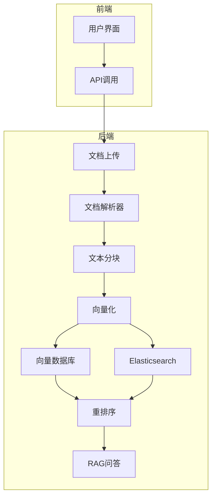
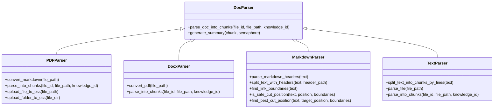
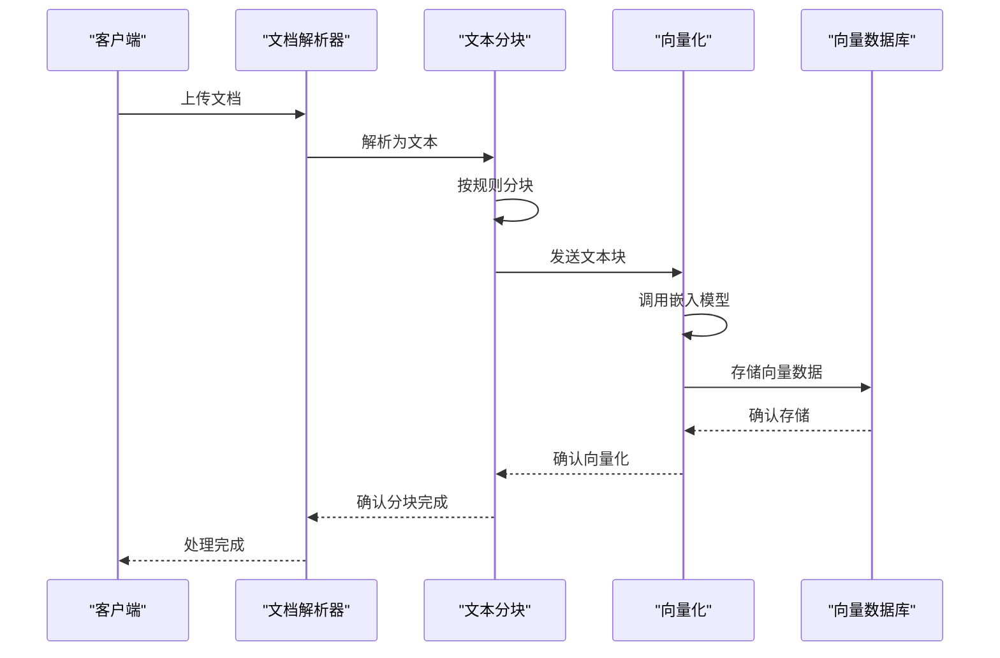
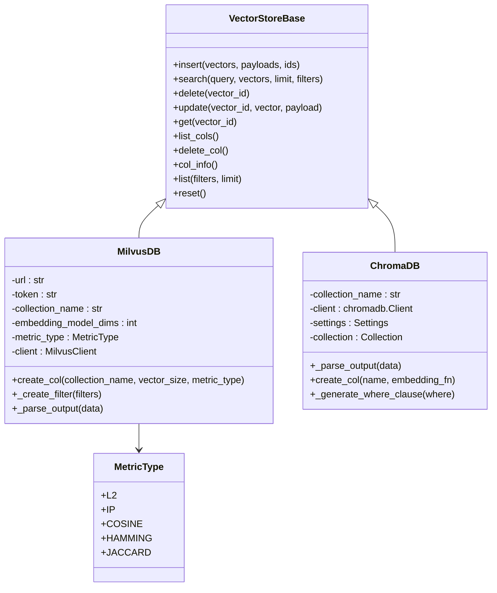
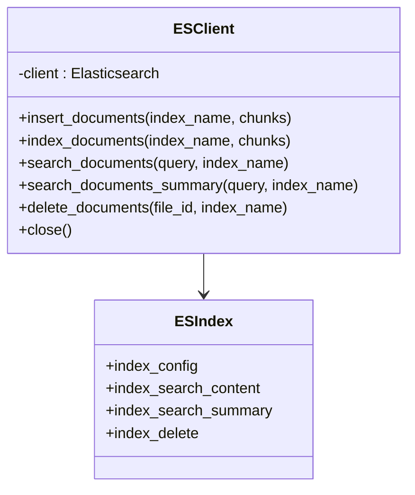
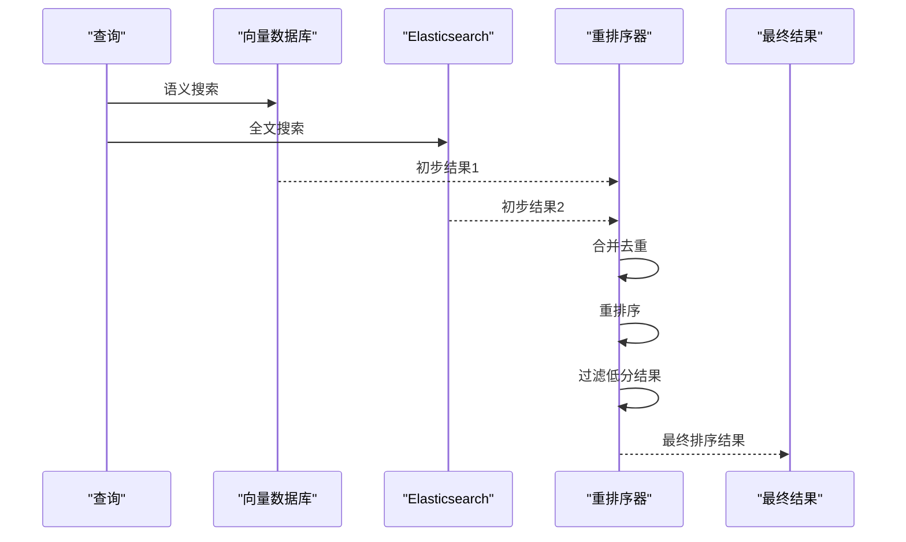
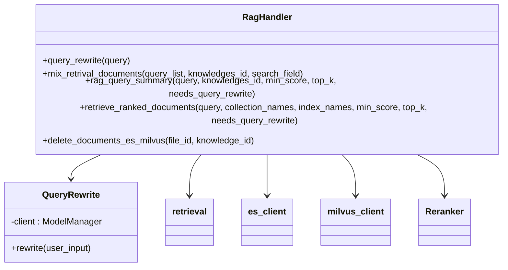
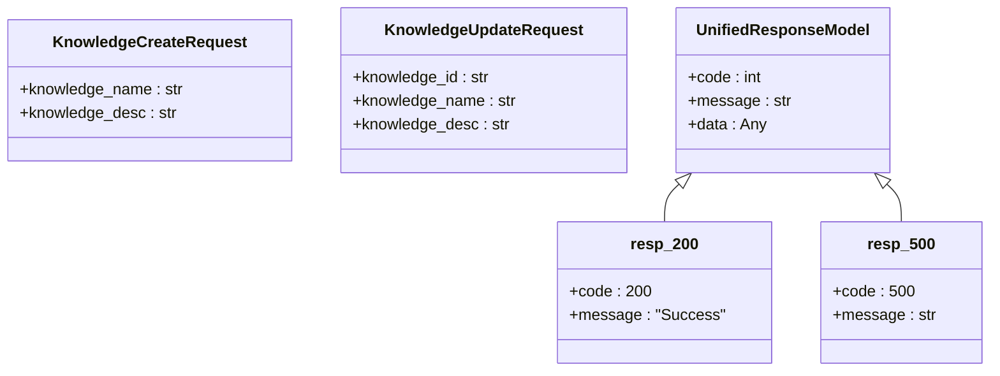
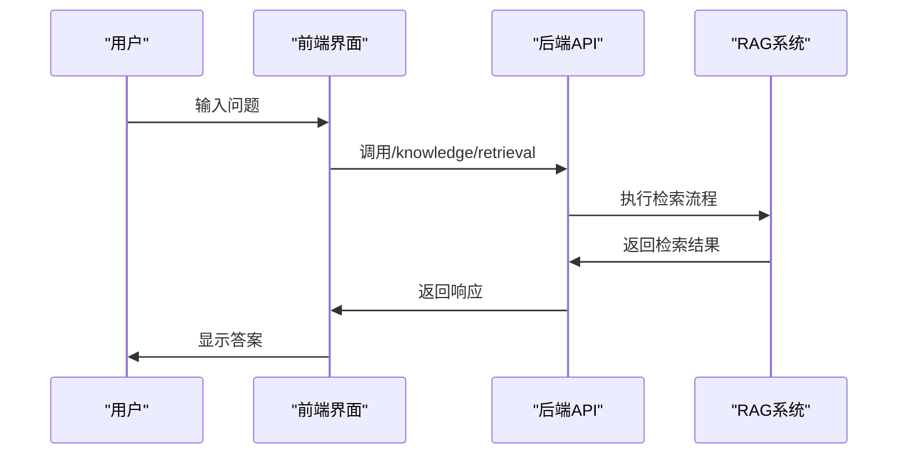

# 知识库系统

## 目录
1. [系统架构概述](#系统架构概述)
2. [文档上传与解析流程](#文档上传与解析流程)
3. [文本分块与向量化](#文本分块与向量化)
4. [向量存储与检索](#向量存储与检索)
5. [全文检索与重排序](#全文检索与重排序)
6. [RAG问答集成](#rag问答集成)
7. [API接口与前端交互](#api接口与前端交互)
8. [常见问题与优化策略](#常见问题与优化策略)

## 系统架构概述

知识库系统采用RAG（检索增强生成）架构，实现了从文档上传、解析、向量化到语义搜索的完整流程。系统通过多模态文档解析器支持多种文件格式，利用向量数据库和Elasticsearch实现混合检索，并通过重排序模块提升检索精度。

**图示来源**
- [rag_handler.py](https://github.com/Shy2593666979/AgentChat/src/backend/agentchat/services/rag_handler.py)
- [parser.py](https://github.com/Shy2593666979/AgentChat/src/backend/agentchat/services/rag/parser.py)

## 文档上传与解析流程

系统支持PDF、DOCX、PPTX、Markdown和纯文本等多种文件格式的上传与解析。文档解析流程采用统一的处理架构，不同格式的文档通过相应的解析器转换为统一的文本格式。

### 支持的文件格式

系统支持以下文件格式的解析：
- **PDF**: 通过pymupdf4llm库解析，保留文本和图像信息
- **DOCX**: 转换为PDF后使用PDF解析器处理
- **PPTX**: 通过python-pptx库解析幻灯片内容
- **Markdown**: 直接解析，保留标题结构和链接
- **纯文本**: 按行分割处理

### 文档解析逻辑

文档解析器采用模块化设计，每个文件格式都有对应的解析器类。系统通过文件后缀名选择相应的解析器进行处理。

**图示来源**
- [parser.py](https://github.com/Shy2593666979/AgentChat/src/backend/agentchat/services/rag/parser.py)
- [pdf.py](https://github.com/Shy2593666979/AgentChat/src/backend/agentchat/services/rag/doc_parser/pdf.py)
- [docx.py](https://github.com/Shy2593666979/AgentChat/src/backend/agentchat/services/rag/doc_parser/docx.py)
- [markdown.py](https://github.com/Shy2593666979/AgentChat/src/backend/agentchat/services/rag/doc_parser/markdown.py)
- [text.py](https://github.com/Shy2593666979/AgentChat/src/backend/agentchat/services/rag/doc_parser/text.py)

**本节来源**
- [parser.py](https://github.com/Shy2593666979/AgentChat/src/backend/agentchat/services/rag/parser.py#L1-L58)
- [pdf.py](https://github.com/Shy2593666979/AgentChat/src/backend/agentchat/services/rag/doc_parser/pdf.py#L1-L80)
- [docx.py](https://github.com/Shy2593666979/AgentChat/src/backend/agentchat/services/rag/doc_parser/docx.py#L1-L66)

## 文本分块与向量化

文档解析后，系统将文本内容进行分块处理，并生成对应的向量表示，为后续的语义搜索做准备。

### 文本分块策略

系统采用智能分块策略，根据不同文档类型采用不同的分块方法：

- **Markdown文档**: 按标题结构分块，保留完整的标题路径
- **纯文本**: 按换行符切割，确保每个块的大小在指定范围内
- **长段落**: 当段落过长时，按句子边界进行切割，避免切断链接或图片引用

分块参数可通过配置文件调整：
- `chunk_size`: 块的最大字符数
- `overlap_size`: 块之间的重叠字符数
- `min_chunk_size`: 块的最小字符数

### 向量化过程

文本向量化是将文本转换为数值向量的过程，系统使用预训练的语言模型生成文本的向量表示。

**图示来源**
- [parser.py](https://github.com/Shy2593666979/AgentChat/src/backend/agentchat/services/rag/parser.py)
- [embedding.py](https://github.com/Shy2593666979/AgentChat/src/backend/agentchat/services/rag/embedding.py)

**本节来源**
- [parser.py](https://github.com/Shy2593666979/AgentChat/src/backend/agentchat/services/rag/parser.py#L1-L58)
- [embedding.py](https://github.com/Shy2593666979/AgentChat/src/backend/agentchat/services/rag/embedding.py#L1-L50)
- [text.py](https://github.com/Shy2593666979/AgentChat/src/backend/agentchat/services/rag/doc_parser/text.py#L1-L86)
- [markdown.py](https://github.com/Shy2593666979/AgentChat/src/backend/agentchat/services/rag/doc_parser/markdown.py#L1-L405)

## 向量存储与检索

系统支持多种向量数据库存储方案，包括Milvus和ChromaDB，实现了高效的向量数据存储和检索。

### 向量数据库架构

系统采用抽象的向量存储接口，支持多种向量数据库的无缝切换。当前主要支持Milvus作为向量存储后端。

**图示来源**
- [milvus.py](https://github.com/Shy2593666979/AgentChat/src/backend/agentchat/services/memory/vector_stores/milvus.py)
- [chroma.py](https://github.com/Shy2593666979/AgentChat/src/backend/agentchat/services/memory/vector_stores/chroma.py)

### 向量数据存储

文档分块并生成向量后，系统将向量数据存储到向量数据库中。每个向量记录包含以下信息：
- `id`: 块的唯一标识符
- `vectors`: 文本的向量表示
- `metadata`: 元数据，包括文件ID、文件名、知识库ID等

存储过程采用批量插入方式，提高数据写入效率。系统还实现了错误处理和重试机制，确保数据的完整性和一致性。

**本节来源**
- [milvus.py](https://github.com/Shy2593666979/AgentChat/src/backend/agentchat/services/memory/vector_stores/milvus.py#L1-L262)
- [chroma.py](https://github.com/Shy2593666979/AgentChat/src/backend/agentchat/services/memory/vector_stores/chroma.py#L1-L255)
- [rag_handler.py](https://github.com/Shy2593666979/AgentChat/src/backend/agentchat/services/rag_handler.py#L1-L152)

## 全文检索与重排序

系统采用混合检索策略，结合向量数据库的语义搜索和Elasticsearch的全文检索，通过重排序模块提升检索结果的准确性。

### Elasticsearch角色

Elasticsearch在系统中主要负责全文检索，支持关键词匹配、模糊搜索和精确查询。系统将文档内容索引到Elasticsearch中，建立倒排索引，实现高效的文本检索。

**图示来源**
- [es_client.py](https://github.com/Shy2593666979/AgentChat/src/backend/agentchat/services/rag/es_client.py)
- [es_index.py](https://github.com/Shy2593666979/AgentChat/src/backend/agentchat/config/es_index.py)

### 重排序模块

重排序模块是提升检索精度的关键组件。系统首先从向量数据库和Elasticsearch获取初步检索结果，然后通过重排序模型对结果进行重新排序。

**图示来源**
- [rag_handler.py](https://github.com/Shy2593666979/AgentChat/src/backend/agentchat/services/rag_handler.py)
- [rerank.py](https://github.com/Shy2593666979/AgentChat/src/backend/agentchat/services/rag/rerank.py)

**本节来源**
- [es_client.py](https://github.com/Shy2593666979/AgentChat/src/backend/agentchat/services/rag/es_client.py#L1-L199)
- [rerank.py](https://github.com/Shy2593666979/AgentChat/src/backend/agentchat/services/rag/rerank.py#L1-L61)
- [rag_handler.py](https://github.com/Shy2593666979/AgentChat/src/backend/agentchat/services/rag_handler.py#L1-L152)

## RAG问答集成

RAG（检索增强生成）是系统的核心功能，将检索到的相关文档内容注入到大语言模型的上下文中，生成准确的回答。

### 查询扩展

系统在处理用户查询时，首先进行查询扩展，通过查询重写模块生成多个相关查询，提高检索的召回率。

**图示来源**
- [rag_handler.py](https://github.com/Shy2593666979/AgentChat/src/backend/agentchat/services/rag_handler.py)
- [query_write.py](https://github.com/Shy2593666979/AgentChat/src/backend/agentchat/services/rewrite/query_write.py)

### 上下文注入与结果生成

RAG流程包括以下步骤：
1. **查询重写**: 扩展用户查询，生成多个相关查询
2. **文档检索**: 从向量数据库和Elasticsearch检索相关文档
3. **重排序**: 对检索结果进行重新排序，提升相关性
4. **上下文注入**: 将排序后的文档内容拼接为上下文
5. **结果生成**: 将上下文和原始查询发送给大语言模型，生成最终回答

**本节来源**
- [rag_handler.py](https://github.com/Shy2593666979/AgentChat/src/backend/agentchat/services/rag_handler.py#L1-L152)
- [query_write.py](https://github.com/Shy2593666979/AgentChat/src/backend/agentchat/services/rewrite/query_write.py#L1-L27)
- [retrieval.py](https://github.com/Shy2593666979/AgentChat/src/backend/agentchat/services/retrieval.py#L1-L46)

## API接口与前端交互

系统提供了RESTful API接口，前端通过这些接口与后端进行交互，实现知识库文件的管理和语义搜索功能。

### API接口设计

系统提供了以下主要API接口：
- `/knowledge/create`: 创建知识库
- `/knowledge/select`: 查询用户的知识库列表
- `/knowledge/update`: 更新知识库信息
- `/knowledge/delete`: 删除知识库
- `/knowledge/retrieval`: 执行知识库检索

**图示来源**
- [knowledge.py](https://github.com/Shy2593666979/AgentChat/src/backend/agentchat/api/v1/knowledge.py)
- [schemas.py](https://github.com/Shy2593666979/AgentChat/src/backend/agentchat/schema/schemas.py)

### 前端页面交互

前端页面提供了知识库管理界面，用户可以创建、查看、更新和删除知识库。在问答界面，用户可以输入问题，系统返回基于知识库的检索结果。

**图示来源**
- [knowledge.py](https://github.com/Shy2593666979/AgentChat/src/backend/agentchat/api/v1/knowledge.py)
- [knowledge-file.ts](https://github.com/Shy2593666979/AgentChat/src/frontend/src/apis/knowledge-file.ts)

**本节来源**
- [knowledge.py](https://github.com/Shy2593666979/AgentChat/src/backend/agentchat/api/v1/knowledge.py#L1-L74)
- [knowledge-file.ts](https://github.com/Shy2593666979/AgentChat/src/frontend/src/apis/knowledge-file.ts)

## 常见问题与优化策略

### 检索结果不相关

当检索结果不相关时，可能的原因包括：
- 查询重写效果不佳
- 向量模型与领域不匹配
- 分块策略不合理

解决方案：
1. 调整查询重写提示词，提高重写质量
2. 使用领域特定的嵌入模型
3. 优化分块策略，确保语义完整性

### 解析失败

文档解析失败的常见原因：
- 文件格式不支持
- 文件损坏
- 解析器依赖库缺失

解决方案：
1. 确认文件格式是否在支持列表中
2. 验证文件完整性
3. 安装必要的依赖库

### 索引优化

为提高检索性能，建议：
- 定期优化向量数据库索引
- 合理设置分块大小和重叠
- 使用合适的距离度量方法

### 性能调优策略

1. **并发处理**: 使用信号量限制并发任务数，避免资源耗尽
2. **批量操作**: 采用批量插入和查询，减少网络开销
3. **缓存机制**: 对频繁查询的结果进行缓存
4. **异步处理**: 使用异步IO提高系统吞吐量

**本节来源**
- [rag_handler.py](https://github.com/Shy2593666979/AgentChat/src/backend/agentchat/services/rag_handler.py)
- [parser.py](https://github.com/Shy2593666979/AgentChat/src/backend/agentchat/services/rag/parser.py)
- [embedding.py](https://github.com/Shy2593666979/AgentChat/src/backend/agentchat/services/rag/embedding.py)
- [retrieval.py](https://github.com/Shy2593666979/AgentChat/src/backend/agentchat/services/retrieval.py)
