# Nginx反向代理配置深度解析

## 目录
1. [项目概述](#项目概述)
2. [Nginx配置架构](#nginx配置架构)
3. [反向代理规则详解](#反向代理规则详解)
4. [静态资源缓存策略](#静态资源缓存策略)
5. [Gzip压缩配置](#gzip压缩配置)
6. [日志管理](#日志管理)
7. [安全配置](#安全配置)
8. [健康检查机制](#健康检查机制)
9. [负载均衡配置](#负载均衡配置)
10. [性能优化](#性能优化)
11. [故障排除指南](#故障排除指南)

## 项目概述

AgentChat项目采用前后端分离架构，前端基于Vue 3框架开发，后端使用FastAPI构建RESTful API服务。Nginx作为反向代理服务器，在生产环境中扮演着关键角色，负责处理静态资源服务、API请求转发、负载均衡和性能优化。

### 技术栈概览

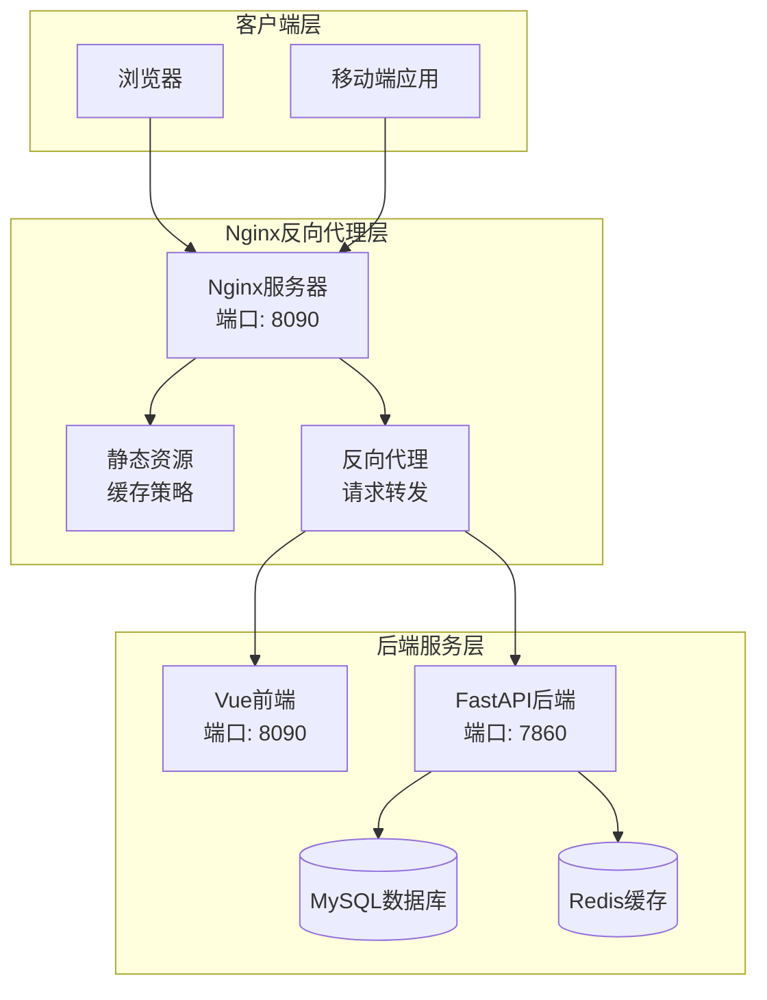

**图表来源**
- [nginx.conf](https://github.com/Shy2593666979/AgentChat/docker/nginx.conf#L66-L101)
- [docker-compose.prod.yml](https://github.com/Shy2593666979/AgentChat/docker/docker-compose.prod.yml#L1-L52)

## Nginx配置架构

### 核心配置结构

Nginx配置采用模块化设计，主要包含以下核心组件：

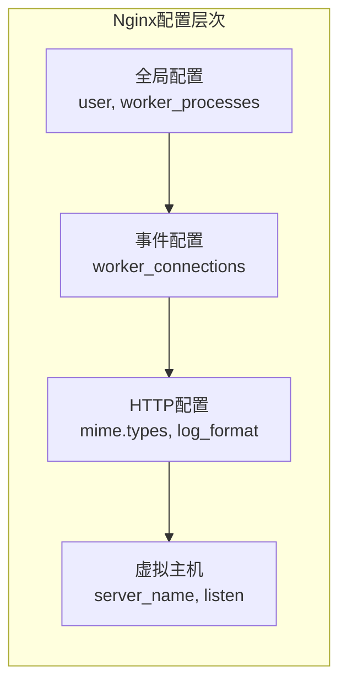

**图表来源**
- [nginx.conf](https://github.com/Shy2593666979/AgentChat/docker/nginx.conf#L1-L12)

### 配置文件组织

| 配置块 | 功能描述 | 主要参数 |
|--------|----------|----------|
| `user` | 运行用户权限 | `nginx` |
| `worker_processes` | 工作进程数 | `auto` |
| `events` | 事件处理配置 | `worker_connections`, `epoll`, `multi_accept` |
| `http` | HTTP协议配置 | `mime.types`, `log_format`, `gzip` |
| `server` | 虚拟主机配置 | `listen`, `server_name`, `root` |

**章节来源**
- [nginx.conf](https://github.com/Shy2593666979/AgentChat/docker/nginx.conf#L1-L101)

## 反向代理规则详解

### 前端请求路由配置

Nginx作为前端静态资源服务器，通过location指令实现智能路由：

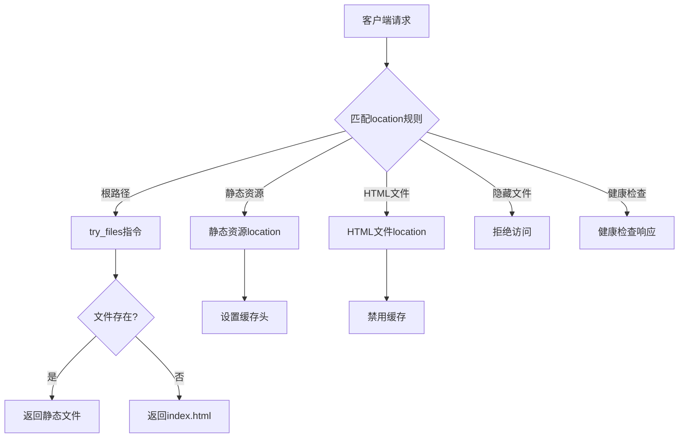

**图表来源**
- [nginx.conf](https://github.com/Shy2593666979/AgentChat/docker/nginx.conf#L72-L99)

### API请求转发配置

虽然当前配置中没有显式的API代理规则，但通过Vite开发服务器的代理配置实现了类似功能：

| 请求路径 | 目标地址 | 功能描述 |
|----------|----------|----------|
| `/api/*` | `http://localhost:7860/` | API请求转发 |
| `changeOrigin` | `true` | 修改请求源 |
| `target` | `http://localhost:7860/` | 后端服务地址 |

**章节来源**
- [vite.config.ts](https://github.com/Shy2593666979/AgentChat/tree/main/src/frontend/vite.config.ts#L14-L18)
- [nginx.conf](https://github.com/Shy2593666979/AgentChat/docker/nginx.conf#L72-L99)

### 静态资源处理流程

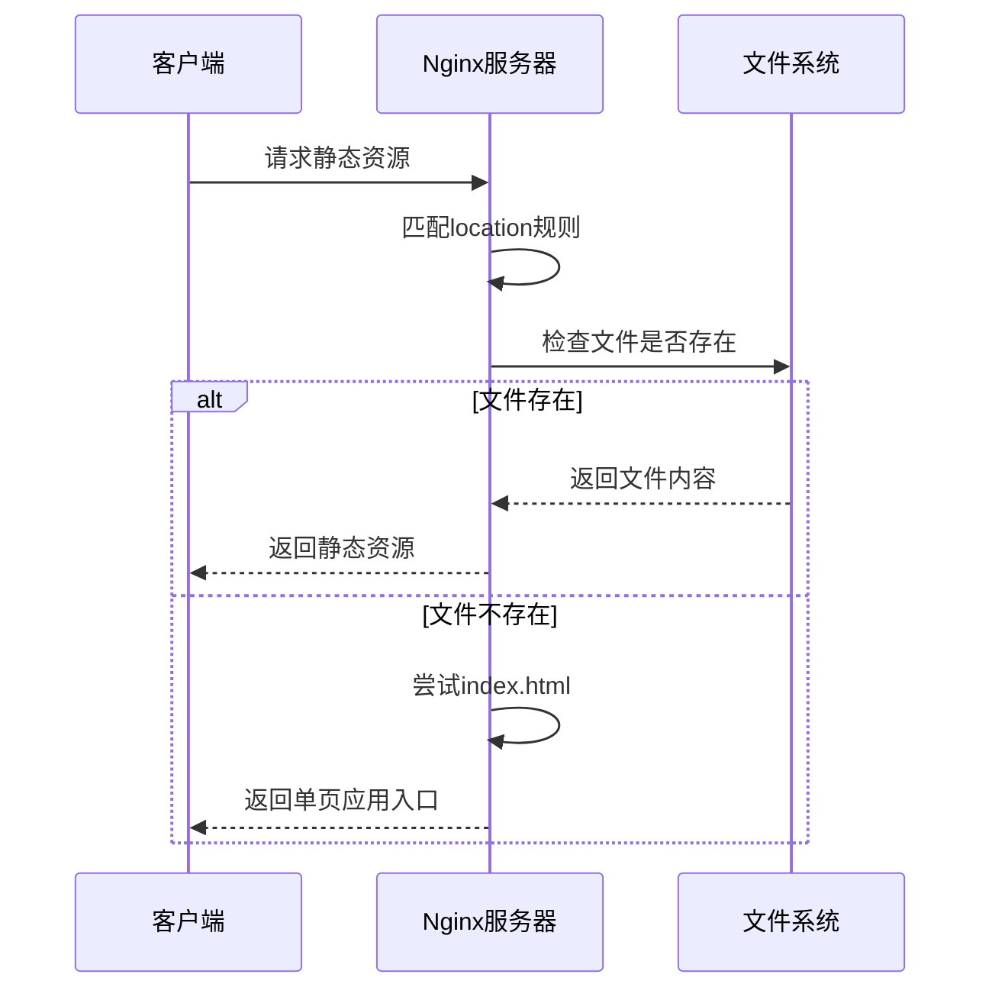

**图表来源**
- [nginx.conf](https://github.com/Shy2593666979/AgentChat/docker/nginx.conf#L73-L74)

## 静态资源缓存策略

### 缓存策略分类

Nginx针对不同类型的静态资源实施差异化缓存策略：

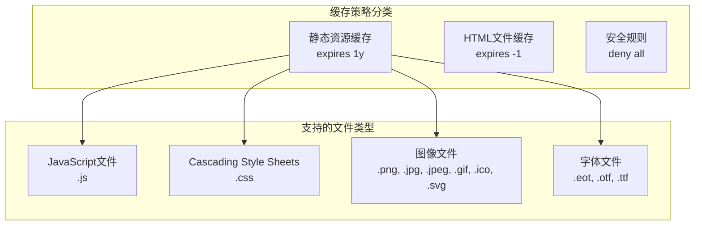

**图表来源**
- [nginx.conf](https://github.com/Shy2593666979/AgentChat/docker/nginx.conf#L76-L86)

### 缓存配置详解

| 文件类型 | 缓存策略 | 缓存头设置 | 适用场景 |
|----------|----------|------------|----------|
| `.js`, `.css` | 长期缓存 | `expires 1y`, `Cache-Control: public, immutable` | JavaScript和样式表文件 |
| `.html` | 不缓存 | `expires -1`, `Cache-Control: no-cache, no-store, must-revalidate` | HTML文件 |
| 图像文件 | 长期缓存 | `expires 1y`, `Cache-Control: public, immutable` | 图片资源 |
| 字体文件 | 长期缓存 | `expires 1y`, `Cache-Control: public, immutable` | Web字体文件 |

### 内容哈希与缓存失效

虽然配置中没有直接体现，但现代前端构建工具通常会为静态资源添加内容哈希，实现以下效果：

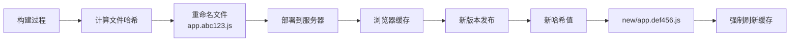

**章节来源**
- [nginx.conf](https://github.com/Shy2593666979/AgentChat/docker/nginx.conf#L76-L86)

## Gzip压缩配置

### 压缩算法与级别

Nginx启用了Gzip压缩以减少传输体积，提高网络传输效率：

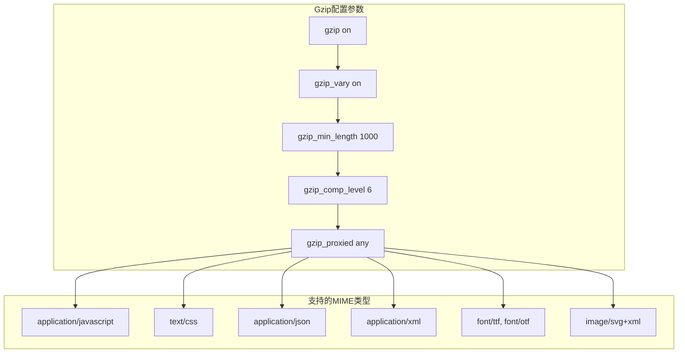

**图表来源**
- [nginx.conf](https://github.com/Shy2593666979/AgentChat/docker/nginx.conf#L33-L58)

### 压缩配置参数说明

| 参数 | 值 | 说明 |
|------|-----|------|
| `gzip` | `on` | 启用Gzip压缩 |
| `gzip_vary` | `on` | 添加Vary头，支持缓存 |
| `gzip_min_length` | `1000` | 最小压缩文件大小(字节) |
| `gzip_comp_level` | `6` | 压缩级别(1-9，平衡速度和压缩率) |
| `gzip_proxied` | `any` | 对所有代理请求启用压缩 |

### 支持的压缩类型

Nginx对以下MIME类型启用Gzip压缩：

- 应用程序类型：`application/javascript`, `application/json`, `application/xml`, `application/manifest+json`
- 文本类型：`text/css`, `text/javascript`, `text/plain`, `text/xml`
- 字体类型：`font/eot`, `font/otf`, `font/ttf`
- 图像类型：`image/svg+xml`

**章节来源**
- [nginx.conf](https://github.com/Shy2593666979/AgentChat/docker/nginx.conf#L33-L58)

## 日志管理

### 日志格式配置

Nginx定义了详细的日志格式，便于监控和分析：

```mermaid
graph LR
subgraph "日志字段"
RemoteAddr[远程地址<br/>$remote_addr]
User[用户标识<br/>$remote_user]
Time[时间戳<br/>[$time_local]]
Request[请求信息<br/>"$request"]
Status[状态码<br/>$status]
BytesSent[发送字节数<br/>$body_bytes_sent]
Referer[引用页面<br/>"$http_referer"]
UserAgent[用户代理<br/>"$http_user_agent"]
ForwardedFor[X-Forwarded-For<br/>"$http_x_forwarded_for"]
end
subgraph "日志文件"
AccessLog[访问日志<br/>/var/log/nginx/access.log]
ErrorLog[错误日志<br/>/var/log/nginx/error.log]
end
RemoteAddr --> AccessLog
User --> AccessLog
Time --> AccessLog
Request --> AccessLog
Status --> AccessLog
BytesSent --> AccessLog
Referer --> AccessLog
UserAgent --> AccessLog
ForwardedFor --> AccessLog
```

**图表来源**
- [nginx.conf](https://github.com/Shy2593666979/AgentChat/docker/nginx.conf#L18-L23)

### 日志配置参数

| 配置项 | 路径 | 说明 |
|--------|------|------|
| `log_format` | `main` | 自定义日志格式名称 |
| `access_log` | `/var/log/nginx/access.log` | 访问日志文件路径 |
| `error_log` | `/var/log/nginx/error.log` | 错误日志文件路径 |
| `level` | `notice` | 错误日志级别 |

### 日志轮转策略

建议实施以下日志轮转策略：

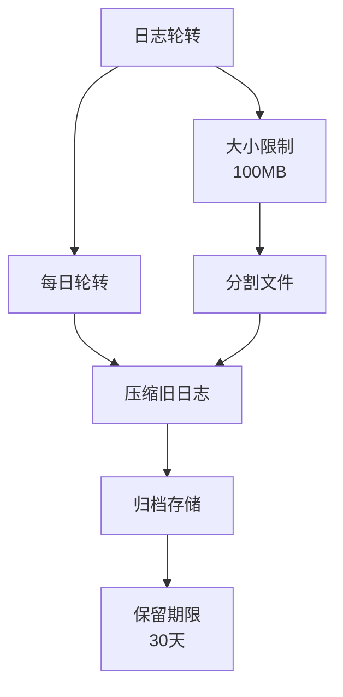

**章节来源**
- [nginx.conf](https://github.com/Shy2593666979/AgentChat/docker/nginx.conf#L18-L24)

## 安全配置

### 安全头部设置

Nginx配置了多项安全头部，增强Web应用安全性：

```mermaid
graph TB
subgraph "安全配置"
ServerTokens[server_tokens off<br/>隐藏服务器版本信息]
FrameOptions[X-Frame-Options DENY<br/>防止点击劫持]
ContentType[X-Content-Type-Options nosniff<br/>防止MIME类型嗅探]
XSSProtection[X-XSS-Protection "1; mode=block"<br/>启用XSS保护]
end
subgraph "安全效果"
ClickJacking[防止点击劫持攻击]
MIMEAttack[防止MIME类型攻击]
XSSAttack[防止跨站脚本攻击]
InfoLeak[防止信息泄露]
end
ServerTokens --> InfoLeak
FrameOptions --> ClickJacking
ContentType --> MIMEAttack
XSSProtection --> XSSAttack
```

**图表来源**
- [nginx.conf](https://github.com/Shy2593666979/AgentChat/docker/nginx.conf#L60-L65)

### 安全配置参数

| 安全头部 | 值 | 安全作用 |
|----------|-----|----------|
| `server_tokens` | `off` | 隐藏Nginx版本信息 |
| `X-Frame-Options` | `DENY` | 防止页面被嵌入iframe |
| `X-Content-Type-Options` | `nosniff` | 防止MIME类型嗅探 |
| `X-XSS-Protection` | `1; mode=block` | 启用XSS过滤器 |

### 隐藏文件保护

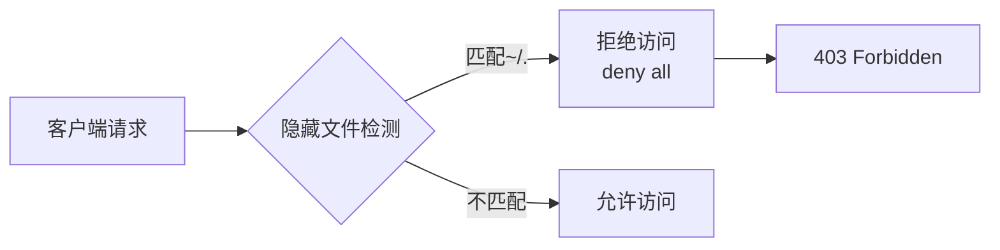

**图表来源**
- [nginx.conf](https://github.com/Shy2593666979/AgentChat/docker/nginx.conf#L90-L92)

**章节来源**
- [nginx.conf](https://github.com/Shy2593666979/AgentChat/docker/nginx.conf#L60-L65)
- [nginx.conf](https://github.com/Shy2593666979/AgentChat/docker/nginx.conf#L90-L92)

## 健康检查机制

### 健康检查配置

Nginx提供了简单的健康检查端点，用于服务监控：

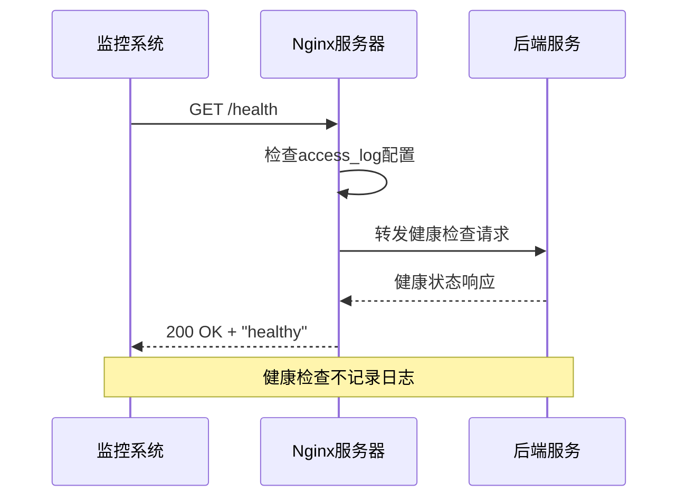

**图表来源**
- [nginx.conf](https://github.com/Shy2593666979/AgentChat/docker/nginx.conf#L94-L99)

### 健康检查特性

| 特性 | 配置 | 说明 |
|------|------|------|
| 端点路径 | `/health` | 健康检查接口 |
| 响应状态 | `200` | 成功响应状态码 |
| 响应内容 | `"healthy\n"` | 简洁的健康状态 |
| 日志记录 | `off` | 不记录访问日志 |
| 内容类型 | `text/plain` | 明确的响应类型 |

### Docker Compose健康检查集成

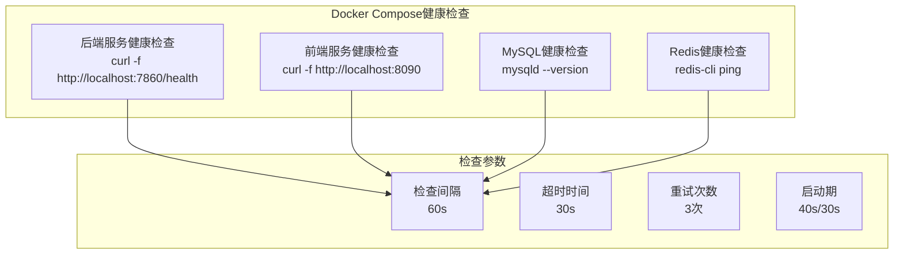

**图表来源**
- [docker-compose.prod.yml](https://github.com/Shy2593666979/AgentChat/docker/docker-compose.prod.yml#L14-L20)
- [docker-compose.prod.yml](https://github.com/Shy2593666979/AgentChat/docker/docker-compose.prod.yml#L29-L34)

**章节来源**
- [nginx.conf](https://github.com/Shy2593666979/AgentChat/docker/nginx.conf#L94-L99)
- [docker-compose.prod.yml](https://github.com/Shy2593666979/AgentChat/docker/docker-compose.prod.yml#L14-L34)

## 负载均衡配置

### 当前配置分析

当前的Nginx配置主要服务于单一前端服务，但在Docker Compose中已经为多个服务配置了健康检查，为未来的负载均衡扩展奠定了基础：

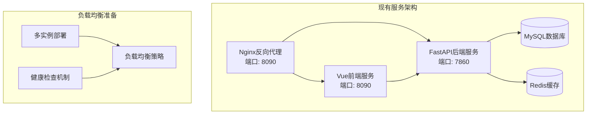

**图表来源**
- [docker-compose.prod.yml](https://github.com/Shy2593666979/AgentChat/docker/docker-compose.prod.yml#L1-L52)

### 负载均衡配置示例

以下是未来可能的负载均衡配置示例：

```nginx
upstream backend_servers {
    least_conn;
    server backend1:7860 weight=3 max_fails=3 fail_timeout=30s;
    server backend2:7860 weight=3 max_fails=3 fail_timeout=30s;
    server backend3:7860 weight=2 max_fails=3 fail_timeout=30s;
}

server {
    listen 8090;
    server_name localhost;
    
    location /api/ {
        proxy_pass http://backend_servers/;
        proxy_set_header Host $host;
        proxy_set_header X-Real-IP $remote_addr;
        proxy_set_header X-Forwarded-For $proxy_add_x_forwarded_for;
        proxy_set_header X-Forwarded-Proto $scheme;
        
        proxy_connect_timeout 5s;
        proxy_send_timeout 60s;
        proxy_read_timeout 60s;
    }
}
```

### 负载均衡策略

| 策略 | 描述 | 适用场景 |
|------|------|----------|
| `round_robin` | 轮询分配请求 | 默认策略，适用于大多数场景 |
| `least_conn` | 最少连接数 | 适用于长连接场景 |
| `ip_hash` | 基于IP的哈希 | 保持会话一致性 |
| `weight` | 权重分配 | 不同性能的服务器 |

**章节来源**
- [docker-compose.prod.yml](https://github.com/Shy2593666979/AgentChat/docker/docker-compose.prod.yml#L1-L52)

## 性能优化

### 核心性能参数

Nginx配置了多项性能优化参数，确保高并发场景下的稳定运行：

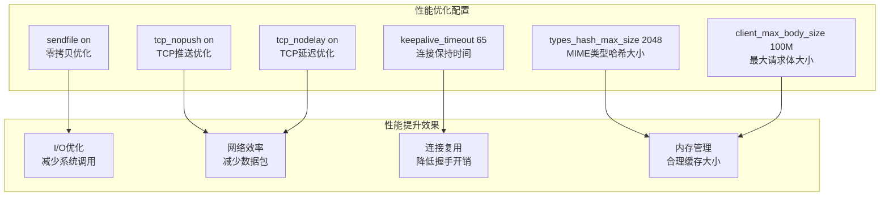

**图表来源**
- [nginx.conf](https://github.com/Shy2593666979/AgentChat/docker/nginx.conf#L25-L31)

### 性能参数详解

| 参数 | 值 | 性能影响 |
|------|-----|----------|
| `sendfile` | `on` | 启用零拷贝，提高文件传输效率 |
| `tcp_nopush` | `on` | 合并小包，减少网络开销 |
| `tcp_nodelay` | `on` | 禁用Nagle算法，降低延迟 |
| `keepalive_timeout` | `65` | 连接保持时间(秒) |
| `types_hash_max_size` | `2048` | MIME类型哈希表大小 |
| `client_max_body_size` | `100M` | 允许的最大请求体大小 |

### 并发连接配置

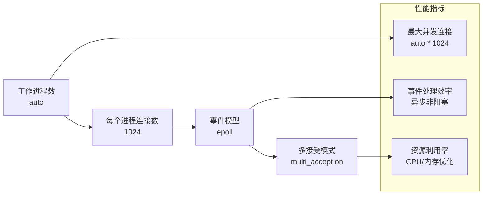

**图表来源**
- [nginx.conf](https://github.com/Shy2593666979/AgentChat/docker/nginx.conf#L8-L12)

**章节来源**
- [nginx.conf](https://github.com/Shy2593666979/AgentChat/docker/nginx.conf#L25-L31)
- [nginx.conf](https://github.com/Shy2593666979/AgentChat/docker/nginx.conf#L8-L12)

## 故障排除指南

### 常见问题诊断

#### 1. 静态资源无法加载

**症状表现：**
- 页面显示空白或404错误
- 控制台出现资源加载失败警告

**诊断步骤：**
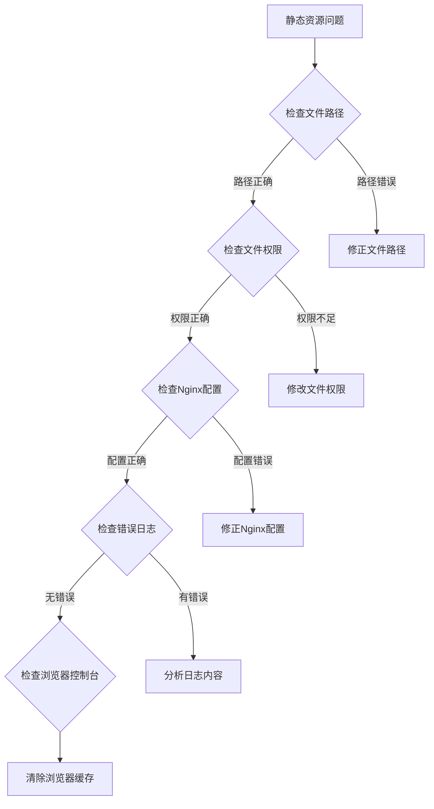

**解决方案：**
- 验证静态资源文件是否存在于正确路径
- 检查Nginx配置中的`root`和`location`指令
- 确认文件权限设置正确
- 清除浏览器缓存

#### 2. API请求转发失败

**症状表现：**
- 前端API请求返回404或502错误
- 控制台显示跨域错误

**诊断流程：**
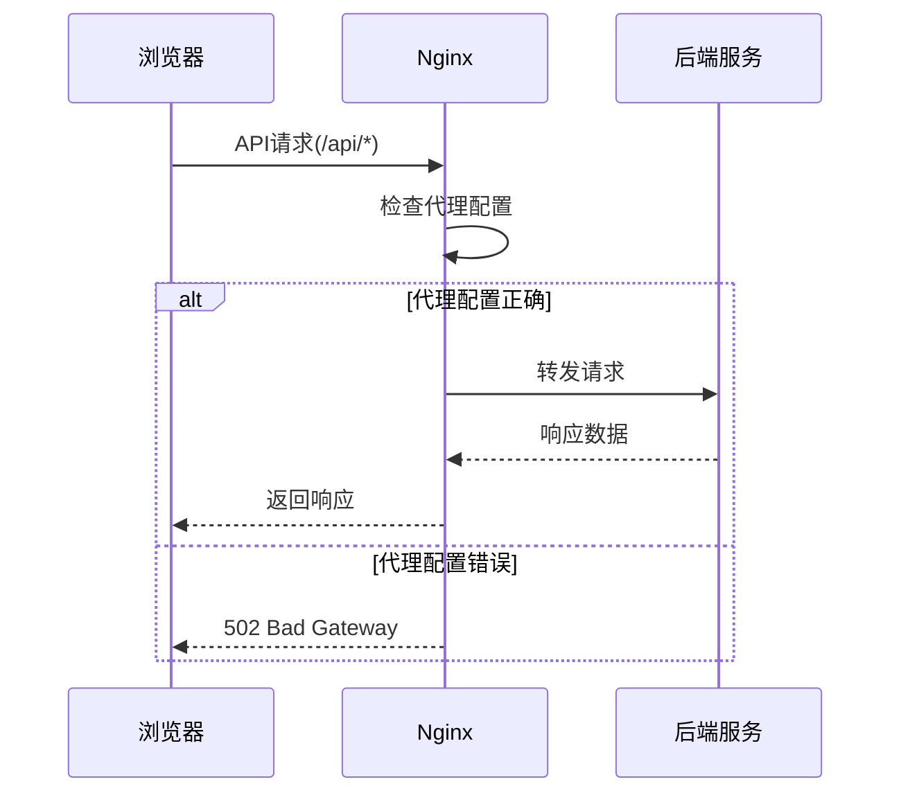

**排查要点：**
- 检查后端服务是否正常运行
- 验证代理目标地址配置
- 确认防火墙和网络连接
- 查看Nginx错误日志

#### 3. 缓存问题

**症状表现：**
- 更新后的资源仍显示旧版本
- 页面布局错乱或功能异常

**解决策略：**
- 强制刷新浏览器缓存(Ctrl+F5)
- 检查缓存头设置是否正确
- 验证文件名是否包含哈希值
- 清理CDN缓存(如果使用)

### 监控指标

建议监控以下关键指标：

| 指标类别 | 关键指标 | 监控方法 |
|----------|----------|----------|
| 性能指标 | 响应时间、吞吐量 | Nginx访问日志分析 |
| 资源指标 | CPU使用率、内存占用 | 系统监控工具 |
| 错误指标 | 4xx/5xx错误率 | 错误日志统计 |
| 连接指标 | 并发连接数、连接池状态 | Nginx状态模块 |

### 日志分析技巧

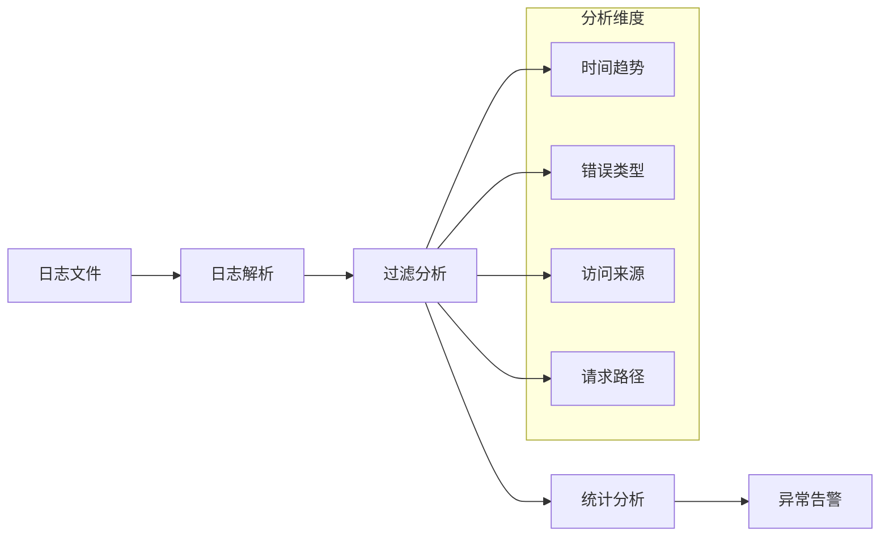

**章节来源**
- [nginx.conf](https://github.com/Shy2593666979/AgentChat/docker/nginx.conf#L18-L24)

## 总结

本文档详细解析了AgentChat项目中Nginx反向代理配置的各项功能和最佳实践。通过合理的配置，Nginx不仅能够高效地处理静态资源服务，还能实现智能的API请求转发、灵活的缓存策略、强大的安全防护和完善的日志管理。

### 关键优势

1. **高性能架构**：通过优化的事件模型和连接处理，支持高并发访问
2. **智能缓存策略**：差异化缓存策略提升用户体验和性能
3. **完善的安全防护**：多层次安全配置保障应用安全
4. **灵活的扩展性**：为未来的负载均衡和集群部署做好准备
5. **全面的日志监控**：详细的日志记录便于运维和故障排查

### 最佳实践建议

- 定期审查和更新安全配置
- 实施适当的日志轮转和归档策略
- 监控关键性能指标，及时发现潜在问题
- 保持Nginx版本更新，获得最新功能和安全补丁
- 制定完善的备份和灾难恢复计划

通过遵循这些配置原则和最佳实践，可以确保Nginx在生产环境中稳定、高效地运行，为用户提供优质的Web服务体验。
