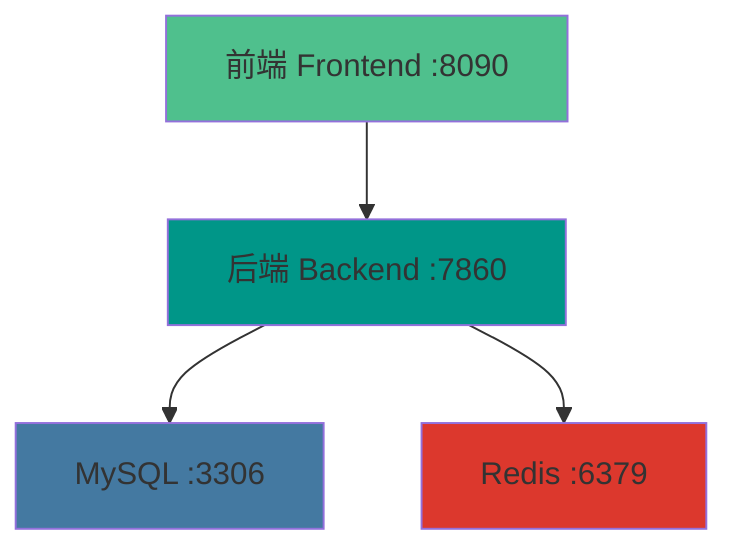
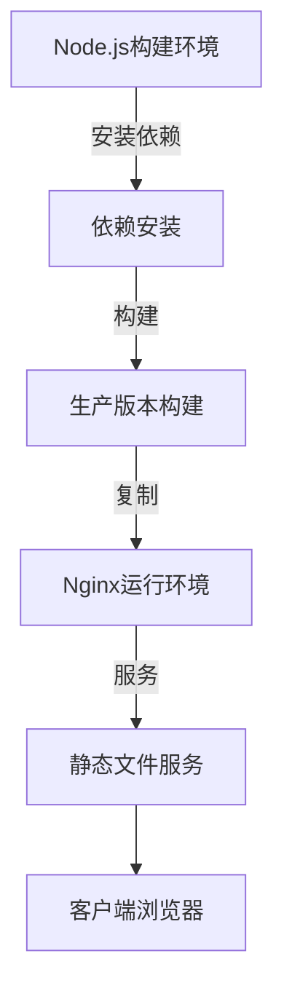

# 生产服务配置

<cite>
**本文档引用的文件**
- [docker-compose.prod.yml](https://github.com/Shy2593666979/AgentChat/docker/docker-compose.prod.yml)
- [Dockerfile](https://github.com/Shy2593666979/AgentChat/docker/Dockerfile)
- [Dockerfile.frontend.prod](https://github.com/Shy2593666979/AgentChat/docker/Dockerfile.frontend.prod)
- [nginx.conf](https://github.com/Shy2593666979/AgentChat/docker/nginx.conf)
- [start.sh](https://github.com/Shy2593666979/AgentChat/docker/start.sh)
- [settings.py](https://github.com/Shy2593666979/AgentChat/src/backend/agentchat/settings.py)
- [main.py](https://github.com/Shy2593666979/AgentChat/src/backend/agentchat/main.py)
</cite>

## 目录
1. [简介](#简介)
2. [项目结构](#项目结构)
3. [后端服务配置](#后端服务配置)
4. [前端服务配置](#前端服务配置)
5. [数据库服务配置](#数据库服务配置)
6. [缓存服务配置](#缓存服务配置)
7. [资源限制与性能优化](#资源限制与性能优化)
8. [镜像构建与安全实践](#镜像构建与安全实践)
9. [服务管理与监控](#服务管理与监控)
10. [配置调整建议](#配置调整建议)

## 简介
本文档详细说明基于`docker-compose.prod.yml`的生产级服务配置，涵盖后端、前端、MySQL数据库和Redis缓存的配置细节。文档重点解析Gunicorn多工作进程部署、前端构建优化、数据库性能调优、缓存持久化机制等关键配置，并提供资源限制设置原则和服务器规格调整建议。

## 项目结构
本项目采用微服务架构，通过Docker Compose管理多个服务容器。主要包含后端API服务、前端Web界面、MySQL数据库和Redis缓存四个核心组件。所有服务配置通过Docker Compose文件定义，使用多阶段构建优化镜像大小和构建效率。

**图示来源**
- [docker-compose.prod.yml](https://github.com/Shy2593666979/AgentChat/docker/docker-compose.prod.yml#L1-L52)

**本节来源**
- [docker-compose.prod.yml](https://github.com/Shy2593666979/AgentChat/docker/docker-compose.prod.yml#L1-L52)

## 后端服务配置
后端服务采用FastAPI框架，通过Gunicorn作为WSGI服务器实现多工作进程部署，以提升并发处理能力。在生产环境中，Gunicorn配置了4个工作进程，使用Uvicorn工作进程类来处理异步请求。

Gunicorn的关键配置参数包括：
- **worker数量**: 设置为4个，充分利用多核CPU的并行处理能力
- **worker类**: 使用`uvicorn.workers.UvicornWorker`以支持ASGI应用
- **绑定地址**: 绑定到`0.0.0.0:7860`，允许外部访问
- **预加载**: 未显式配置，使用默认行为

环境变量配置确保了生产环境的安全性和稳定性：
- `APP_ENV=production`: 标识生产环境
- `LOG_LEVEL=warning`: 设置日志级别为警告，减少日志输出
- `DEBUG=false`: 关闭调试模式，提高安全性
- `HOT_RELOAD=false`: 关闭热重载，避免生产环境中的意外重启

健康检查配置确保服务的可用性，通过定期调用`/health`端点验证服务状态。

**本节来源**
- [docker-compose.prod.yml](https://github.com/Shy2593666979/AgentChat/docker/docker-compose.prod.yml#L6-L20)
- [main.py](https://github.com/Shy2593666979/AgentChat/src/backend/agentchat/main.py#L1-L108)
- [settings.py](https://github.com/Shy2593666979/AgentChat/src/backend/agentchat/settings.py#L1-L62)

## 前端服务配置
前端服务采用Vue3 + Vite技术栈，通过多阶段Docker构建实现生产环境优化。构建过程分为两个阶段：构建阶段和生产运行阶段。

### 构建流程
1. **构建阶段**: 使用Node.js 18 Alpine镜像安装依赖并构建生产版本
   - 设置npm镜像源为国内镜像，加速依赖下载
   - 使用`npm ci`安装生产依赖，确保依赖版本一致性
   - 执行`npm run build`生成优化的静态资源

2. **生产运行阶段**: 使用Nginx Alpine镜像提供静态文件服务
   - 复制构建结果到Nginx默认目录
   - 使用优化的Nginx配置提供高效静态文件服务

### 优化策略
前端配置实现了多项性能优化策略：
- **静态资源压缩**: Nginx配置启用Gzip压缩，减少传输数据量
- **缓存哈希**: 静态资源文件名包含内容哈希，实现长期缓存
- **资源缓存**: 对JS、CSS、图片等静态资源设置1年缓存期
- **HTML不缓存**: HTML文件设置为不缓存，确保用户获取最新版本

Nginx配置还包含安全设置，如隐藏服务器版本信息、防止点击劫持等。

**图示来源**
- [Dockerfile.frontend.prod](https://github.com/Shy2593666979/AgentChat/docker/Dockerfile.frontend.prod#L1-L41)
- [nginx.conf](https://github.com/Shy2593666979/AgentChat/docker/nginx.conf#L1-L101)

**本节来源**
- [Dockerfile.frontend.prod](https://github.com/Shy2593666979/AgentChat/docker/Dockerfile.frontend.prod#L1-L41)
- [nginx.conf](https://github.com/Shy2593666979/AgentChat/docker/nginx.conf#L1-L101)

## 数据库服务配置
MySQL数据库在生产环境中进行了多项性能调优配置，以确保高并发场景下的稳定性和响应速度。

### 性能调优参数
- **InnoDB缓冲池大小**: 设置为1GB (`--innodb-buffer-pool-size=1G`)，这是MySQL最重要的性能参数，用于缓存数据和索引，减少磁盘I/O
- **最大连接数**: 设置为1000 (`--max-connections=1000`)，支持高并发连接
- **查询缓存**: 启用查询缓存，大小设置为256MB (`--query-cache-size=256M`)，缓存SELECT查询结果

### 安全配置
- **认证插件**: 使用`mysql_native_password`作为默认认证插件，确保兼容性
- **密码管理**: 通过环境变量注入密码，避免硬编码

这些配置在`docker-compose.prod.yml`中通过command指令直接传递给MySQL容器，确保了生产环境的性能需求。

**本节来源**
- [docker-compose.prod.yml](https://github.com/Shy2593666979/AgentChat/docker/docker-compose.prod.yml#L36-L48)

## 缓存服务配置
Redis作为缓存和会话存储服务，在生产环境中配置了持久化机制和内存管理策略。

### 持久化机制
配置了AOF（Append Only File）持久化模式：
- `--appendonly yes`: 启用AOF持久化，将每个写操作追加到日志文件中
- 这种配置在性能和数据安全性之间取得了平衡，相比RDB快照模式，AOF能提供更好的数据持久性

### 内存管理
- **最大内存**: 设置为512MB (`--maxmemory 512mb`)，防止Redis占用过多内存
- **内存淘汰策略**: 配置为`allkeys-lru`，当内存达到上限时，使用LRU（最近最少使用）算法淘汰键值对

这种配置确保了Redis在内存受限的情况下仍能有效工作，同时通过AOF持久化保证了数据的可靠性。

**本节来源**
- [docker-compose.prod.yml](https://github.com/Shy2593666979/AgentChat/docker/docker-compose.prod.yml#L49-L52)

## 资源限制与性能优化
虽然当前配置中未显式设置Docker资源限制，但根据最佳实践，建议为各服务设置合理的CPU和内存限制。

### 资源限制原则
- **后端服务**: 建议设置内存限制为1-2GB，CPU限制为1-2个核心
- **前端服务**: 由于是静态文件服务，资源需求较低，建议内存限制为256MB
- **MySQL**: 建议内存限制为总内存的50-75%，CPU限制为2-4个核心
- **Redis**: 建议内存限制略高于`maxmemory`配置，如600MB

### 性能优化建议
- **连接池**: 在应用层配置数据库连接池，避免频繁创建连接
- **查询优化**: 使用索引、避免N+1查询等问题
- **缓存策略**: 合理使用Redis缓存热点数据
- **监控**: 配置服务监控，及时发现性能瓶颈

**本节来源**
- [docker-compose.prod.yml](https://github.com/Shy2593666979/AgentChat/docker/docker-compose.prod.yml#L1-L52)
- [README.md](https://github.com/Shy2593666979/AgentChat/docker/README.md#L1-L272)

## 镜像构建与安全实践
镜像构建过程遵循安全与性能最佳实践，通过多阶段构建和精简基础镜像来优化。

### 安全实践
- **基础镜像**: 使用Alpine Linux等轻量级基础镜像，减少攻击面
- **依赖管理**: 使用`pip install --no-cache-dir`避免缓存敏感信息
- **环境变量**: 敏感信息通过环境变量注入，不硬编码在镜像中
- **权限控制**: 运行容器时使用非root用户（建议）

### 性能实践
- **多阶段构建**: 分离构建环境和运行环境，减小最终镜像大小
- **依赖优化**: 使用`npm ci`和`--only=production`确保只安装生产依赖
- **缓存利用**: Docker层缓存加速重复构建
- **镜像精简**: 清理构建过程中的临时文件和包管理器缓存

后端Dockerfile使用Python 3.12-slim基础镜像，安装必要的系统依赖后，复制并安装Python依赖，最后复制应用代码。这种分层构建方式充分利用了Docker的缓存机制。

**本节来源**
- [Dockerfile](https://github.com/Shy2593666979/AgentChat/docker/Dockerfile#L1-L39)
- [Dockerfile.frontend.prod](https://github.com/Shy2593666979/AgentChat/docker/Dockerfile.frontend.prod#L1-L41)

## 服务管理与监控
项目提供了一套完整的服务管理脚本，简化部署和维护操作。

### 启动脚本
`start.sh`脚本实现了自动化启动流程：
1. 检查环境变量配置文件，不存在时自动创建
2. 创建必要的数据和日志目录
3. 使用`docker-compose up --build -d`构建并启动所有服务
4. 显示服务状态和访问信息

### 停止脚本
`stop.sh`脚本提供了优雅的停止机制：
1. 停止所有容器
2. 询问是否删除数据卷和构建缓存
3. 提供清理选项，避免误删重要数据

### 监控建议
- 使用`docker stats`监控容器资源使用情况
- 配置健康检查，确保服务可用性
- 集中日志管理，便于故障排查

**本节来源**
- [start.sh](https://github.com/Shy2593666979/AgentChat/docker/start.sh#L1-L52)
- [stop.sh](https://github.com/Shy2593666979/AgentChat/docker/stop.sh#L1-L35)

## 配置调整建议
根据服务器规格，建议调整配置以优化性能和资源利用率。

### 小型服务器（4GB内存）
- 减少Gunicorn工作进程到2个
- MySQL缓冲池设置为512MB
- Redis最大内存设置为256MB
- 总体资源使用控制在3GB以内

### 中型服务器（8GB内存）
- 保持当前配置或增加Gunicorn工作进程到6个
- MySQL缓冲池设置为2GB
- Redis最大内存设置为1GB
- 可考虑增加应用实例实现负载均衡

### 大型服务器（16GB+内存）
- 增加Gunicorn工作进程到8-12个
- MySQL缓冲池设置为4-8GB
- Redis最大内存设置为2-4GB
- 考虑数据库和缓存的主从复制

所有配置调整都应基于实际负载测试结果，避免过度配置导致资源浪费。

**本节来源**
- [docker-compose.prod.yml](https://github.com/Shy2593666979/AgentChat/docker/docker-compose.prod.yml#L1-L52)
- [README.md](https://github.com/Shy2593666979/AgentChat/docker/README.md#L1-L272)