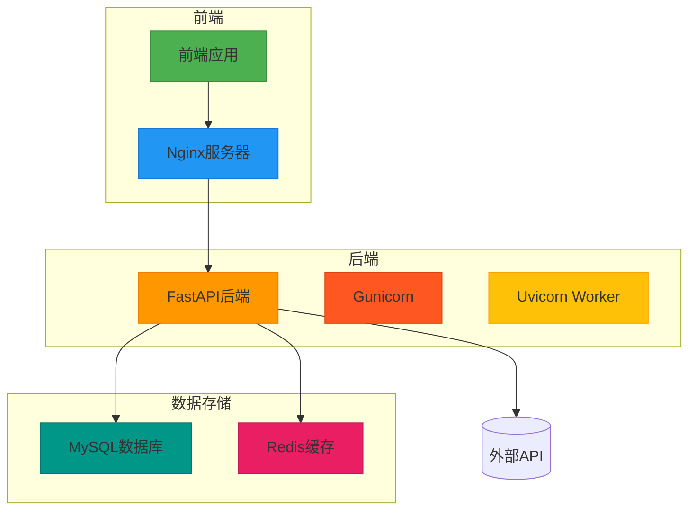
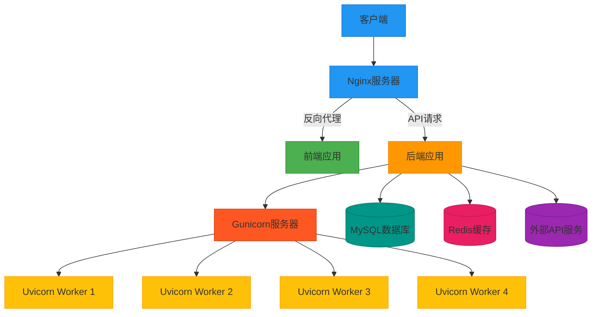
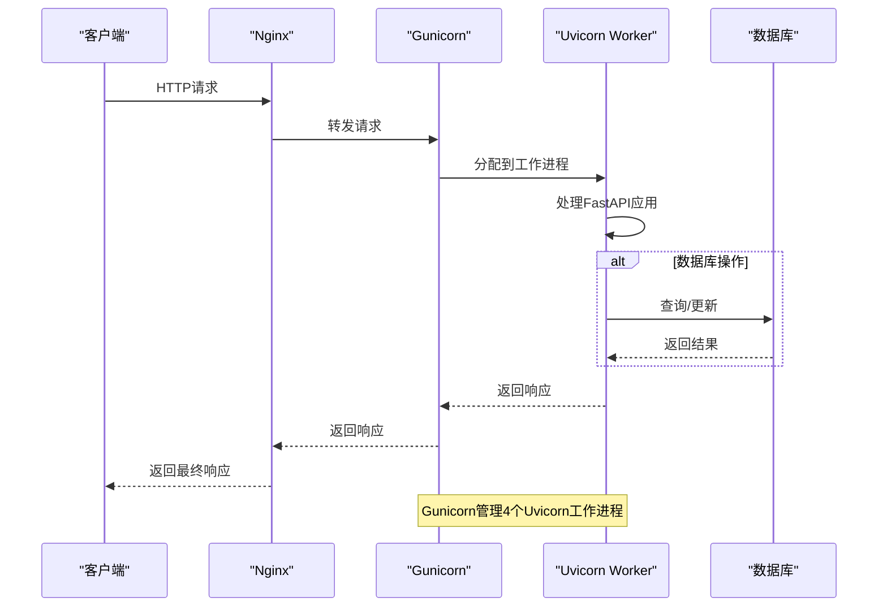
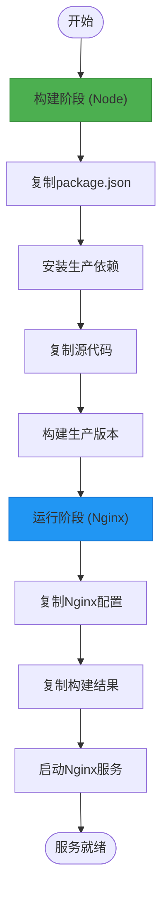
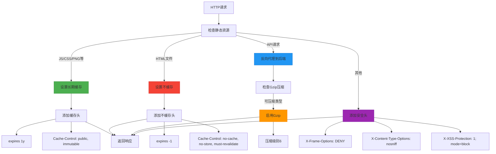
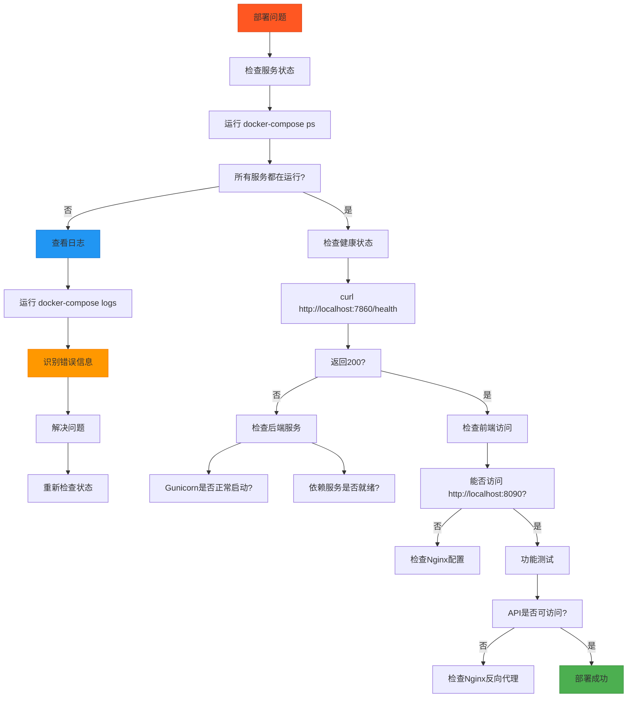

# 生产环境部署

<cite>
**本文档引用文件**  
- [docker-compose.prod.yml](https://github.com/Shy2593666979/AgentChat/docker/docker-compose.prod.yml)
- [nginx.conf](https://github.com/Shy2593666979/AgentChat/docker/nginx.conf)
- [Dockerfile](https://github.com/Shy2593666979/AgentChat/docker/Dockerfile)
- [Dockerfile.frontend.prod](https://github.com/Shy2593666979/AgentChat/docker/Dockerfile.frontend.prod)
- [start.sh](https://github.com/Shy2593666979/AgentChat/docker/start.sh)
- [stop.sh](https://github.com/Shy2593666979/AgentChat/docker/stop.sh)
- [docker.env.example](https://github.com/Shy2593666979/AgentChat/docker/docker.env.example)
- [main.py](https://github.com/Shy2593666979/AgentChat/src/backend/agentchat/main.py)
- [settings.py](https://github.com/Shy2593666979/AgentChat/src/backend/agentchat/settings.py)
- [config.yaml](https://github.com/Shy2593666979/AgentChat/src/backend/agentchat/config.yaml)
</cite>

## 目录
1. [简介](#简介)
2. [项目结构](#项目结构)
3. [核心组件](#核心组件)
4. [架构概述](#架构概述)
5. [详细组件分析](#详细组件分析)
6. [依赖分析](#依赖分析)
7. [性能考虑](#性能考虑)
8. [故障排除指南](#故障排除指南)
9. [结论](#结论)

## 简介
本指南详细说明了从开发到生产环境的配置演进过程，重点介绍基于 `docker-compose.prod.yml` 的生产级服务配置。内容涵盖后端使用Gunicorn多工作进程部署、前端生产镜像构建、MySQL性能优化参数（如InnoDB缓冲池、最大连接数）、Redis持久化与内存策略，以及Nginx生产配置（包括反向代理规则、静态资源缓存策略、Gzip压缩和安全头）。同时，指南还说明了如何通过环境变量注入敏感信息，并指导配置HTTPS（可结合Let's Encrypt），最后提供部署验证步骤以确保高可用性和性能优化措施生效。

## 项目结构
本项目采用前后端分离架构，使用Docker进行容器化部署。核心结构包括后端服务（FastAPI）、前端应用（Vue 3）、MySQL数据库、Redis缓存和Nginx反向代理。



**图示来源**
- [docker-compose.prod.yml](https://github.com/Shy2593666979/AgentChat/docker/docker-compose.prod.yml#L6-L52)
- [nginx.conf](https://github.com/Shy2593666979/AgentChat/docker/nginx.conf#L66-L101)
- [Dockerfile](https://github.com/Shy2593666979/AgentChat/docker/Dockerfile#L2-L39)

**本节来源**
- [docker-compose.prod.yml](https://github.com/Shy2593666979/AgentChat/docker/docker-compose.prod.yml#L1-L52)
- [nginx.conf](https://github.com/Shy2593666979/AgentChat/docker/nginx.conf#L1-L101)

## 核心组件
本系统的核心组件包括使用Gunicorn部署的FastAPI后端、基于Vue 3的前端应用、MySQL数据库、Redis缓存和Nginx反向代理服务器。生产环境通过Docker Compose进行编排，确保各服务的高可用性和性能优化。

**本节来源**
- [docker-compose.prod.yml](https://github.com/Shy2593666979/AgentChat/docker/docker-compose.prod.yml#L1-L52)
- [main.py](https://github.com/Shy2593666979/AgentChat/src/backend/agentchat/main.py#L1-L108)

## 架构概述
系统采用现代化的微服务架构，前端通过Nginx反向代理与后端API通信。后端使用Gunicorn作为WSGI服务器，管理多个Uvicorn工作进程，实现高并发处理能力。数据存储层由MySQL和Redis组成，分别负责持久化数据和缓存。



**图示来源**
- [docker-compose.prod.yml](https://github.com/Shy2593666979/AgentChat/docker/docker-compose.prod.yml#L6-L13)
- [nginx.conf](https://github.com/Shy2593666979/AgentChat/docker/nginx.conf#L66-L101)

## 详细组件分析

### 后端服务分析
后端服务采用Gunicorn多工作进程模式部署，每个工作进程运行一个Uvicorn Worker，实现异步高性能处理。



**图示来源**
- [docker-compose.prod.yml](https://github.com/Shy2593666979/AgentChat/docker/docker-compose.prod.yml#L13)
- [main.py](https://github.com/Shy2593666979/AgentChat/src/backend/agentchat/main.py#L102-L108)

**本节来源**
- [docker-compose.prod.yml](https://github.com/Shy2593666979/AgentChat/docker/docker-compose.prod.yml#L6-L20)
- [main.py](https://github.com/Shy2593666979/AgentChat/src/backend/agentchat/main.py#L1-L108)

### 前端服务分析
前端服务采用多阶段Docker构建，首先在构建阶段安装依赖并构建生产版本，然后在运行阶段使用轻量级Nginx容器提供服务。



**图示来源**
- [Dockerfile.frontend.prod](https://github.com/Shy2593666979/AgentChat/docker/Dockerfile.frontend.prod#L1-L41)
- [nginx.conf](https://github.com/Shy2593666979/AgentChat/docker/nginx.conf#L1-L101)

**本节来源**
- [Dockerfile.frontend.prod](https://github.com/Shy2593666979/AgentChat/docker/Dockerfile.frontend.prod#L1-L41)
- [nginx.conf](https://github.com/Shy2593666979/AgentChat/docker/nginx.conf#L1-L101)

### 数据库服务分析
MySQL和Redis服务在生产环境中进行了专门的性能优化配置。

```mermaid
classDiagram
class MySQLConfig {
+innodb_buffer_pool_size : 1G
+max_connections : 1000
+query_cache_size : 256M
+default_authentication_plugin : mysql_native_password
}
class RedisConfig {
+appendonly : yes
+maxmemory : 512mb
+maxmemory_policy : allkeys-lru
}
class EnvironmentVariables {
+MYSQL_ROOT_PASSWORD : ${MYSQL_ROOT_PASSWORD}
+MYSQL_PASSWORD : ${MYSQL_PASSWORD}
+REDIS_PASSWORD : ${REDIS_PASSWORD}
}
MySQLConfig --> EnvironmentVariables : "使用"
RedisConfig --> EnvironmentVariables : "使用"
```

**图示来源**
- [docker-compose.prod.yml](https://github.com/Shy2593666979/AgentChat/docker/docker-compose.prod.yml#L36-L52)
- [docker.env.example](https://github.com/Shy2593666979/AgentChat/docker/docker.env.example#L45-L52)

**本节来源**
- [docker-compose.prod.yml](https://github.com/Shy2593666979/AgentChat/docker/docker-compose.prod.yml#L36-L52)
- [docker.env.example](https://github.com/Shy2593666979/AgentChat/docker/docker.env.example#L45-L52)

### Nginx配置分析
Nginx配置包含了反向代理、静态资源缓存、Gzip压缩和安全头等生产环境关键配置。



**图示来源**
- [nginx.conf](https://github.com/Shy2593666979/AgentChat/docker/nginx.conf#L66-L101)
- [Dockerfile.frontend.prod](https://github.com/Shy2593666979/AgentChat/docker/Dockerfile.frontend.prod#L32)

**本节来源**
- [nginx.conf](https://github.com/Shy2593666979/AgentChat/docker/nginx.conf#L1-L101)
- [Dockerfile.frontend.prod](https://github.com/Shy2593666979/AgentChat/docker/Dockerfile.frontend.prod#L32)

## 依赖分析
系统各组件之间的依赖关系清晰，通过Docker Compose进行编排管理。

```mermaid
graph TD
docker-compose.prod.yml --> backend
docker-compose.prod.yml --> frontend
docker-compose.prod.yml --> mysql
docker-compose.prod.yml --> redis
backend --> Gunicorn
backend --> Uvicorn
backend --> settings.py
backend --> config.yaml
frontend --> Dockerfile.frontend.prod
frontend --> nginx.conf
frontend --> build-stage
frontend --> production-stage
mysql --> MySQLConfig
redis --> RedisConfig
Environment --> docker.env.example
docker.env.example --> MYSQL_ROOT_PASSWORD
docker.env.example --> MYSQL_PASSWORD
docker.env.example --> REDIS_PASSWORD
docker.env.example --> JWT_SECRET_KEY
start.sh --> docker-compose
stop.sh --> docker-compose
style docker-compose.prod.yml fill:#FF5722,stroke:#D84315
style backend fill:#FF9800,stroke:#F57C00
style frontend fill:#4CAF50,stroke:#388E3C
style mysql fill:#009688,stroke:#00796B
style redis fill:#E91E63,stroke:#C2185B
style start.sh fill:#2196F3,stroke:#1976D2
style stop.sh fill:#2196F3,stroke:#1976D2
```



**图示来源**
- [docker-compose.prod.yml](https://github.com/Shy2593666979/AgentChat/docker/docker-compose.prod.yml#L1-L52)
- [docker.env.example](https://github.com/Shy2593666979/AgentChat/docker/docker.env.example#L1-L73)

**本节来源**
- [docker-compose.prod.yml](https://github.com/Shy2593666979/AgentChat/docker/docker-compose.prod.yml#L1-L52)
- [docker.env.example](https://github.com/Shy2593666979/AgentChat/docker/docker.env.example#L1-L73)

## 性能考虑
生产环境的性能优化主要体现在以下几个方面：

1. **后端性能**：使用Gunicorn管理4个Uvicorn工作进程，充分利用多核CPU，提高并发处理能力。
2. **数据库性能**：MySQL配置了1GB的InnoDB缓冲池和1000的最大连接数，Redis配置了512MB的最大内存和LRU淘汰策略。
3. **前端性能**：Nginx配置了静态资源的长期缓存（1年）和Gzip压缩，减少网络传输量。
4. **安全性能**：Nginx配置了X-Frame-Options、X-Content-Type-Options等安全头，提高应用安全性。

**本节来源**
- [docker-compose.prod.yml](https://github.com/Shy2593666979/AgentChat/docker/docker-compose.prod.yml#L13-L52)
- [nginx.conf](https://github.com/Shy2593666979/AgentChat/docker/nginx.conf#L34-L65)

## 故障排除指南
当部署出现问题时，可以按照以下步骤进行排查：



**本节来源**
- [start.sh](https://github.com/Shy2593666979/AgentChat/docker/start.sh#L34-L35)
- [nginx.conf](https://github.com/Shy2593666979/AgentChat/docker/nginx.conf#L95-L98)
- [main.py](https://github.com/Shy2593666979/AgentChat/src/backend/agentchat/main.py#L24-L26)

## 结论
本指南详细介绍了AgentChat系统的生产环境部署方案。通过`docker-compose.prod.yml`文件，我们实现了后端Gunicorn多工作进程部署、前端生产镜像构建、MySQL和Redis的性能优化配置。Nginx配置文件提供了反向代理、静态资源缓存、Gzip压缩和安全头等关键生产环境特性。通过环境变量注入敏感信息，确保了配置的安全性。建议在生产环境中结合Let's Encrypt配置HTTPS，以提供更安全的通信。部署后，应通过提供的验证步骤确保所有高可用性和性能优化措施均已生效。