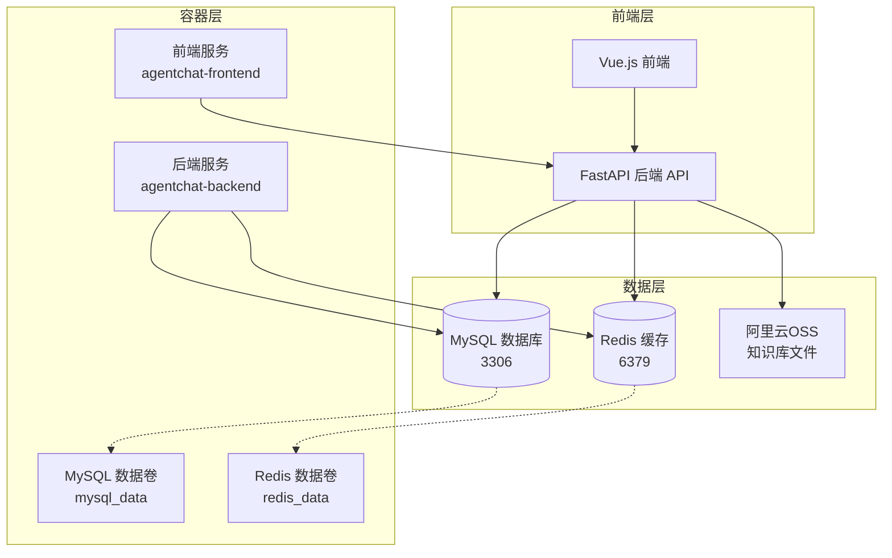
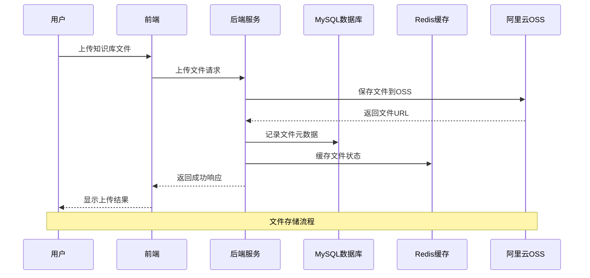
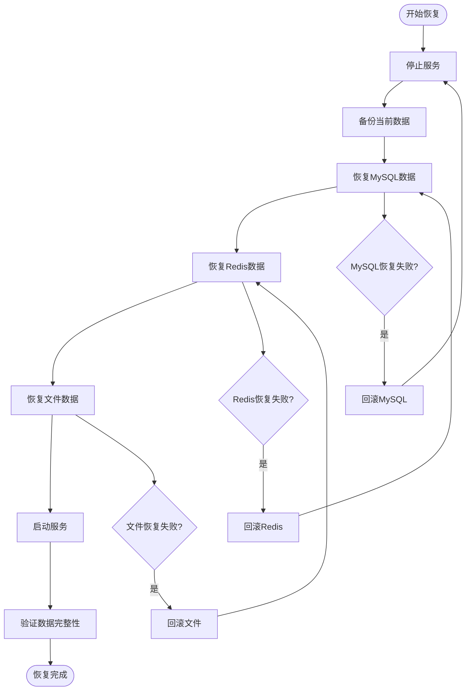
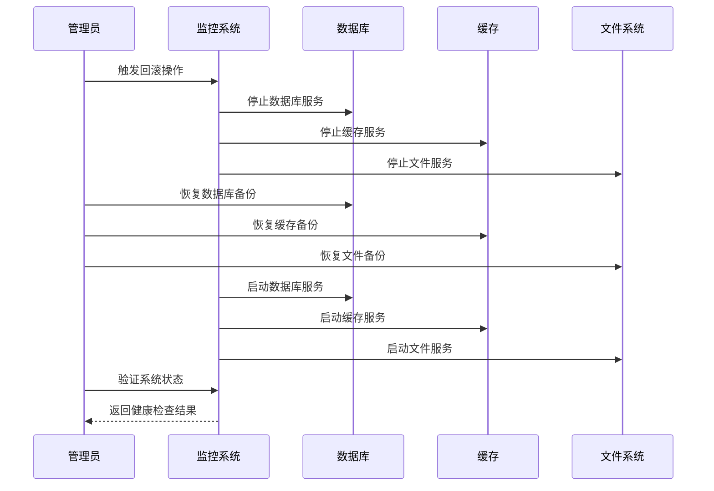

# 备份与恢复

<cite>
**本文档引用的文件**
- [docker-compose.yml](https://github.com/Shy2593666979/AgentChat/docker/docker-compose.yml)
- [docker-compose.prod.yml](https://github.com/Shy2593666979/AgentChat/docker/docker-compose.prod.yml)
- [settings.py](https://github.com/Shy2593666979/AgentChat/src/backend/agentchat/settings.py)
- [main.py](https://github.com/Shy2593666979/AgentChat/src/backend/agentchat/main.py)
- [redis.py](https://github.com/Shy2593666979/AgentChat/src/backend/agentchat/services/redis.py)
- [config.yaml](https://github.com/Shy2593666979/AgentChat/src/backend/agentchat/config.yaml)
- [knowledge.py](https://github.com/Shy2593666979/AgentChat/src/backend/agentchat/api/services/knowledge.py)
- [knowledge_file.py](https://github.com/Shy2593666979/AgentChat/src/backend/agentchat/api/services/knowledge_file.py)
- [Dockerfile](https://github.com/Shy2593666979/AgentChat/docker/Dockerfile)
- [start.sh](https://github.com/Shy2593666979/AgentChat/docker/start.sh)
</cite>

## 目录
1. [概述](#概述)
2. [系统架构分析](#系统架构分析)
3. [数据存储结构](#数据存储结构)
4. [备份策略设计](#备份策略设计)
5. [恢复操作指南](#恢复操作指南)
6. [版本回滚处理](#版本回滚处理)
7. [服务迁移流程](#服务迁移流程)
8. [监控与维护](#监控与维护)
9. [故障排除](#故障排除)
10. [最佳实践建议](#最佳实践建议)

## 概述

AgentChat是一个基于Docker容器化的智能对话平台，采用MySQL作为主数据库，Redis作为缓存层，支持知识库文件存储等功能。本备份与恢复策略旨在确保用户数据、对话历史、知识库文件等关键信息的安全性和可恢复性。

### 关键组件概览

- **MySQL数据库**：存储用户信息、对话记录、知识库配置等核心数据
- **Redis缓存**：提供会话状态、临时数据缓存
- **知识库文件存储**：通过阿里云OSS存储用户上传的知识库文件
- **Docker容器编排**：通过docker-compose管理服务部署

## 系统架构分析



**图表来源**
- [docker-compose.yml](https://github.com/Shy2593666979/AgentChat/docker/docker-compose.yml#L1-L126)
- [main.py](https://github.com/Shy2593666979/AgentChat/src/backend/agentchat/main.py#L1-L108)

**章节来源**
- [docker-compose.yml](https://github.com/Shy2593666979/AgentChat/docker/docker-compose.yml#L1-L126)
- [config.yaml](https://github.com/Shy2593666979/AgentChat/src/backend/agentchat/config.yaml#L1-L129)

## 数据存储结构

### 数据库表结构

系统主要包含以下核心数据表：

| 表名 | 描述 | 关键字段 |
|------|------|----------|
| user | 用户信息表 | user_id, user_name, user_email |
| dialog | 对话记录表 | dialog_id, user_id, agent_id |
| message | 消息内容表 | message_id, dialog_id, content |
| knowledge | 知识库表 | id, name, description, user_id |
| knowledge_file | 知识库文件表 | id, knowledge_id, file_name, oss_url |
| usage_stats | 使用统计表 | id, user_id, agent, model |
| agent | 代理配置表 | id, name, description |

### 数据流分析



**图表来源**
- [knowledge_file.py](https://github.com/Shy2593666979/AgentChat/src/backend/agentchat/api/services/knowledge_file.py#L54-L64)
- [knowledge_file.py](https://github.com/Shy2593666979/AgentChat/src/backend/agentchat/api/v1/knowledge_file.py#L1-L57)

**章节来源**
- [knowledge.py](https://github.com/Shy2593666979/AgentChat/src/backend/agentchat/api/services/knowledge.py#L1-L34)
- [knowledge_file.py](https://github.com/Shy2593666979/AgentChat/src/backend/agentchat/api/services/knowledge_file.py#L54-L64)

## 备份策略设计

### 全量备份方案

#### MySQL数据库备份

**备份计划**：
- 每日凌晨2:00执行全量备份
- 备份保留周期：30天
- 备份文件命名格式：`agentchat_backup_YYYYMMDD.sql`

**备份命令**：
```bash
# 在MySQL容器内执行
mysqldump -u root -p123456 --single-transaction --routines --triggers agentchat > /backup/agentchat_backup_$(date +%Y%m%d).sql

# 或通过docker exec执行
docker exec agentchat-mysql mysqldump -u root -p123456 --single-transaction --routines --triggers agentchat > /backup/agentchat_backup_$(date +%Y%m%d).sql
```

**自动化脚本**：
```bash
#!/bin/bash
# MySQL自动备份脚本

BACKUP_DIR="/backup/mysql"
DATE=$(date +%Y%m%d)
RETENTION_DAYS=30

# 创建备份目录
mkdir -p $BACKUP_DIR

# 执行备份
docker exec agentchat-mysql mysqldump -u root -p123456 \
  --single-transaction \
  --routines \
  --triggers \
  agentchat > $BACKUP_DIR/agentchat_backup_$DATE.sql

# 压缩备份文件
gzip $BACKUP_DIR/agentchat_backup_$DATE.sql

# 清理过期备份
find $BACKUP_DIR -name "*.sql.gz" -mtime +$RETENTION_DAYS -delete
```

#### Redis缓存备份

**备份计划**：
- 每日午夜执行RDB快照备份
- 备份保留周期：7天
- 备份文件命名格式：`redis_backup_YYYYMMDD.rdb`

**配置优化**：
```bash
# Redis配置文件(/etc/redis/redis.conf)
save 900 1      # 900秒内至少1个键变化时保存
save 300 10     # 300秒内至少10个键变化时保存
save 60 10000   # 60秒内至少10000个键变化时保存
```

**备份命令**：
```bash
# 执行SAVE命令触发RDB备份
docker exec agentchat-redis redis-cli save

# 复制RDB文件到备份目录
docker cp agentchat-redis:/data/dump.rdb /backup/redis/redis_backup_$(date +%Y%m%d).rdb
```

#### 知识库文件备份

**备份策略**：
- 定期扫描OSS中的文件
- 备份元数据到MySQL
- 文件级别备份（可选）

**章节来源**
- [docker-compose.yml](https://github.com/Shy2593666979/AgentChat/docker/docker-compose.yml#L9-L48)
- [redis.py](https://github.com/Shy2593666979/AgentChat/src/backend/agentchat/services/redis.py#L1-L115)

### 增量备份方案

#### 日志文件备份

**备份内容**：
- 应用日志：`/app/logs/*.log`
- 访问日志：`/var/log/nginx/access.log`
- 错误日志：`/var/log/nginx/error.log`

**备份脚本**：
```bash
#!/bin/bash
# 日志文件增量备份

LOG_DIR="/app/logs"
BACKUP_DIR="/backup/logs"
DATE=$(date +%Y%m%d)

# 创建日志备份目录
mkdir -p $BACKUP_DIR/$DATE

# 备份应用日志
tar -czf $BACKUP_DIR/$DATE/app_logs.tar.gz $LOG_DIR/*.log

# 备份Nginx日志
tar -czf $BACKUP_DIR/$DATE/nginx_logs.tar.gz /var/log/nginx/*.log
```

#### 配置文件备份

**备份范围**：
- Docker配置文件
- Nginx配置
- 环境变量文件

**章节来源**
- [start.sh](https://github.com/Shy2593666979/AgentChat/docker/start.sh#L1-L52)
- [Dockerfile](https://github.com/Shy2593666979/AgentChat/docker/Dockerfile#L1-L39)

## 恢复操作指南

### 数据库恢复流程



**图表来源**
- [docker-compose.yml](https://github.com/Shy2593666979/AgentChat/docker/docker-compose.yml#L1-L126)

#### MySQL恢复步骤

1. **停止服务**：
```bash
docker-compose down
```

2. **恢复数据库**：
```bash
# 恢复到指定日期的备份
docker exec -i agentchat-mysql mysql -u root -p123456 agentchat < /backup/mysql/agentchat_backup_YYYYMMDD.sql

# 或解压后恢复
gunzip /backup/mysql/agentchat_backup_YYYYMMDD.sql.gz
docker exec -i agentchat-mysql mysql -u root -p123456 agentchat < /backup/mysql/agentchat_backup_YYYYMMDD.sql
```

3. **验证恢复**：
```bash
docker exec agentchat-mysql mysql -u root -p123456 -e "USE agentchat; SHOW TABLES;"
```

#### Redis恢复步骤

1. **复制RDB文件**：
```bash
# 停止Redis服务
docker-compose stop redis

# 复制备份文件
cp /backup/redis/redis_backup_YYYYMMDD.rdb agentchat-redis-data/dump.rdb

# 启动Redis服务
docker-compose start redis
```

2. **验证恢复**：
```bash
docker exec agentchat-redis redis-cli ping
docker exec agentchat-redis redis-cli dbsize
```

#### 知识库文件恢复

1. **重建OSS连接**：
```bash
# 更新配置文件
sed -i 's/old-bucket-name/new-bucket-name/g' src/backend/agentchat/config.yaml
```

2. **同步文件元数据**：
```bash
# 重新初始化知识库文件表
docker exec agentchat-backend python manage.py rebuild_knowledge_files
```

**章节来源**
- [docker-compose.yml](https://github.com/Shy2593666979/AgentChat/docker/docker-compose.yml#L1-L126)
- [redis.py](https://github.com/Shy2593666979/AgentChat/src/backend/agentchat/services/redis.py#L1-L115)

## 版本回滚处理

### 数据兼容性检查

#### 版本对比矩阵

| 功能模块 | 当前版本 | 回滚版本 | 兼容性风险 | 处理方案 |
|----------|----------|----------|------------|----------|
| 用户系统 | v2.2.0 | v2.1.0 | 中等 | 检查用户表结构变更 |
| 对话系统 | v2.2.0 | v2.1.0 | 低 | 对话格式兼容性检查 |
| 知识库 | v2.2.0 | v2.1.0 | 高 | 文件格式和索引重建 |
| 缓存系统 | v2.2.0 | v2.1.0 | 低 | Redis数据结构检查 |

#### 自动化兼容性检测脚本

```bash
#!/bin/bash
# 数据库兼容性检查脚本

echo "开始数据库兼容性检查..."

# 检查用户表结构
echo "检查用户表结构..."
docker exec agentchat-mysql mysql -u root -p123456 -e "
SELECT COLUMN_NAME, DATA_TYPE, CHARACTER_MAXIMUM_LENGTH 
FROM INFORMATION_SCHEMA.COLUMNS 
WHERE TABLE_SCHEMA='agentchat' AND TABLE_NAME='user';
"

# 检查对话表结构
echo "检查对话表结构..."
docker exec agentchat-mysql mysql -u root -p123456 -e "
SELECT COLUMN_NAME, DATA_TYPE, IS_NULLABLE 
FROM INFORMATION_SCHEMA.COLUMNS 
WHERE TABLE_SCHEMA='agentchat' AND TABLE_NAME='dialog';
"

# 检查知识库表结构
echo "检查知识库表结构..."
docker exec agentchat-mysql mysql -u root -p123456 -e "
SELECT COLUMN_NAME, DATA_TYPE, COLUMN_DEFAULT 
FROM INFORMATION_SCHEMA.COLUMNS 
WHERE TABLE_SCHEMA='agentchat' AND TABLE_NAME='knowledge';
"

echo "兼容性检查完成"
```

### 回滚操作流程



**图表来源**
- [main.py](https://github.com/Shy2593666979/AgentChat/src/backend/agentchat/main.py#L66-L75)

**章节来源**
- [config.yaml](https://github.com/Shy2593666979/AgentChat/src/backend/agentchat/config.yaml#L1-L129)
- [settings.py](https://github.com/Shy2593666979/AgentChat/src/backend/agentchat/settings.py#L1-L62)

## 服务迁移流程

### 迁移前准备

#### 环境检查清单

1. **硬件资源检查**：
   - CPU：至少4核
   - 内存：8GB以上
   - 磁盘空间：50GB以上
   - 网络带宽：100Mbps以上

2. **软件依赖检查**：
   - Docker版本：20.10+
   - Docker Compose版本：2.0+
   - Git版本控制

3. **数据完整性检查**：
   ```bash
   # 检查数据库连接
   docker exec agentchat-mysql mysqladmin ping -h localhost
   
   # 检查Redis连接
   docker exec agentchat-redis redis-cli ping
   
   # 检查OSS连接
   docker exec agentchat-backend python -c "
   from agentchat.services.aliyun_oss import aliyun_oss
   print('OSS连接正常:', aliyun_oss.check_connection())
   "
   ```

#### 迁移脚本模板

```bash
#!/bin/bash
# 服务迁移脚本

SOURCE_HOST="source-server-ip"
TARGET_HOST="target-server-ip"
BACKUP_PATH="/backup/migration"

echo "开始服务迁移..."

# 1. 停止源服务器服务
ssh root@$SOURCE_HOST "docker-compose down"

# 2. 备份数据
ssh root@$SOURCE_HOST "rsync -avz /var/lib/docker/volumes/ agentchat-data-backup/"

# 3. 传输数据
scp -r root@$SOURCE_HOST:agentchat-data-backup/* $BACKUP_PATH/

# 4. 停止目标服务器服务
ssh root@$TARGET_HOST "docker-compose down"

# 5. 恢复数据
rsync -avz $BACKUP_PATH/ /var/lib/docker/volumes/

# 6. 启动目标服务器服务
ssh root@$TARGET_HOST "cd /path/to/project && docker-compose up -d"

# 7. 验证服务状态
ssh root@$TARGET_HOST "docker-compose ps"
```

### 迁移后验证

#### 功能验证清单

1. **数据库连接验证**：
```bash
# 测试数据库连接
docker exec agentchat-mysql mysql -u root -p123456 -e "SHOW DATABASES;"

# 检查关键表数据
docker exec agentchat-mysql mysql -u root -p123456 -e "
USE agentchat;
SELECT COUNT(*) as user_count FROM user;
SELECT COUNT(*) as dialog_count FROM dialog;
SELECT COUNT(*) as knowledge_count FROM knowledge;
"
```

2. **缓存服务验证**：
```bash
# 检查Redis状态
docker exec agentchat-redis redis-cli info | grep connected_clients

# 测试缓存功能
docker exec agentchat-backend python -c "
from agentchat.services.redis import redis_client
redis_client.set('test_key', 'test_value', 60)
print('缓存设置成功:', redis_client.get('test_key'))
"
```

3. **文件系统验证**：
```bash
# 检查OSS连接
docker exec agentchat-backend python -c "
from agentchat.services.aliyun_oss import aliyun_oss
print('OSS可用:', aliyun_oss.check_connection())
"

# 验证知识库文件访问
docker exec agentchat-backend python -c "
from agentchat.api.services.knowledge_file import KnowledgeFileService
files = await KnowledgeFileService.get_knowledge_file('test-knowledge-id')
print('知识库文件列表:', len(files))
"
```

**章节来源**
- [docker-compose.yml](https://github.com/Shy2593666979/AgentChat/docker/docker-compose.yml#L1-L126)
- [config.yaml](https://github.com/Shy2593666979/AgentChat/src/backend/agentchat/config.yaml#L1-L129)

## 监控与维护

### 监控指标体系

#### 关键性能指标(KPI)

| 指标类别 | 监控项 | 正常范围 | 告警阈值 | 处理措施 |
|----------|--------|----------|----------|----------|
| 数据库 | 连接数 | < 80%最大连接数 | > 90% | 优化查询或增加连接池 |
| 数据库 | 响应时间 | < 100ms | > 500ms | 分析慢查询 |
| 缓存 | 命中率 | > 85% | < 70% | 调整缓存策略 |
| 缓存 | 内存使用 | < 80% | > 90% | 清理过期数据 |
| 存储 | 磁盘使用 | < 85% | > 95% | 清理旧备份 |
| 网络 | 带宽使用 | < 70% | > 85% | 优化数据传输 |

#### 监控脚本示例

```bash
#!/bin/bash
# 系统监控脚本

# MySQL监控
mysql_status=$(docker exec agentchat-mysql mysqladmin ping 2>&1)
if [[ $mysql_status == *"alive"* ]]; then
    echo "MySQL: 正常"
else
    echo "MySQL: 异常 - $mysql_status"
fi

# Redis监控
redis_status=$(docker exec agentchat-redis redis-cli ping 2>&1)
if [[ $redis_status == "PONG" ]]; then
    echo "Redis: 正常"
else
    echo "Redis: 异常 - $redis_status"
fi

# 磁盘空间监控
disk_usage=$(df -h /var/lib/docker/volumes/ | awk 'NR==2 {print $5}' | sed 's/%//')
if [ $disk_usage -gt 90 ]; then
    echo "磁盘空间不足: ${disk_usage}%"
fi

# 备份状态检查
backup_files=$(ls -la /backup/mysql/ | wc -l)
if [ $backup_files -lt 7 ]; then
    echo "警告: 备份文件数量不足"
fi
```

### 定期维护任务

#### 日常维护(每日)

1. **备份检查**：
```bash
#!/bin/bash
# 备份完整性检查

BACKUP_DATE=$(date +%Y%m%d)
BACKUP_FILE="/backup/mysql/agentchat_backup_$BACKUP_DATE.sql.gz"

# 检查备份文件是否存在
if [ ! -f "$BACKUP_FILE" ]; then
    echo "错误: 备份文件不存在 - $BACKUP_FILE"
    exit 1
fi

# 检查备份文件大小
FILE_SIZE=$(stat -f%z "$BACKUP_FILE")
if [ $FILE_SIZE -lt 1024 ]; then
    echo "警告: 备份文件过小 - $(($FILE_SIZE/1024))KB"
fi

# 测试备份文件可读性
gunzip -t "$BACKUP_FILE"
if [ $? -ne 0 ]; then
    echo "错误: 备份文件损坏"
    exit 1
fi

echo "备份文件检查通过"
```

2. **日志清理**：
```bash
#!/bin/bash
# 日志文件清理

LOG_RETENTION_DAYS=30
LOG_DIRS="/app/logs /var/log/nginx"

for dir in $LOG_DIRS; do
    find $dir -name "*.log" -mtime +$LOG_RETENTION_DAYS -delete
    echo "清理了$dir中${LOG_RETENTION_DAYS}天前的日志文件"
done
```

#### 周期性维护(每周)

1. **数据库优化**：
```bash
#!/bin/bash
# 数据库维护脚本

# 优化表结构
docker exec agentchat-mysql mysql -u root -p123456 -e "
USE agentchat;
OPTIMIZE TABLE user, dialog, message, knowledge, knowledge_file;
ANALYZE TABLE user, dialog, message, knowledge, knowledge_file;
"

# 清理慢查询日志
docker exec agentchat-mysql mysql -u root -p123456 -e "
SET GLOBAL slow_query_log = 'OFF';
TRUNCATE TABLE mysql.slow_log;
SET GLOBAL slow_query_log = 'ON';
"
```

2. **缓存清理**：
```bash
#!/bin/bash
# 缓存维护脚本

# 清理过期缓存
docker exec agentchat-redis redis-cli --scan --pattern "*" | while read key; do
    ttl=$(docker exec agentchat-redis redis-cli ttl $key)
    if [ $ttl -eq -1 ]; then
        # 设置默认过期时间(1小时)
        docker exec agentchat-redis redis-cli expire $key 3600
    fi
done

# 检查内存使用情况
redis_info=$(docker exec agentchat-redis redis-cli info memory)
echo "Redis内存使用情况:"
echo "$redis_info" | grep used_memory_human
echo "$redis_info" | grep used_memory_peak_human
```

**章节来源**
- [redis.py](https://github.com/Shy2593666979/AgentChat/src/backend/agentchat/services/redis.py#L1-L115)
- [start.sh](https://github.com/Shy2593666979/AgentChat/docker/start.sh#L1-L52)

## 故障排除

### 常见问题及解决方案

#### 数据库连接问题

**问题现象**：
- 应用无法连接MySQL
- 数据库连接超时

**排查步骤**：
```bash
# 1. 检查MySQL容器状态
docker ps | grep mysql

# 2. 检查MySQL服务状态
docker exec agentchat-mysql mysqladmin ping

# 3. 检查MySQL错误日志
docker exec agentchat-mysql tail -n 100 /var/log/mysql/error.log

# 4. 检查网络连接
docker network ls
docker network inspect agentchat-agentchat-network
```

**解决方案**：
```bash
# 重启MySQL服务
docker-compose restart mysql

# 重置MySQL配置
docker exec agentchat-mysql mysql -u root -p123456 -e "
FLUSH PRIVILEGES;
ALTER USER 'agentchat_user'@'%' IDENTIFIED WITH mysql_native_password BY '123456';
GRANT ALL PRIVILEGES ON agentchat.* TO 'agentchat_user'@'%';
FLUSH PRIVILEGES;
"
```

#### Redis缓存问题

**问题现象**：
- 缓存数据丢失
- 缓存响应缓慢

**排查步骤**：
```bash
# 检查Redis状态
docker exec agentchat-redis redis-cli ping

# 检查Redis配置
docker exec agentchat-redis redis-cli config get "*"

# 检查Redis内存使用
docker exec agentchat-redis redis-cli info memory
```

**解决方案**：
```bash
# 重置Redis配置
docker exec agentchat-redis redis-cli config set save ""
docker exec agentchat-redis redis-cli config set appendonly no

# 重新启动Redis
docker-compose restart redis

# 检查持久化配置
docker exec agentchat-redis redis-cli config get "appendonly"
docker exec agentchat-redis redis-cli config get "save"
```

#### 知识库文件访问问题

**问题现象**：
- 文件上传失败
- 文件下载链接失效

**排查步骤**：
```bash
# 检查OSS连接
docker exec agentchat-backend python -c "
from agentchat.services.aliyun_oss import aliyun_oss
print('OSS连接状态:', aliyun_oss.check_connection())
"

# 检查文件权限
docker exec agentchat-backend ls -la /app/uploads/
```

**解决方案**：
```bash
# 重新配置OSS
docker exec agentchat-backend python -c "
from agentchat.config import app_settings
app_settings.aliyun_oss = {
    'access_key_id': 'new-access-key',
    'access_key_secret': 'new-secret-key',
    'endpoint': 'oss-cn-beijing.aliyuncs.com',
    'bucket_name': 'agentchat-new'
}
"

# 重建文件索引
docker exec agentchat-backend python manage.py rebuild_file_index
```

### 紧急恢复程序

#### 最小化恢复流程

当系统出现严重故障时，可执行最小化恢复：

1. **快速启动服务**：
```bash
# 只启动数据库和缓存服务
docker-compose up -d mysql redis

# 等待服务就绪
sleep 30
```

2. **验证核心功能**：
```bash
# 验证数据库连接
docker exec agentchat-mysql mysql -u root -p123456 -e "SELECT 1;"

# 验证缓存连接
docker exec agentchat-redis redis-cli ping

# 检查基本数据
docker exec agentchat-mysql mysql -u root -p123456 -e "
USE agentchat;
SELECT COUNT(*) FROM user LIMIT 1;
SELECT COUNT(*) FROM dialog LIMIT 1;
"
```

3. **逐步恢复完整服务**：
```bash
# 启动完整服务栈
docker-compose up -d

# 监控服务状态
docker-compose ps

# 验证API接口
curl -f http://localhost:7860/health
```

**章节来源**
- [docker-compose.yml](https://github.com/Shy2593666979/AgentChat/docker/docker-compose.yml#L1-L126)
- [redis.py](https://github.com/Shy2593666979/AgentChat/src/backend/agentchat/services/redis.py#L1-L115)

## 最佳实践建议

### 备份策略优化

1. **多层备份策略**：
   - 本地即时备份（RDB快照）
   - 远程异地备份（OSS存储）
   - 定期归档备份（冷存储）

2. **备份验证自动化**：
   ```bash
   # 自动化备份验证脚本
   #!/bin/bash
   BACKUP_DATE=$(date +%Y%m%d)
   BACKUP_FILE="/backup/mysql/agentchat_backup_$BACKUP_DATE.sql.gz"
   
   # 验证备份文件完整性
   if gunzip -t "$BACKUP_FILE"; then
       echo "备份文件验证通过"
   else
       echo "备份文件损坏，发送告警"
       # 发送告警通知
   fi
   ```

3. **备份性能优化**：
   - 使用`--single-transaction`参数避免锁定
   - 启用压缩减少存储空间
   - 并行处理多个数据库

### 监控告警配置

1. **关键指标监控**：
   - 数据库连接数趋势
   - 缓存命中率变化
   - 磁盘空间使用率
   - 备份成功率统计

2. **告警规则设置**：
   - 数据库连接失败：立即告警
   - 缓存命中率低于70%：延迟告警
   - 备份失败：立即告警
   - 磁盘空间低于20%：紧急告警

### 安全加固措施

1. **访问控制**：
   - 限制数据库访问IP
   - 使用强密码策略
   - 定期更换密钥

2. **数据加密**：
   - 传输过程加密（TLS）
   - 存储过程加密（AES）
   - 备份文件加密

3. **审计日志**：
   - 记录所有备份操作
   - 监控异常访问行为
   - 定期安全评估

### 性能调优建议

1. **数据库优化**：
   - 合理设置连接池大小
   - 优化索引策略
   - 定期分析查询性能

2. **缓存优化**：
   - 设置合适的过期时间
   - 使用分布式缓存
   - 监控缓存命中率

3. **存储优化**：
   - 定期清理无用数据
   - 压缩大文件
   - 使用CDN加速

通过实施这些备份与恢复策略，可以确保AgentChat系统的数据安全性和业务连续性，为用户提供稳定可靠的服务体验。