# 服务管理

<cite>
**本文档引用的文件**
- [start.sh](https://github.com/Shy2593666979/AgentChat/docker/start.sh)
- [stop.sh](https://github.com/Shy2593666979/AgentChat/docker/stop.sh)
- [docker-compose.yml](https://github.com/Shy2593666979/AgentChat/docker/docker-compose.yml)
- [docker-compose.prod.yml](https://github.com/Shy2593666979/AgentChat/docker/docker-compose.prod.yml)
- [Dockerfile](https://github.com/Shy2593666979/AgentChat/docker/Dockerfile)
- [docker.env.example](https://github.com/Shy2593666979/AgentChat/docker/docker.env.example)
- [nginx.conf](https://github.com/Shy2593666979/AgentChat/docker/nginx.conf)
- [README.md](https://github.com/Shy2593666979/AgentChat/docker/README.md)
</cite>

## 目录
1. [简介](#简介)
2. [项目结构概览](#项目结构概览)
3. [核心服务组件](#核心服务组件)
4. [架构概览](#架构概览)
5. [详细组件分析](#详细组件分析)
6. [服务启动管理](#服务启动管理)
7. [服务停止管理](#服务停止管理)
8. [配置文件管理](#配置文件管理)
9. [健康检查机制](#健康检查机制)
10. [日志监控与诊断](#日志监控与诊断)
11. [常见问题排查](#常见问题排查)
12. [性能监控与优化](#性能监控与优化)
13. [总结](#总结)

## 简介

AgentChat 是一个基于 Docker 容器化的智能对话平台，采用微服务架构设计。本指南详细介绍了服务的启动、停止、重启和状态监控操作，以及相关的配置管理和故障排除方法。

## 项目结构概览

AgentChat 的服务管理主要集中在 `docker/` 目录下，包含以下核心文件：

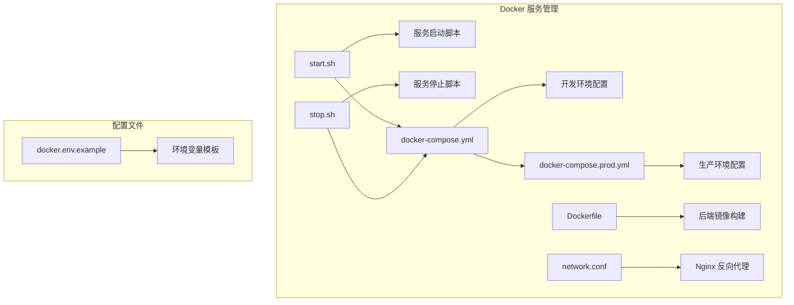

**图表来源**
- [start.sh](https://github.com/Shy2593666979/AgentChat/docker/start.sh#L1-L52)
- [stop.sh](https://github.com/Shy2593666979/AgentChat/docker/stop.sh#L1-L35)
- [docker-compose.yml](https://github.com/Shy2593666979/AgentChat/docker/docker-compose.yml#L1-L126)
- [docker-compose.prod.yml](https://github.com/Shy2593666979/AgentChat/docker/docker-compose.prod.yml#L1-L52)

## 核心服务组件

AgentChat 包含以下核心服务组件：

| 服务名称 | 容器名称 | 端口 | 功能描述 | 健康检查 |
|---------|---------|------|----------|----------|
| MySQL数据库 | agentchat-mysql | 3306 | 主数据库存储 | mysqladmin ping |
| Redis缓存 | agentchat-redis | 6379 | 缓存和会话存储 | redis-cli ping |
| 后端API | agentchat-backend | 7860 | FastAPI应用服务 | curl health check |
| 前端开发 | agentchat-frontend | 8090 | Vue3开发服务器 | curl health check |

**章节来源**
- [docker-compose.yml](https://github.com/Shy2593666979/AgentChat/docker/docker-compose.yml#L8-L126)

## 架构概览

AgentChat 采用多层架构设计，支持开发和生产两种环境：

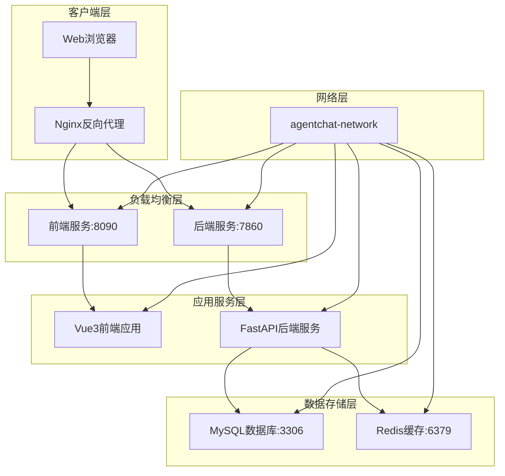

**图表来源**
- [docker-compose.yml](https://github.com/Shy2593666979/AgentChat/docker/docker-compose.yml#L3-L6)
- [nginx.conf](https://github.com/Shy2593666979/AgentChat/docker/nginx.conf#L67-L101)

## 详细组件分析

### 后端服务组件

后端服务基于 FastAPI 框架构建，采用 Uvicorn 作为 ASGI 服务器：

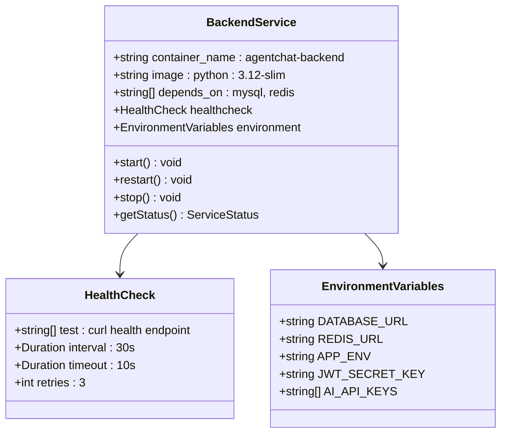

**图表来源**
- [docker-compose.yml](https://github.com/Shy2593666979/AgentChat/docker/docker-compose.yml#L51-L93)
- [Dockerfile](https://github.com/Shy2593666979/AgentChat/docker/Dockerfile#L1-L39)

### 数据库服务组件

MySQL 和 Redis 服务提供数据持久化和缓存功能：

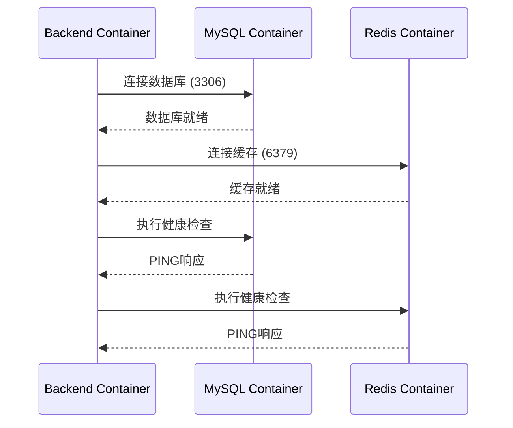

**图表来源**
- [docker-compose.yml](https://github.com/Shy2593666979/AgentChat/docker/docker-compose.yml#L8-L49)

**章节来源**
- [docker-compose.yml](https://github.com/Shy2593666979/AgentChat/docker/docker-compose.yml#L8-L93)

## 服务启动管理

### 启动脚本分析

启动脚本 `start.sh` 提供了完整的服务启动流程：

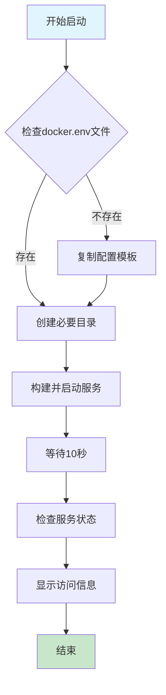

**图表来源**
- [start.sh](https://github.com/Shy2593666979/AgentChat/docker/start.sh#L1-L52)

### 启动流程详解

1. **环境变量检查**：自动检测并创建环境变量配置文件
2. **目录创建**：初始化数据和日志目录
3. **服务构建**：使用 Docker Compose 构建并启动所有服务
4. **健康检查**：等待服务启动并验证状态

### 启动命令使用

```bash
# 进入docker目录
cd docker

# 设置执行权限
chmod +x start.sh stop.sh

# 启动所有服务
./start.sh
```

**章节来源**
- [start.sh](https://github.com/Shy2593666979/AgentChat/docker/start.sh#L1-L52)

## 服务停止管理

### 停止脚本分析

停止脚本提供了安全的服务终止机制：

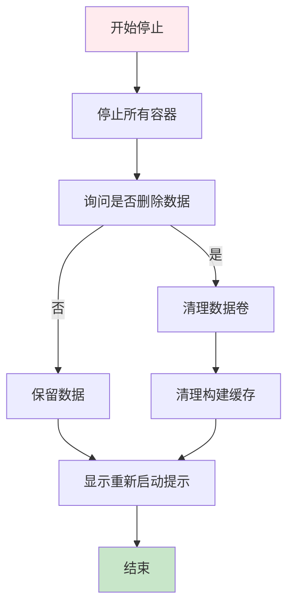

**图表来源**
- [stop.sh](https://github.com/Shy2593666979/AgentChat/docker/stop.sh#L1-L35)

### 停止选项说明

| 选项 | 功能描述 | 数据处理 |
|------|----------|----------|
| 停止容器 | 正常关闭所有服务 | 保留 |
| 删除数据 | 清理所有数据卷 | 删除 |
| 清理缓存 | 移除构建缓存 | 删除 |

**章节来源**
- [stop.sh](https://github.com/Shy2593666979/AgentChat/docker/stop.sh#L1-L35)

## 配置文件管理

### 环境变量配置

AgentChat 使用 `.env` 文件管理环境变量：

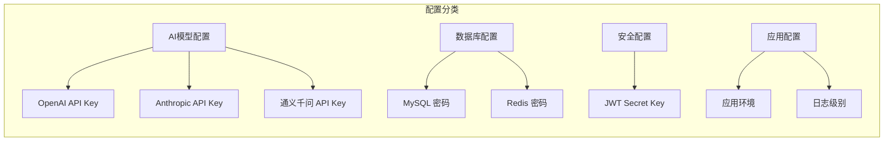

**图表来源**
- [docker.env.example](https://github.com/Shy2593666979/AgentChat/docker/docker.env.example#L1-L73)

### 配置文件结构

| 配置类别 | 关键字 | 默认值 | 说明 |
|---------|--------|--------|------|
| AI模型 | OPENAI_API_KEY | - | OpenAI API 密钥 |
| 数据库 | MYSQL_ROOT_PASSWORD | 123456 | MySQL root 密码 |
| 安全 | JWT_SECRET_KEY | - | JWT 加密密钥 |
| 应用 | APP_ENV | development | 应用环境类型 |

**章节来源**
- [docker.env.example](https://github.com/Shy2593666979/AgentChat/docker/docker.env.example#L1-L73)

## 健康检查机制

### 服务健康检查配置

每个服务都配置了相应的健康检查机制：

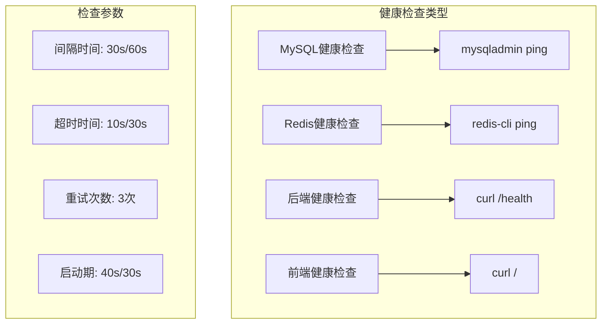

**图表来源**
- [docker-compose.yml](https://github.com/Shy2593666979/AgentChat/docker/docker-compose.yml#L26-L118)
- [docker-compose.prod.yml](https://github.com/Shy2593666979/AgentChat/docker/docker-compose.prod.yml#L14-L34)

### 健康检查策略

| 服务类型 | 检查方式 | 检查频率 | 超时时间 | 重试次数 |
|---------|----------|----------|----------|----------|
| 数据库服务 | 命令行工具 | 30秒 | 20秒 | 10次 |
| 缓存服务 | CLI工具 | 30秒 | 10秒 | 3次 |
| Web服务 | HTTP请求 | 30/60秒 | 10/30秒 | 3次 |

**章节来源**
- [docker-compose.yml](https://github.com/Shy2593666979/AgentChat/docker/docker-compose.yml#L26-L118)
- [docker-compose.prod.yml](https://github.com/Shy2593666979/AgentChat/docker/docker-compose.prod.yml#L14-L52)

## 日志监控与诊断

### 日志查看命令

AgentChat 提供了多种日志查看方式：

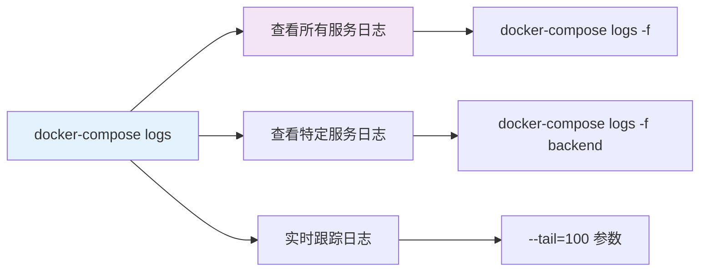

### 日志管理命令

| 命令 | 功能 | 使用场景 |
|------|------|----------|
| `docker-compose logs -f` | 实时跟踪所有日志 | 服务监控 |
| `docker-compose logs -f backend` | 查看后端服务日志 | 后端问题排查 |
| `docker-compose logs -f frontend` | 查看前端服务日志 | 前端问题排查 |
| `docker-compose logs --tail=100 backend` | 查看最近100行日志 | 快速定位问题 |

### 容器状态监控

```bash
# 查看服务状态
docker-compose ps

# 查看容器资源使用情况
docker stats

# 查看特定容器统计信息
docker stats agentchat-backend agentchat-frontend
```

**章节来源**
- [start.sh](https://github.com/Shy2593666979/AgentChat/docker/start.sh#L45-L48)
- [README.md](https://github.com/Shy2593666979/AgentChat/docker/README.md#L115-L167)

## 常见问题排查

### 服务启动失败

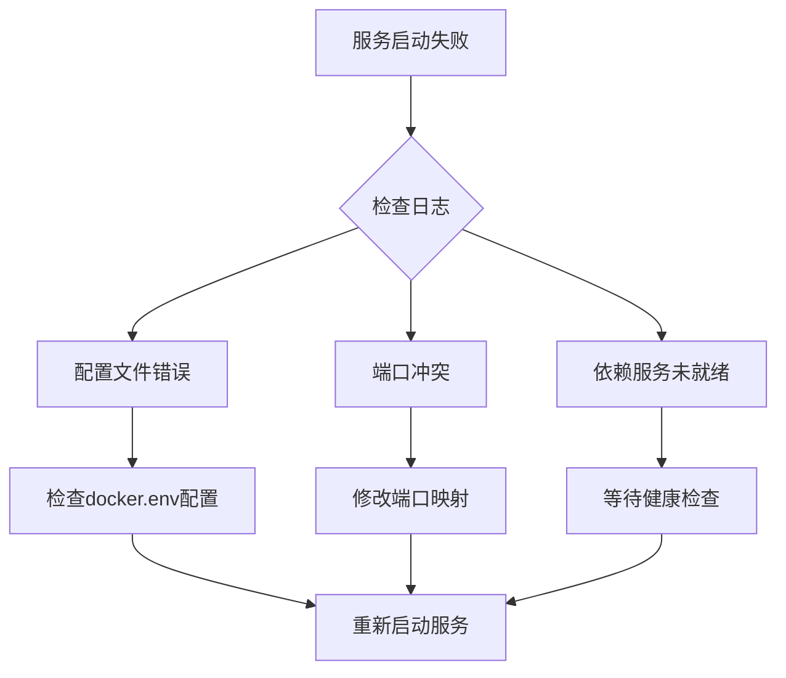

### 端口冲突解决

当遇到端口占用问题时：

```bash
# 检查端口占用
lsof -i :7860
lsof -i :8090

# 修改docker-compose.yml中的端口映射
ports:
  - "17860:7860"  # 改为其他端口
```

### 数据库连接问题

```bash
# 检查MySQL容器状态
docker-compose ps mysql

# 进入MySQL容器进行诊断
docker-compose exec mysql mysql -u root -p

# 重置数据库服务
docker-compose down mysql
docker volume rm docker_mysql_data
docker-compose up -d mysql
```

### API密钥配置问题

```bash
# 检查环境变量
docker-compose exec backend printenv | grep API_KEY

# 重新设置环境变量
vim docker.env
docker-compose restart backend
```

**章节来源**
- [README.md](https://github.com/Shy2593666979/AgentChat/docker/README.md#L170-L250)

## 性能监控与优化

### 资源监控

```bash
# 实时监控容器资源使用
docker stats

# 监控特定服务
docker stats agentchat-backend agentchat-frontend

# 查看容器网络状态
docker network ls
docker network inspect agentchat-network
```

### 性能优化建议

| 优化方面 | 建议配置 | 说明 |
|---------|----------|------|
| 内存限制 | Redis: 512MB, MySQL: 1GB | 防止内存溢出 |
| CPU核心数 | 后端: 4核 | 提高并发处理能力 |
| 网络带宽 | 根据需求调整 | 优化网络传输效率 |
| 存储I/O | SSD存储 | 提高数据读写速度 |

### 生产环境配置

生产环境使用专门的配置文件：

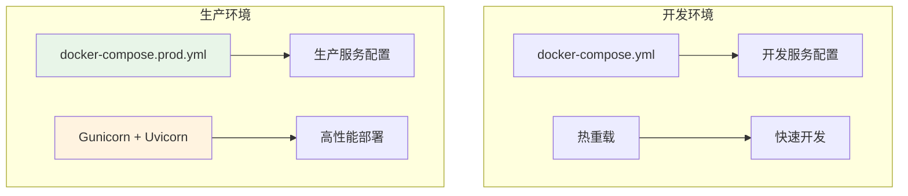

**图表来源**
- [docker-compose.yml](https://github.com/Shy2593666979/AgentChat/docker/docker-compose.yml#L1-L126)
- [docker-compose.prod.yml](https://github.com/Shy2593666979/AgentChat/docker/docker-compose.prod.yml#L1-L52)

**章节来源**
- [docker-compose.prod.yml](https://github.com/Shy2593666979/AgentChat/docker/docker-compose.prod.yml#L1-L52)
- [README.md](https://github.com/Shy2593666979/AgentChat/docker/README.md#L250-L272)

## 总结

AgentChat 的服务管理系统提供了完整的一站式解决方案，包括：

1. **自动化启动管理**：通过 `start.sh` 脚本实现一键启动
2. **灵活的配置管理**：支持开发和生产环境的不同配置
3. **完善的健康检查**：确保服务稳定运行
4. **全面的日志监控**：便于问题诊断和性能优化
5. **详细的故障排除**：提供常见问题的解决方案

通过遵循本指南中的最佳实践，可以确保 AgentChat 服务的稳定运行和高效管理。定期监控服务状态、及时处理异常情况，以及根据实际需求调整配置参数，都是维护系统稳定性的关键措施。