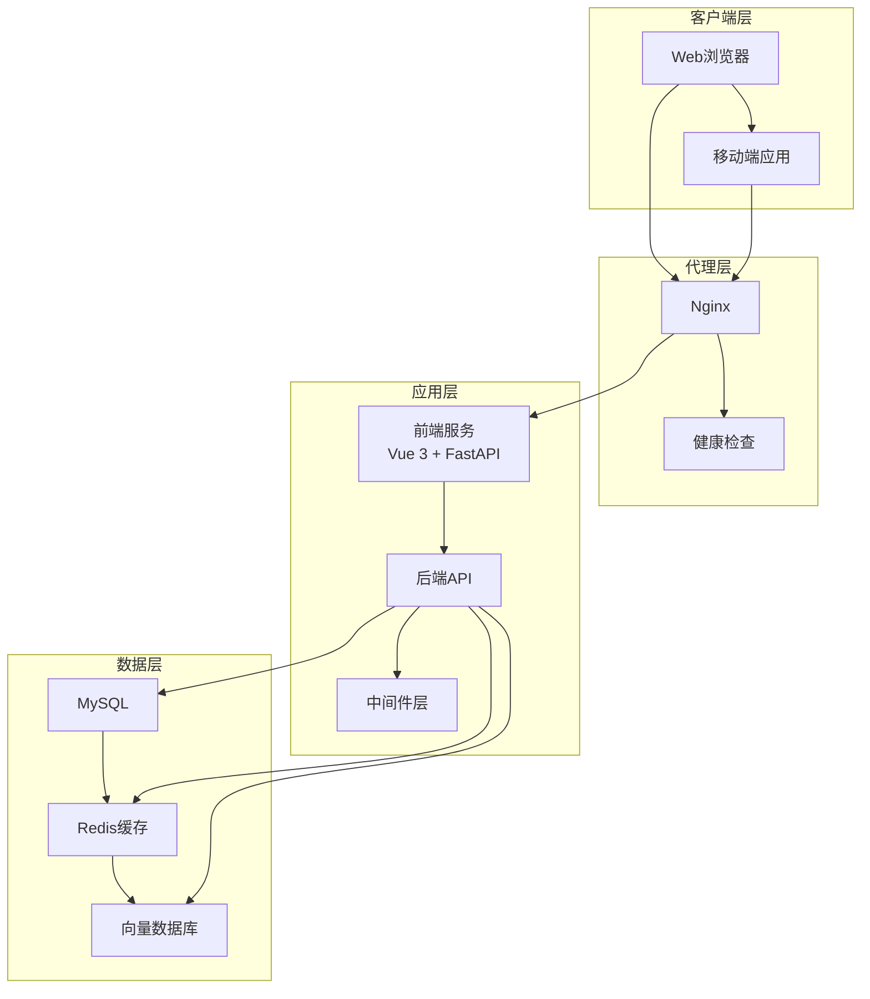
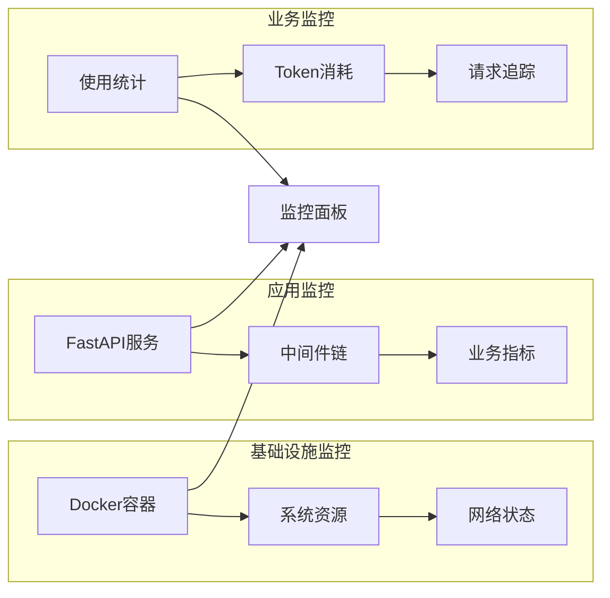
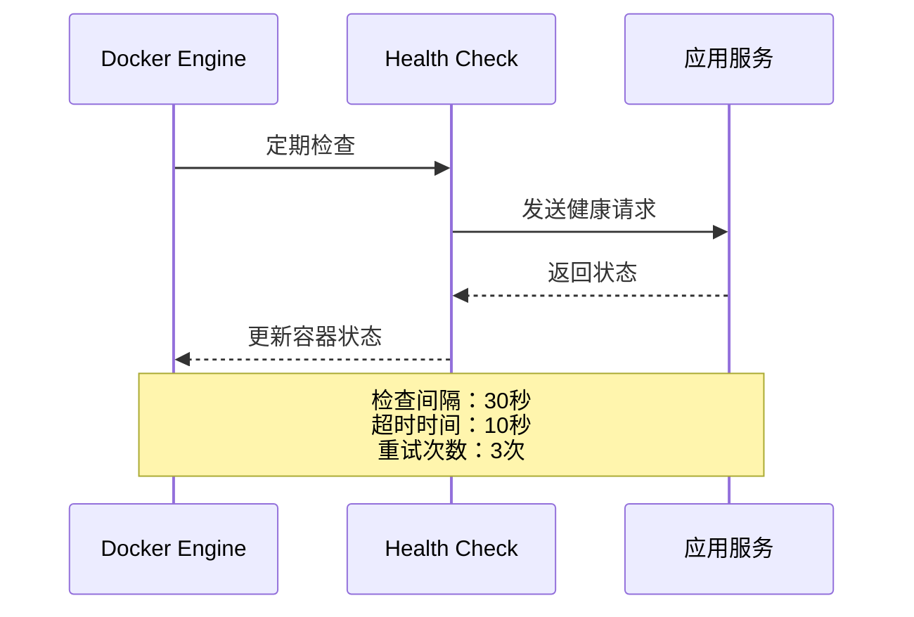
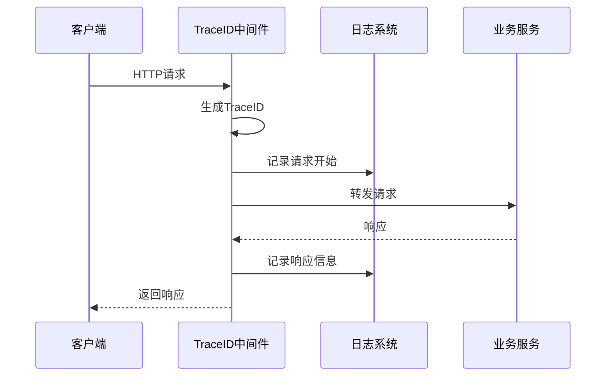
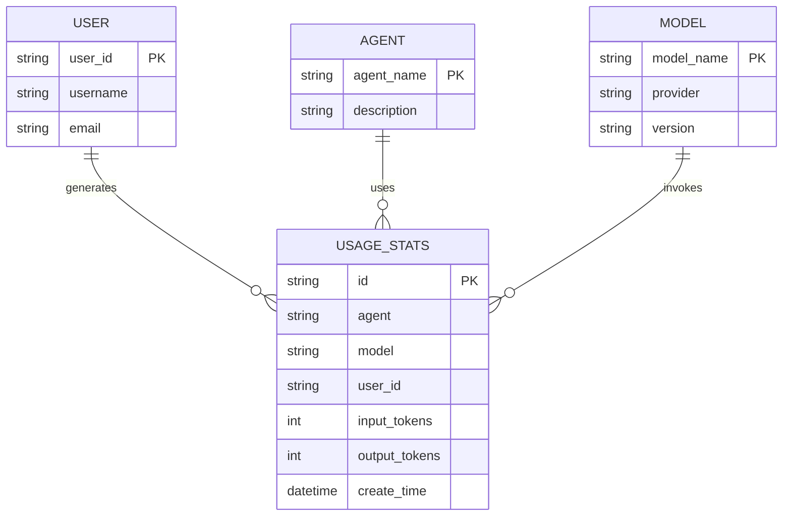
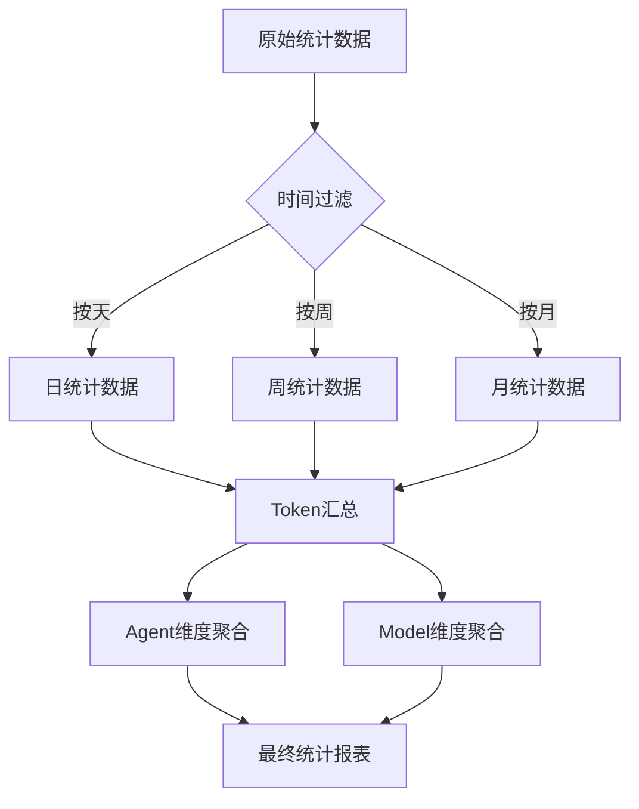
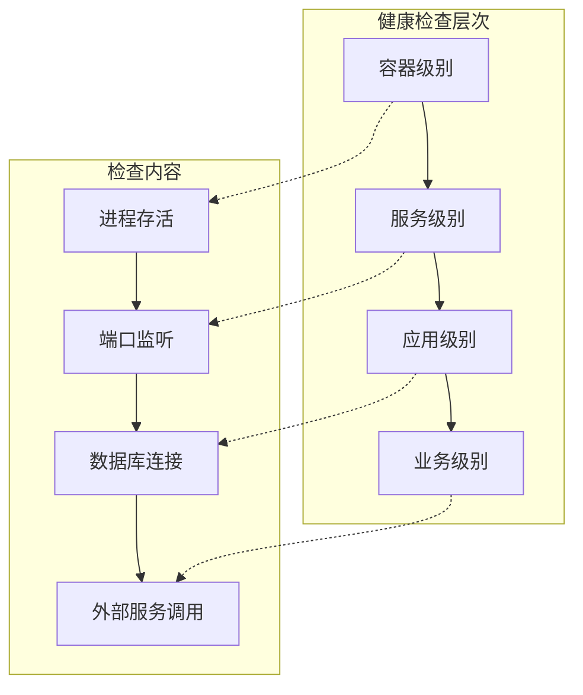
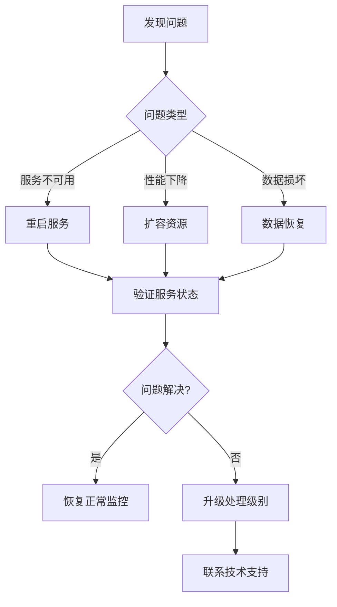

# 监控与维护

<cite>
**本文档引用的文件**
- [nginx.conf](https://github.com/Shy2593666979/AgentChat/docker/nginx.conf)
- [docker-compose.yml](https://github.com/Shy2593666979/AgentChat/docker/docker-compose.yml)
- [trace_id_middleware.py](https://github.com/Shy2593666979/AgentChat/src/backend/agentchat/middleware/trace_id_middleware.py)
- [usage_stats.py](https://github.com/Shy2593666979/AgentChat/src/backend/agentchat/api/services/usage_stats.py)
- [usage_stats.py](https://github.com/Shy2593666979/AgentChat/src/backend/agentchat/api/v1/usage_stats.py)
- [usage_stats.py](https://github.com/Shy2593666979/AgentChat/src/backend/agentchat/database/dao/usage_stats.py)
- [usage_stats.py](https://github.com/Shy2593666979/AgentChat/src/backend/agentchat/database/models/usage_stats.py)
- [usage_stats.py](https://github.com/Shy2593666979/AgentChat/src/backend/agentchat/schema/usage_stats.py)
- [usage_metadata.py](https://github.com/Shy2593666979/AgentChat/src/backend/agentchat/core/callbacks/usage_metadata.py)
- [main.py](https://github.com/Shy2593666979/AgentChat/src/backend/agentchat/main.py)
- [settings.py](https://github.com/Shy2593666979/AgentChat/src/backend/agentchat/settings.py)
- [README.md](https://github.com/Shy2593666979/AgentChat/README.md)
- [docker/README.md](https://github.com/Shy2593666979/AgentChat/docker/README.md)
</cite>

## 目录
1. [系统概述](#系统概述)
2. [监控架构](#监控架构)
3. [Nginx日志监控](#nginx日志监控)
4. [Docker容器监控](#docker容器监控)
5. [应用中间件监控](#应用中间件监控)
6. [使用统计服务](#使用统计服务)
7. [健康检查机制](#健康检查机制)
8. [性能监控与告警](#性能监控与告警)
9. [日志管理策略](#日志管理策略)
10. [故障排除指南](#故障排除指南)

## 系统概述

AgentChat是一个现代化的智能对话系统，采用前后端分离架构，集成了多种AI模型和服务。系统包含以下核心组件：
- **前端服务**：基于Vue 3的现代化用户界面
- **后端服务**：FastAPI构建的高性能API服务
- **数据库层**：MySQL + Redis + 向量数据库
- **代理服务**：Nginx反向代理和负载均衡



**图表来源**
- [docker-compose.yml](https://github.com/Shy2593666979/AgentChat/docker/docker-compose.yml#L1-L126)
- [main.py](https://github.com/Shy2593666979/AgentChat/src/backend/agentchat/main.py#L1-L108)

## 监控架构

系统采用多层次监控架构，涵盖基础设施、应用服务和业务指标三个维度。



**节来源**
- [docker-compose.yml](https://github.com/Shy2593666979/AgentChat/docker/docker-compose.yml#L26-L92)
- [main.py](https://github.com/Shy2593666979/AgentChat/src/backend/agentchat/main.py#L28-L48)

## Nginx日志监控

Nginx作为反向代理服务器，提供详细的访问日志和错误日志，支持实时监控和分析。

### 日志配置

系统配置了专门的日志格式，包含以下关键信息：
- 客户端IP地址
- 请求方法和URL路径
- HTTP状态码
- 响应大小
- 用户代理信息
- 请求耗时

### 日志轮转策略

```bash
# Nginx日志轮转配置示例
/var/log/nginx/*.log {
    daily
    missingok
    rotate 30
    compress
    delaycompress
    notifempty
    create 644 nginx nginx
    postrotate
        systemctl reload nginx
    endscript
}
```

### 关键监控指标

| 指标名称 | 描述 | 监控阈值 |
|---------|------|---------|
| 请求响应时间 | 平均请求处理时间 | >500ms |
| 错误率 | 4xx/5xx状态码比例 | >5% |
| 并发连接数 | 当前活跃连接数 | >1000 |
| 带宽使用率 | 网络传输速率 | >80% |

**节来源**
- [nginx.conf](https://github.com/Shy2593666979/AgentChat/docker/nginx.conf#L18-L24)

## Docker容器监控

Docker Compose配置了完整的健康检查机制，确保各服务组件的正常运行。

### 服务健康检查



**图表来源**
- [docker-compose.yml](https://github.com/Shy2593666979/AgentChat/docker/docker-compose.yml#L26-L92)

### 容器资源监控

| 服务组件 | CPU使用率 | 内存使用率 | 磁盘I/O | 网络I/O |
|---------|----------|-----------|--------|--------|
| MySQL | < 70% | < 80% | < 100MB/s | < 50MB/s |
| Redis | < 50% | < 60% | < 50MB/s | < 20MB/s |
| Backend | < 80% | < 70% | < 20MB/s | < 30MB/s |
| Frontend | < 30% | < 40% | < 10MB/s | < 10MB/s |

### 容器状态管理

```bash
# 查看所有服务状态
docker-compose ps

# 查看特定服务日志
docker-compose logs -f backend

# 监控容器资源使用
docker stats agentchat-backend agentchat-frontend
```

**节来源**
- [docker-compose.yml](https://github.com/Shy2593666979/AgentChat/docker/docker-compose.yml#L115-L165)

## 应用中间件监控

系统通过中间件层实现全面的请求追踪和性能监控。

### TraceID中间件

TraceID中间件为每个请求生成唯一的跟踪标识符，支持分布式追踪和问题定位。



**图表来源**
- [trace_id_middleware.py](https://github.com/Shy2593666979/AgentChat/src/backend/agentchat/middleware/trace_id_middleware.py#L12-L32)

### 中间件功能特性

| 功能 | 描述 | 实现位置 |
|------|------|---------|
| 请求追踪 | 为每个请求生成唯一ID | TraceIDMiddleware |
| 性能监控 | 记录请求处理时间 | 日志记录 |
| 异常捕获 | 捕获并记录异常信息 | 异常处理 |
| 响应头注入 | 添加TraceID到响应头 | 响应处理 |

### 白名单中间件

提供安全访问控制，支持IP白名单和API路径白名单配置。

**节来源**
- [trace_id_middleware.py](https://github.com/Shy2593666979/AgentChat/src/backend/agentchat/middleware/trace_id_middleware.py#L1-L32)
- [main.py](https://github.com/Shy2593666979/AgentChat/src/backend/agentchat/main.py#L41-L46)

## 使用统计服务

系统提供完整的使用统计功能，支持按Agent、模型、时间维度的详细分析。

### 统计数据模型



**图表来源**
- [usage_stats.py](https://github.com/Shy2593666979/AgentChat/src/backend/agentchat/database/models/usage_stats.py#L1-L33)

### 统计服务功能

| 功能模块 | API端点 | 描述 |
|---------|---------|------|
| Token统计 | `/api/v1/usage` | 按Agent/模型统计Token使用量 |
| 调用次数统计 | `/api/v1/usage_count` | 统计API调用次数 |
| 模型列表 | `/api/v1/usage/models_list` | 获取可用模型列表 |
| Agent列表 | `/api/v1/usage/agents_list` | 获取可用Agent列表 |

### 数据聚合算法

系统支持按时间维度的数据聚合：



**图表来源**
- [usage_stats.py](https://github.com/Shy2593666979/AgentChat/src/backend/agentchat/api/services/usage_stats.py#L44-L96)

**节来源**
- [usage_stats.py](https://github.com/Shy2593666979/AgentChat/src/backend/agentchat/api/services/usage_stats.py#L1-L135)
- [usage_stats.py](https://github.com/Shy2593666979/AgentChat/src/backend/agentchat/api/v1/usage_stats.py#L1-L60)
- [usage_stats.py](https://github.com/Shy2593666979/AgentChat/src/backend/agentchat/database/dao/usage_stats.py#L1-L158)

## 健康检查机制

系统实现了多层次的健康检查机制，确保服务的高可用性。

### 服务健康检查



### 健康检查配置

| 服务 | 检查端点 | 检查频率 | 超时时间 | 重试次数 |
|------|---------|---------|---------|---------|
| Backend | `/health` | 30秒 | 10秒 | 3次 |
| Frontend | `/` | 30秒 | 10秒 | 3次 |
| MySQL | `mysqladmin ping` | 30秒 | 20秒 | 10次 |
| Redis | `redis-cli ping` | 30秒 | 10秒 | 3次 |

**节来源**
- [docker-compose.yml](https://github.com/Shy2593666979/AgentChat/docker/docker-compose.yml#L26-L92)
- [main.py](https://github.com/Shy2593666979/AgentChat/src/backend/agentchat/main.py#L23-L27)

## 性能监控与告警

### 关键性能指标

| 指标类型 | 监控指标 | 正常范围 | 告警阈值 | 处理建议 |
|---------|---------|---------|---------|---------|
| 响应时间 | API平均响应时间 | <200ms | >500ms | 优化数据库查询 |
| 吞吐量 | 每秒请求数 | >100 req/s | <50 req/s | 扩容或优化 |
| 错误率 | 5xx错误比例 | <1% | >5% | 检查服务状态 |
| 资源使用 | CPU使用率 | <70% | >85% | 升级硬件或优化 |
| 内存使用 | 内存使用率 | <80% | >90% | 增加内存或优化 |

### Prometheus集成配置

```yaml
# prometheus.yml
global:
  scrape_interval: 15s
  
scrape_configs:
  - job_name: 'agentchat'
    static_configs:
      - targets: ['localhost:9090']
    metrics_path: '/metrics'
    scrape_interval: 30s
```

### Grafana仪表板配置

建议监控面板包含以下图表：
- **系统概览**：CPU、内存、磁盘使用率
- **应用性能**：请求响应时间、吞吐量
- **业务指标**：Token使用量、API调用统计
- **错误监控**：错误率趋势、异常告警

## 日志管理策略

### 日志级别配置

| 级别 | 用途 | 示例场景 |
|------|------|---------|
| DEBUG | 详细调试信息 | 开发阶段问题排查 |
| INFO | 一般信息记录 | 请求处理、定时任务 |
| WARNING | 警告信息 | 性能警告、配置问题 |
| ERROR | 错误信息 | 异常处理、系统错误 |
| CRITICAL | 严重错误 | 服务不可用、数据丢失 |

### 日志轮转配置

```bash
# /etc/logrotate.d/agentchat
/var/log/agentchat/*.log {
    daily
    missingok
    rotate 30
    compress
    delaycompress
    notifempty
    create 644 agentchat agentchat
    postrotate
        docker-compose exec backend supervisorctl restart all
    endscript
}
```

### 日志分析工具

推荐使用以下工具进行日志分析：
- **ELK Stack**：Elasticsearch + Logstash + Kibana
- **Fluentd**：日志收集和转发
- **Graylog**：集中式日志管理
- **Splunk**：商业级日志分析平台

## 故障排除指南

### 常见问题诊断

#### 1. 服务启动失败

```bash
# 检查容器状态
docker-compose ps

# 查看详细日志
docker-compose logs backend

# 检查配置文件
docker-compose exec backend cat /app/config.yaml
```

#### 2. 数据库连接问题

```bash
# 检查MySQL容器状态
docker-compose ps mysql

# 进入MySQL容器测试连接
docker-compose exec mysql mysql -u root -p

# 检查数据库配置
docker-compose exec backend env | grep DATABASE
```

#### 3. 性能问题排查

```bash
# 监控系统资源
docker stats

# 分析慢查询
docker-compose exec mysql mysql -e "SHOW PROCESSLIST;"

# 检查Redis性能
docker-compose exec redis redis-cli info
```

### 故障恢复流程



### 监控告警配置

建议配置以下告警规则：

```yaml
groups:
  - name: agentchat_alerts
    rules:
      - alert: HighCPUUsage
        expr: cpu_usage > 85
        for: 5m
        
      - alert: HighMemoryUsage
        expr: memory_usage > 90
        for: 3m
        
      - alert: ServiceDown
        expr: up{job="agentchat"} == 0
        for: 1m
```

**节来源**
- [docker/README.md](https://github.com/Shy2593666979/AgentChat/docker/README.md#L170-L235)

## 结论

AgentChat系统提供了完整的监控与维护解决方案，通过多层次的监控架构、详细的日志记录、智能的使用统计和完善的健康检查机制，确保系统的稳定运行和高效维护。建议运维团队定期检查监控指标，及时处理告警信息，并根据业务发展需求调整监控策略和资源配置。