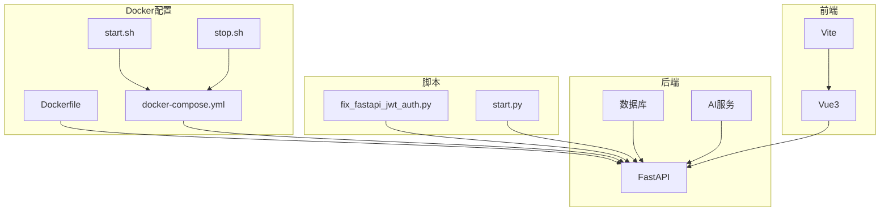
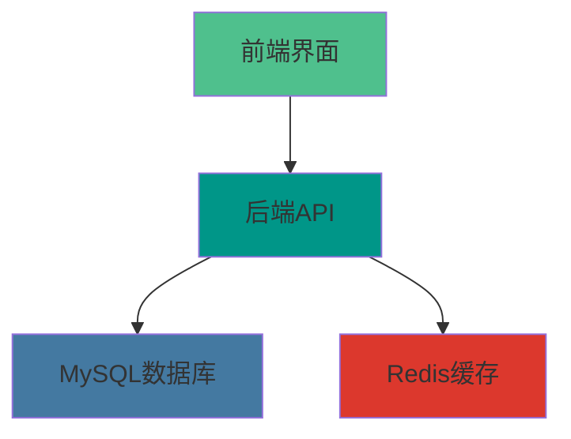
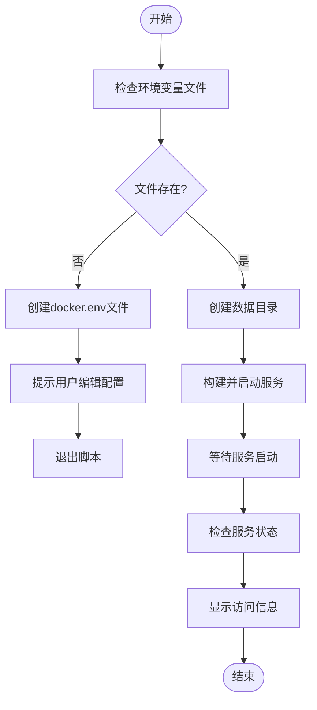
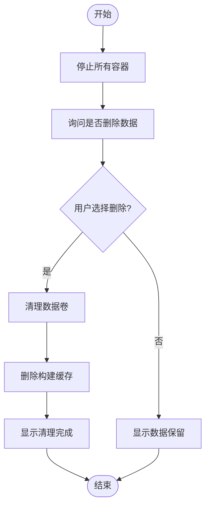
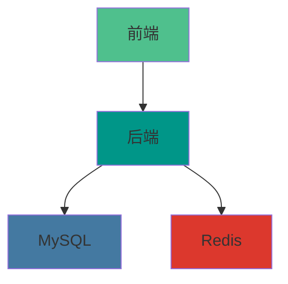

# 运维管理

<cite>
**本文档引用的文件**
- [start.sh](https://github.com/Shy2593666979/AgentChat/docker/start.sh)
- [stop.sh](https://github.com/Shy2593666979/AgentChat/docker/stop.sh)
- [docker-compose.yml](https://github.com/Shy2593666979/AgentChat/docker/docker-compose.yml)
- [docker-compose.prod.yml](https://github.com/Shy2593666979/AgentChat/docker/docker-compose.prod.yml)
- [docker.env.example](https://github.com/Shy2593666979/AgentChat/docker/docker.env.example)
- [nginx.conf](https://github.com/Shy2593666979/AgentChat/docker/nginx.conf)
- [main.py](https://github.com/Shy2593666979/AgentChat/src/backend/agentchat/main.py)
</cite>

## 目录
1. [简介](#简介)
2. [项目结构](#项目结构)
3. [核心组件](#核心组件)
4. [架构概述](#架构概述)
5. [详细组件分析](#详细组件分析)
6. [依赖分析](#依赖分析)
7. [性能考虑](#性能考虑)
8. [故障排除指南](#故障排除指南)
9. [结论](#结论)
10. [附录](#附录)（如有必要）

## 简介
本文档为系统管理员提供AgentChat系统的全面运维操作指南。文档详细说明了服务的启动与停止流程、日志管理、容器监控、环境变量配置、数据备份与恢复策略、版本更新与回滚操作，以及关键监控指标和告警阈值建议。通过本手册，管理员可以有效地管理和维护AgentChat系统，确保服务的稳定性和连续性。

## 项目结构
AgentChat项目采用模块化设计，主要分为Docker配置、脚本、后端和前端四个部分。Docker配置文件位于`docker`目录下，包括Dockerfile、docker-compose文件和启动/停止脚本。脚本文件位于`scripts`目录，主要用于系统维护。后端代码位于`src/backend`目录，采用FastAPI框架构建RESTful API服务。前端代码位于`src/frontend`目录，使用Vue3和Vite构建用户界面。

**图示来源**
- [docker-compose.yml](https://github.com/Shy2593666979/AgentChat/docker/docker-compose.yml#L7-L125)
- [Dockerfile](https://github.com/Shy2593666979/AgentChat/docker/Dockerfile#L1-L39)

**本节来源**
- [docker](https://github.com/Shy2593666979/AgentChat/docker)
- [scripts](https://github.com/Shy2593666979/AgentChat/scripts)
- [src/backend](https://github.com/Shy2593666979/AgentChat/src/backend)
- [src/frontend](https://github.com/Shy2593666979/AgentChat/src/frontend)

## 核心组件
AgentChat系统的核心组件包括MySQL数据库、Redis缓存、后端API服务和前端界面。MySQL用于持久化存储用户数据、对话记录和知识库信息。Redis用于缓存会话数据和提高系统性能。后端API服务基于FastAPI框架，提供RESTful接口供前端调用。前端界面使用Vue3和Vite构建，提供用户友好的交互体验。

**本节来源**
- [docker-compose.yml](https://github.com/Shy2593666979/AgentChat/docker/docker-compose.yml#L9-L119)
- [main.py](https://github.com/Shy2593666979/AgentChat/src/backend/agentchat/main.py#L1-L108)

## 架构概述
AgentChat系统采用微服务架构，通过Docker容器化部署。系统由前端、后端、数据库和缓存四个主要服务组成，通过Docker Compose进行编排和管理。前端服务通过HTTP请求与后端API服务通信，后端服务则与MySQL数据库和Redis缓存交互，实现数据的持久化存储和高效访问。

**图示来源**
- [docker-compose.yml](https://github.com/Shy2593666979/AgentChat/docker/docker-compose.yml#L7-L125)
- [main.py](https://github.com/Shy2593666979/AgentChat/src/backend/agentchat/main.py#L1-L108)

## 详细组件分析

### 启动脚本分析
`start.sh`脚本用于启动AgentChat系统的所有服务。脚本首先检查环境变量配置文件`docker.env`是否存在，如果不存在则从`docker.env.example`复制并提示用户编辑。然后创建必要的数据目录，最后使用`docker-compose`命令构建并启动所有服务。

**图示来源**
- [start.sh](https://github.com/Shy2593666979/AgentChat/docker/start.sh#L1-L52)

**本节来源**
- [start.sh](https://github.com/Shy2593666979/AgentChat/docker/start.sh#L1-L52)

### 停止脚本分析
`stop.sh`脚本用于停止AgentChat系统的所有服务。脚本首先使用`docker-compose down`命令停止所有容器，然后询问用户是否删除数据卷和构建缓存。如果用户选择删除，则执行`docker-compose down -v`命令清理数据卷，并使用`docker system prune -f`命令删除构建缓存。

**图示来源**
- [stop.sh](https://github.com/Shy2593666979/AgentChat/docker/stop.sh#L1-L35)

**本节来源**
- [stop.sh](https://github.com/Shy2593666979/AgentChat/docker/stop.sh#L1-L35)

## 依赖分析
AgentChat系统的组件之间存在明确的依赖关系。后端服务依赖于MySQL数据库和Redis缓存，前端服务依赖于后端API服务。Docker Compose文件中通过`depends_on`指令定义了这些依赖关系，确保服务按正确的顺序启动。

**图示来源**
- [docker-compose.yml](https://github.com/Shy2593666979/AgentChat/docker/docker-compose.yml#L7-L125)

**本节来源**
- [docker-compose.yml](https://github.com/Shy2593666979/AgentChat/docker/docker-compose.yml#L7-L125)

## 性能考虑
AgentChat系统在设计时考虑了性能优化。后端服务使用FastAPI框架，具有高性能的异步处理能力。Redis缓存用于存储会话数据和频繁访问的信息，减少数据库查询次数。MySQL数据库配置了健康检查，确保服务的可用性。前端使用Vue3和Vite，提供快速的页面加载和响应。

## 故障排除指南
当系统出现问题时，管理员可以按照以下步骤进行故障排除：
1. 使用`docker-compose ps`命令检查服务状态。
2. 使用`docker-compose logs -f`命令查看实时日志。
3. 检查环境变量配置是否正确。
4. 确认端口没有被其他进程占用。
5. 如果问题持续存在，可以尝试重启相关服务或重新构建容器。

**本节来源**
- [docker-compose.yml](https://github.com/Shy2593666979/AgentChat/docker/docker-compose.yml#L7-L125)
- [start.sh](https://github.com/Shy2593666979/AgentChat/docker/start.sh#L1-L52)
- [stop.sh](https://github.com/Shy2593666979/AgentChat/docker/stop.sh#L1-L35)

## 结论
AgentChat系统通过Docker容器化部署，提供了易于管理和维护的微服务架构。通过本文档提供的运维指南，系统管理员可以有效地管理系统的启动、停止、监控和故障排除，确保服务的稳定运行。建议定期备份数据，监控系统性能，并及时更新系统以修复安全漏洞。

## 附录
### 环境变量管理最佳实践
使用`.env`文件分离配置，避免将敏感信息硬编码在代码中。生产环境中应使用强密码和密钥，并定期轮换。可以使用Docker Secrets或外部配置管理工具来进一步增强安全性。

### 备份与恢复策略
定期备份MySQL数据卷和Redis持久化文件。可以使用`docker exec`命令进入容器执行数据库导出，或将数据卷挂载到主机进行备份。恢复时，将备份文件复制到相应位置并重启服务。

### 版本更新与回滚
进行版本更新时，先在测试环境中验证新版本的稳定性。更新时使用`docker-compose pull`命令拉取最新镜像，然后使用`docker-compose up -d`命令更新服务。如果新版本出现问题，可以使用`docker-compose down`和`docker-compose up -d`命令回滚到之前的版本。

### 关键监控指标和告警阈值
- CPU使用率：超过80%时告警
- 内存使用率：超过85%时告警
- 磁盘使用率：超过90%时告警
- 服务响应时间：超过1秒时告警
- 错误率：超过5%时告警