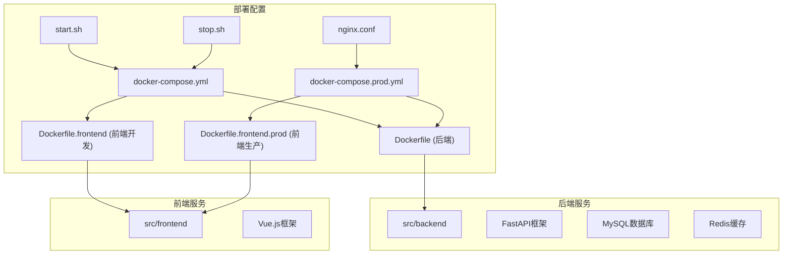
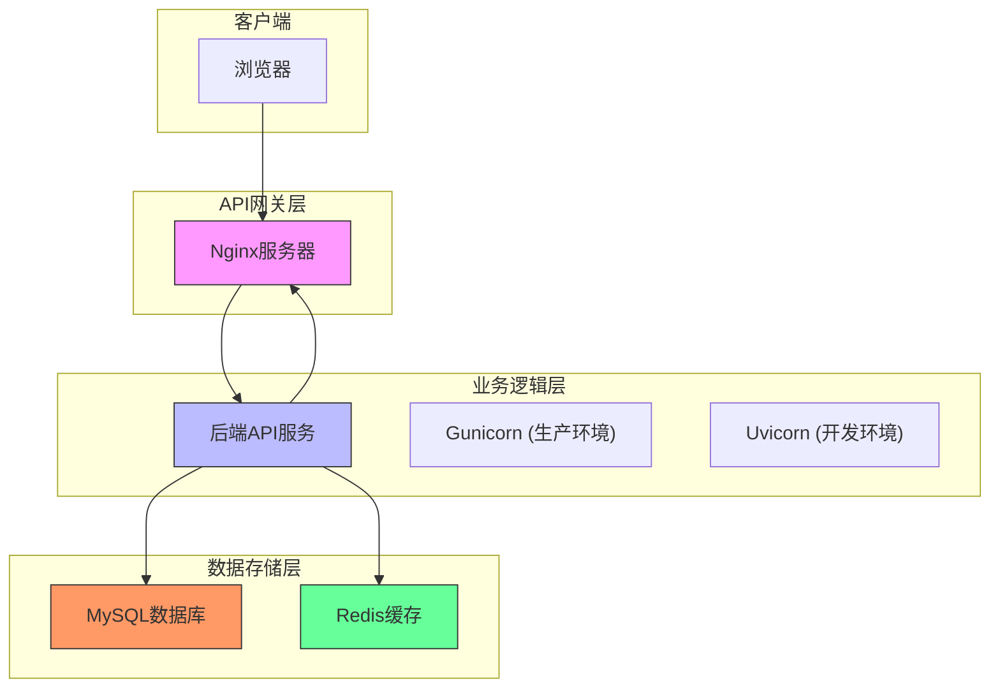
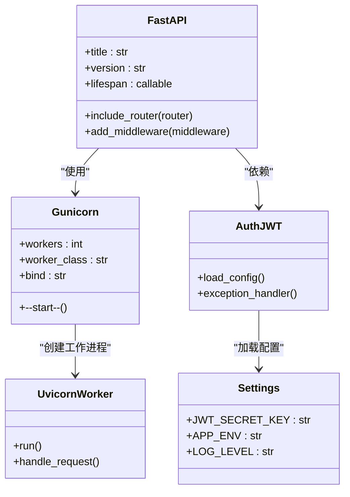
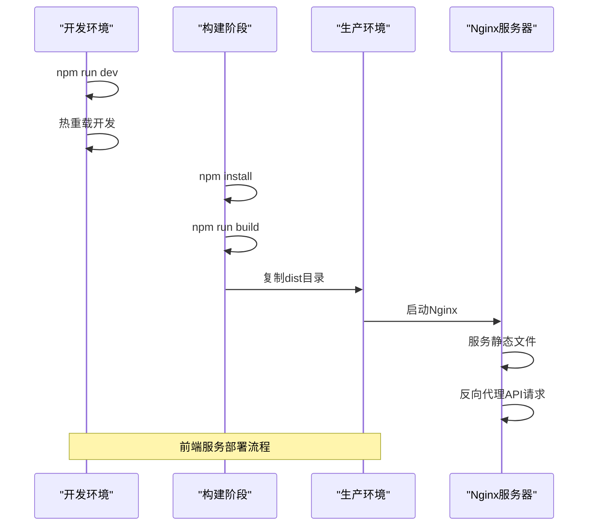
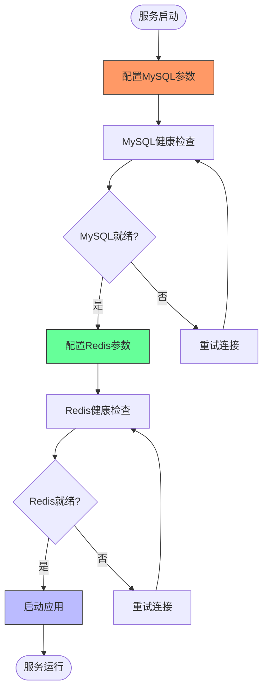

# 部署指南

## 目录
1. [简介](#简介)
2. [项目结构](#项目结构)
3. [核心组件](#核心组件)
4. [架构概览](#架构概览)
5. [详细组件分析](#详细组件分析)
6. [依赖分析](#依赖分析)
7. [性能考量](#性能考量)
8. [故障排除指南](#故障排除指南)
9. [结论](#结论)

## 简介
本指南详细介绍了AgentChat应用从开发到生产的完整部署流程。重点涵盖基于Docker的容器化部署方案，包括本地开发环境和生产环境的配置差异。文档详细说明了各服务容器的配置、Nginx反向代理规则、环境变量管理最佳实践，以及运维脚本的使用方法，旨在为运维人员提供安全高效的部署和管理指导。

## 项目结构
AgentChat项目采用模块化设计，主要分为后端API、前端界面和部署配置三大模块。部署相关文件集中存放在`docker`目录下，包括Docker配置文件、启动脚本和Nginx配置。后端代码位于`src/backend`目录，采用FastAPI框架构建RESTful API服务，前端代码位于`src/frontend`目录，使用Vue.js框架开发。



**Diagram sources**
- [docker-compose.yml](https://github.com/Shy2593666979/AgentChat/docker/docker-compose.yml#L1-L126)
- [docker-compose.prod.yml](https://github.com/Shy2593666979/AgentChat/docker/docker-compose.prod.yml#L1-L52)
- [Dockerfile](https://github.com/Shy2593666979/AgentChat/docker/Dockerfile#L1-L39)

**Section sources**
- [docker-compose.yml](https://github.com/Shy2593666979/AgentChat/docker/docker-compose.yml#L1-L126)
- [docker-compose.prod.yml](https://github.com/Shy2593666979/AgentChat/docker/docker-compose.prod.yml#L1-L52)
- [project_structure](https://github.com/Shy2593666979/AgentChat/#project_structure)

## 核心组件
AgentChat的核心组件包括后端API服务、前端界面、MySQL数据库和Redis缓存。后端API服务基于FastAPI框架构建，提供RESTful接口；前端界面使用Vue.js开发，通过Vite构建工具进行打包；MySQL数据库用于持久化存储应用数据；Redis缓存用于提高系统性能和实现会话管理。

**Section sources**
- [main.py](https://github.com/Shy2593666979/AgentChat/tree/main/src/backend/agentchat/main.py#L1-L108)
- [settings.py](https://github.com/Shy2593666979/AgentChat/tree/main/src/backend/agentchat/settings.py#L1-L62)
- [redis.py](https://github.com/Shy2593666979/AgentChat/tree/main/src/backend/agentchat/services/redis.py#L68-L115)

## 架构概览
AgentChat采用微服务架构，通过Docker容器化部署。系统架构分为四层：前端展示层、API网关层、业务逻辑层和数据存储层。前端展示层负责用户界面渲染；API网关层通过Nginx实现反向代理和静态资源服务；业务逻辑层包含后端API服务，处理核心业务逻辑；数据存储层由MySQL和Redis组成，分别负责持久化存储和缓存。



**Diagram sources**
- [docker-compose.yml](https://github.com/Shy2593666979/AgentChat/docker/docker-compose.yml#L7-L119)
- [nginx.conf](https://github.com/Shy2593666979/AgentChat/docker/nginx.conf#L1-L101)
- [main.py](https://github.com/Shy2593666979/AgentChat/tree/main/src/backend/agentchat/main.py#L1-L108)

## 详细组件分析

### 后端API服务分析
后端API服务是AgentChat的核心，负责处理所有业务逻辑和数据交互。服务基于FastAPI框架构建，具有自动API文档生成、数据验证和异步支持等特性。在生产环境中，使用Gunicorn作为WSGI服务器，配合Uvicorn工作进程处理异步请求，提高了服务的并发处理能力。



**Diagram sources**
- [Dockerfile](https://github.com/Shy2593666979/AgentChat/docker/Dockerfile#L1-L39)
- [docker-compose.prod.yml](https://github.com/Shy2593666979/AgentChat/docker/docker-compose.prod.yml#L6-L13)
- [main.py](https://github.com/Shy2593666979/AgentChat/tree/main/src/backend/agentchat/main.py#L1-L108)

**Section sources**
- [main.py](https://github.com/Shy2593666979/AgentChat/tree/main/src/backend/agentchat/main.py#L1-L108)
- [settings.py](https://github.com/Shy2593666979/AgentChat/tree/main/src/backend/agentchat/settings.py#L1-L62)
- [Dockerfile](https://github.com/Shy2593666979/AgentChat/docker/Dockerfile#L1-L39)

### 前端服务分析
前端服务分为开发环境和生产环境两种配置。开发环境使用Vite开发服务器，支持热重载和快速刷新；生产环境采用多阶段Docker构建，首先使用Node.js镜像构建前端资源，然后使用Nginx镜像作为静态文件服务器，提高了性能和安全性。



**Diagram sources**
- [Dockerfile.frontend](https://github.com/Shy2593666979/AgentChat/docker/Dockerfile.frontend#L1-L27)
- [Dockerfile.frontend.prod](https://github.com/Shy2593666979/AgentChat/docker/Dockerfile.frontend.prod#L1-L41)
- [nginx.conf](https://github.com/Shy2593666979/AgentChat/docker/nginx.conf#L1-L101)

**Section sources**
- [Dockerfile.frontend](https://github.com/Shy2593666979/AgentChat/docker/Dockerfile.frontend#L1-L27)
- [Dockerfile.frontend.prod](https://github.com/Shy2593666979/AgentChat/docker/Dockerfile.frontend.prod#L1-L41)
- [nginx.conf](https://github.com/Shy2593666979/AgentChat/docker/nginx.conf#L1-L101)

### 数据库服务分析
数据库服务包括MySQL和Redis两种。MySQL用于持久化存储应用数据，如用户信息、对话记录等；Redis用于缓存频繁访问的数据和会话管理，提高系统性能。两种数据库都配置了健康检查，确保服务的可用性。



**Diagram sources**
- [docker-compose.yml](https://github.com/Shy2593666979/AgentChat/docker/docker-compose.yml#L9-L49)
- [__init__.py](https://github.com/Shy2593666979/AgentChat/tree/main/src/backend/agentchat/database/__init__.py#L24-L40)
- [redis.py](https://github.com/Shy2593666979/AgentChat/tree/main/src/backend/agentchat/services/redis.py#L68-L115)

**Section sources**
- [docker-compose.yml](https://github.com/Shy2593666979/AgentChat/docker/docker-compose.yml#L9-L49)
- [__init__.py](https://github.com/Shy2593666979/AgentChat/tree/main/src/backend/agentchat/database/__init__.py#L24-L40)
- [redis.py](https://github.com/Shy2593666979/AgentChat/tree/main/src/backend/agentchat/services/redis.py#L68-L115)

## 依赖分析
AgentChat的组件之间存在明确的依赖关系。后端API服务依赖于MySQL和Redis数据库服务，必须在数据库服务健康后才能启动；前端服务依赖于后端API服务，需要后端服务可用才能正常工作。这种依赖关系通过Docker Compose的`depends_on`和`condition: service_healthy`配置确保。

```mermaid
graph TD
A[前端服务] --> B[后端API服务]
B --> C[MySQL数据库]
B --> D[Redis缓存]
C --> E[MySQL数据卷]
D --> F[Redis数据卷]
style A fill:#cfc,stroke:#333
style B fill:#bbf,stroke:#333
style C fill:#f96,stroke:#333
style D fill:#6f9,stroke:#333
style E fill:#ccc,stroke:#333
style F fill:#ccc,stroke:#333
linkStyle 0 stroke:#000;
linkStyle 1 stroke:#000;
linkStyle 2 stroke:#000;
linkStyle 3 stroke:#000;
linkStyle 4 stroke:#000;
linkStyle 5 stroke:#000;
```

**Diagram sources**
- [docker-compose.yml](https://github.com/Shy2593666979/AgentChat/docker/docker-compose.yml#L80-L85)
- [docker-compose.yml](https://github.com/Shy2593666979/AgentChat/docker/docker-compose.yml#L110-L111)
- [main.py](https://github.com/Shy2593666979/AgentChat/tree/main/src/backend/agentchat/main.py#L67-L72)

**Section sources**
- [docker-compose.yml](https://github.com/Shy2593666979/AgentChat/docker/docker-compose.yml#L80-L85)
- [main.py](https://github.com/Shy2593666979/AgentChat/tree/main/src/backend/agentchat/main.py#L67-L72)

## 性能考量
AgentChat在设计时充分考虑了性能优化。生产环境中，Nginx配置了Gzip压缩和静态资源缓存，减少了网络传输量；后端服务使用Gunicorn多进程模型，提高了并发处理能力；Redis缓存减少了数据库访问频率。此外，MySQL配置了查询缓存和InnoDB缓冲池，优化了数据库性能。

**Section sources**
- [nginx.conf](https://github.com/Shy2593666979/AgentChat/docker/nginx.conf#L34-L58)
- [docker-compose.prod.yml](https://github.com/Shy2593666979/AgentChat/docker/docker-compose.prod.yml#L43-L47)
- [Dockerfile](https://github.com/Shy2593666979/AgentChat/docker/Dockerfile#L19)

## 故障排除指南
当部署或运行AgentChat遇到问题时，可以按照以下步骤进行排查：首先检查各服务的健康状态，使用`docker-compose ps`命令查看服务运行情况；然后查看日志，使用`docker-compose logs`命令获取详细的错误信息；最后检查环境变量配置，确保所有必要的API密钥和数据库连接信息都已正确设置。

**Section sources**
- [start.sh](https://github.com/Shy2593666979/AgentChat/docker/start.sh#L1-L52)
- [stop.sh](https://github.com/Shy2593666979/AgentChat/docker/stop.sh#L1-L35)
- [docker.env.example](https://github.com/Shy2593666979/AgentChat/docker/docker.env.example#L1-L73)

## 结论
AgentChat提供了一套完整的容器化部署方案，通过Docker Compose简化了多服务应用的部署和管理。本地开发环境和生产环境的配置分离，确保了开发效率和生产安全。Nginx反向代理和静态资源服务配置，提高了前端性能和安全性。环境变量管理最佳实践，保护了敏感信息。运维脚本的提供，使得服务的启停更加安全高效。
