# AgentChat前端与后端API集成方案

<cite>
**本文档引用的文件**
- [request.ts](https://github.com/Shy2593666979/AgentChat/src/frontend/src/utils/request.ts)
- [chat.ts](https://github.com/Shy2593666979/AgentChat/src/frontend/src/apis/chat.ts)
- [agent.ts](https://github.com/Shy2593666979/AgentChat/src/frontend/src/apis/agent.ts)
- [history.ts](https://github.com/Shy2593666979/AgentChat/src/frontend/src/apis/history.ts)
- [conversation.vue](https://github.com/Shy2593666979/AgentChat/src/frontend/src/pages/conversation/conversation.vue)
- [type.ts](https://github.com/Shy2593666979/AgentChat/src/frontend/src/type.ts)
- [router.py](https://github.com/Shy2593666979/AgentChat/src/backend/agentchat/api/router.py)
- [chat.py](https://github.com/Shy2593666979/AgentChat/src/backend/agentchat/api/v1/chat.py)
- [dialog.py](https://github.com/Shy2593666979/AgentChat/src/backend/agentchat/api/v1/dialog.py)
- [auth_config.py](https://github.com/Shy2593666979/AgentChat/src/backend/fastapi_jwt_auth/auth_config.py)
- [auth_jwt.py](https://github.com/Shy2593666979/AgentChat/src/backend/fastapi_jwt_auth/auth_jwt.py)
- [DEBUGGING_GUIDE.md](https://github.com/Shy2593666979/AgentChat/src/frontend/DEBUGGING_GUIDE.md)
- [chat.py](https://github.com/Shy2593666979/AgentChat/src/backend/agentchat/api/services/chat.py)
</cite>

## 目录
1. [项目概述](#项目概述)
2. [架构设计](#架构设计)
3. [前端API封装层](#前端api封装层)
4. [后端API路由架构](#后端api路由架构)
5. [认证与授权机制](#认证与授权机制)
6. [TypeScript类型安全实践](#typescript类型安全实践)
7. [对话通信流程](#对话通信流程)
8. [错误处理与调试](#错误处理与调试)
9. [性能优化策略](#性能优化策略)
10. [最佳实践指南](#最佳实践指南)

## 项目概述

AgentChat是一个基于Vue.js前端和FastAPI后端的智能对话平台，采用现代化的前后端分离架构。前端使用TypeScript和Vue 3构建，后端采用Python FastAPI框架，两者通过RESTful API进行通信。

### 技术栈概览

**前端技术栈：**
- Vue.js 3 + TypeScript
- Axios HTTP客户端
- Element Plus UI组件库
- Vite构建工具

**后端技术栈：**
- FastAPI Python框架
- JWT认证机制
- MySQL数据库
- LangChain智能体框架

## 架构设计

### 系统架构图

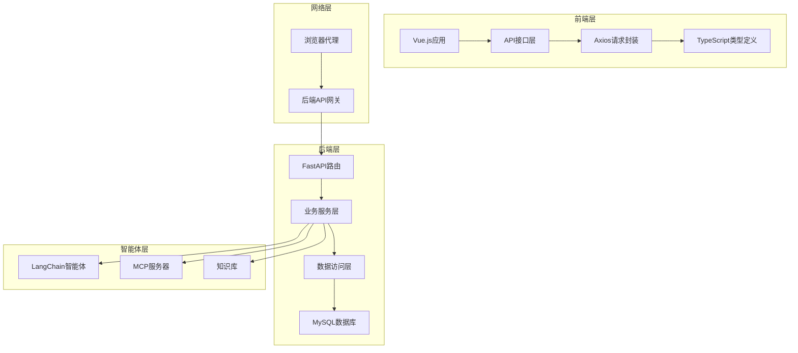
```mermaid
graph TB
subgraph "前端层"
A[Vue.js应用] --> B[API接口层]
B --> C[Axios请求封装]
C --> D[TypeScript类型定义]
end
subgraph "网络层"
E[浏览器代理] --> F[后端API网关]
end
subgraph "后端层"
F --> G[FastAPI路由]
G --> H[业务服务层]
H --> I[数据访问层]
I --> J[MySQL数据库]
end
subgraph "智能体层"
K[LangChain智能体]
L[MCP服务器]
M[知识库]
end
H --> K
H --> L
H --> M
```

**架构图来源**
- [router.py](https://github.com/Shy2593666979/AgentChat/src/backend/agentchat/api/router.py#L1-L28)
- [request.ts](https://github.com/Shy2593666979/AgentChat/src/frontend/src/utils/request.ts#L1-L61)

### 数据流架构

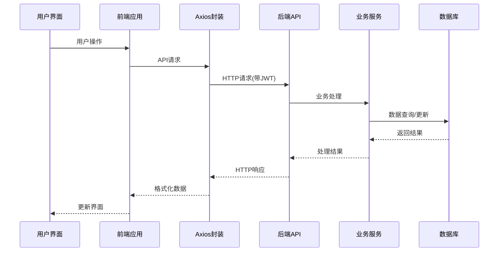
```mermaid
sequenceDiagram
participant U as 用户界面
participant F as 前端应用
participant A as Axios封装
participant B as 后端API
participant S as 业务服务
participant D as 数据库
U->>F : 用户操作
F->>A : API请求
A->>B : HTTP请求(带JWT)
B->>S : 业务处理
S->>D : 数据查询/更新
D-->>S : 返回结果
S-->>B : 处理结果
B-->>A : HTTP响应
A-->>F : 格式化数据
F-->>U : 更新界面
```

**序列图来源**
- [conversation.vue](https://github.com/Shy2593666979/AgentChat/src/frontend/src/pages/conversation/conversation.vue#L83-L105)
- [chat.py](https://github.com/Shy2593666979/AgentChat/src/backend/agentchat/api/v1/chat.py#L49-L122)

## 前端API封装层

### Axios请求封装核心

前端的API封装基于Axios库，提供了统一的请求处理机制，包括认证令牌自动注入、错误处理和响应拦截。

#### 请求拦截器实现

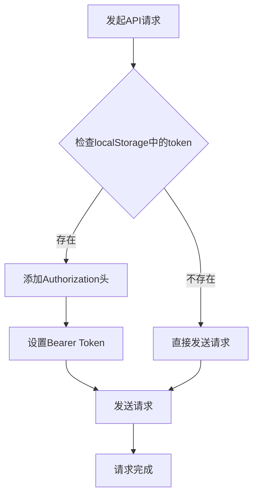
```mermaid
flowchart TD
A[发起API请求] --> B{检查localStorage中的token}
B --> |存在| C[添加Authorization头]
B --> |不存在| D[直接发送请求]
C --> E[设置Bearer Token]
E --> F[发送请求]
D --> F
F --> G[请求完成]
```

**流程图来源**
- [request.ts](https://github.com/Shy2593666979/AgentChat/src/frontend/src/utils/request.ts#L13-L30)

#### 响应拦截器机制

响应拦截器负责处理各种HTTP状态码和错误情况，特别是401未授权错误的处理。

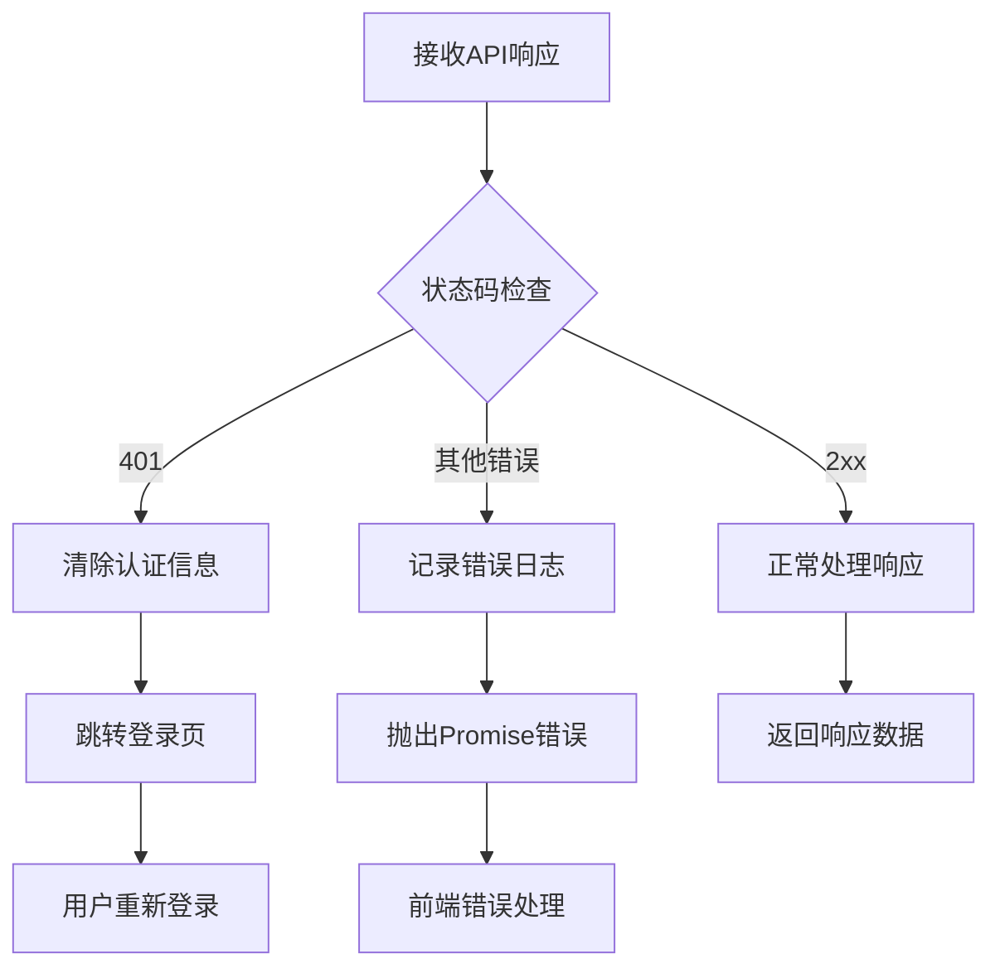
```mermaid
flowchart TD
A[接收API响应] --> B{状态码检查}
B --> |2xx| C[正常处理响应]
B --> |401| D[清除认证信息]
D --> E[跳转登录页]
B --> |其他错误| F[记录错误日志]
F --> G[抛出Promise错误]
C --> H[返回响应数据]
E --> I[用户重新登录]
G --> J[前端错误处理]
```

**流程图来源**
- [request.ts](https://github.com/Shy2593666979/AgentChat/src/frontend/src/utils/request.ts#L38-L57)

**章节来源**
- [request.ts](https://github.com/Shy2593666979/AgentChat/src/frontend/src/utils/request.ts#L1-L61)

### API模块设计

#### 聊天API模块

聊天模块专门处理与LLM的实时对话，支持流式输出和文件上传功能。

| 功能模块 | 方法名称 | 参数类型 | 返回类型 | 描述 |
|---------|----------|----------|----------|------|
| 消息发送 | `sendMessage` | `Chat, onmessage, onclose` | `AbortController` | 流式发送聊天消息 |
| 文件上传 | `uploadFile` | `File` | `Promise<UploadResponse>` | 上传文件到服务器 |
| 知识检索 | `retrieveKnowledge` | `string, string \| string[]` | `Promise<any>` | 检索知识库内容 |
| Mars示例 | `sendMarsExample` | `number, onmessage, onclose` | `AbortController` | 发送Mars示例 |

**表格来源**
- [chat.ts](https://github.com/Shy2593666979/AgentChat/src/frontend/src/apis/chat.ts#L16-L146)

#### 智能体API模块

智能体模块提供完整的CRUD操作，支持智能体的创建、查询、更新和删除。

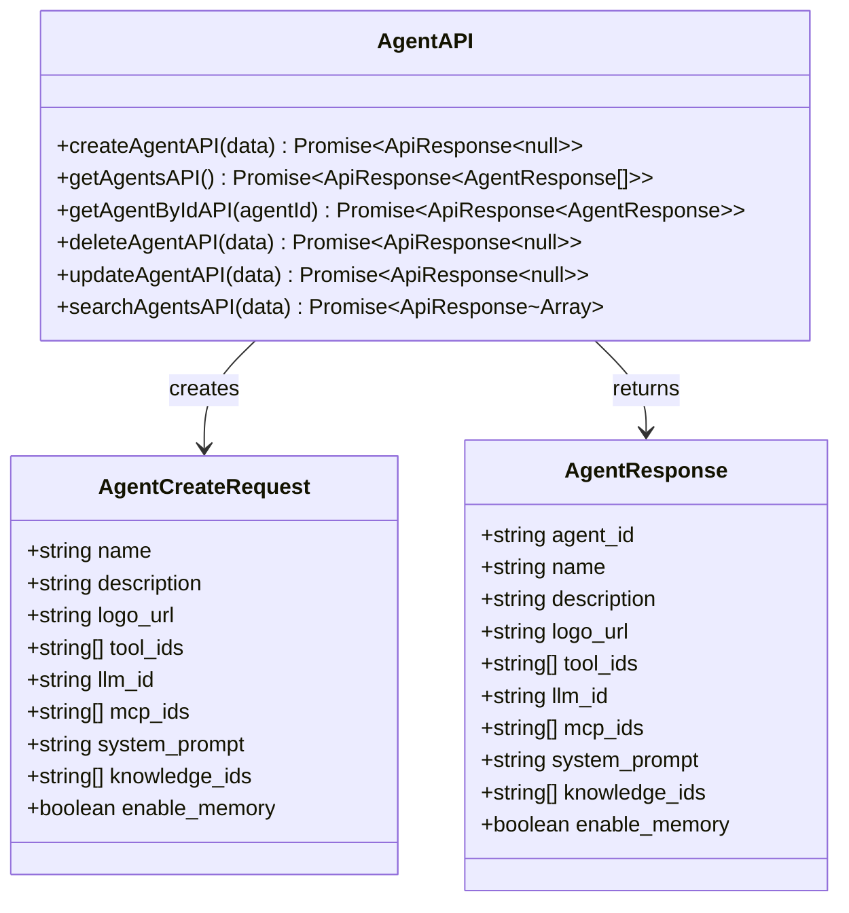
```mermaid
classDiagram
class AgentAPI {
+createAgentAPI(data) Promise~ApiResponse~null~~
+getAgentsAPI() Promise~ApiResponse~AgentResponse[]~~
+getAgentByIdAPI(agentId) Promise~ApiResponse~AgentResponse~~
+deleteAgentAPI(data) Promise~ApiResponse~null~~
+updateAgentAPI(data) Promise~ApiResponse~null~~
+searchAgentsAPI(data) Promise~ApiResponse~Array~
}
class AgentCreateRequest {
+string name
+string description
+string logo_url
+string[] tool_ids
+string llm_id
+string[] mcp_ids
+string system_prompt
+string[] knowledge_ids
+boolean enable_memory
}
class AgentResponse {
+string agent_id
+string name
+string description
+string logo_url
+string[] tool_ids
+string llm_id
+string[] mcp_ids
+string system_prompt
+string[] knowledge_ids
+boolean enable_memory
}
AgentAPI --> AgentCreateRequest : creates
AgentAPI --> AgentResponse : returns
```

**类图来源**
- [agent.ts](https://github.com/Shy2593666979/AgentChat/src/frontend/src/apis/agent.ts#L4-L46)
- [agent.ts](https://github.com/Shy2593666979/AgentChat/src/frontend/src/apis/agent.ts#L49-L163)

**章节来源**
- [chat.ts](https://github.com/Shy2593666979/AgentChat/src/frontend/src/apis/chat.ts#L1-L147)
- [agent.ts](https://github.com/Shy2593666979/AgentChat/src/frontend/src/apis/agent.ts#L1-L163)

## 后端API路由架构

### 路由组织结构

后端采用模块化的路由组织方式，每个功能模块都有独立的路由处理器。

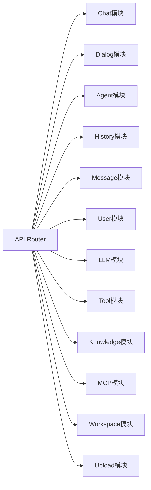
```mermaid
graph LR
A[API Router] --> B[Chat模块]
A --> C[Dialog模块]
A --> D[Agent模块]
A --> E[History模块]
A --> F[Message模块]
A --> G[User模块]
A --> H[LLM模块]
A --> I[Tool模块]
A --> J[Knowledge模块]
A --> K[MCP模块]
A --> L[Workspace模块]
A --> M[Upload模块]
```

**图表来源**
- [router.py](https://github.com/Shy2593666979/AgentChat/src/backend/agentchat/api/router.py#L6-L28)

### 核心API端点

| 模块 | 端点路径 | HTTP方法 | 功能描述 |
|------|----------|----------|----------|
| 聊天 | `/api/v1/chat` | POST | 实时对话接口 |
| 对话 | `/api/v1/dialog` | POST/GET/DELETE | 对话管理 |
| 智能体 | `/api/v1/agent` | GET/POST/PUT/DELETE | 智能体CRUD |
| 历史 | `/api/v1/history` | GET | 历史记录查询 |
| 消息 | `/api/v1/message/*` | POST/GET | 消息操作 |
| 知识库 | `/api/v1/knowledge/*` | POST/GET/DELETE | 知识库管理 |

**表格来源**
- [router.py](https://github.com/Shy2593666979/AgentChat/src/backend/agentchat/api/router.py#L8-L28)

### 流式响应处理

后端实现了专门的流式响应处理机制，支持实时的SSE（Server-Sent Events）通信。

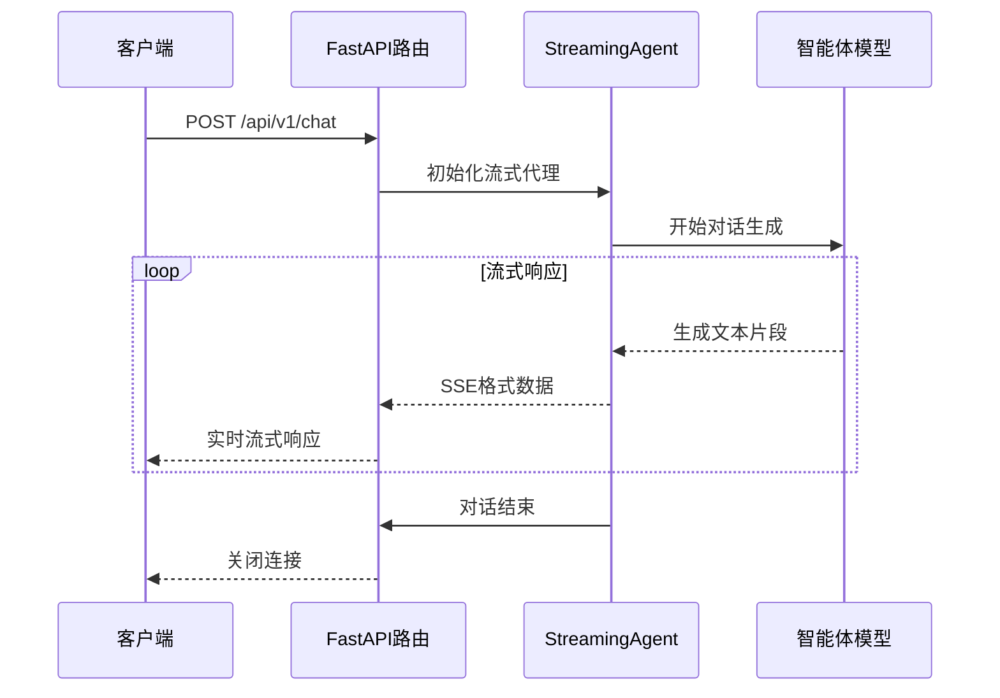
```mermaid
sequenceDiagram
participant C as 客户端
participant R as FastAPI路由
participant A as StreamingAgent
participant M as 智能体模型
C->>R : POST /api/v1/chat
R->>A : 初始化流式代理
A->>M : 开始对话生成
loop 流式响应
M-->>A : 生成文本片段
A-->>R : SSE格式数据
R-->>C : 实时流式响应
end
A->>R : 对话结束
R-->>C : 关闭连接
```

**序列图来源**
- [chat.py](https://github.com/Shy2593666979/AgentChat/src/backend/agentchat/api/v1/chat.py#L49-L122)

**章节来源**
- [router.py](https://github.com/Shy2593666979/AgentChat/src/backend/agentchat/api/router.py#L1-L28)
- [chat.py](https://github.com/Shy2593666979/AgentChat/src/backend/agentchat/api/v1/chat.py#L1-L122)

## 认证与授权机制

### JWT认证架构

系统采用JWT（JSON Web Token）进行身份认证，提供了完整的认证生命周期管理。

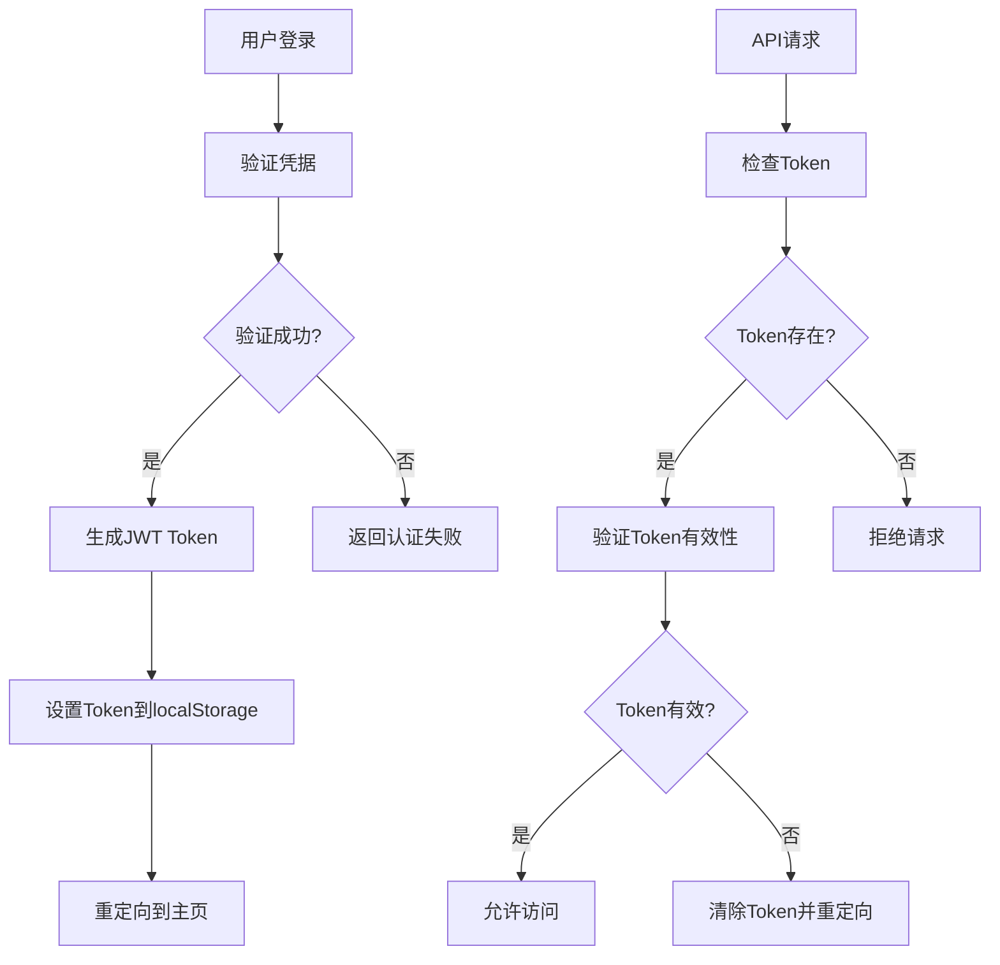
```mermaid
flowchart TD
A[用户登录] --> B[验证凭据]
B --> C{验证成功?}
C --> |是| D[生成JWT Token]
C --> |否| E[返回认证失败]
D --> F[设置Token到localStorage]
F --> G[重定向到主页]
H[API请求] --> I[检查Token]
I --> J{Token存在?}
J --> |是| K[验证Token有效性]
J --> |否| L[拒绝请求]
K --> M{Token有效?}
M --> |是| N[允许访问]
M --> |否| O[清除Token并重定向]
```

**流程图来源**
- [auth_config.py](https://github.com/Shy2593666979/AgentChat/src/backend/fastapi_jwt_auth/auth_config.py#L1-L81)
- [auth_jwt.py](https://github.com/Shy2593666979/AgentChat/src/backend/fastapi_jwt_auth/auth_jwt.py#L1-L806)

### 认证配置参数

| 配置项 | 默认值 | 描述 |
|--------|--------|------|
| `access_token_expires` | 15分钟 | 访问令牌有效期 |
| `refresh_token_expires` | 30天 | 刷新令牌有效期 |
| `algorithm` | HS256 | JWT签名算法 |
| `header_name` | Authorization | 认证头部名称 |
| `header_type` | Bearer | 认证类型前缀 |

**表格来源**
- [auth_config.py](https://github.com/Shy2593666979/AgentChat/src/backend/fastapi_jwt_auth/auth_config.py#L13-L25)

### 前端认证处理

前端通过请求拦截器自动处理认证令牌的添加和过期处理。

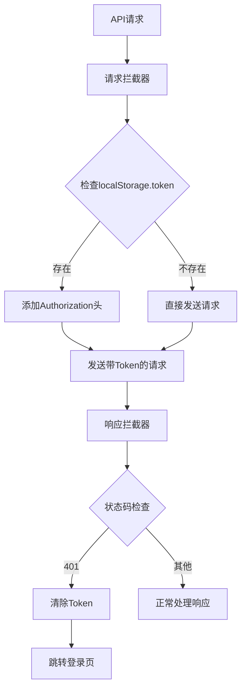
```mermaid
flowchart TD
A[API请求] --> B[请求拦截器]
B --> C{检查localStorage.token}
C --> |存在| D[添加Authorization头]
C --> |不存在| E[直接发送请求]
D --> F[发送带Token的请求]
E --> F
F --> G[响应拦截器]
G --> H{状态码检查}
H --> |401| I[清除Token]
I --> J[跳转登录页]
H --> |其他| K[正常处理响应]
```

**流程图来源**
- [request.ts](https://github.com/Shy2593666979/AgentChat/src/frontend/src/utils/request.ts#L13-L57)

**章节来源**
- [auth_config.py](https://github.com/Shy2593666979/AgentChat/src/backend/fastapi_jwt_auth/auth_config.py#L1-L81)
- [auth_jwt.py](https://github.com/Shy2593666979/AgentChat/src/backend/fastapi_jwt_auth/auth_jwt.py#L1-L806)
- [request.ts](https://github.com/Shy2593666979/AgentChat/src/frontend/src/utils/request.ts#L1-L61)

## TypeScript类型安全实践

### 类型定义体系

前端采用了严格的TypeScript类型定义，确保API接口的类型安全。

#### 核心类型定义

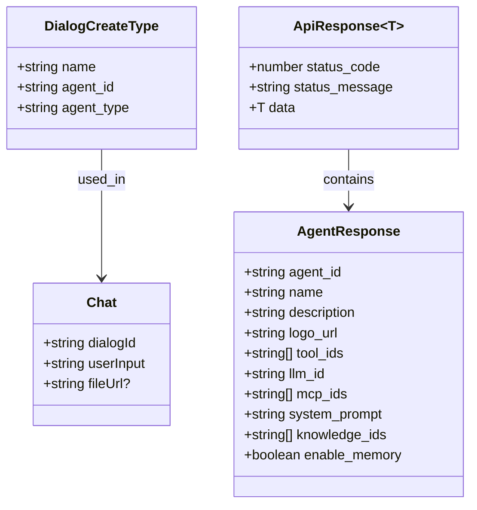
```mermaid
classDiagram
class DialogCreateType {
+string name
+string agent_id
+string agent_type
}
class AgentResponse {
+string agent_id
+string name
+string description
+string logo_url
+string[] tool_ids
+string llm_id
+string[] mcp_ids
+string system_prompt
+string[] knowledge_ids
+boolean enable_memory
}
class ApiResponse~T~ {
+number status_code
+string status_message
+T data
}
class Chat {
+string dialogId
+string userInput
+string fileUrl?
}
ApiResponse --> AgentResponse : contains
DialogCreateType --> Chat : used_in
```

**类图来源**
- [type.ts](https://github.com/Shy2593666979/AgentChat/src/frontend/src/type.ts#L1-L167)
- [agent.ts](https://github.com/Shy2593666979/AgentChat/src/frontend/src/apis/agent.ts#L4-L46)

### 类型安全API调用

#### 智能体API类型安全示例

```typescript
// 类型安全的智能体创建
interface AgentCreateRequest {
  name: string;
  description: string;
  logo_url: string;
  tool_ids: string[];
  llm_id: string;
  mcp_ids: string[];
  system_prompt: string;
  knowledge_ids: string[];
  enable_memory: boolean;
}

// 编译时类型检查
function createAgentAPI(data: AgentCreateRequest) {
  return request<ApiResponse<null>>({
    url: '/api/v1/agent',
    method: 'POST',
    data
  });
}
```

#### 错误类型处理

| 错误类型 | 处理策略 | 用户体验 |
|----------|----------|----------|
| 网络错误 | 显示重试按钮 | 提示"网络连接失败，请重试" |
| 认证错误 | 自动跳转登录 | 引导重新登录 |
| 业务错误 | 显示具体错误信息 | 明确告知错误原因 |
| 超时错误 | 显示加载状态 | 提供进度指示 |

**表格来源**
- [request.ts](https://github.com/Shy2593666979/AgentChat/src/frontend/src/utils/request.ts#L46-L57)

**章节来源**
- [type.ts](https://github.com/Shy2593666979/AgentChat/src/frontend/src/type.ts#L1-L167)
- [agent.ts](https://github.com/Shy2593666979/AgentChat/src/frontend/src/apis/agent.ts#L4-L46)

## 对话通信流程

### 会话管理流程

前端的对话管理通过Vue组件和Pinia状态管理实现，展示了完整的异步API调用流程。

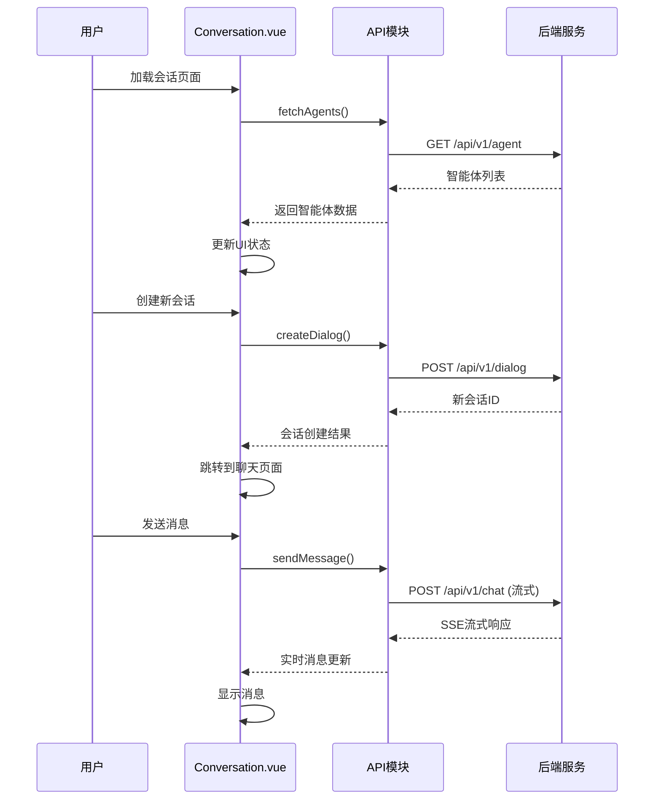
```mermaid
sequenceDiagram
participant U as 用户
participant CV as Conversation.vue
participant API as API模块
participant BE as 后端服务
U->>CV : 加载会话页面
CV->>API : fetchAgents()
API->>BE : GET /api/v1/agent
BE-->>API : 智能体列表
API-->>CV : 返回智能体数据
CV->>CV : 更新UI状态
U->>CV : 创建新会话
CV->>API : createDialog()
API->>BE : POST /api/v1/dialog
BE-->>API : 新会话ID
API-->>CV : 会话创建结果
CV->>CV : 跳转到聊天页面
U->>CV : 发送消息
CV->>API : sendMessage()
API->>BE : POST /api/v1/chat (流式)
BE-->>API : SSE流式响应
API-->>CV : 实时消息更新
CV->>CV : 显示消息
```

**序列图来源**
- [conversation.vue](https://github.com/Shy2593666979/AgentChat/src/frontend/src/pages/conversation/conversation.vue#L83-L105)
- [conversation.vue](https://github.com/Shy2593666979/AgentChat/src/frontend/src/pages/conversation/conversation.vue#L178-L247)

### 流式对话实现

#### 前端流式处理

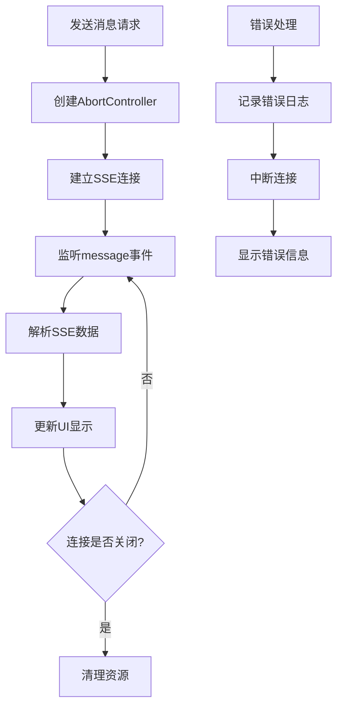
```mermaid
flowchart TD
A[发送消息请求] --> B[创建AbortController]
B --> C[建立SSE连接]
C --> D[监听message事件]
D --> E[解析SSE数据]
E --> F[更新UI显示]
F --> G{连接是否关闭?}
G --> |否| D
G --> |是| H[清理资源]
I[错误处理] --> J[记录错误日志]
J --> K[中断连接]
K --> L[显示错误信息]
```

**流程图来源**
- [chat.ts](https://github.com/Shy2593666979/AgentChat/src/frontend/src/apis/chat.ts#L16-L61)

#### 后端流式生成

后端实现了专门的流式响应类，支持实时的消息流式传输。

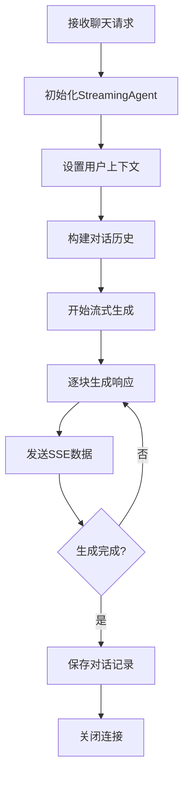
```mermaid
flowchart TD
A[接收聊天请求] --> B[初始化StreamingAgent]
B --> C[设置用户上下文]
C --> D[构建对话历史]
D --> E[开始流式生成]
E --> F[逐块生成响应]
F --> G[发送SSE数据]
G --> H{生成完成?}
H --> |否| F
H --> |是| I[保存对话记录]
I --> J[关闭连接]
```

**流程图来源**
- [chat.py](https://github.com/Shy2593666979/AgentChat/src/backend/agentchat/api/v1/chat.py#L93-L116)

**章节来源**
- [conversation.vue](https://github.com/Shy2593666979/AgentChat/src/frontend/src/pages/conversation/conversation.vue#L1-L800)
- [chat.ts](https://github.com/Shy2593666979/AgentChat/src/frontend/src/apis/chat.ts#L16-L61)
- [chat.py](https://github.com/Shy2593666979/AgentChat/src/backend/agentchat/api/v1/chat.py#L49-L122)

## 错误处理与调试

### 前端错误处理策略

前端实现了多层次的错误处理机制，确保用户体验的连续性。

#### 错误分类处理

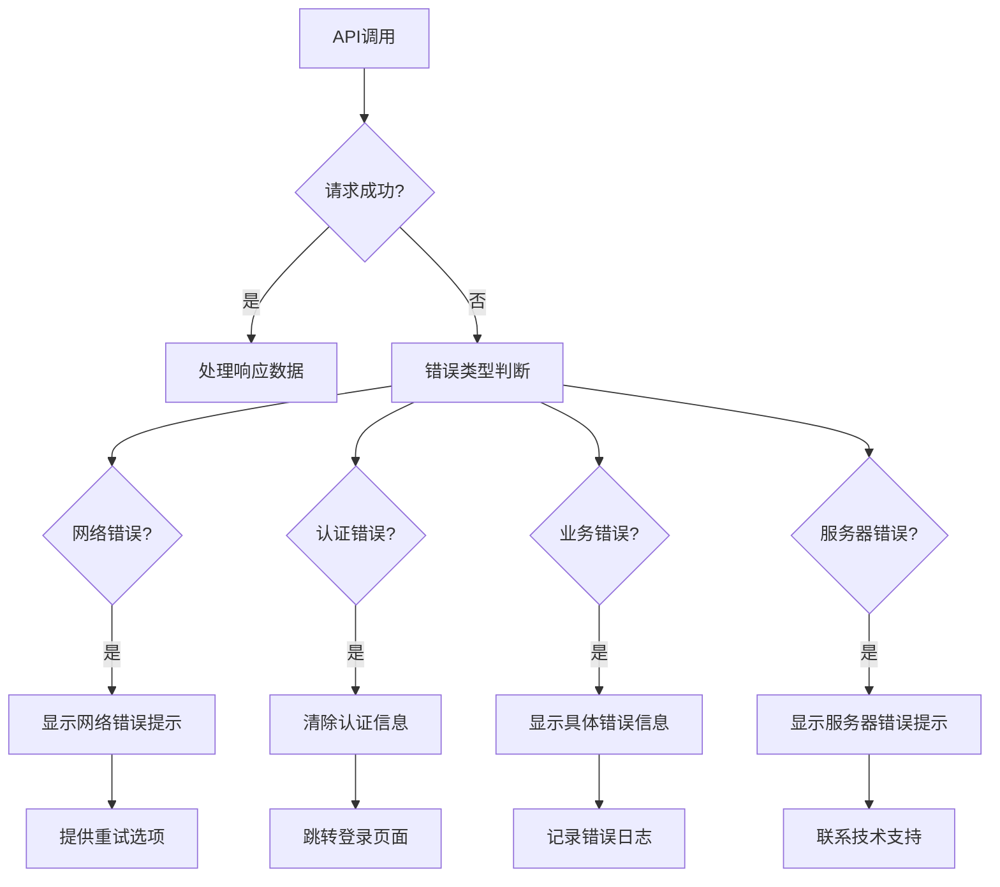
```mermaid
flowchart TD
A[API调用] --> B{请求成功?}
B --> |是| C[处理响应数据]
B --> |否| D[错误类型判断]
D --> E{网络错误?}
D --> F{认证错误?}
D --> G{业务错误?}
D --> H{服务器错误?}
E --> |是| I[显示网络错误提示]
F --> |是| J[清除认证信息]
G --> |是| K[显示具体错误信息]
H --> |是| L[显示服务器错误提示]
J --> M[跳转登录页面]
I --> N[提供重试选项]
K --> O[记录错误日志]
L --> P[联系技术支持]
```

**流程图来源**
- [request.ts](https://github.com/Shy2593666979/AgentChat/src/frontend/src/utils/request.ts#L46-L57)

### 后端错误处理

后端采用统一的响应格式和错误处理机制。

#### 统一响应格式

```typescript
interface UnifiedResponseModel {
  status_code: number;
  status_message: string;
  data: any;
}
```

#### 错误响应示例

| HTTP状态码 | 错误类型 | 响应格式 |
|------------|----------|----------|
| 400 | 请求错误 | `{code: 400, message: "错误描述", data: null}` |
| 401 | 认证失败 | `{code: 401, message: "未授权", data: null}` |
| 404 | 资源不存在 | `{code: 404, message: "未找到", data: null}` |
| 500 | 服务器内部错误 | `{code: 500, message: "服务器错误", data: null}` |

### API调试工具

#### 调试指南

前端提供了专门的调试页面和工具，帮助开发者快速定位问题。

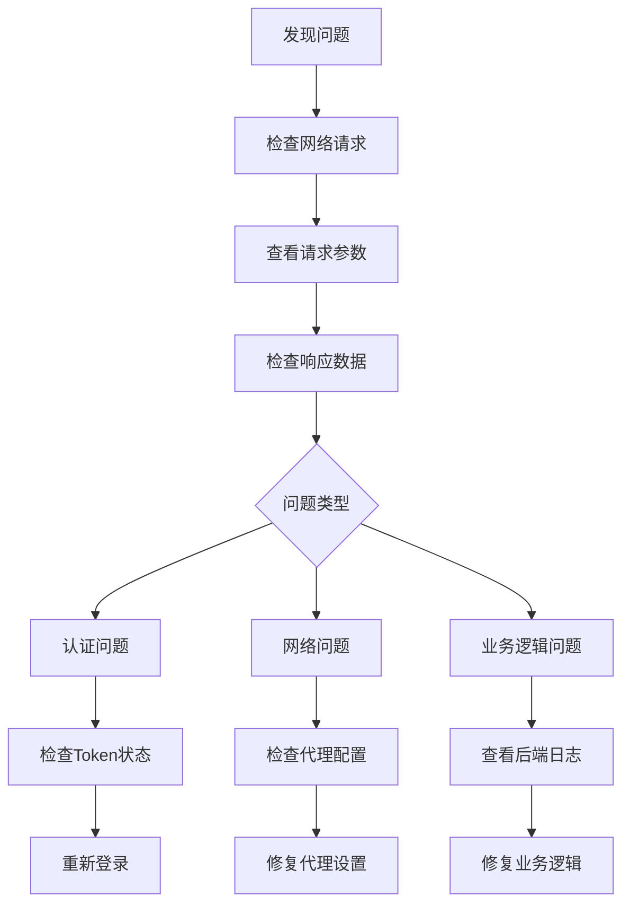
```mermaid
flowchart TD
A[发现问题] --> B[检查网络请求]
B --> C[查看请求参数]
C --> D[检查响应数据]
D --> E{问题类型}
E --> F[认证问题]
E --> G[网络问题]
E --> H[业务逻辑问题]
F --> I[检查Token状态]
G --> J[检查代理配置]
H --> K[查看后端日志]
I --> L[重新登录]
J --> M[修复代理设置]
K --> N[修复业务逻辑]
```

**流程图来源**
- [DEBUGGING_GUIDE.md](https://github.com/Shy2593666979/AgentChat/src/frontend/DEBUGGING_GUIDE.md#L1-L107)

#### 常见问题排查

| 问题类型 | 症状 | 排查步骤 | 解决方案 |
|----------|------|----------|----------|
| 401错误 | 未授权访问 | 检查Token有效性 | 重新登录获取Token |
| 404错误 | 接口不存在 | 检查API路径 | 确认后端路由配置 |
| CORS错误 | 跨域请求被拒绝 | 检查CORS配置 | 配置后端CORS策略 |
| 网络超时 | 请求长时间无响应 | 检查网络连接 | 优化网络配置 |

**表格来源**
- [DEBUGGING_GUIDE.md](https://github.com/Shy2593666979/AgentChat/src/frontend/DEBUGGING_GUIDE.md#L63-L107)

**章节来源**
- [request.ts](https://github.com/Shy2593666979/AgentChat/src/frontend/src/utils/request.ts#L46-L57)
- [DEBUGGING_GUIDE.md](https://github.com/Shy2593666979/AgentChat/src/frontend/DEBUGGING_GUIDE.md#L1-L107)

## 性能优化策略

### 前端性能优化

#### 请求缓存机制

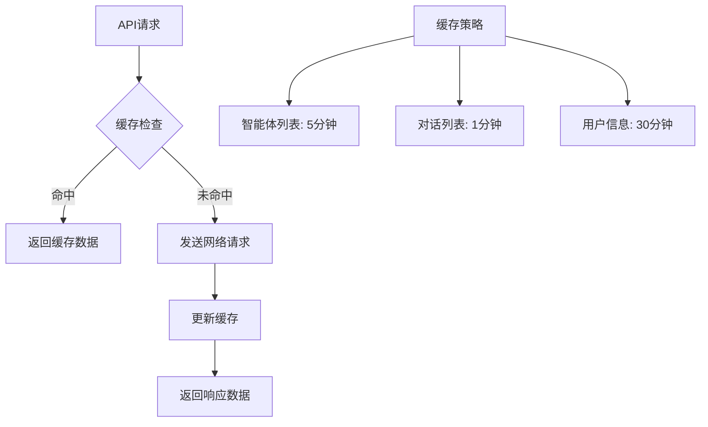
```mermaid
flowchart TD
A[API请求] --> B{缓存检查}
B --> |命中| C[返回缓存数据]
B --> |未命中| D[发送网络请求]
D --> E[更新缓存]
E --> F[返回响应数据]
G[缓存策略] --> H[智能体列表: 5分钟]
G --> I[对话列表: 1分钟]
G --> J[用户信息: 30分钟]
```

#### 组件懒加载

前端采用Vue的异步组件和路由懒加载，减少初始包体积。

```typescript
// 路由懒加载示例
const routes = [
  {
    path: '/conversation',
    component: () => import('./pages/conversation/conversation.vue')
  },
  {
    path: '/agent',
    component: () => import('./pages/agent/agent.vue')
  }
];
```

### 后端性能优化

#### 数据库连接池

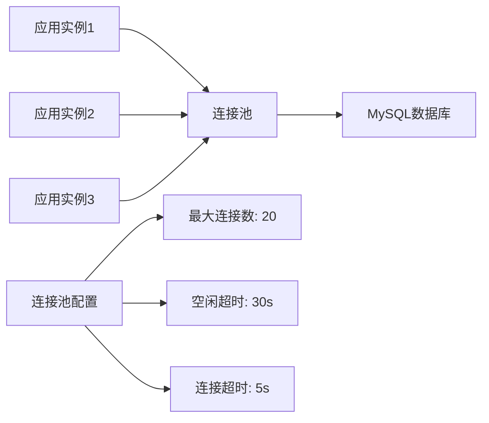
```mermaid
graph LR
A[应用实例1] --> B[连接池]
C[应用实例2] --> B
D[应用实例3] --> B
B --> E[MySQL数据库]
F[连接池配置] --> G[最大连接数: 20]
F --> H[空闲超时: 30s]
F --> I[连接超时: 5s]
```

#### 智能体缓存

后端实现了智能体配置的内存缓存，避免重复的数据库查询。

```python
# 智能体配置缓存示例
class AgentCache:
    def __init__(self):
        self.cache = {}
        self.ttl = 300  # 5分钟
    
    def get_agent_config(self, agent_id):
        if agent_id in self.cache:
            return self.cache[agent_id]
        # 查询数据库并缓存
        config = db.query_agent_config(agent_id)
        self.cache[agent_id] = config
        return config
```

### 流式传输优化

#### SSE连接管理

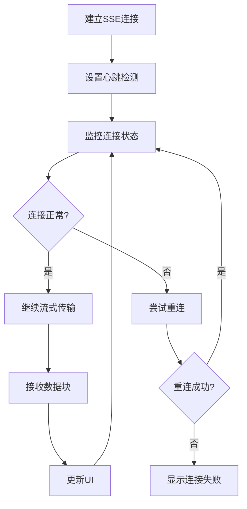
```mermaid
flowchart TD
A[建立SSE连接] --> B[设置心跳检测]
B --> C[监控连接状态]
C --> D{连接正常?}
D --> |是| E[继续流式传输]
D --> |否| F[尝试重连]
F --> G{重连成功?}
G --> |是| C
G --> |否| H[显示连接失败]
E --> I[接收数据块]
I --> J[更新UI]
J --> C
```

## 最佳实践指南

### 前端开发最佳实践

#### API调用规范

1. **统一错误处理**：所有API调用都应在catch块中处理错误
2. **加载状态管理**：为每个API调用设置适当的加载状态
3. **类型安全**：使用TypeScript严格类型检查
4. **资源清理**：及时取消不必要的请求

```typescript
// 推荐的API调用模式
async function fetchData() {
  try {
    setLoading(true);
    const response = await apiCall();
    setData(response.data);
  } catch (error) {
    handleError(error);
  } finally {
    setLoading(false);
  }
}
```

#### 状态管理策略

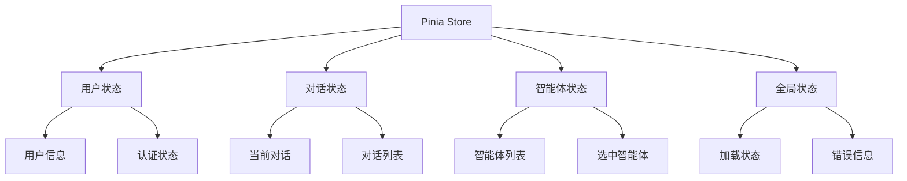
```mermaid
graph TD
A[Pinia Store] --> B[用户状态]
A --> C[对话状态]
A --> D[智能体状态]
A --> E[全局状态]
B --> F[用户信息]
B --> G[认证状态]
C --> H[当前对话]
C --> I[对话列表]
D --> J[智能体列表]
D --> K[选中智能体]
E --> L[加载状态]
E --> M[错误信息]
```

### 后端开发最佳实践

#### 路由设计原则

1. **RESTful设计**：遵循REST架构风格
2. **版本控制**：使用API版本号管理
3. **错误响应标准化**：统一错误响应格式
4. **权限控制**：细粒度的权限管理

#### 数据库操作最佳实践

```python
# 推荐的数据库操作模式
async def get_user_profile(user_id: str):
    try:
        # 使用异步ORM
        user = await User.get(user_id)
        return user.to_dict()
    except DoesNotExist:
        raise HTTPException(status_code=404, detail="用户不存在")
    except Exception as e:
        logger.error(f"获取用户资料失败: {e}")
        raise HTTPException(status_code=500, detail="服务器内部错误")
```

### 安全最佳实践

#### 前端安全措施

1. **CSRF防护**：启用双提交Cookie保护
2. **XSS防护**：对用户输入进行适当转义
3. **数据加密**：敏感数据本地加密存储
4. **权限验证**：前端路由级别的权限控制

#### 后端安全措施

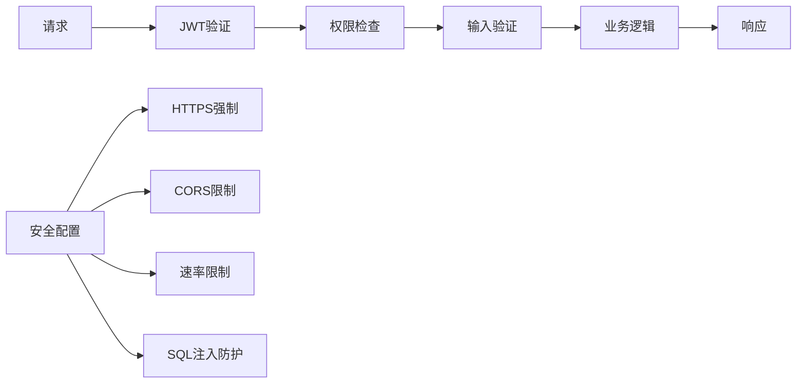
```mermaid
graph LR
A[请求] --> B[JWT验证]
B --> C[权限检查]
C --> D[输入验证]
D --> E[业务逻辑]
E --> F[响应]
G[安全配置] --> H[HTTPS强制]
G --> I[CORS限制]
G --> J[速率限制]
G --> K[SQL注入防护]
```

### 监控与日志

#### 前端监控

```typescript
// 前端错误监控示例
window.addEventListener('error', (event) => {
  analytics.track('frontend_error', {
    message: event.message,
    filename: event.filename,
    lineno: event.lineno,
    colno: event.colno,
    stack: event.error?.stack
  });
});
```

#### 后端监控

```python
# 后端性能监控示例
@router.middleware("http")
async def performance_monitor(request: Request, call_next):
    start_time = time.time()
    
    response = await call_next(request)
    
    process_time = time.time() - start_time
    logger.info(f"{request.method} {request.url} took {process_time:.2f}s")
    
    return response
```

通过以上全面的API集成方案，AgentChat实现了前后端的高效协同，提供了稳定可靠的智能对话服务。该方案不仅保证了系统的可维护性和扩展性，还为用户提供了流畅的交互体验。