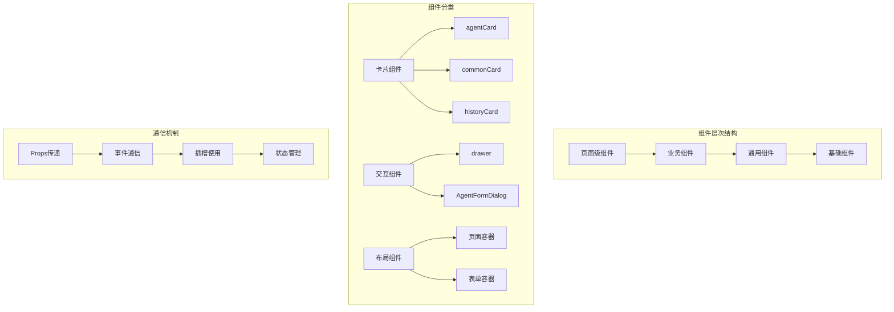
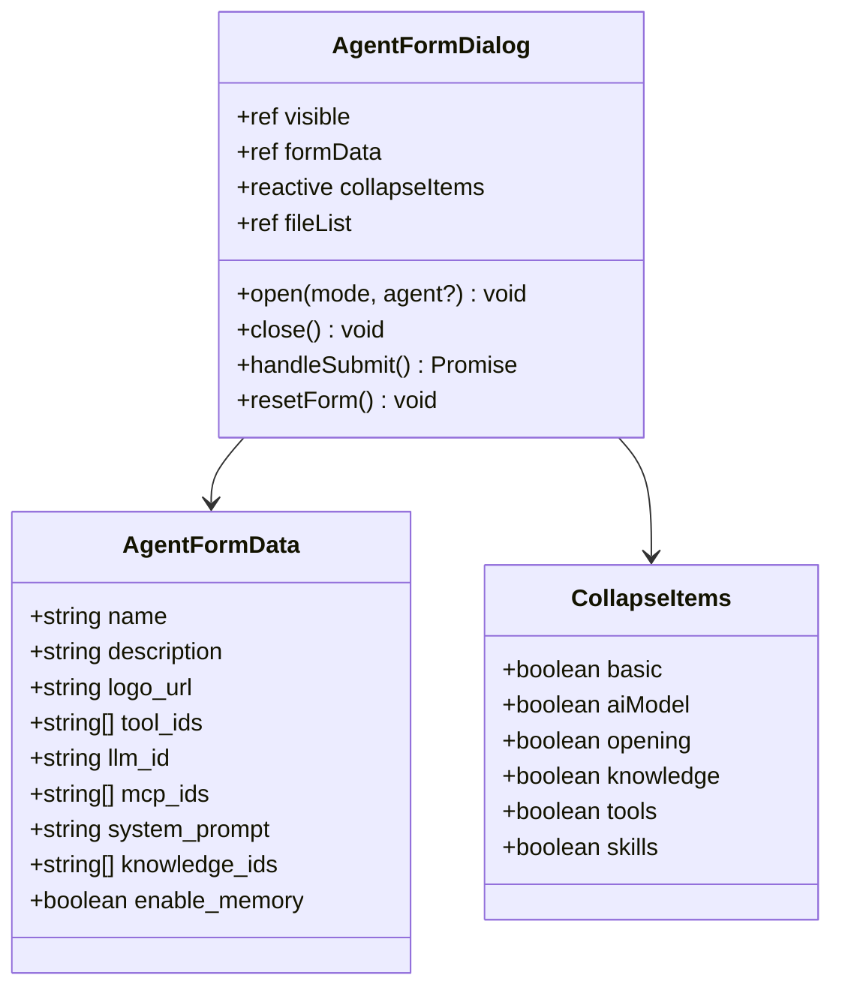

# UI组件体系

<cite>
**本文档引用的文件**
- [agentCard.vue](https://github.com/Shy2593666979/AgentChat/src/frontend/src/components/agentCard/agentCard.vue)
- [drawer.vue](https://github.com/Shy2593666979/AgentChat/src/frontend/src/components/drawer/drawer.vue)
- [AgentFormDialog.vue](https://github.com/Shy2593666979/AgentChat/src/frontend/src/components/dialog/create_agent/AgentFormDialog.vue)
- [commonCard.vue](https://github.com/Shy2593666979/AgentChat/src/frontend/src/components/commonCard/commonCard.vue)
- [histortCard.vue](https://github.com/Shy2593666979/AgentChat/src/frontend/src/components/historyCard/histortCard.vue)
- [agentCard/index.ts](https://github.com/Shy2593666979/AgentChat/src/frontend/src/components/agentCard/index.ts)
- [drawer/index.ts](https://github.com/Shy2593666979/AgentChat/src/frontend/src/components/drawer/index.ts)
- [AgentFormDialog/index.ts](https://github.com/Shy2593666979/AgentChat/src/frontend/src/components/dialog/create_agent/index.ts)
- [type.ts](https://github.com/Shy2593666979/AgentChat/src/frontend/src/type.ts)
- [agent-fixed.vue](https://github.com/Shy2593666979/AgentChat/src/frontend/src/pages/agent/agent-fixed.vue)
- [agent-editor.vue](https://github.com/Shy2593666979/AgentChat/src/frontend/src/pages/agent/agent-editor.vue)
- [dialog.ts](https://github.com/Shy2593666979/AgentChat/src/frontend/src/utils/dialog.ts)
</cite>

## 目录
1. [概述](#概述)
2. [组件架构设计](#组件架构设计)
3. [核心通用组件](#核心通用组件)
4. [复杂表单组件](#复杂表单组件)
5. [组件导出与按需引入](#组件导出与按需引入)
6. [样式隔离与响应式设计](#样式隔离与响应式设计)
7. [组件通信机制](#组件通信机制)
8. [开发规范与最佳实践](#开发规范与最佳实践)
9. [测试建议](#测试建议)
10. [总结](#总结)

## 概述

AgentChat的UI组件体系采用基于Vue 3 Composition API的设计模式，构建了一套高度可复用、模块化的组件库。该体系涵盖了从基础卡片组件到复杂表单对话框的完整解决方案，支持响应式设计和组件间的灵活通信。

### 设计理念

- **模块化设计**：每个组件独立封装，职责单一
- **类型安全**：全面使用TypeScript确保类型安全
- **可复用性**：通用组件可在不同场景下重复使用
- **响应式优先**：内置响应式设计支持多设备适配
- **样式隔离**：采用Scoped CSS和CSS Modules确保样式独立

## 组件架构设计



**图表来源**
- [agentCard.vue](https://github.com/Shy2593666979/AgentChat/src/frontend/src/components/agentCard/agentCard.vue#L1-L50)
- [drawer.vue](https://github.com/Shy2593666979/AgentChat/src/frontend/src/components/drawer/drawer.vue#L1-L50)
- [AgentFormDialog.vue](https://github.com/Shy2593666979/AgentChat/src/frontend/src/components/dialog/create_agent/AgentFormDialog.vue#L1-L50)

## 核心通用组件

### agentCard组件

agentCard是智能体展示的核心组件，提供了完整的智能体信息展示和操作功能。

#### Props定义与类型安全

```typescript
// Props类型定义
interface AgentCardProps {
  item: Agent // 智能体数据对象
}

// 类型接口
interface Agent {
  agent_id: string
  name: string
  description: string
  logo_url: string
  tool_ids: string[]
  llm_id: string
  mcp_ids: string[]
  system_prompt: string
  knowledge_ids: string[]
  enable_memory: boolean
}
```

#### 事件通信机制

组件通过$emit实现父子组件通信：

```typescript
// 定义事件类型
const emits = defineEmits<{
  (event: 'delete'): void
  (event: 'edit', agent: Agent): void
}>()
```

#### 插槽使用方式

虽然当前版本主要依赖模板渲染，但设计上预留了插槽扩展空间：

```vue
<!-- 插槽占位符 -->
<slot name="header"></slot>
<slot name="footer"></slot>
```

#### 样式隔离策略

采用Scoped CSS确保样式独立性：

```scss
<style lang="scss" scoped>
.agentCard {
  // 组件特定样式
  .content {
    // 内部样式
  }
}
</style>
```

**章节来源**
- [agentCard.vue](https://github.com/Shy2593666979/AgentChat/src/frontend/src/components/agentCard/agentCard.vue#L8-L15)
- [type.ts](https://github.com/Shy2593666979/AgentChat/src/frontend/src/type.ts#L103-L118)

### commonCard组件

commonCard作为更通用的基础卡片组件，提供简洁的卡片展示能力。

#### 简洁的Props设计

```typescript
interface CommonCardProps {
  title: string      // 标题
  detail: string     // 详情内容
  type?: string      // 卡片类型
  imgUrl: string     // 图标URL
}
```

#### 响应式设计实现

组件内置响应式布局，适应不同屏幕尺寸：

```scss
@media (max-width: 768px) {
  .historyCard {
    padding: 10px;
    .content {
      .top {
        font-size: 16px;
      }
    }
  }
}
```

**章节来源**
- [commonCard.vue](https://github.com/Shy2593666979/AgentChat/src/frontend/src/components/commonCard/commonCard.vue#L4-L9)
- [histortCard.vue](https://github.com/Shy2593666979/AgentChat/src/frontend/src/components/historyCard/histortCard.vue#L205-L236)

### drawer组件

drawer组件提供智能体选择的抽屉式交互界面。

#### 复杂状态管理

```typescript
// 响应式状态
const drawer = ref(false)
const cardList: Agent[] = reactive([])
const currentId = ref()
const searchKeyword = ref('')
const loading = ref(false)
```

#### 计算属性优化

```typescript
const filteredAgents = computed(() => {
  if (!searchKeyword.value) {
    return cardList
  }
  return cardList.filter(agent => 
    agent.name.toLowerCase().includes(searchKeyword.value.toLowerCase()) ||
    agent.description.toLowerCase().includes(searchKeyword.value.toLowerCase())
  )
})
```

#### API集成模式

组件与后端API深度集成：

```typescript
const loadAgents = async () => {
  try {
    loading.value = true
    const response = await getAgentsAPI()
    cardList = response.data.data
  } catch (error) {
    ElMessage.error('获取智能体列表失败')
  } finally {
    loading.value = false
  }
}
```

**章节来源**
- [drawer.vue](https://github.com/Shy2593666979/AgentChat/src/frontend/src/components/drawer/drawer.vue#L13-L49)

## 复杂表单组件

### AgentFormDialog组件

AgentFormDialog是整个UI体系中最复杂的组件，实现了智能体的创建和编辑功能。

#### 组件架构概览



**图表来源**
- [AgentFormDialog.vue](https://github.com/Shy2593666979/AgentChat/src/frontend/src/components/dialog/create_agent/AgentFormDialog.vue#L22-L32)
- [AgentFormDialog.vue](https://github.com/Shy2593666979/AgentChat/src/frontend/src/components/dialog/create_agent/AgentFormDialog.vue#L35-L43)

#### 表单数据管理

采用响应式数据结构管理复杂的表单状态：

```typescript
const formData = reactive<AgentFormData>({
  name: '',
  description: '',
  logo_url: '',
  tool_ids: [],
  llm_id: '',
  mcp_ids: [],
  system_prompt: '',
  knowledge_ids: [],
  enable_memory: false
})
```

#### 折叠面板控制

```typescript
const collapseItems = ref({
  basic: true,
  aiModel: false,
  opening: false,
  knowledge: false,
  knowledgeBase: false,
  tools: false,
  skills: false
})

const toggleCollapse = (key: keyof typeof collapseItems.value) => {
  collapseItems.value[key] = !collapseItems.value[key]
}
```

#### 文件上传处理

```typescript
const uploadAvatarFile = async (file: File) => {
  // 文件大小和类型检查
  const isLt2M = file.size / 1024 / 1024 < 2
  if (!isLt2M) {
    ElMessage.error('上传头像图片大小不能超过 2MB!')
    return
  }
  
  // 开始上传
  uploadLoading.value = true
  try {
    const uploadFormData = new FormData()
    uploadFormData.append('file', file)
    const response = await uploadFileAPI(uploadFormData)
    if (response.data.status_code === 200) {
      formData.logo_url = response.data.data
      ElMessage.success('头像上传成功')
    }
  } finally {
    uploadLoading.value = false
  }
}
```

#### 自定义遮罩层实现

```typescript
const createCustomOverlay = () => {
  const overlay = document.createElement('div')
  overlay.id = 'custom-dialog-overlay'
  overlay.style.cssText = `
    position: fixed;
    top: 0;
    left: 0;
    width: 100vw;
    height: 100vh;
    background-color: rgba(0, 0, 0, 0.6);
    z-index: 999999;
    pointer-events: auto;
    backdrop-filter: blur(4px);
  `
  
  document.body.appendChild(overlay)
  overlay.addEventListener('click', (e) => {
    if (e.target === overlay) {
      close()
    }
  })
}
```

**章节来源**
- [AgentFormDialog.vue](https://github.com/Shy2593666979/AgentChat/src/frontend/src/components/dialog/create_agent/AgentFormDialog.vue#L22-L32)
- [AgentFormDialog.vue](https://github.com/Shy2593666979/AgentChat/src/frontend/src/components/dialog/create_agent/AgentFormDialog.vue#L83-L118)
- [AgentFormDialog.vue](https://github.com/Shy2593666979/AgentChat/src/frontend/src/components/dialog/create_agent/AgentFormDialog.vue#L121-L149)

### 在agent-editor.vue中的集成示例

AgentFormDialog在agent-editor.vue中的典型使用模式：

```typescript
// 引入组件
import AgentFormDialog from '../../components/dialog/create_agent/AgentFormDialog.vue'

// 定义引用
const agentFormRef = ref()

// 处理更新事件
const handleAgentUpdate = () => {
  fetchAgents()
}

// 调用打开方法
const createAgent = () => {
  agentFormRef.value?.open('create')
}

const editAgent = (agent: Agent) => {
  agentFormRef.value?.open('edit', agent)
}
```

**章节来源**
- [agent-fixed.vue](https://github.com/Shy2593666979/AgentChat/src/frontend/src/pages/agent/agent-fixed.vue#L10-L18)
- [agent-fixed.vue](https://github.com/Shy2593666979/AgentChat/src/frontend/src/pages/agent/agent-fixed.vue#L106-L113)

## 组件导出与按需引入

### 导出规范统一

所有组件都遵循统一的导出规范：

```typescript
// agentCard/index.ts
import AgentCard from "./agentCard.vue";
export default AgentCard 

// drawer/index.ts  
import Drawer from "./drawer.vue";
export default Drawer

// AgentFormDialog/index.ts
import CreateAgent from "./create_agent.vue";
export default CreateAgent
```

### 按需引入机制

组件支持ES模块的按需引入：

```typescript
// 按需导入
import AgentCard from '@/components/agentCard'
import Drawer from '@/components/drawer'
import AgentFormDialog from '@/components/dialog/create_agent'

// 组合使用
export default {
  components: {
    AgentCard,
    Drawer,
    AgentFormDialog
  }
}
```

### 性能优化策略

- **Tree Shaking支持**：利用ES模块特性实现无用代码消除
- **懒加载机制**：大型组件可通过动态导入延迟加载
- **Bundle分析**：定期分析打包体积，优化组件大小

**章节来源**
- [agentCard/index.ts](https://github.com/Shy2593666979/AgentChat/src/frontend/src/components/agentCard/index.ts#L1-L4)
- [drawer/index.ts](https://github.com/Shy2593666979/AgentChat/src/frontend/src/components/drawer/index.ts#L1-L5)
- [AgentFormDialog/index.ts](https://github.com/Shy2593666979/AgentChat/src/frontend/src/components/dialog/create_agent/index.ts#L1-L4)

## 样式隔离与响应式设计

### CSS Modules vs Scoped CSS

AgentChat采用混合策略：

1. **Scoped CSS**：主要用于组件内部样式隔离
2. **CSS Modules**：用于全局样式和主题定制

### 样式隔离策略

```scss
<style lang="scss" scoped>
// agentCard.vue
.agentCard {
  // 组件根元素样式
  .content {
    // 子元素样式
    .top {
      // 更深层级样式
    }
  }
}
</style>

<style lang="scss">
// AgentFormDialog.vue - 全局样式
.agent-form-dialog {
  // 覆盖Element UI样式
  .el-dialog {
    border-radius: 12px;
  }
}
</style>
```

### 响应式设计实现

#### 断点定义

```scss
// 响应式断点
$breakpoint-mobile: 480px;
$breakpoint-tablet: 768px;
$breakpoint-desktop: 1024px;

// 移动端适配
@media (max-width: $breakpoint-mobile) {
  .history-card {
    padding: 12px;
    .card-main {
      .card-left {
        .avatar {
          width: 32px;
          height: 32px;
        }
        .content {
          .title {
            font-size: 13px;
          }
        }
      }
    }
  }
}
```

#### 布局适配

```scss
.history-card {
  // 基础布局
  display: flex;
  align-items: center;
  
  // 移动端堆叠布局
  @media (max-width: $breakpoint-mobile) {
    flex-direction: column;
    align-items: flex-start;
  }
}
```

**章节来源**
- [agentCard.vue](https://github.com/Shy2593666979/AgentChat/src/frontend/src/components/agentCard/agentCard.vue#L99-L311)
- [histortCard.vue](https://github.com/Shy2593666979/AgentChat/src/frontend/src/components/historyCard/histortCard.vue#L205-L237)

## 组件通信机制

### Props传递机制

```typescript
// 父组件传递数据
<AgentCard :item="agentData" />

// 子组件接收Props
const props = defineProps<{
  item: Agent
}>()
```

### 事件通信系统

```typescript
// 定义事件
const emits = defineEmits<{
  (event: 'delete'): void
  (event: 'edit', agent: Agent): void
  (event: 'update'): void
}>()

// 触发事件
emits('delete')
emits('edit', selectedAgent)
```

### 插槽通信模式

```vue
<!-- 父组件 -->
<AgentFormDialog>
  <template #header>
    <h3>自定义头部</h3>
  </template>
  
  <template #footer>
    <button @click="customAction">自定义操作</button>
  </template>
</AgentFormDialog>
```

### 状态提升与共享

对于跨组件的状态管理：

```typescript
// 使用provide/inject
const agentStore = reactive({
  agents: [] as Agent[],
  loading: false,
  async fetchAgents() {
    // 实现逻辑
  }
})

provide('agentStore', agentStore)
```

**章节来源**
- [agentCard.vue](https://github.com/Shy2593666979/AgentChat/src/frontend/src/components/agentCard/agentCard.vue#L12-L15)
- [AgentFormDialog.vue](https://github.com/Shy2593666979/AgentChat/src/frontend/src/components/dialog/create_agent/AgentFormDialog.vue#L10-L12)

## 开发规范与最佳实践

### 组件命名规范

```typescript
// 正确的命名
export default {
  name: 'AgentCard',
  components: {
    CommonCard,
    HistoryCard
  }
}

// 错误的命名
export default {
  name: 'ac', // 太短
  components: {
    cc: CommonCard, // 不符合语义
    hc: HistoryCard
  }
}
```

### 类型定义规范

```typescript
// 接口定义
interface AgentCardProps {
  item: Agent
  className?: string
}

// 事件类型
const emits = defineEmits<{
  (event: 'click', payload: MouseEvent): void
  (event: 'update:modelValue', value: string): void
}>()
```

### 性能优化指南

1. **避免内联函数**：在模板中使用计算属性替代内联函数
2. **合理使用v-once**：对静态内容使用v-once指令
3. **组件懒加载**：大型组件使用动态导入
4. **事件防抖节流**：对频繁触发的事件进行优化

```typescript
// 性能优化示例
const debouncedSearch = debounce((value: string) => {
  searchAgents(value)
}, 300)
```

### 可访问性支持

```vue
<div 
  role="button" 
  tabindex="0"
  @click="handleClick"
  @keydown.enter="handleClick"
>
  <!-- 内容 -->
</div>
```

**章节来源**
- [agentCard.vue](https://github.com/Shy2593666979/AgentChat/src/frontend/src/components/agentCard/agentCard.vue#L1-L5)
- [AgentFormDialog.vue](https://github.com/Shy2593666979/AgentChat/src/frontend/src/components/dialog/create_agent/AgentFormDialog.vue#L1-L5)

## 测试建议

### 单元测试策略

```typescript
// 组件测试示例
describe('AgentCard', () => {
  it('should render agent information correctly', () => {
    const wrapper = mount(AgentCard, {
      props: {
        item: mockAgent
      }
    })
    
    expect(wrapper.text()).toContain(mockAgent.name)
    expect(wrapper.find('img').attributes('src')).toBe(mockAgent.logo_url)
  })
  
  it('should emit delete event when delete button is clicked', async () => {
    const wrapper = mount(AgentCard, {
      props: {
        item: mockAgent
      }
    })
    
    await wrapper.find('.delete').trigger('click')
    expect(wrapper.emitted('delete')).toBeTruthy()
  })
})
```

### 端到端测试

```typescript
// E2E测试示例
test('AgentFormDialog should handle form submission', async ({ page }) => {
  await page.goto('/agent-editor')
  
  // 打开表单
  await page.click('[data-testid="create-agent"]')
  
  // 填写表单
  await page.fill('[data-testid="agent-name"]', 'Test Agent')
  await page.fill('[data-testid="agent-description"]', 'Test Description')
  
  // 提交表单
  await page.click('[data-testid="submit-form"]')
  
  // 验证结果
  await expect(page.locator('[data-testid="success-message"]')).toBeVisible()
})
```

### 可视化测试

```typescript
// 视觉回归测试
import { toMatchImageSnapshot } from 'jest-image-snapshot'

expect.extend({ toMatchImageSnapshot })

it('should render AgentCard correctly', () => {
  const wrapper = mount(AgentCard, {
    props: { item: mockAgent }
  })
  
  expect(wrapper.element).toMatchImageSnapshot()
})
```

### 性能测试

```typescript
// 性能基准测试
describe('Component Performance', () => {
  it('should render AgentCard under 100ms', () => {
    const start = performance.now()
    mount(AgentCard, { props: { item: mockAgent } })
    const end = performance.now()
    
    expect(end - start).toBeLessThan(100)
  })
})
```

**章节来源**
- [agentCard.vue](https://github.com/Shy2593666979/AgentChat/src/frontend/src/components/agentCard/agentCard.vue#L33-L47)
- [AgentFormDialog.vue](https://github.com/Shy2593666979/AgentChat/src/frontend/src/components/dialog/create_agent/AgentFormDialog.vue#L244-L283)

## 总结

AgentChat的UI组件体系展现了现代前端开发的最佳实践，通过以下核心特性实现了高质量的用户体验：

### 架构优势

1. **模块化设计**：每个组件职责单一，易于维护和复用
2. **类型安全**：全面的TypeScript支持确保开发时的类型安全
3. **响应式优先**：内置响应式设计支持多设备适配
4. **样式隔离**：采用Scoped CSS和CSS Modules确保样式独立性

### 技术亮点

1. **复杂表单处理**：AgentFormDialog展示了如何处理复杂的表单场景
2. **组件通信**：多种通信机制满足不同场景需求
3. **性能优化**：按需引入和懒加载机制优化应用性能
4. **可访问性**：内置可访问性支持提升用户体验

### 发展方向

1. **组件库标准化**：建立更完善的组件库文档和规范
2. **自动化测试**：完善单元测试和端到端测试体系
3. **性能监控**：建立组件性能监控和优化机制
4. **可访问性增强**：进一步提升组件的可访问性支持

这套UI组件体系不仅满足了当前项目的需求，更为未来的功能扩展和维护奠定了坚实的基础，体现了现代前端工程化的最佳实践。