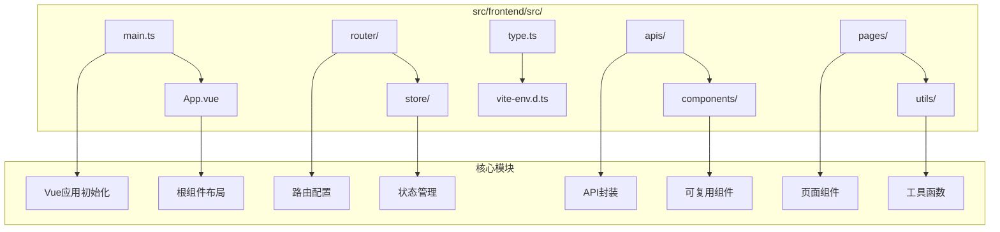
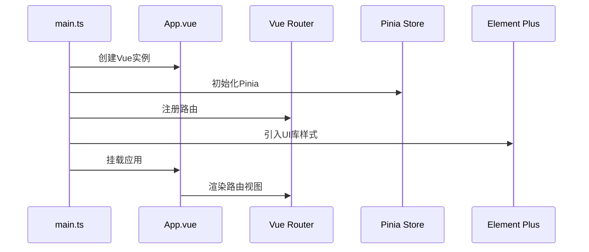
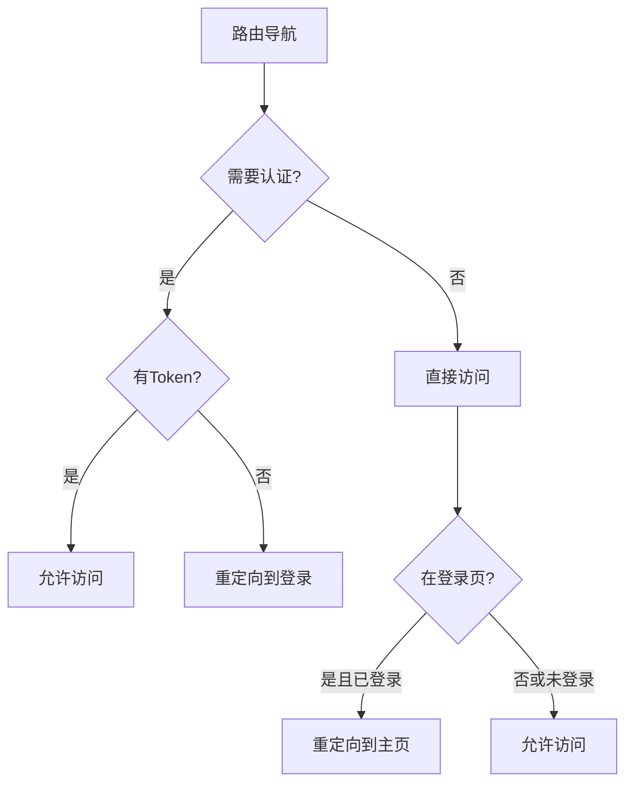
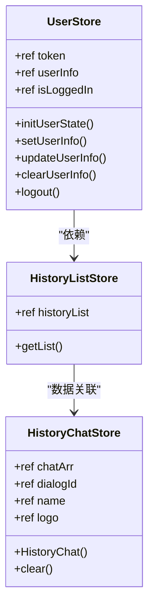
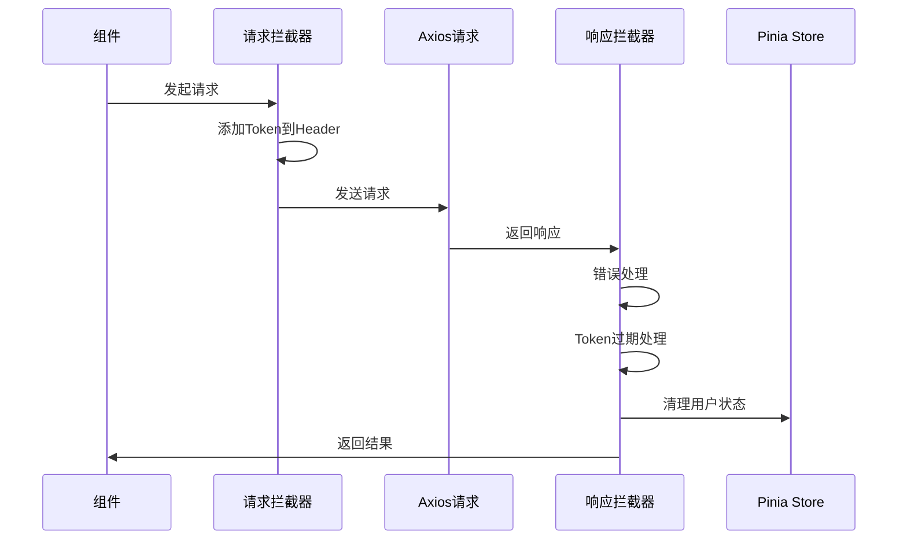
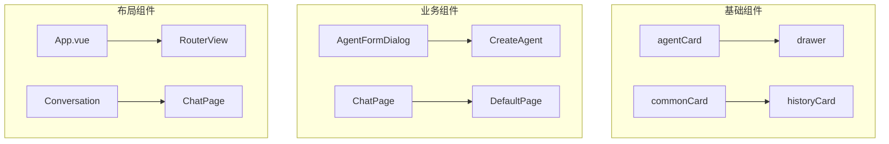
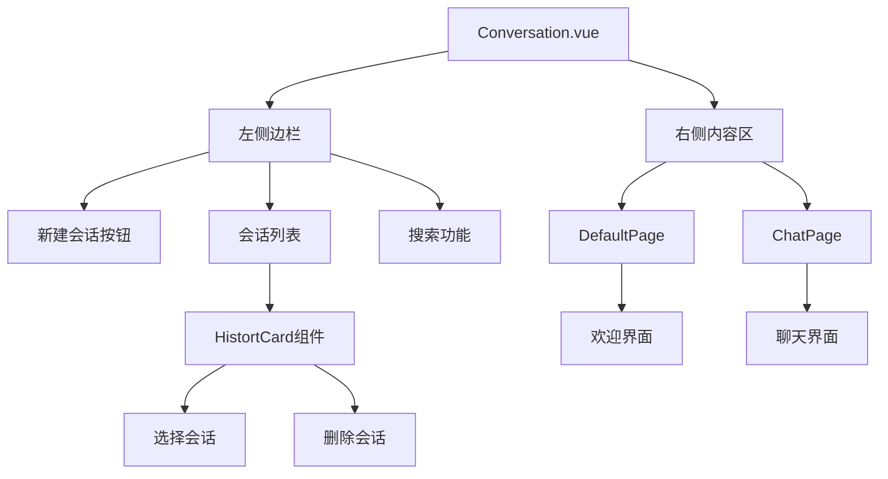
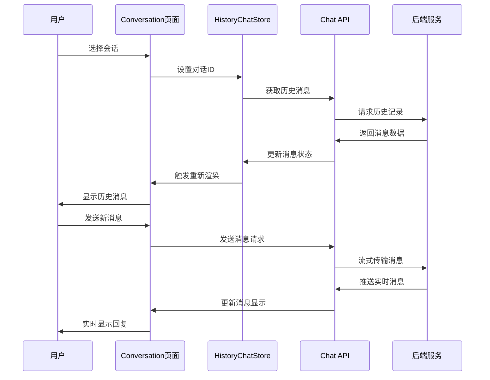
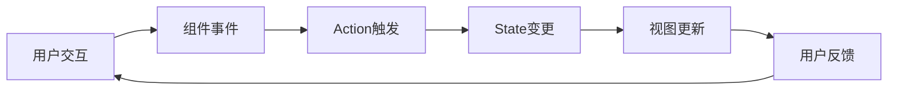

# AgentChat前端工程化结构与组件体系深度解析

## 目录
1. [项目概述](#项目概述)
2. [工程化架构](#工程化架构)
3. [核心应用初始化](#核心应用初始化)
4. [路由系统设计](#路由系统设计)
5. [状态管理系统](#状态管理系统)
6. [API封装层](#api封装层)
7. [组件体系架构](#组件体系架构)
8. [页面组件分析](#页面组件分析)
9. [数据流管理](#数据流管理)
10. [开发模式总结](#开发模式总结)

## 项目概述

AgentChat前端采用现代化Vue3技术栈构建，基于Vite开发工具，集成了TypeScript、Pinia状态管理、Element Plus UI组件库等核心技术。项目遵循模块化、组件化的设计理念，实现了完整的对话式AI交互界面。

### 技术栈概览

- **框架**: Vue 3.4.21 + Composition API
- **状态管理**: Pinia 2.1.7 + 持久化插件
- **路由管理**: Vue Router 4.3.0
- **HTTP客户端**: Axios + 自定义拦截器
- **UI组件库**: Element Plus 2.7.0
- **构建工具**: Vite 5.2.8
- **样式预处理器**: Sass/SCSS
- **类型系统**: TypeScript 5.4.3

## 工程化架构

### 目录结构设计



**图表来源**
- [main.ts](https://github.com/Shy2593666979/AgentChat/tree/main/src/frontend/src/main.ts#L1-L18)
- [App.vue](https://github.com/Shy2593666979/AgentChat/tree/main/src/frontend/src/App.vue#L1-L13)
- [router/index.ts](https://github.com/Shy2593666979/AgentChat/tree/main/src/frontend/src/router/index.ts#L1-L255)

### 构建配置优化

项目采用Vite作为构建工具，配置了自动导入、组件扫描等功能，显著提升开发效率：

- **自动导入**: 自动导入Vue API和第三方库函数
- **组件自动注册**: 组件无需手动注册即可使用
- **TypeScript支持**: 完整的类型检查和智能提示
- **热模块替换**: 开发环境下的快速热更新

**章节来源**
- [package.json](https://github.com/Shy2593666979/AgentChat/tree/main/src/frontend/package.json#L1-L41)

## 核心应用初始化

### Vue3应用启动流程

Vue应用的初始化过程体现了现代前端应用的最佳实践：



**图表来源**
- [main.ts](https://github.com/Shy2593666979/AgentChat/tree/main/src/frontend/src/main.ts#L11-L17)

### 应用配置详解

应用初始化包含以下关键步骤：

1. **Vue实例创建**: 使用`createApp`创建应用实例
2. **Pinia状态管理**: 配置Pinia并启用持久化插件
3. **路由注册**: 将Vue Router集成到应用中
4. **UI库引入**: 加载Element Plus样式
5. **应用挂载**: 将应用挂载到DOM元素

**章节来源**
- [main.ts](https://github.com/Shy2593666979/AgentChat/tree/main/src/frontend/src/main.ts#L1-L18)

## 路由系统设计

### 路由架构概览

AgentChat采用嵌套路由设计，支持复杂的页面层次结构：

```mermaid
graph TD
A[/] --> B[workspace]
B --> C[homepage]
B --> D[conversation]
B --> E[construct]
B --> F[configuration]
B --> G[agent]
B --> H[mcp-server]
B --> I[knowledge]
B --> J[tool]
B --> K[model]
B --> L[profile]
B --> M[mars]
B --> N[dashboard]
D --> O[defaultPage]
D --> P[chatPage]
G --> Q[agent-editor]
K --> R[model-editor]
S[workspace] --> T[workspacePage]
S --> U[taskGraphPage]
```

**图表来源**
- [router/index.ts](https://github.com/Shy2593666979/AgentChat/tree/main/src/frontend/src/router/index.ts#L30-L216)

### 路由守卫机制

系统实现了完善的路由权限控制：



**图表来源**
- [router/index.ts](https://github.com/Shy2593666979/AgentChat/tree/main/src/frontend/src/router/index.ts#L231-L252)

### 懒加载策略

为了优化首屏加载性能，系统采用动态导入实现路由组件的懒加载：

- **按需加载**: 路由组件仅在访问时才加载
- **代码分割**: 减少初始包体积
- **预加载**: 关键路径组件提前加载

**章节来源**
- [router/index.ts](https://github.com/Shy2593666979/AgentChat/tree/main/src/frontend/src/router/index.ts#L1-L255)

## 状态管理系统

### Pinia模块化设计

AgentChat采用Pinia作为状态管理解决方案，实现了模块化的状态管理架构：



**图表来源**
- [store/user/index.ts](https://github.com/Shy2593666979/AgentChat/tree/main/src/frontend/src/store/user/index.ts#L12-L83)
- [store/history_list/index.ts](https://github.com/Shy2593666979/AgentChat/tree/main/src/frontend/src/store/history_list/index.ts#L6-L44)
- [store/history_chat_msg/index.ts](https://github.com/Shy2593666979/AgentChat/tree/main/src/frontend/src/store/history_chat_msg/index.ts#L18-L186)

### 用户状态管理

用户状态管理涵盖了身份验证、用户信息存储等核心功能：

- **Token管理**: 自动处理JWT令牌的存储和验证
- **用户信息持久化**: 用户资料自动保存到localStorage
- **状态同步**: 实时同步用户登录状态
- **自动清理**: 登出时自动清理所有用户相关数据

**章节来源**
- [store/user/index.ts](https://github.com/Shy2593666979/AgentChat/tree/main/src/frontend/src/store/user/index.ts#L1-L83)

### 历史记录管理

历史记录状态管理实现了对话历史的完整生命周期管理：

- **列表获取**: 异步获取用户对话历史列表
- **数据格式化**: 时间戳格式化为友好显示
- **错误处理**: 完善的异常处理机制
- **持久化存储**: 历史记录自动持久化

**章节来源**
- [store/history_list/index.ts](https://github.com/Shy2593666979/AgentChat/tree/main/src/frontend/src/store/history_list/index.ts#L1-L44)

## API封装层

### 请求拦截器设计

系统实现了统一的HTTP请求拦截机制：



**图表来源**
- [utils/request.ts](https://github.com/Shy2593666979/AgentChat/tree/main/src/frontend/src/utils/request.ts#L12-L58)

### 类型安全机制

API层采用TypeScript实现完整的类型安全：

- **接口定义**: 严格的请求响应接口规范
- **泛型支持**: 泛型约束确保类型安全
- **错误处理**: 结构化的错误信息处理
- **异步支持**: Promise类型支持异步操作

**章节来源**
- [utils/request.ts](https://github.com/Shy2593666979/AgentChat/tree/main/src/frontend/src/utils/request.ts#L1-L61)

### 流式数据处理

聊天功能采用Server-Sent Events实现流式数据传输：

- **事件源连接**: 使用`@microsoft/fetch-event-source`库
- **实时消息**: 支持服务器推送的实时消息
- **连接管理**: 自动处理连接断开和重连
- **错误恢复**: 完善的错误处理和恢复机制

**章节来源**
- [apis/chat.ts](https://github.com/Shy2593666979/AgentChat/tree/main/src/frontend/src/apis/chat.ts#L16-L62)

## 组件体系架构

### 可复用组件设计

AgentChat构建了完整的可复用组件体系：



**图表来源**
- [components/agentCard/agentCard.vue](https://github.com/Shy2593666979/AgentChat/tree/main/src/frontend/src/components/agentCard/agentCard.vue#L1-L311)
- [components/drawer/drawer.vue](https://github.com/Shy2593666979/AgentChat/tree/main/src/frontend/src/components/drawer/drawer.vue#L1-L314)

### Props设计原则

组件Props设计遵循以下原则：

- **类型安全**: 完整的TypeScript类型定义
- **默认值**: 合理的默认值设置
- **验证规则**: 必要的Props验证
- **事件通信**: 标准化的事件发射机制

**章节来源**
- [components/agentCard/agentCard.vue](https://github.com/Shy2593666979/AgentChat/tree/main/src/frontend/src/components/agentCard/agentCard.vue#L8-L15)

### 样式隔离机制

组件采用Scoped CSS实现样式隔离：

- **作用域限制**: 样式仅作用于当前组件
- **主题定制**: 支持全局主题变量覆盖
- **响应式设计**: 移动端适配支持
- **动画效果**: 平滑的过渡动画

**章节来源**
- [components/agentCard/agentCard.vue](https://github.com/Shy2593666979/AgentChat/tree/main/src/frontend/src/components/agentCard/agentCard.vue#L99-L311)

## 页面组件分析

### 会话页面架构

会话页面是系统的核心功能页面，展示了完整的对话交互流程：



**图表来源**
- [pages/conversation/conversation.vue](https://github.com/Shy2593666979/AgentChat/tree/main/src/frontend/src/pages/conversation/conversation.vue#L1-L800)

### 数据绑定与状态管理

页面组件通过Pinia实现数据状态管理：

- **响应式数据**: 使用`ref`和`computed`创建响应式数据
- **状态同步**: 组件状态与Pinia状态自动同步
- **事件处理**: 标准化的事件处理机制
- **生命周期**: 合理的组件生命周期管理

**章节来源**
- [pages/conversation/conversation.vue](https://github.com/Shy2593666979/AgentChat/tree/main/src/frontend/src/pages/conversation/conversation.vue#L1-L800)

### 聊天界面实现

聊天界面展示了复杂的数据流处理：



**图表来源**
- [pages/conversation/conversation.vue](https://github.com/Shy2593666979/AgentChat/tree/main/src/frontend/src/pages/conversation/conversation.vue#L108-L159)
- [store/history_chat_msg/index.ts](https://github.com/Shy2593666979/AgentChat/tree/main/src/frontend/src/store/history_chat_msg/index.ts#L30-L160)

## 数据流管理

### 单向数据流原则

系统严格遵循单向数据流原则：



### 状态更新机制

状态更新采用响应式机制：

- **自动追踪**: Pinia自动追踪状态变化
- **批量更新**: 批量处理状态变更以提高性能
- **持久化**: 自动持久化重要状态数据
- **调试支持**: 提供完整的状态调试工具

**章节来源**
- [store/history_chat_msg/index.ts](https://github.com/Shy2593666979/AgentChat/tree/main/src/frontend/src/store/history_chat_msg/index.ts#L18-L186)

### 错误处理策略

系统实现了多层次的错误处理机制：

- **API层错误**: 统一的API错误处理
- **组件级错误**: 组件内部的错误边界
- **用户提示**: 友好的错误信息展示
- **日志记录**: 完善的错误日志记录

**章节来源**
- [utils/request.ts](https://github.com/Shy2593666979/AgentChat/tree/main/src/frontend/src/utils/request.ts#L46-L58)

## 开发模式总结

### 组件开发最佳实践

AgentChat前端项目展现了现代Vue3应用开发的最佳实践：

1. **模块化设计**: 清晰的模块划分和职责分离
2. **类型安全**: 完整的TypeScript类型系统
3. **状态管理**: 合理的状态管理架构
4. **组件复用**: 高度可复用的组件设计
5. **性能优化**: 懒加载和代码分割策略

### 架构优势

- **可维护性**: 清晰的代码结构和命名规范
- **可扩展性**: 模块化设计便于功能扩展
- **可测试性**: 良好的单元测试支持
- **开发体验**: 优秀的开发工具链支持

### 技术创新点

- **流式通信**: Server-Sent Events实现实时聊天
- **智能缓存**: 基于Pinia的智能状态缓存
- **响应式设计**: 完整的移动端适配方案
- **类型推导**: 强大的TypeScript类型推导能力

通过深入分析AgentChat前端项目的工程化结构与组件体系，我们可以看到一个成熟、可维护、高性能的现代前端应用的完整实现。该项目不仅展示了Vue3技术栈的强大功能，更为前端开发提供了宝贵的实践经验。
