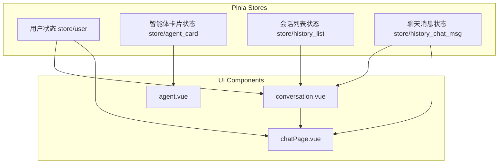
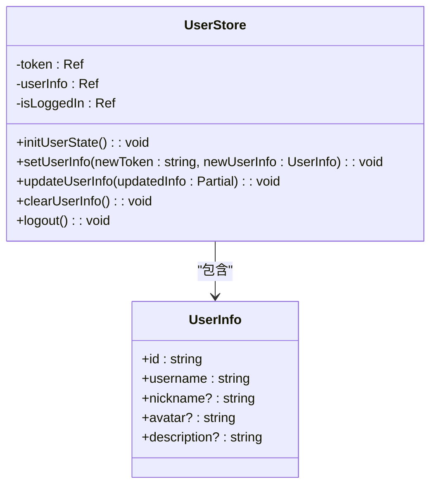
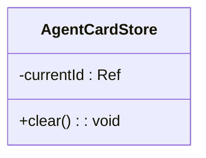
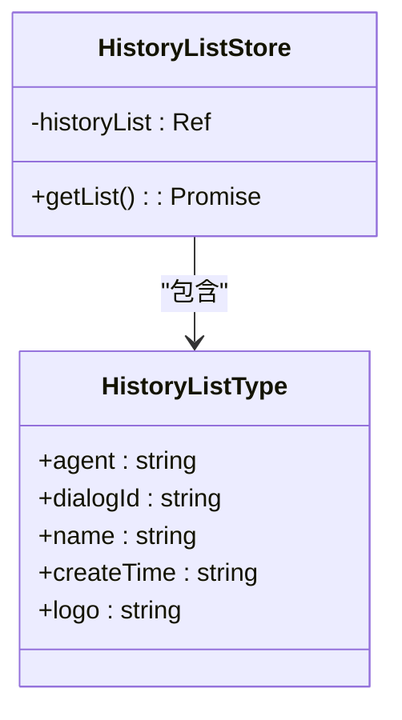
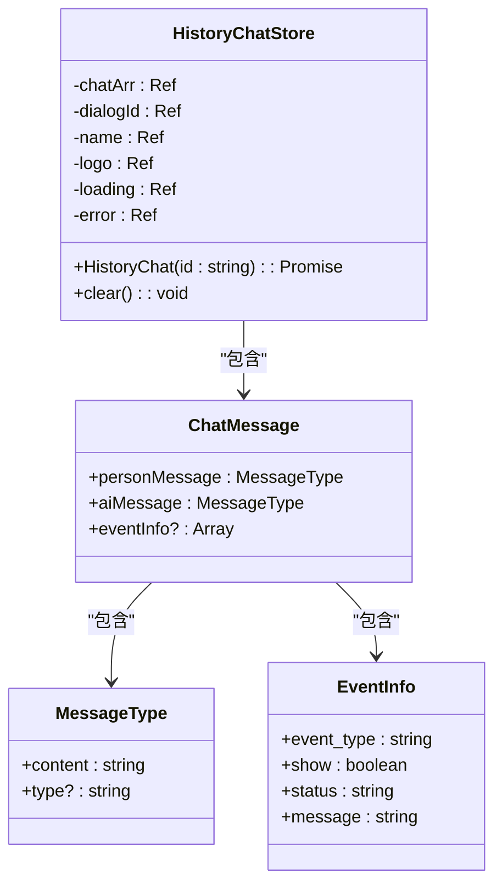
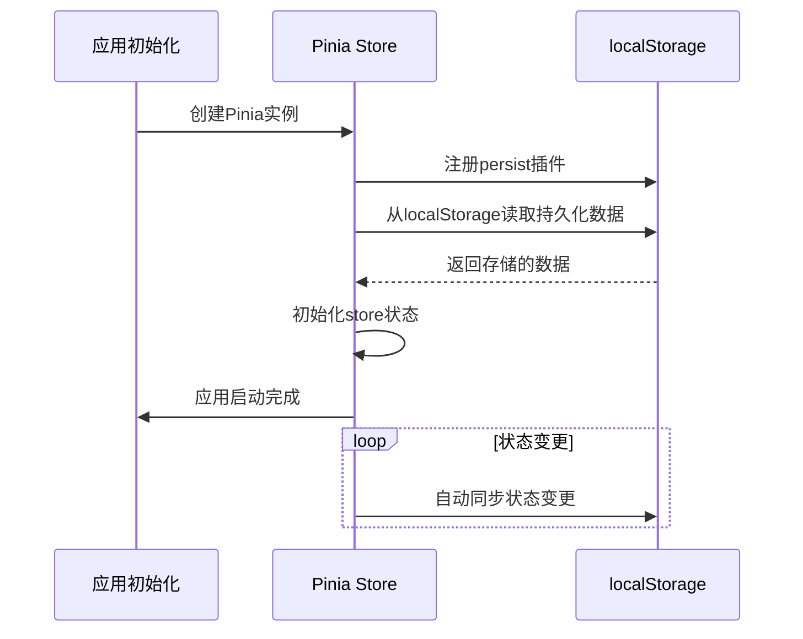
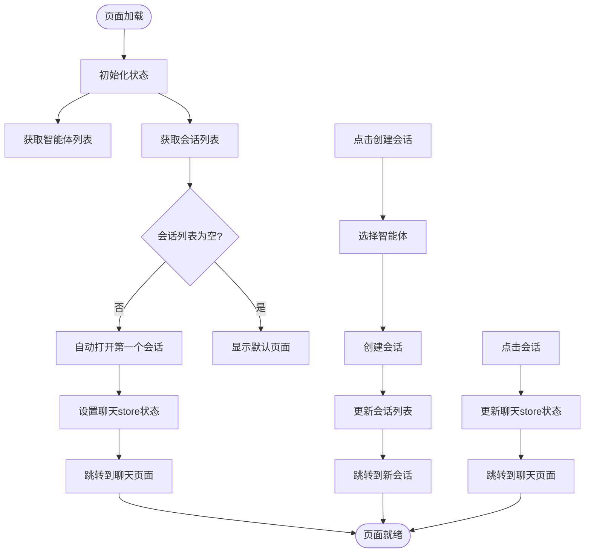
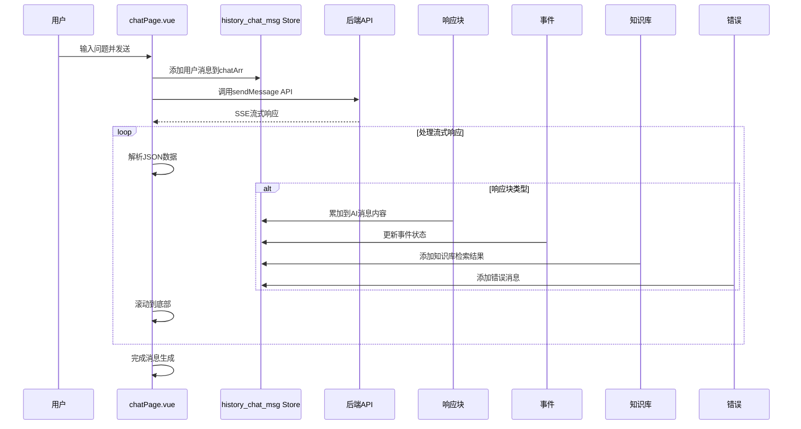
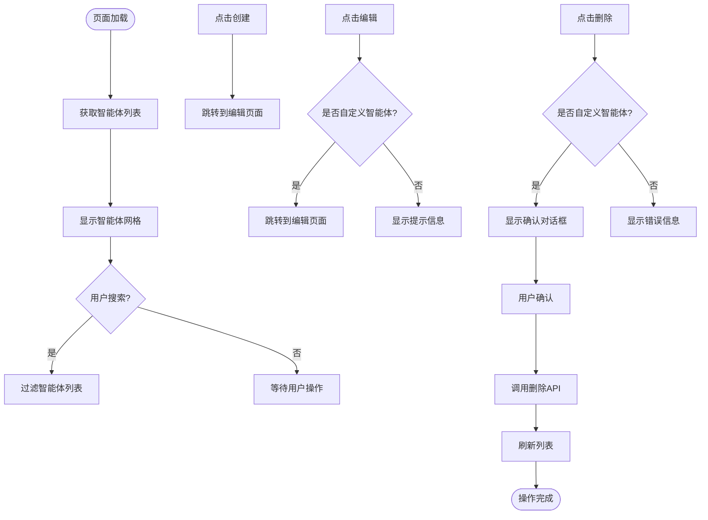

# 状态管理

## 目录
1. [引言](#引言)
2. [状态管理架构概览](#状态管理架构概览)
3. [核心Store模块分析](#核心store模块分析)
4. [状态持久化策略](#状态持久化策略)
5. [组件中的状态使用示例](#组件中的状态使用示例)
6. [状态变更调试技巧](#状态变更调试技巧)
7. [性能优化建议](#性能优化建议)
8. [总结](#总结)

## 引言
AgentChat应用采用Pinia作为其状态管理解决方案，实现了高效、可维护的全局状态管理。本文档深入剖析了基于Pinia的状态管理架构，详细说明了store目录下各模块的模块化设计原则与状态划分逻辑，解释了state、getters、actions的实现方式及其在组件间的共享机制，并结合实际用例展示了如何在页面中使用store进行数据读取与更新。

## 状态管理架构概览



**图示来源**
- [user/index.ts](https://github.com/Shy2593666979/AgentChat/src/frontend/src/store/user/index.ts)
- [agent_card/index.ts](https://github.com/Shy2593666979/AgentChat/src/frontend/src/store/agent_card/index.ts)
- [history_list/index.ts](https://github.com/Shy2593666979/AgentChat/src/frontend/src/store/history_list/index.ts)
- [history_chat_msg/index.ts](https://github.com/Shy2593666979/AgentChat/src/frontend/src/store/history_chat_msg/index.ts)
- [conversation.vue](https://github.com/Shy2593666979/AgentChat/src/frontend/src/pages/conversation/conversation.vue)
- [chatPage.vue](https://github.com/Shy2593666979/AgentChat/src/frontend/src/pages/conversation/chatPage/chatPage.vue)
- [agent.vue](https://github.com/Shy2593666979/AgentChat/src/frontend/src/pages/agent/agent.vue)

## 核心Store模块分析

### 用户状态模块 (user)
用户状态模块负责管理用户认证和用户信息相关的全局状态。



**图示来源**
- [user/index.ts](https://github.com/Shy2593666979/AgentChat/src/frontend/src/store/user/index.ts)
- [type.ts](https://github.com/Shy2593666979/AgentChat/src/frontend/src/type.ts)

**模块分析**
用户状态模块定义了`UserInfo`接口来描述用户信息的结构，并通过`useUserStore`创建了一个Pinia store实例。该store包含以下核心状态：
- `token`: 存储用户认证令牌
- `userInfo`: 存储用户详细信息
- `isLoggedIn`: 标记用户登录状态

模块提供了完整的状态管理方法，包括初始化、设置、更新和清除用户信息。特别的是，`setUserInfo`和`updateUserInfo`方法在更新内存状态的同时，也会将数据持久化到localStorage中。

**模块来源**
- [user/index.ts](https://github.com/Shy2593666979/AgentChat/src/frontend/src/store/user/index.ts#L1-L83)

### 智能体卡片状态模块 (agent_card)
智能体卡片状态模块用于管理当前选中的智能体卡片状态。



**图示来源**
- [agent_card/index.ts](https://github.com/Shy2593666979/AgentChat/src/frontend/src/store/agent_card/index.ts)

**模块分析**
该模块设计简洁，主要维护一个`currentId`状态来跟踪当前选中的智能体卡片ID。提供了`clear`方法用于重置状态。这个轻量级的store体现了Pinia模块化设计的优势，每个store只关注特定的业务领域。

**模块来源**
- [agent_card/index.ts](https://github.com/Shy2593666979/AgentChat/src/frontend/src/store/agent_card/index.ts#L1-L15)

### 会话列表状态模块 (history_list)
会话列表状态模块负责管理用户的历史会话列表。



**图示来源**
- [history_list/index.ts](https://github.com/Shy2593666979/AgentChat/src/frontend/src/store/history_list/index.ts)
- [type.ts](https://github.com/Shy2593666979/AgentChat/src/frontend/src/type.ts)

**模块分析**
该模块维护一个`historyList`状态数组，存储用户的所有历史会话。通过`getList`异步方法从后端API获取会话列表数据，并在获取后对时间进行格式化处理。模块依赖于`getDialogListAPI`来与后端通信，体现了清晰的职责分离。

**模块来源**
- [history_list/index.ts](https://github.com/Shy2593666979/AgentChat/src/frontend/src/store/history_list/index.ts#L1-L44)
- [history.ts](https://github.com/Shy2593666979/AgentChat/src/frontend/src/apis/history.ts#L29-L35)

### 聊天消息状态模块 (history_chat_msg)
聊天消息状态模块是应用中最复杂的store，负责管理聊天会话的完整状态。



**图示来源**
- [history_chat_msg/index.ts](https://github.com/Shy2593666979/AgentChat/src/frontend/src/store/history_chat_msg/index.ts)
- [type.ts](https://github.com/Shy2593666979/AgentChat/src/frontend/src/type.ts)

**模块分析**
该模块维护了聊天会话的完整状态，包括：
- `chatArr`: 聊天消息数组
- `dialogId`: 当前会话ID
- `name`: 会话名称
- `logo`: 会话图标
- `loading`: 加载状态
- `error`: 错误信息

`HistoryChat`方法是核心功能，负责从后端获取历史消息并进行复杂的格式化处理。它将原始消息数据转换为适合UI展示的结构，包括处理用户消息、AI消息以及事件信息。事件处理逻辑特别复杂，需要对重复事件进行去重，并过滤掉心跳类型的事件。

**模块来源**
- [history_chat_msg/index.ts](https://github.com/Shy2593666979/AgentChat/src/frontend/src/store/history_chat_msg/index.ts#L1-L186)
- [type.ts](https://github.com/Shy2593666979/AgentChat/src/frontend/src/type.ts#L59-L68)

## 状态持久化策略
AgentChat应用实现了完善的状态持久化策略，确保用户刷新页面后仍能保持应用状态。



**图示来源**
- [main.ts](https://github.com/Shy2593666979/AgentChat/src/frontend/src/main.ts)
- [user/index.ts](https://github.com/Shy2593666979/AgentChat/src/frontend/src/store/user/index.ts)

**策略分析**
状态持久化通过以下方式实现：
1. 在`main.ts`中，创建Pinia实例后立即注册`pinia-plugin-persistedstate`插件
2. 在各个store模块中，通过配置`persist: true`启用持久化
3. 对于需要特殊处理的store（如user），在actions中手动调用localStorage API进行数据存储

这种混合策略既利用了插件的自动化优势，又保留了手动控制的灵活性。例如，用户状态模块在`setUserInfo`方法中显式地将token和用户信息存储到localStorage中，确保敏感数据的安全处理。

**策略来源**
- [main.ts](https://github.com/Shy2593666979/AgentChat/src/frontend/src/main.ts#L5-L13)
- [user/index.ts](https://github.com/Shy2593666979/AgentChat/src/frontend/src/store/user/index.ts#L82-L83)

## 组件中的状态使用示例

### 会话页面 (conversation.vue)
会话页面是状态管理的典型使用场景，展示了如何在组件中集成多个store。



**图示来源**
- [conversation.vue](https://github.com/Shy2593666979/AgentChat/src/frontend/src/pages/conversation/conversation.vue)

**使用分析**
会话页面通过以下方式使用store：
1. 导入`useHistoryChatStore`并创建实例
2. 在`onMounted`生命周期中初始化数据
3. 在用户交互时更新store状态并触发页面导航
4. 通过计算属性实现数据过滤和搜索功能

特别值得注意的是，该组件在获取会话列表后，如果列表不为空且当前路由是默认页面，会立即自动打开第一个会话，这体现了状态驱动的UI设计理念。

**使用来源**
- [conversation.vue](https://github.com/Shy2593666979/AgentChat/src/frontend/src/pages/conversation/conversation.vue#L10-L13)

### 聊天页面 (chatPage.vue)
聊天页面展示了实时聊天状态的管理。



**图示来源**
- [chatPage.vue](https://github.com/Shy2593666979/AgentChat/src/frontend/src/pages/conversation/chatPage/chatPage.vue)
- [history_chat_msg/index.ts](https://github.com/Shy2593666979/AgentChat/src/frontend/src/store/history_chat_msg/index.ts)

**使用分析**
聊天页面的实现展示了复杂的状态管理：
1. 使用`useHistoryChatStore`和`useUserStore`两个store
2. 通过`personQuestion`方法处理用户输入
3. 利用SSE（Server-Sent Events）实现流式响应处理
4. 在接收到每个数据块时更新store状态
5. 通过`watch`监听store变化并自动滚动到底部

该组件还实现了取消生成、文件上传等高级功能，所有状态变更都通过store进行管理，确保了状态的一致性。

**使用来源**
- [chatPage.vue](https://github.com/Shy2593666979/AgentChat/src/frontend/src/pages/conversation/chatPage/chatPage.vue#L7-L8)
- [history_chat_msg/index.ts](https://github.com/Shy2593666979/AgentChat/src/frontend/src/store/history_chat_msg/index.ts#L19-L25)

### 智能体管理页面 (agent.vue)
智能体管理页面展示了如何使用store进行数据管理和用户交互。



**图示来源**
- [agent.vue](https://github.com/Shy2593666979/AgentChat/src/frontend/src/pages/agent/agent.vue)

**使用分析**
智能体管理页面虽然没有直接使用store来管理智能体数据（而是使用本地ref），但它展示了良好的状态管理实践：
1. 通过`fetchAgents`方法从API获取数据
2. 使用`convertToAgent`函数确保数据类型一致性
3. 实现了搜索、刷新、创建、编辑、删除等完整的CRUD操作
4. 通过`is_custom`字段区分官方智能体和自定义智能体，实施不同的操作权限

**使用来源**
- [agent.vue](https://github.com/Shy2593666979/AgentChat/src/frontend/src/pages/agent/agent.vue#L17-L24)

## 状态变更调试技巧
为了有效调试AgentChat应用中的状态变更，建议采用以下技巧：

### 1. 使用浏览器开发者工具
- 在Vue Devtools中查看Pinia store的实时状态
- 监控store的actions调用和状态变更
- 查看持久化数据在localStorage中的存储情况

### 2. 添加详细的日志记录
在关键的store方法中添加console.log语句，例如：
```typescript
// 在HistoryChat方法中添加日志
console.log('【HistoryChat】开始获取历史消息，dialog_id:', id)
console.log('【HistoryChat】历史消息API返回:', response.data)
console.log('【HistoryChat】处理后的消息数组:', chatArr.value)
```

### 3. 利用Pinia的调试功能
Pinia提供了丰富的调试API，可以在开发环境中启用：
```typescript
// 在store中添加调试钩子
const store = defineStore('myStore', {
  // ...
}, {
  debug: true // 启用调试模式
})
```

### 4. 监控状态变化
使用watch来监控关键状态的变化：
```typescript
// 在组件中监控chatArr变化
watch(
  () => historyChatStore.chatArr,
  (newVal) => {
    console.log('【消息更新】历史消息数组更新:', JSON.stringify(newVal))
  },
  { deep: true }
)
```

**调试来源**
- [history_chat_msg/index.ts](https://github.com/Shy2593666979/AgentChat/src/frontend/src/store/history_chat_msg/index.ts#L31-L32)
- [chatPage.vue](https://github.com/Shy2593666979/AgentChat/src/frontend/src/pages/conversation/chatPage/chatPage.vue#L366-L368)

## 性能优化建议
基于对AgentChat状态管理架构的分析，提出以下性能优化建议：

### 1. 状态分割优化
当前的store设计已经很好地实现了模块化，但可以进一步优化：
- 将`history_chat_msg` store拆分为更小的模块，如`chat_messages`、`chat_session`等
- 避免在单个store中维护过多的状态，遵循单一职责原则

### 2. 计算属性优化
充分利用计算属性的缓存特性：
```typescript
// 使用计算属性替代方法
const filteredDialogs = computed(() => {
  if (!searchKeyword.value) return dialogs.value
  return dialogs.value.filter(dialog => 
    dialog.name.toLowerCase().includes(searchKeyword.value.toLowerCase())
  )
})
```

### 3. 持久化策略优化
- 对于大型状态（如聊天消息），考虑使用IndexedDB替代localStorage
- 实现状态的增量持久化，避免频繁写入大量数据
- 添加持久化数据的版本控制，便于未来数据结构变更

### 4. 内存管理优化
- 在页面切换时及时清理不再需要的状态
- 对于长列表数据，实现虚拟滚动以减少内存占用
- 定期清理过期的会话数据

### 5. 网络请求优化
- 实现API响应的缓存机制
- 使用防抖技术优化搜索功能
- 批量处理状态更新，减少不必要的重新渲染

**优化来源**
- [conversation.vue](https://github.com/Shy2593666979/AgentChat/src/frontend/src/pages/conversation/conversation.vue#L27-L33)
- [history_list/index.ts](https://github.com/Shy2593666979/AgentChat/src/frontend/src/store/history_list/index.ts#L9-L36)

## 总结
AgentChat应用的Pinia状态管理架构设计合理，体现了现代前端应用状态管理的最佳实践。通过模块化的store设计，将不同的业务状态分离到独立的模块中，提高了代码的可维护性和可测试性。状态持久化策略确保了用户体验的连续性，而组件与store的清晰分离则实现了关注点的分离。

建议在未来开发中继续遵循当前的设计原则，同时考虑实施上述性能优化建议，以应对应用规模的增长和用户需求的复杂化。通过持续优化状态管理架构，可以确保AgentChat应用保持高性能和良好的可维护性。

**文档来源**
- [user/index.ts](https://github.com/Shy2593666979/AgentChat/src/frontend/src/store/user/index.ts)
- [agent_card/index.ts](https://github.com/Shy2593666979/AgentChat/src/frontend/src/store/agent_card/index.ts)
- [history_list/index.ts](https://github.com/Shy2593666979/AgentChat/src/frontend/src/store/history_list/index.ts)
- [history_chat_msg/index.ts](https://github.com/Shy2593666979/AgentChat/src/frontend/src/store/history_chat_msg/index.ts)
- [main.ts](https://github.com/Shy2593666979/AgentChat/src/frontend/src/main.ts)
- [type.ts](https://github.com/Shy2593666979/AgentChat/src/frontend/src/type.ts)
- [history.ts](https://github.com/Shy2593666979/AgentChat/src/frontend/src/apis/history.ts)
- [conversation.vue](https://github.com/Shy2593666979/AgentChat/src/frontend/src/pages/conversation/conversation.vue)
- [chatPage.vue](https://github.com/Shy2593666979/AgentChat/src/frontend/src/pages/conversation/chatPage/chatPage.vue)
- [agent.vue](https://github.com/Shy2593666979/AgentChat/src/frontend/src/pages/agent/agent.vue)
