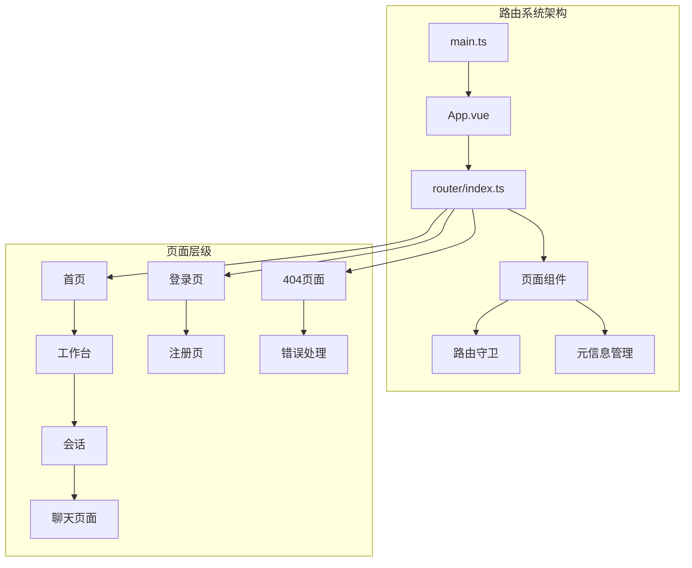
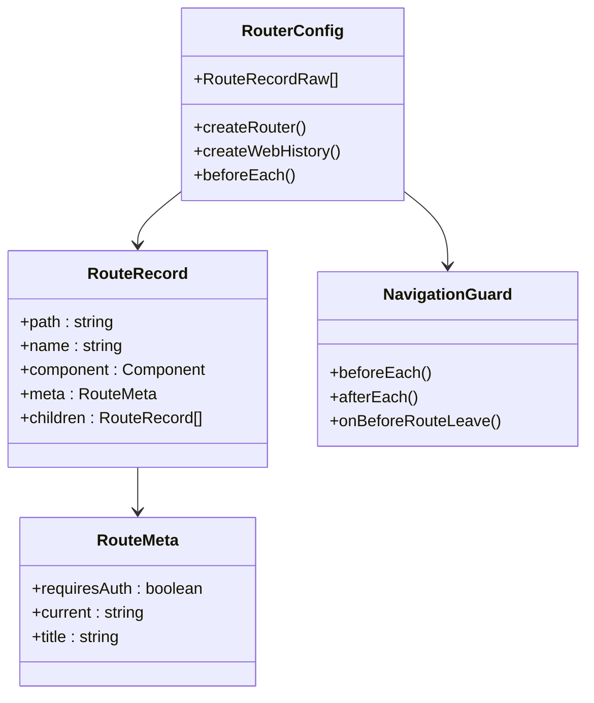
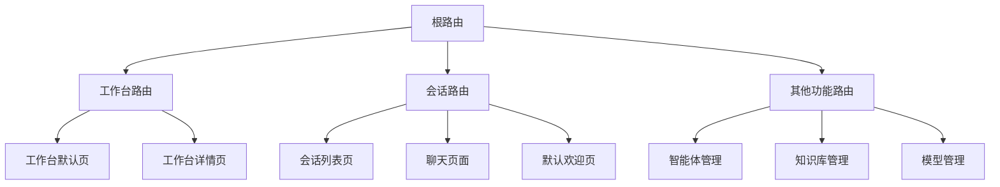
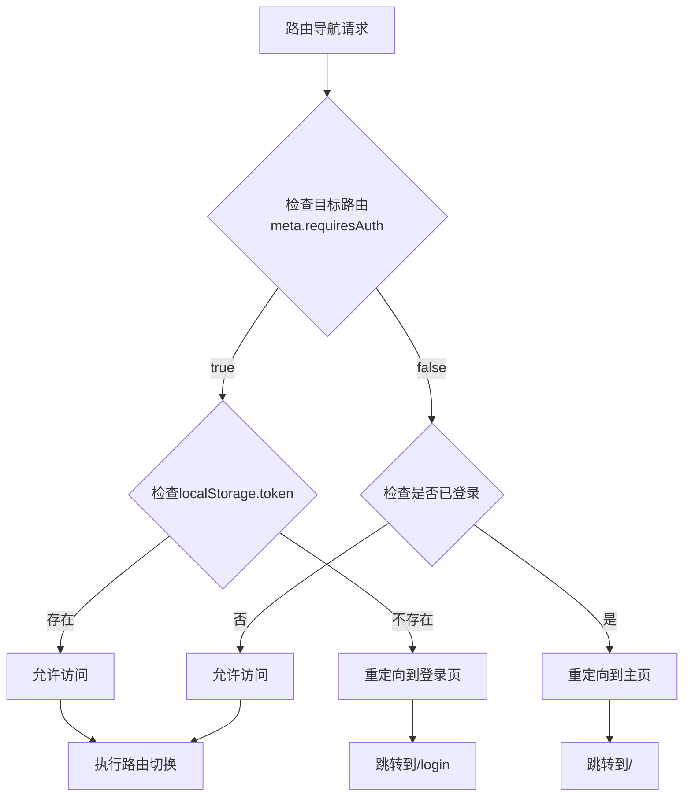
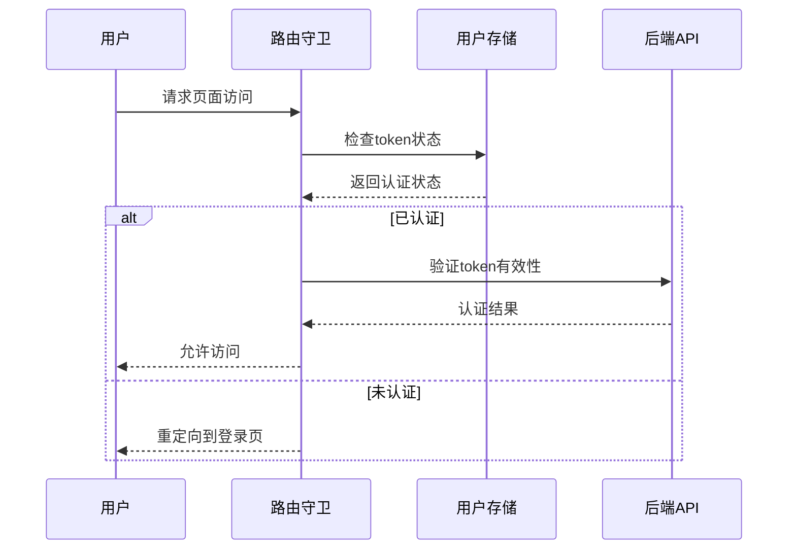
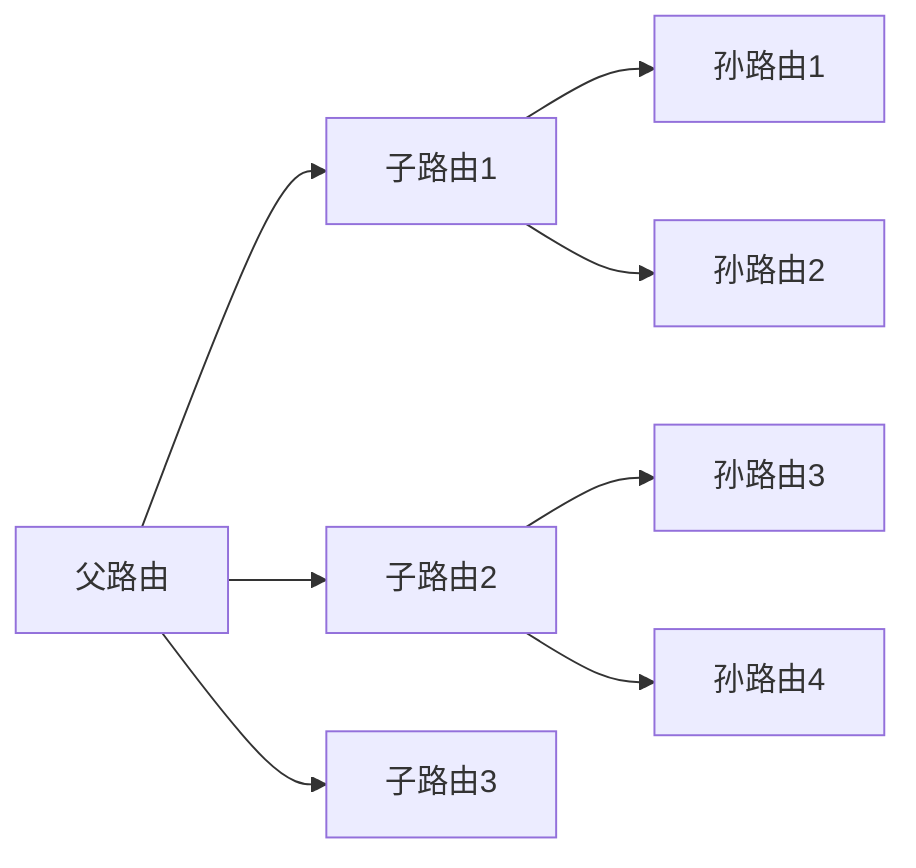
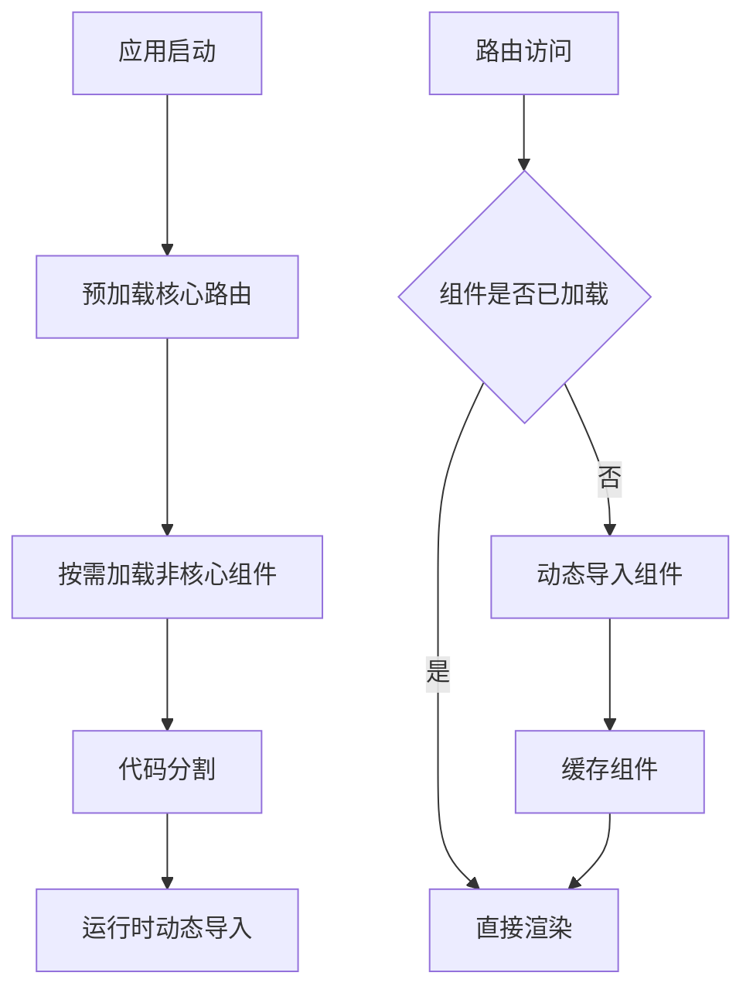
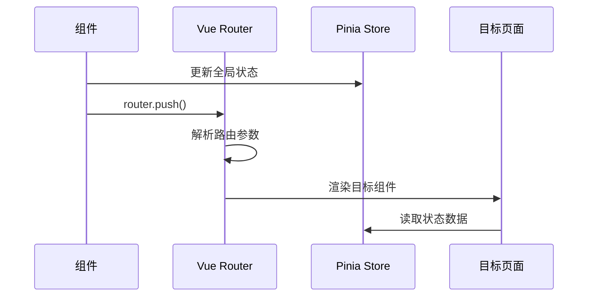
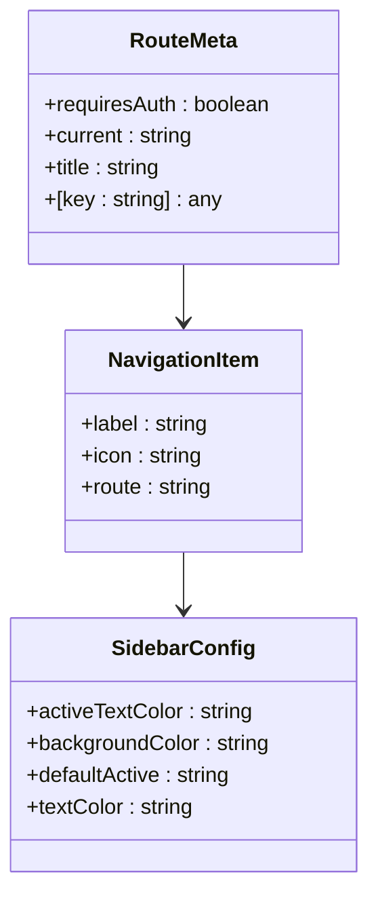
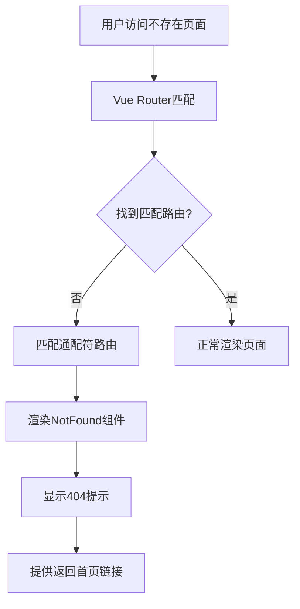

# 路由与导航

<cite>
**本文档引用的文件**
- [router/index.ts](https://github.com/Shy2593666979/AgentChat/src/frontend/src/router/index.ts)
- [main.ts](https://github.com/Shy2593666979/AgentChat/src/frontend/src/main.ts)
- [App.vue](https://github.com/Shy2593666979/AgentChat/src/frontend/src/App.vue)
- [index.vue](https://github.com/Shy2593666979/AgentChat/src/frontend/src/pages/index.vue)
- [conversation.vue](https://github.com/Shy2593666979/AgentChat/src/frontend/src/pages/conversation/conversation.vue)
- [login.vue](https://github.com/Shy2593666979/AgentChat/src/frontend/src/pages/login/login.vue)
- [notFound.vue](https://github.com/Shy2593666979/AgentChat/src/frontend/src/pages/notFound/notFound.vue)
- [user/index.ts](https://github.com/Shy2593666979/AgentChat/src/frontend/src/store/user/index.ts)
- [auth.ts](https://github.com/Shy2593666979/AgentChat/src/frontend/src/apis/auth.ts)
</cite>

## 目录
1. [概述](#概述)
2. [项目结构分析](#项目结构分析)
3. [路由系统架构](#路由系统架构)
4. [核心路由配置](#核心路由配置)
5. [路由守卫与权限控制](#路由守卫与权限控制)
6. [嵌套路由与动态路由](#嵌套路由与动态路由)
7. [路由懒加载策略](#路由懒加载策略)
8. [路由跳转与参数传递](#路由跳转与参数传递)
9. [路由元信息管理](#路由元信息管理)
10. [异常处理与404页面](#异常处理与404页面)
11. [开发者指南](#开发者指南)
12. [总结](#总结)

## 概述

AgentChat前端采用基于Vue Router 4的现代化路由系统，提供了完整的SPA（单页面应用）导航解决方案。该系统支持嵌套路由、动态路由、权限控制、懒加载等高级特性，为用户提供流畅的单页应用体验。

### 主要特性

- **基于Vue Router 4**：利用最新的路由管理功能
- **嵌套路由支持**：复杂的页面层次结构
- **权限控制**：基于路由元信息的访问控制
- **懒加载优化**：提升应用启动性能
- **动态路由**：运行时路由配置能力
- **404处理**：优雅的页面不存在处理

## 项目结构分析

AgentChat前端的路由系统组织结构清晰，遵循模块化设计理念：



**图表来源**
- [main.ts](https://github.com/Shy2593666979/AgentChat/src/frontend/src/main.ts#L1-L18)
- [App.vue](https://github.com/Shy2593666979/AgentChat/src/frontend/src/App.vue#L1-L13)
- [router/index.ts](https://github.com/Shy2593666979/AgentChat/src/frontend/src/router/index.ts#L1-L255)

**章节来源**
- [main.ts](https://github.com/Shy2593666979/AgentChat/src/frontend/src/main.ts#L1-L18)
- [App.vue](https://github.com/Shy2593666979/AgentChat/src/frontend/src/App.vue#L1-L13)

## 路由系统架构

### Vue Router 4集成

路由系统通过Vue Router 4实现，提供了声明式的路由配置和强大的导航功能：



**图表来源**
- [router/index.ts](https://github.com/Shy2593666979/AgentChat/src/frontend/src/router/index.ts#L225-L255)

### 应用入口配置

应用通过main.ts文件初始化路由系统，建立了完整的Vue应用生命周期：

**章节来源**
- [main.ts](https://github.com/Shy2593666979/AgentChat/src/frontend/src/main.ts#L1-L18)

## 核心路由配置

### 基础路由结构

路由配置采用扁平化的结构，同时支持嵌套路由：

| 路由路径 | 组件名称 | 权限要求 | 描述 |
|---------|---------|---------|------|
| `/login` | Login | 无需认证 | 用户登录页面 |
| `/register` | Register | 无需认证 | 用户注册页面 |
| `/` | Index | 需要认证 | 首页重定向 |
| `/workspace` | Workspace | 需要认证 | 工作台主页面 |
| `/conversation` | Conversation | 需要认证 | 会话管理页面 |
| `/agent` | Agent | 需要认证 | 智能体管理页面 |
| `/knowledge` | Knowledge | 需要认证 | 知识库管理页面 |
| `/:catchAll(.*)` | NotFound | 无需认证 | 404错误页面 |

### 嵌套路由配置

系统支持深度嵌套路由，特别是会话管理部分：



**图表来源**
- [router/index.ts](https://github.com/Shy2593666979/AgentChat/src/frontend/src/router/index.ts#L47-L223)

**章节来源**
- [router/index.ts](https://github.com/Shy2593666979/AgentChat/src/frontend/src/router/index.ts#L30-L223)

## 路由守卫与权限控制

### 权限验证机制

路由守卫实现了基于token的权限验证系统：



**图表来源**
- [router/index.ts](https://github.com/Shy2593666979/AgentChat/src/frontend/src/router/index.ts#L231-L251)

### 用户状态管理

权限系统与用户状态管理紧密集成：



**图表来源**
- [router/index.ts](https://github.com/Shy2593666979/AgentChat/src/frontend/src/router/index.ts#L231-L251)
- [user/index.ts](https://github.com/Shy2593666979/AgentChat/src/frontend/src/store/user/index.ts#L18-L45)

**章节来源**
- [router/index.ts](https://github.com/Shy2593666979/AgentChat/src/frontend/src/router/index.ts#L231-L251)
- [user/index.ts](https://github.com/Shy2593666979/AgentChat/src/frontend/src/store/user/index.ts#L1-L83)

## 嵌套路由与动态路由

### 嵌套路由实现

系统通过children属性实现嵌套路由，支持复杂的页面层次结构：



**图表来源**
- [router/index.ts](https://github.com/Shy2593666979/AgentChat/src/frontend/src/router/index.ts#L54-L65)
- [router/index.ts](https://github.com/Shy2593666979/AgentChat/src/frontend/src/router/index.ts#L99-L110)

### 动态路由配置

路由配置支持动态参数传递，如知识库文件路由：

**章节来源**
- [router/index.ts](https://github.com/Shy2593666979/AgentChat/src/frontend/src/router/index.ts#L161-L167)

## 路由懒加载策略

### 性能优化策略

虽然当前实现主要依赖于静态导入，但系统架构支持懒加载优化：



**图表来源**
- [router/index.ts](https://github.com/Shy2593666979/AgentChat/src/frontend/src/router/index.ts#L3-L25)

### 懒加载实现建议

对于大型应用，可以考虑以下懒加载实现：

1. **动态导入语法**：使用`import()`函数
2. **路由级别分割**：按功能模块分割路由
3. **预加载策略**：智能预加载常用组件
4. **缓存机制**：避免重复加载相同组件

**章节来源**
- [router/index.ts](https://github.com/Shy2593666979/AgentChat/src/frontend/src/router/index.ts#L3-L25)

## 路由跳转与参数传递

### 编程式导航

系统广泛使用编程式导航进行页面跳转：



**图表来源**
- [conversation.vue](https://github.com/Shy2593666979/AgentChat/src/frontend/src/pages/conversation/conversation.vue#L143-L148)
- [index.vue](https://github.com/Shy2593666979/AgentChat/src/frontend/src/pages/index.vue#L107-L119)

### 参数传递模式

系统支持多种参数传递方式：

| 参数类型 | 传递方式 | 使用场景 | 示例 |
|---------|---------|---------|------|
| 路径参数 | `/path/:id` | 必需参数 | `/knowledge/:knowledgeId/files` |
| 查询参数 | `?key=value` | 可选参数 | `?dialog_id=123` |
| 路由状态 | `state` | 临时状态 | 导航时携带状态 |
| 全局状态 | Pinia Store | 复杂状态 | 对话历史、用户信息 |

### 路由跳转示例

**章节来源**
- [conversation.vue](https://github.com/Shy2593666979/AgentChat/src/frontend/src/pages/conversation/conversation.vue#L143-L148)
- [index.vue](https://github.com/Shy2593666979/AgentChat/src/frontend/src/pages/index.vue#L107-L119)

## 路由元信息管理

### 元信息结构设计

路由元信息提供了丰富的配置选项：



**图表来源**
- [router/index.ts](https://github.com/Shy2593666979/AgentChat/src/frontend/src/router/index.ts#L35-L37)
- [index.vue](https://github.com/Shy2593666979/AgentChat/src/frontend/src/pages/index.vue#L45-L61)

### 权限控制元信息

| 元信息键 | 类型 | 描述 | 示例值 |
|---------|------|------|--------|
| `requiresAuth` | boolean | 是否需要认证 | `true`/`false` |
| `current` | string | 当前激活的导航项 | `'conversation'` |

### 页面标题管理

元信息还用于页面标题的动态管理，支持SEO优化和用户体验提升。

**章节来源**
- [router/index.ts](https://github.com/Shy2593666979/AgentChat/src/frontend/src/router/index.ts#L35-L37)
- [index.vue](https://github.com/Shy2593666979/AgentChat/src/frontend/src/pages/index.vue#L62-L62)

## 异常处理与404页面

### 404页面实现

系统提供了专门的404页面处理机制：



**图表来源**
- [router/index.ts](https://github.com/Shy2593666979/AgentChat/src/frontend/src/router/index.ts#L219-L222)
- [notFound.vue](https://github.com/Shy2593666979/AgentChat/src/frontend/src/pages/notFound/notFound.vue#L1-L28)

### 错误处理策略

系统采用多层次的错误处理策略：

1. **路由级别**：通配符路由处理
2. **组件级别**：组件内部错误边界
3. **API级别**：接口调用错误处理
4. **用户反馈**：友好的错误提示

**章节来源**
- [router/index.ts](https://github.com/Shy2593666979/AgentChat/src/frontend/src/router/index.ts#L219-L222)
- [notFound.vue](https://github.com/Shy2593666979/AgentChat/src/frontend/src/pages/notFound/notFound.vue#L1-L28)

## 开发者指南

### 新增页面步骤

按照以下步骤新增页面并正确配置路由：

#### 1. 创建页面组件

```typescript
// src/frontend/src/pages/new-page/new-page.vue
<script setup lang="ts">
// 页面逻辑
</script>

<template>
  <!-- 页面内容 -->
</template>
```

#### 2. 添加路由配置

在router/index.ts中添加路由记录：

```typescript
{
  path: '/new-page',
  name: 'new-page',
  component: NewPage,
  meta: {
    requiresAuth: true,
    current: 'new-page'
  }
}
```

#### 3. 更新导航菜单

在index.vue中添加导航项：

```typescript
const appCenterColumns = ref([
  // ...现有菜单
  [
    { label: '新页面', icon: newIcon, route: '/new-page' }
  ]
])
```

#### 4. 配置权限控制

根据页面需求设置适当的权限要求。

### 最佳实践建议

1. **命名规范**：使用语义化的路由名称和组件名
2. **权限设计**：合理规划需要认证的页面
3. **性能优化**：考虑使用懒加载技术
4. **错误处理**：完善的404和错误页面
5. **SEO友好**：适当使用路由元信息

**章节来源**
- [router/index.ts](https://github.com/Shy2593666979/AgentChat/src/frontend/src/router/index.ts#L30-L223)
- [index.vue](https://github.com/Shy2593666979/AgentChat/src/frontend/src/pages/index.vue#L45-L61)

## 总结

AgentChat前端的路由系统展现了现代Vue应用的最佳实践：

### 技术亮点

- **架构清晰**：模块化的设计便于维护和扩展
- **权限完善**：基于路由守卫的完整权限控制体系
- **性能优化**：支持懒加载和代码分割
- **用户体验**：流畅的导航和优雅的错误处理

### 发展方向

1. **动态路由**：支持运行时路由配置
2. **国际化**：多语言路由支持
3. **SEO优化**：更好的搜索引擎优化
4. **性能监控**：路由级别的性能分析

该路由系统为AgentChat提供了坚实的技术基础，支撑了复杂的企业级应用场景。通过合理的架构设计和完善的权限控制，确保了应用的安全性和可维护性。