# API层

## 目录
1. [API路由聚合与版本控制](#api路由聚合与版本控制)
2. [RESTful路由函数定义](#restful路由函数定义)
3. [JWT认证机制](#jwt认证机制)
4. [请求响应模型与数据校验](#请求响应模型与数据校验)
5. [API调用流程示例](#api调用流程示例)
6. [错误码体系](#错误码体系)
7. [新增API端点指南](#新增api端点指南)

## API路由聚合与版本控制

AgentChat后端API层采用模块化设计，通过`router.py`文件实现API路由的聚合与版本控制。系统使用FastAPI的APIRouter组件，将不同功能模块的路由统一注册到`/api/v1`前缀下，实现了清晰的版本管理和模块分离。

```mermaid
graph TD
APIRouter["APIRouter(prefix='/api/v1')"] --> chat["chat.router"]
APIRouter --> dialog["dialog.router"]
APIRouter --> message["message.router"]
APIRouter --> agent["agent.router"]
APIRouter --> history["history.router"]
APIRouter --> user["user.router"]
APIRouter --> tool["tool.router"]
APIRouter --> llm["llm.router"]
APIRouter --> knowledge["knowledge.router"]
APIRouter --> mcp_server["mcp_server.router"]
APIRouter --> mars["mars.router"]
APIRouter --> workspace["workspace.router"]
APIRouter --> usage_stats["usage_stats.router"]
APIRouter --> wechat["wechat.router"]
subgraph "v1模块"
chat["chat.py"]
dialog["dialog.py"]
message["message.py"]
agent["agent.py"]
history["history.py"]
user["user.py"]
tool["tool.py"]
llm["llm.py"]
knowledge["knowledge.py"]
mcp_server["mcp_server.py"]
mars["mars.py"]
workspace["workspace.py"]
usage_stats["usage_stats.py"]
wechat["wechat.py"]
end
```

**图示来源**
- [router.py](https://github.com/Shy2593666979/AgentChat/src/backend/agentchat/api/router.py#L6-L28)

**本节来源**
- [router.py](https://github.com/Shy2593666979/AgentChat/src/backend/agentchat/api/router.py#L1-L28)

## RESTful路由函数定义

API层的路由函数定义遵循RESTful设计原则，每个v1模块中的路由函数都通过路径操作装饰器进行定义，实现了清晰的HTTP方法映射和端点组织。

### Agent模块路由
Agent模块提供了对智能体的完整CRUD操作，包括创建、查询、更新、删除和搜索功能。每个路由函数都使用了`@router.post`、`@router.get`、`@router.put`和`@router.delete`装饰器来映射相应的HTTP方法。

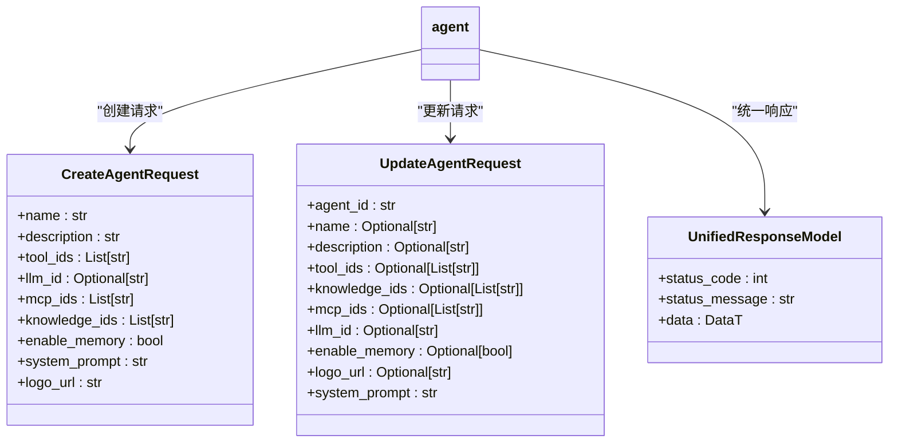

**图示来源**
- [agent.py](https://github.com/Shy2593666979/AgentChat/src/backend/agentchat/api/v1/agent.py#L13-L101)
- [agent.py](https://github.com/Shy2593666979/AgentChat/src/backend/agentchat/schema/agent.py#L4-L26)

**本节来源**
- [agent.py](https://github.com/Shy2593666979/AgentChat/src/backend/agentchat/api/v1/agent.py#L13-L101)

### Chat模块路由
Chat模块实现了与AI助手的实时对话功能，支持流式响应。`/chat`端点使用`@router.post`装饰器定义，能够实时返回AI生成的内容，同时处理历史对话记录和上下文管理。

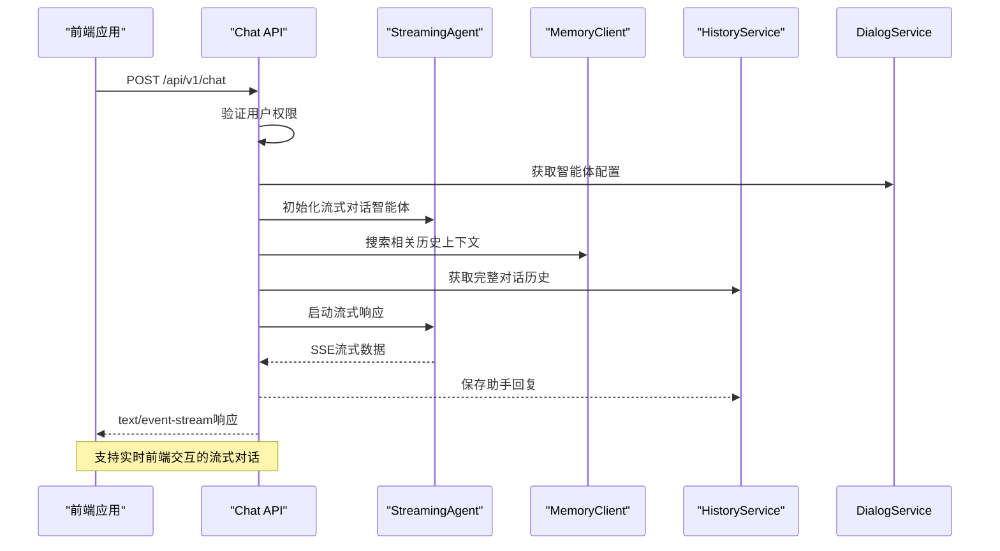

**图示来源**
- [chat.py](https://github.com/Shy2593666979/AgentChat/src/backend/agentchat/api/v1/chat.py#L20-L122)

**本节来源**
- [chat.py](https://github.com/Shy2593666979/AgentChat/src/backend/agentchat/api/v1/chat.py#L20-L122)

### Tool模块路由
Tool模块提供了工具管理功能，包括创建、查询、更新和删除工具等操作。路由函数通过`Depends(get_login_user)`实现依赖注入，确保只有授权用户才能执行相关操作。

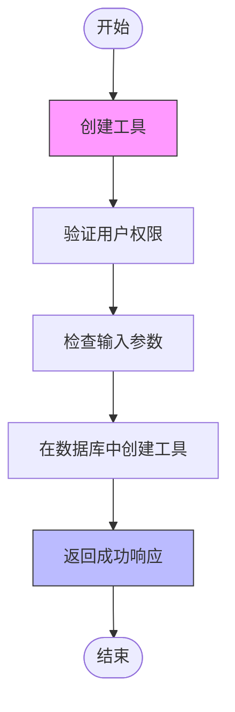

**图示来源**
- [tool.py](https://github.com/Shy2593666979/AgentChat/src/backend/agentchat/api/v1/tool.py#L10-L86)

**本节来源**
- [tool.py](https://github.com/Shy2593666979/AgentChat/src/backend/agentchat/api/v1/tool.py#L10-L86)

## JWT认证机制

AgentChat系统实现了基于JWT（JSON Web Token）的认证机制，确保API接口的安全性。系统使用`fastapi_jwt_auth`库来处理JWT令牌的生成、验证和管理。

### JWT配置
系统在`JWT.py`文件中定义了JWT的配置参数，包括密钥、令牌位置和CSRF保护设置。这些配置通过Pydantic的`BaseSettings`类进行管理，确保了配置的一致性和类型安全。

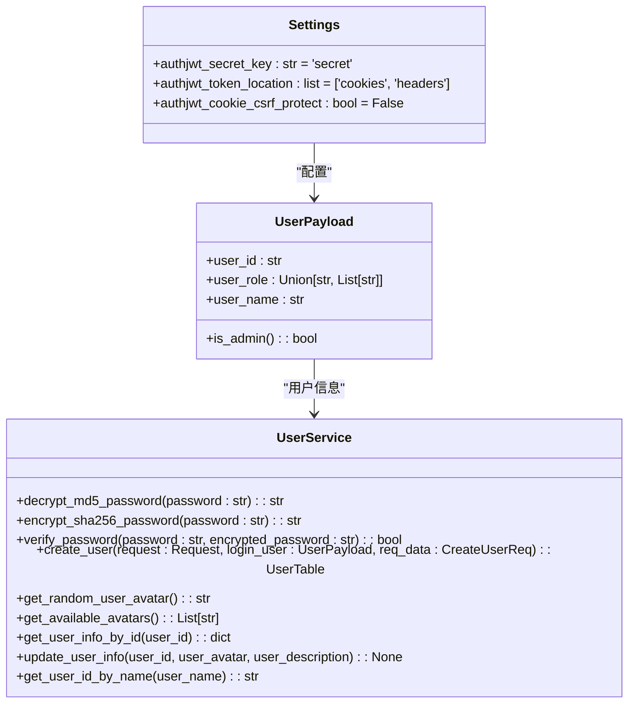

**图示来源**
- [JWT.py](https://github.com/Shy2593666979/AgentChat/src/backend/agentchat/api/JWT.py#L1-L7)
- [user.py](https://github.com/Shy2593666979/AgentChat/src/backend/agentchat/api/services/user.py#L23-L157)

**本节来源**
- [JWT.py](https://github.com/Shy2593666979/AgentChat/src/backend/agentchat/api/JWT.py#L1-L7)
- [user.py](https://github.com/Shy2593666979/AgentChat/src/backend/agentchat/api/services/user.py#L114-L157)

### 认证流程
系统的认证流程通过`get_login_user`依赖函数实现。该函数首先检查请求是否在白名单中，如果是则直接返回管理员用户；否则执行JWT验证，解析令牌中的用户信息。

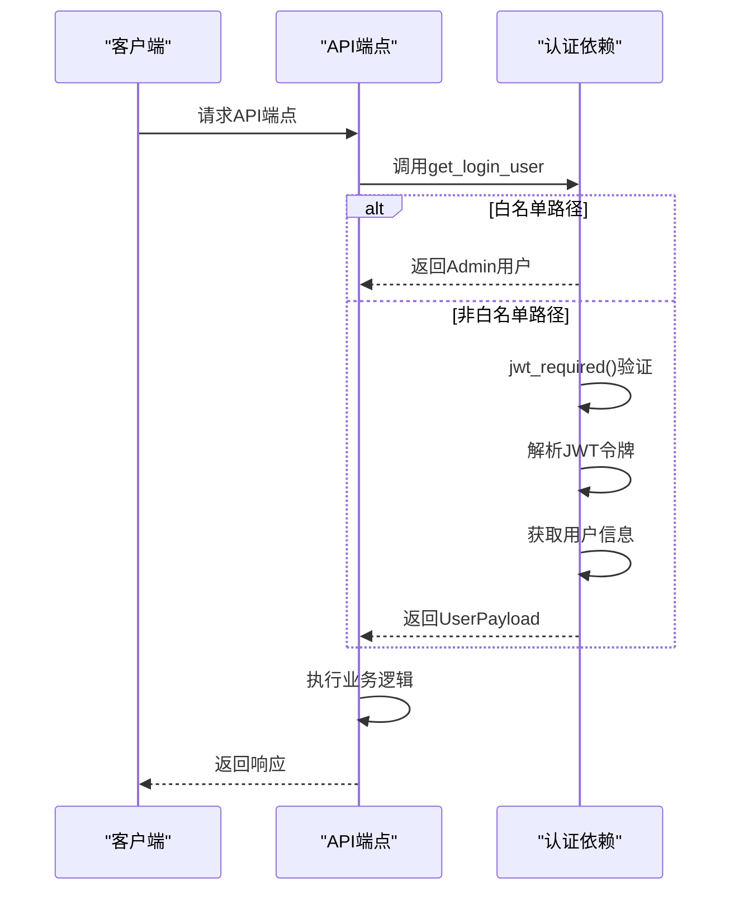

**图示来源**
- [user.py](https://github.com/Shy2593666979/AgentChat/src/backend/agentchat/api/services/user.py#L114-L129)

**本节来源**
- [user.py](https://github.com/Shy2593666979/AgentChat/src/backend/agentchat/api/services/user.py#L114-L129)

## 请求响应模型与数据校验

API层使用Pydantic模型实现请求参数校验、数据序列化和响应格式统一，确保了数据的一致性和安全性。

### 统一响应模型
系统定义了`UnifiedResponseModel`作为统一的响应格式，包含状态码、状态消息和数据三个字段。这种设计使得前端可以统一处理所有API响应，提高了开发效率。

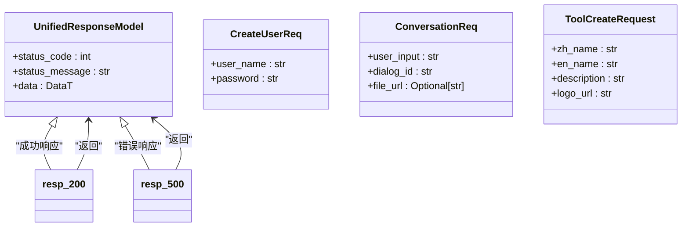

**图示来源**
- [schemas.py](https://github.com/Shy2593666979/AgentChat/src/backend/agentchat/schema/schemas.py#L1-L28)
- [chat.py](https://github.com/Shy2593666979/AgentChat/src/backend/agentchat/schema/chat.py#L6-L10)
- [tool.py](https://github.com/Shy2593666979/AgentChat/src/backend/agentchat/schema/tool.py#L5-L10)

**本节来源**
- [schemas.py](https://github.com/Shy2593666979/AgentChat/src/backend/agentchat/schema/schemas.py#L1-L28)

### 数据校验机制
Pydantic模型通过字段注解和验证器实现数据校验。系统在`schema`目录中定义了各种请求模型，如`CreateAgentRequest`、`UpdateAgentRequest`等，每个字段都指定了类型、约束和描述信息。

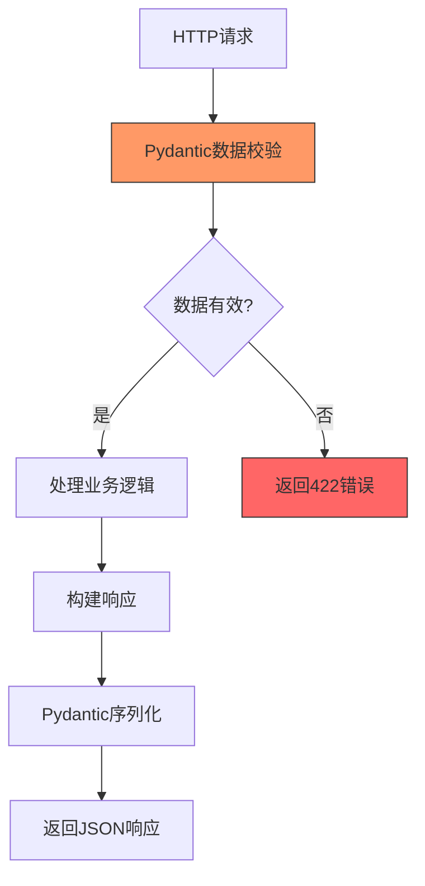

**图示来源**
- [agent.py](https://github.com/Shy2593666979/AgentChat/src/backend/agentchat/schema/agent.py#L4-L26)
- [chat.py](https://github.com/Shy2593666979/AgentChat/src/backend/agentchat/schema/chat.py#L6-L10)
- [tool.py](https://github.com/Shy2593666979/AgentChat/src/backend/agentchat/schema/tool.py#L5-L10)

**本节来源**
- [agent.py](https://github.com/Shy2593666979/AgentChat/src/backend/agentchat/schema/agent.py#L4-L26)

## API调用流程示例

以下通过实际HTTP请求示例展示API调用流程，帮助开发者理解如何与AgentChat后端进行交互。

### 创建Agent
创建智能体的API调用需要提供智能体的名称、描述、工具ID、LLM ID等信息。系统会验证用户权限和智能体名称的唯一性。

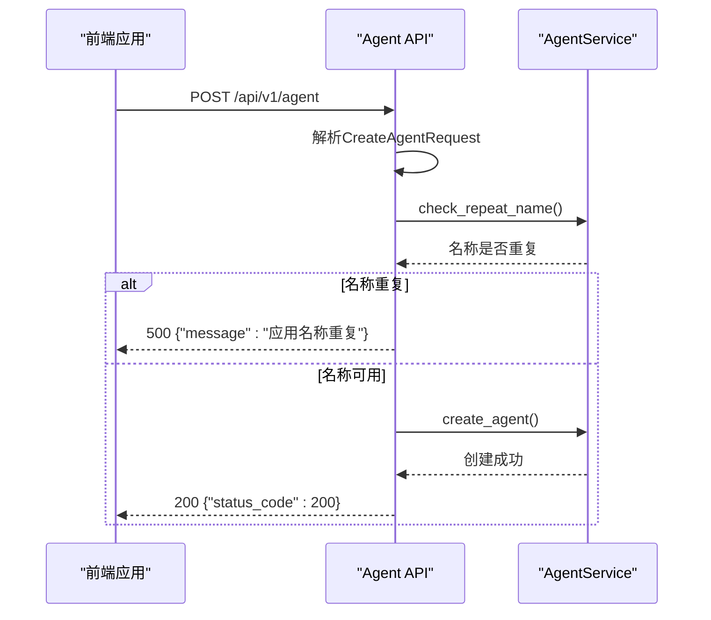

**图示来源**
- [agent.py](https://github.com/Shy2593666979/AgentChat/src/backend/agentchat/api/v1/agent.py#L16-L37)

**本节来源**
- [agent.py](https://github.com/Shy2593666979/AgentChat/src/backend/agentchat/api/v1/agent.py#L16-L37)

### 发送对话请求
发送对话请求的API支持流式响应，能够实时返回AI生成的内容。系统会整合用户输入、附件URL和历史上下文，生成完整的对话消息。

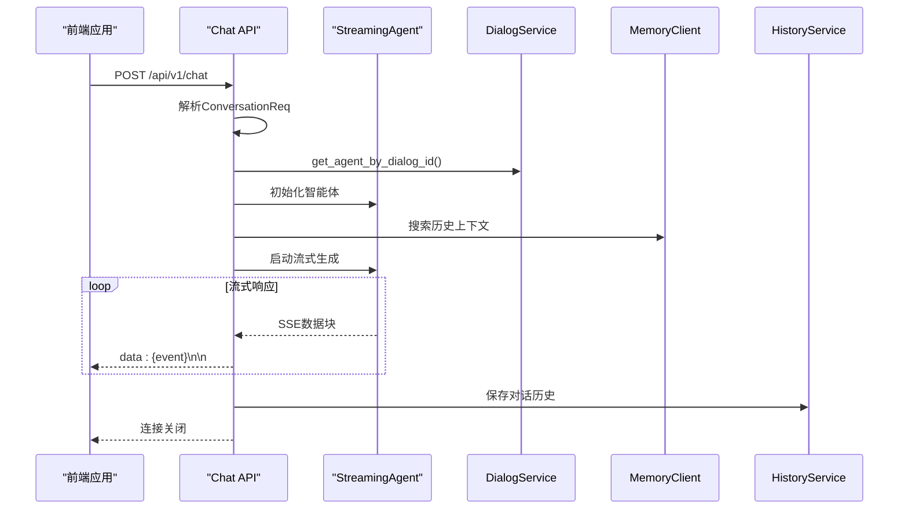

**图示来源**
- [chat.py](https://github.com/Shy2593666979/AgentChat/src/backend/agentchat/api/v1/chat.py#L49-L122)

**本节来源**
- [chat.py](https://github.com/Shy2593666979/AgentChat/src/backend/agentchat/api/v1/chat.py#L49-L122)

## 错误码体系

系统实现了统一的错误码体系，通过`errcode`模块定义各种错误类型，确保API响应的一致性和可预测性。

### 错误码设计
错误码采用五位数字编码，前三位代表功能模块，后两位表示模块内部的具体错误。系统定义了基础错误码类`BaseErrorCode`，其他具体错误码继承自该基类。

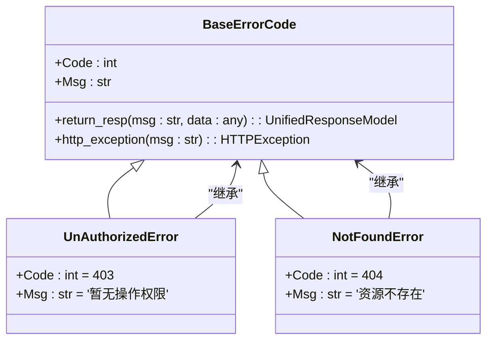

**图示来源**
- [base.py](https://github.com/Shy2593666979/AgentChat/src/backend/agentchat/api/errcode/base.py#L6-L28)

**本节来源**
- [base.py](https://github.com/Shy2593666979/AgentChat/src/backend/agentchat/api/errcode/base.py#L6-L28)

### 错误处理流程
API端点通过try-catch机制捕获异常，并使用统一的错误响应函数返回标准化的错误信息。这种设计使得前端可以统一处理各种错误情况。

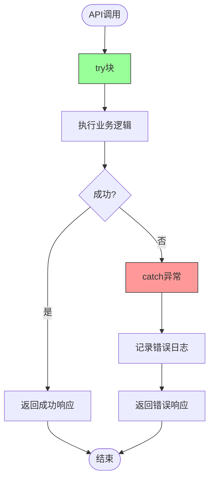

**本节来源**
- [agent.py](https://github.com/Shy2593666979/AgentChat/src/backend/agentchat/api/v1/agent.py#L19-L40)
- [chat.py](https://github.com/Shy2593666979/AgentChat/src/backend/agentchat/api/v1/chat.py#L101-L116)

## 新增API端点指南

为确保新API端点符合现有架构规范，开发者应遵循以下指南进行开发。

### 模块化设计
新增API端点应遵循模块化设计原则，将相关功能组织在同一个模块中。对于v1版本的API，应将新端点添加到`api/v1/`目录下的相应文件中。

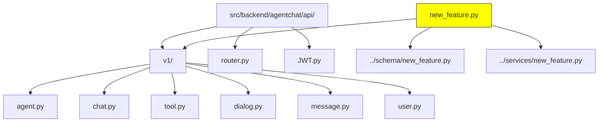

**本节来源**
- [router.py](https://github.com/Shy2593666979/AgentChat/src/backend/agentchat/api/router.py#L2-L28)

### 路由注册
新增模块需要在`router.py`文件中导入并注册到主路由器。系统使用`APIRouter`的`include_router`方法将模块路由包含到主应用中。

```python
# 在router.py中添加新模块
from agentchat.api.v1 import new_feature

router.include_router(new_feature.router)
```

**本节来源**
- [router.py](https://github.com/Shy2593666979/AgentChat/src/backend/agentchat/api/router.py#L8-L28)

### 安全性考虑
所有API端点都应考虑安全性，使用JWT认证保护敏感操作。通过`Depends(get_login_user)`依赖注入获取当前登录用户信息，并验证用户权限。

```python
@router.post("/new-endpoint")
async def new_endpoint(
    request_data: NewRequestModel = Body(),
    login_user: UserPayload = Depends(get_login_user)
):
    # 验证用户权限
    if not login_user.is_admin():
        return resp_500(message="暂无操作权限")
    
    # 处理业务逻辑
    return resp_200()
```

**本节来源**
- [user.py](https://github.com/Shy2593666979/AgentChat/src/backend/agentchat/api/services/user.py#L114-L129)
- [agent.py](https://github.com/Shy2593666979/AgentChat/src/backend/agentchat/api/v1/agent.py#L18-L19)
