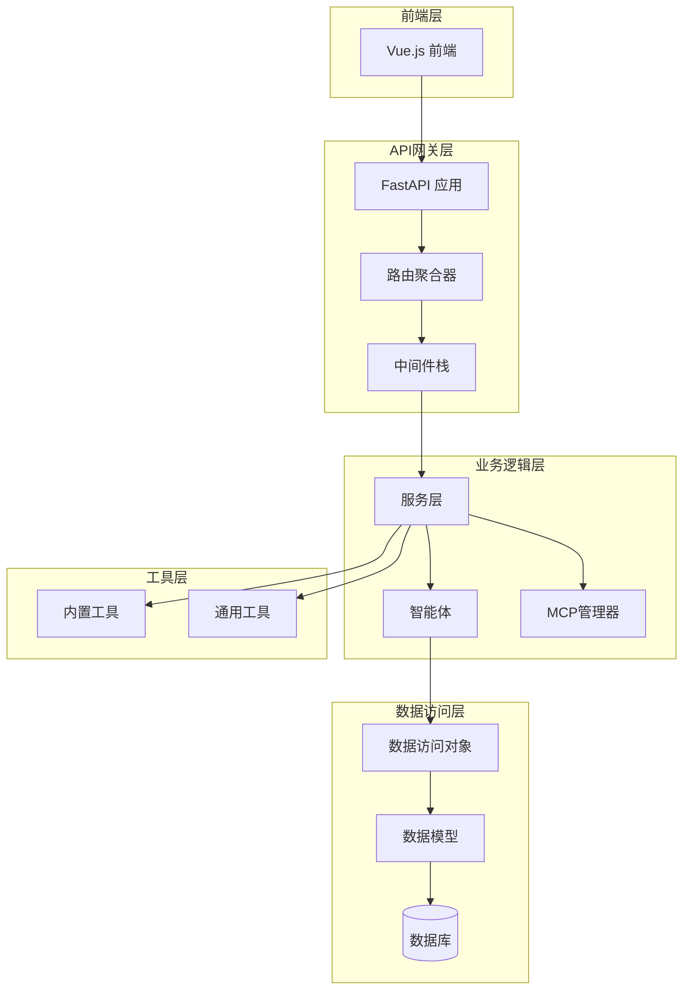
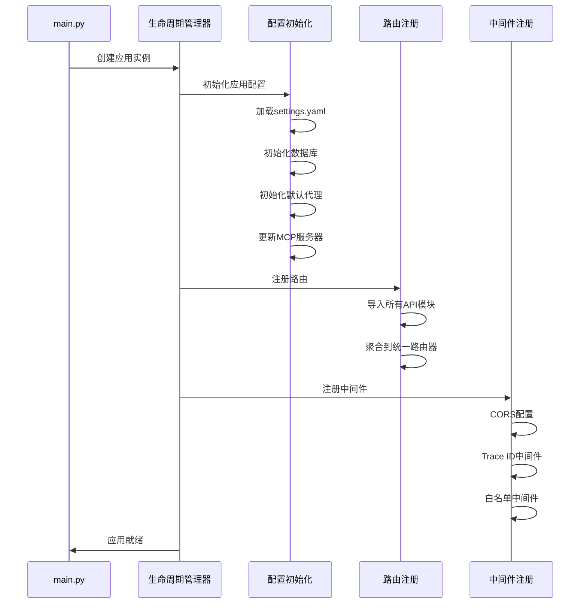
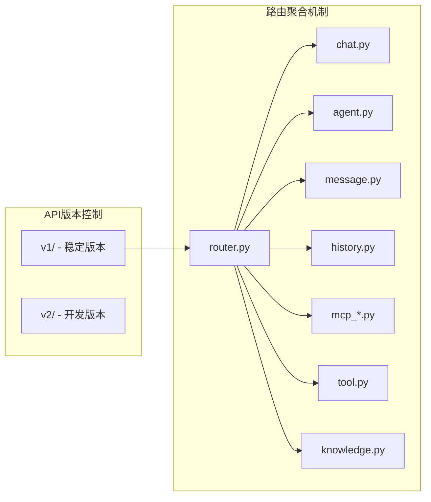
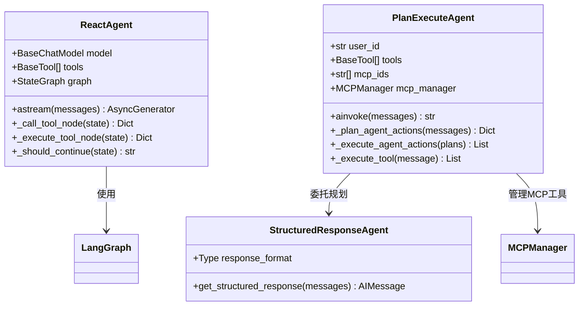
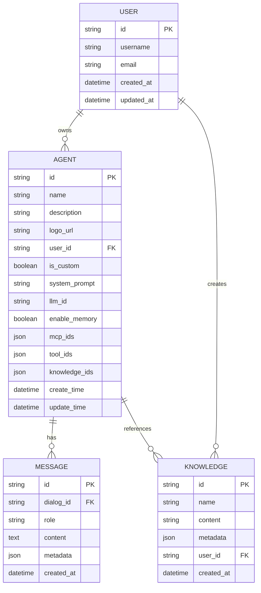
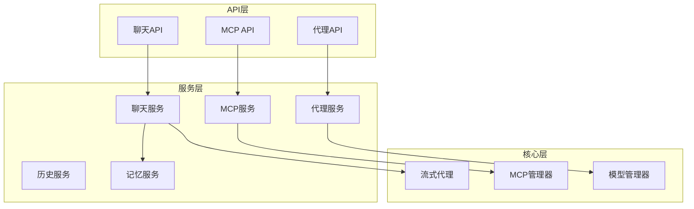
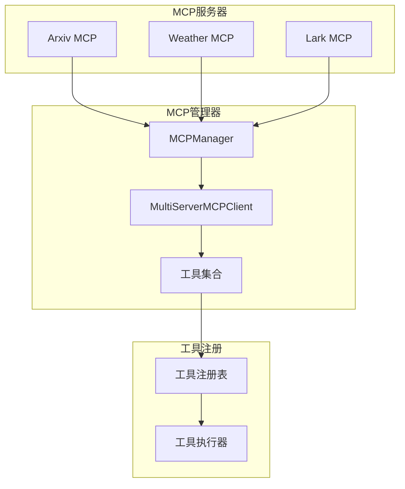
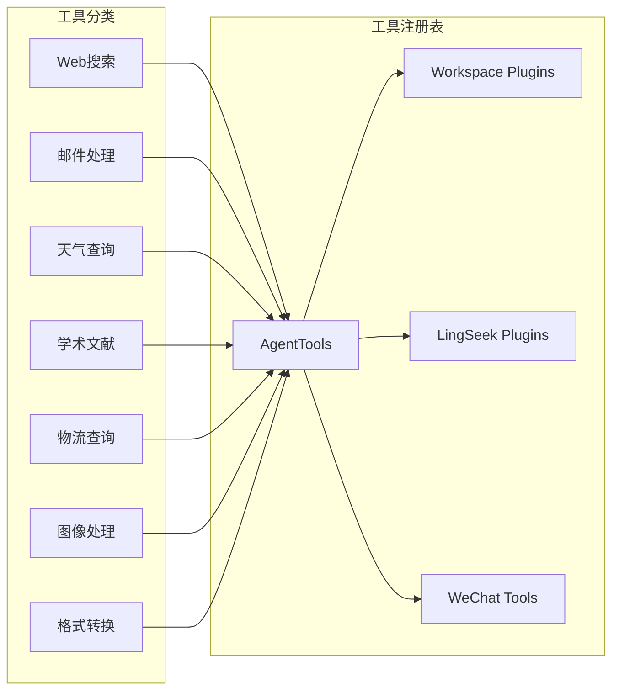
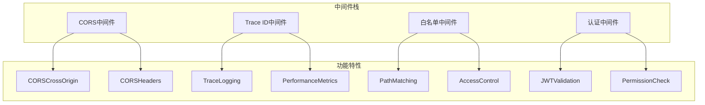
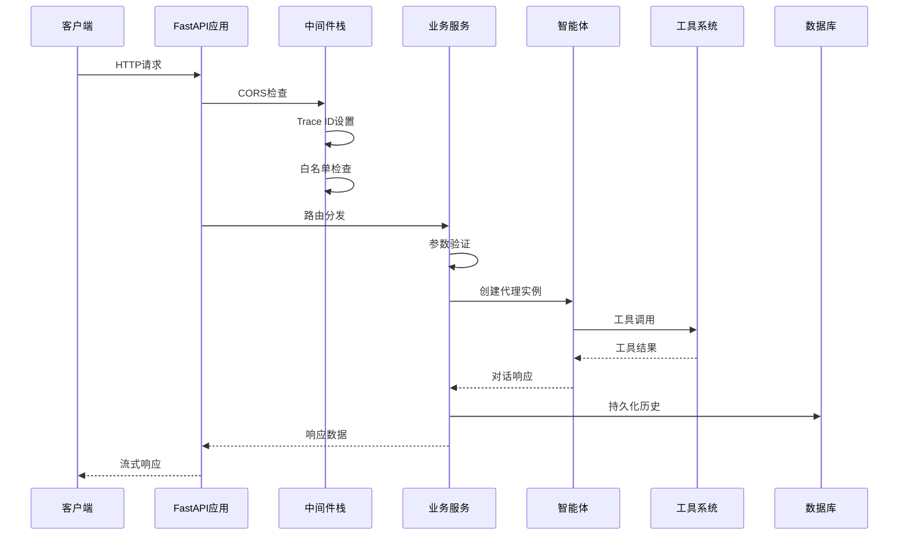

# AgentChat后端目录结构与模块职责详解

## 目录
1. [项目概述](#项目概述)
2. [核心架构](#核心架构)
3. [main.py应用入口](#mainpy应用入口)
4. [API层设计](#api层设计)
5. [核心代理模块](#核心代理模块)
6. [数据库层架构](#数据库层架构)
7. [服务层协调](#服务层协调)
8. [MCP插件系统](#mcp插件系统)
9. [工具系统](#工具系统)
10. [中间件与工具](#中间件与工具)
11. [调用链路分析](#调用链路分析)
12. [总结](#总结)

## 项目概述

AgentChat是一个基于FastAPI构建的智能对话平台，采用分层架构设计，支持多种智能体（Agent）类型，包括ReAct、Plan-Execute等推理模式。系统具备强大的插件化能力，支持MCP（Model Context Protocol）协议，以及丰富的工具生态系统。

## 核心架构

**图表来源**
- [main.py](https://github.com/Shy2593666979/AgentChat/src/backend/agentchat/main.py#L77-L108)
- [router.py](https://github.com/Shy2593666979/AgentChat/src/backend/agentchat/api/router.py#L1-L28)

## main.py应用入口

### 应用初始化流程

main.py作为FastAPI应用的入口点，负责整个应用的初始化和生命周期管理：

**图表来源**
- [main.py](https://github.com/Shy2593666979/AgentChat/src/backend/agentchat/main.py#L66-L75)

### 依赖注入与中间件注册

应用启动时依次执行以下关键步骤：

1. **配置初始化**：加载settings.yaml配置文件，初始化数据库连接和默认数据
2. **路由注册**：动态导入所有API模块并聚合到统一路由器
3. **中间件注册**：按顺序注册CORS、Trace ID追踪和白名单中间件

**章节来源**
- [main.py](https://github.com/Shy2593666979/AgentChat/src/backend/agentchat/main.py#L18-L48)
- [main.py](https://github.com/Shy2593666979/AgentChat/src/backend/agentchat/main.py#L51-L58)

## API层设计

### RESTful API端点设计原则

API层采用版本化设计，v1版本作为主要稳定版本：

**图表来源**
- [router.py](https://github.com/Shy2593666979/AgentChat/src/backend/agentchat/api/router.py#L1-L28)

### 版本控制策略

- **稳定性保证**：v1版本保持向后兼容，新功能在v2中开发
- **渐进式迁移**：v2版本逐步替代v1，提供平滑升级路径
- **API文档**：每个端点都有详细的描述和示例

**章节来源**
- [router.py](https://github.com/Shy2593666979/AgentChat/src/backend/agentchat/api/router.py#L1-L28)

## 核心代理模块

### 智能体架构设计

系统支持多种智能体类型，每种都有特定的推理模式：

**图表来源**
- [react_agent.py](https://github.com/Shy2593666979/AgentChat/src/backend/agentchat/core/agents/react_agent.py#L39-L279)
- [plan_execute_agent.py](https://github.com/Shy2593666979/AgentChat/src/backend/agentchat/core/agents/plan_execute_agent.py#L17-L238)

### ReAct智能体实现

ReAct（Reasoning and Acting）智能体基于LangGraph实现，具有以下特点：

- **流式输出**：支持实时响应和事件流
- **工具调用**：智能识别和调用可用工具
- **状态管理**：维护对话状态和工具调用计数
- **事件驱动**：发送工具选择和执行事件

**章节来源**
- [react_agent.py](https://github.com/Shy2593666979/AgentChat/src/backend/agentchat/core/agents/react_agent.py#L39-L279)

### Plan-Execute智能体实现

Plan-Execute智能体采用战略规划模式：

- **计划阶段**：分析用户查询，制定执行计划
- **执行阶段**：按计划调用工具，收集结果
- **MCP集成**：无缝集成MCP服务器工具
- **错误恢复**：自动处理JSON解析错误

**章节来源**
- [plan_execute_agent.py](https://github.com/Shy2593666979/AgentChat/src/backend/agentchat/core/agents/plan_execute_agent.py#L17-L238)

## 数据库层架构

### 数据模型设计

数据库层采用SQLModel ORM框架，提供类型安全的数据访问：

**图表来源**
- [agent.py](https://github.com/Shy2593666979/AgentChat/src/backend/agentchat/database/models/agent.py#L11-L47)

### ORM映射逻辑

- **序列化支持**：继承SQLModelSerializable，支持JSON序列化
- **隐藏字段**：可配置敏感字段不参与序列化
- **时间处理**：自动处理datetime字段的格式化
- **类型安全**：利用Pydantic提供运行时类型验证

**章节来源**
- [base.py](https://github.com/Shy2593666979/AgentChat/src/backend/agentchat/database/models/base.py#L28-L43)

## 服务层协调

### 业务服务层架构

服务层作为API层和核心逻辑之间的协调者：

**图表来源**
- [chat.py](https://github.com/Shy2593666979/AgentChat/src/backend/agentchat/api/v1/chat.py#L1-L122)
- [agent.py](https://github.com/Shy2593666979/AgentChat/src/backend/agentchat/api/v1/agent.py#L1-L101)

### 核心服务功能

- **聊天服务**：处理流式对话，管理对话状态
- **代理服务**：管理智能体的生命周期
- **MCP服务**：协调外部MCP服务器
- **历史服务**：持久化对话历史
- **记忆服务**：向量化记忆检索

**章节来源**
- [chat.py](https://github.com/Shy2593666979/AgentChat/src/backend/agentchat/api/v1/chat.py#L1-L122)

## MCP插件系统

### 插件化MCP服务组织

MCP（Model Context Protocol）系统提供标准化的插件接口：

**图表来源**
- [manager.py](https://github.com/Shy2593666979/AgentChat/src/backend/agentchat/services/mcp/manager.py#L13-L103)

### 加载机制

MCP管理器提供异步并发工具加载和执行：

- **批量加载**：同时从多个MCP服务器获取工具
- **并发执行**：支持多个工具的并发调用
- **错误处理**：完善的异常捕获和错误恢复
- **配置管理**：支持用户个性化配置

**章节来源**
- [manager.py](https://github.com/Shy2593666979/AgentChat/src/backend/agentchat/services/mcp/manager.py#L13-L103)

## 工具系统

### 内置工具注册

系统提供丰富的内置工具集合：

**图表来源**
- [__init__.py](https://github.com/Shy2593666979/AgentChat/src/backend/agentchat/tools/__init__.py#L1-L48)

### 执行流程

工具执行遵循统一的模式：

- **参数验证**：使用Pydantic进行参数类型检查
- **异步执行**：支持同步和异步工具调用
- **结果处理**：统一的结果格式化和错误处理
- **事件通知**：执行过程中的状态事件

**章节来源**
- [__init__.py](https://github.com/Shy2593666979/AgentChat/src/backend/agentchat/tools/__init__.py#L1-L48)

## 中间件与工具

### 中间件栈设计

**图表来源**
- [trace_id_middleware.py](https://github.com/Shy2593666979/AgentChat/src/backend/agentchat/middleware/trace_id_middleware.py#L12-L32)
- [white_list_middleware.py](https://github.com/Shy2593666979/AgentChat/src/backend/agentchat/middleware/white_list_middleware.py#L33-L50)

### 通用工具函数

utils模块提供跨层使用的工具函数：

- **上下文管理**：用户ID和Trace ID的全局上下文
- **日期处理**：北京时间计算和格式化
- **JSON处理**：JSON修复和提取功能
- **文件操作**：文件上传和下载辅助
- **缓存管理**：Redis缓存操作

**章节来源**
- [helpers.py](https://github.com/Shy2593666979/AgentChat/src/backend/agentchat/utils/helpers.py#L1-L361)

## 调用链路分析

### 完整调用流程

从API请求到响应的完整链路：

**图表来源**
- [main.py](https://github.com/Shy2593666979/AgentChat/src/backend/agentchat/main.py#L66-L75)
- [chat.py](https://github.com/Shy2593666979/AgentChat/src/backend/agentchat/api/v1/chat.py#L49-L122)

### 模块边界与职责

| 层级 | 模块 | 职责 | 接口 |
|------|------|------|------|
| 表现层 | API Router | HTTP端点定义 | RESTful API |
| 控制层 | Services | 业务逻辑协调 | 服务接口 |
| 核心层 | Agents | 智能体推理 | 流式接口 |
| 数据层 | DAO | 数据访问 | ORM接口 |
| 工具层 | Tools | 功能扩展 | 工具接口 |

## 总结

AgentChat后端采用清晰的分层架构，每一层都有明确的职责边界：

1. **表现层**：FastAPI提供RESTful API接口，支持流式响应
2. **控制层**：服务层协调业务逻辑，管理智能体生命周期
3. **核心层**：智能体模块实现不同的推理模式
4. **数据层**：ORM提供类型安全的数据访问
5. **工具层**：插件化架构支持功能扩展

这种设计使得系统具备良好的可扩展性、可维护性和测试性，为构建复杂的智能对话系统提供了坚实的基础。
