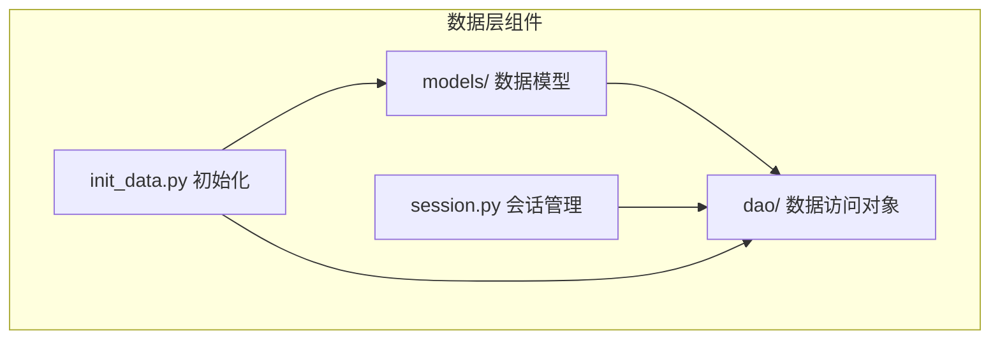
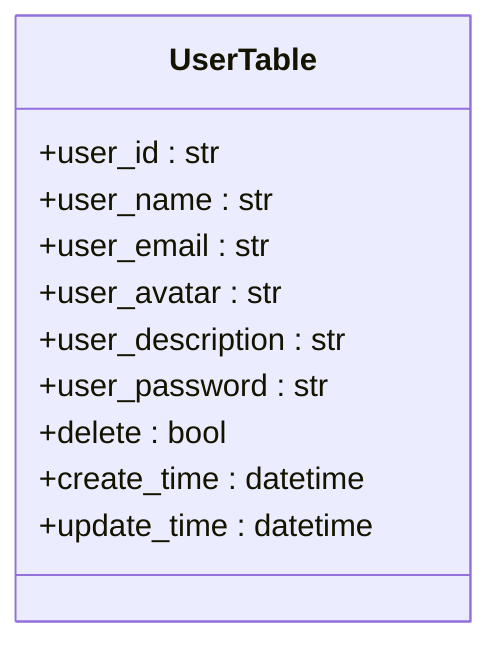
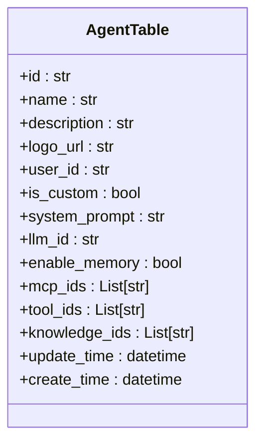
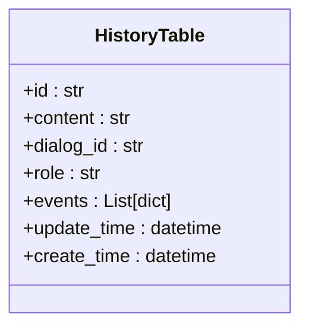
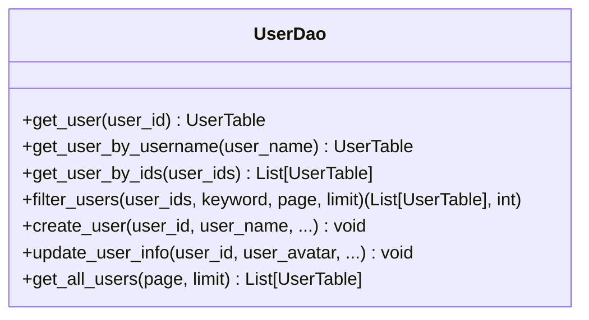
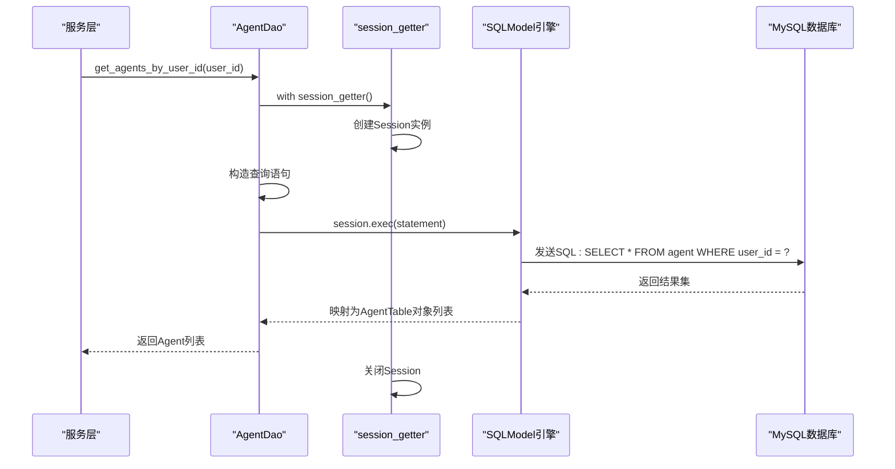

# 数据层

## 目录
1. [项目结构](#项目结构)
2. [数据模型设计](#数据模型设计)
3. [数据访问对象（DAO）模式](#数据访问对象dao模式)
4. [数据库会话管理](#数据库会话管理)
5. [应用启动数据初始化](#应用启动数据初始化)
6. [数据流示例：根据用户ID获取Agent列表](#数据流示例根据用户id获取agent列表)
7. [数据库扩展指南](#数据库扩展指南)

## 项目结构

AgentChat项目的数据层主要位于`src/backend/agentchat/database/`目录下，包含三个核心子模块：`models`（数据模型）、`dao`（数据访问对象）和会话管理组件。该设计遵循清晰的分层架构，将数据定义、数据操作和数据库连接管理分离。



**图示来源**  
- [src/backend/agentchat/database/models](https://github.com/Shy2593666979/AgentChat/src/backend/agentchat/database/models)
- [src/backend/agentchat/database/dao](https://github.com/Shy2593666979/AgentChat/src/backend/agentchat/database/dao)
- [src/backend/agentchat/database/session.py](https://github.com/Shy2593666979/AgentChat/src/backend/agentchat/database/session.py)
- [src/backend/agentchat/database/init_data.py](https://github.com/Shy2593666979/AgentChat/src/backend/agentchat/database/init_data.py)

## 数据模型设计

数据模型基于SQLModel库定义，位于`src/backend/agentchat/database/models/`目录中。所有模型均继承自`SQLModelSerializable`基类，实现了统一的序列化行为。

### 基类设计

`base.py`文件定义了`SQLModelSerializable`基类，为所有数据模型提供通用功能：
- **序列化支持**：通过`to_dict()`方法将模型实例转换为字典，自动处理`datetime`类型的序列化。
- **字段隐藏**：通过`hide_fields`类变量定义不应暴露的敏感字段（如API密钥）。
- **ORM配置**：启用`from_attributes=True`以支持从数据库记录直接构建模型实例。

**数据模型基类来源**  
- [base.py](https://github.com/Shy2593666979/AgentChat/src/backend/agentchat/database/models/base.py#L28-L43)

### 核心数据模型

#### 用户模型 (User)

`user.py`中的`UserTable`类定义了用户实体，其主要特性包括：
- **主键**：`user_id`作为主键，类型为字符串。
- **唯一约束**：`user_name`字段具有唯一性约束和索引。
- **时间戳**：包含`create_time`和`update_time`字段，利用数据库的`CURRENT_TIMESTAMP`自动填充和更新。
- **软删除**：通过`delete`布尔字段实现软删除机制。
- **常量定义**：文件中定义了`SystemUser`和`AdminUser`常量，用于标识系统用户和管理员。



**用户模型来源**  
- [user.py](https://github.com/Shy2593666979/AgentChat/src/backend/agentchat/database/models/user.py#L18-L35)

#### Agent模型

`agent.py`中的`AgentTable`类定义了Agent实体，其关键设计如下：
- **主键生成**：`id`字段使用`uuid4().hex`作为默认工厂函数，生成唯一的字符串ID。
- **JSON字段**：`mcp_ids`、`tool_ids`和`knowledge_ids`字段使用`sa_column=Column(JSON)`映射到数据库的JSON类型，用于存储字符串列表。
- **外键关联**：`user_id`字段通过索引关联到`UserTable`，表示Agent的拥有者。
- **配置注入**：`logo_url`字段的默认值从`app_settings`中获取，实现了配置与代码的解耦。



**Agent模型来源**  
- [agent.py](https://github.com/Shy2593666979/AgentChat/src/backend/agentchat/database/models/agent.py#L11-L47)

#### 聊天历史模型

`history.py`中的`HistoryTable`类定义了聊天历史记录：
- **内容存储**：`content`字段使用`Text`类型，适合存储较长的文本消息。
- **角色枚举**：`role`字段使用`Literal["assistant", "system", "user"]`进行类型限制。
- **事件记录**：`events`字段为JSON类型，用于存储AI回复过程中的事件信息。



**聊天历史模型来源**  
- [history.py](https://github.com/Shy2593666979/AgentChat/src/backend/agentchat/database/models/history.py#L12-L37)

## 数据访问对象（DAO）模式

DAO模式通过`src/backend/agentchat/database/dao/`目录下的模块实现，为上层服务提供封装的数据库操作接口。

### UserDao实现

`dao/user.py`中的`UserDao`类提供了对`UserTable`的CRUD操作：
- **查询方法**：`get_user()`、`get_user_by_username()`等方法根据不同条件查询用户。
- **分页查询**：`filter_users()`和`get_all_users()`支持分页，通过`offset`和`limit`实现。
- **创建与更新**：`create_user()`、`add_user_and_default_role()`等方法封装了用户创建逻辑。
- **会话管理**：所有方法都通过`session_getter()`上下文管理器获取数据库会话，确保会话的正确开启和关闭。



**UserDao来源**  
- [user.py](https://github.com/Shy2593666979/AgentChat/src/backend/agentchat/database/dao/user.py#L7-L119)

### AgentDao实现

虽然未直接读取`agent.py`，但根据项目结构和命名规范，`dao/agent.py`应提供类似的CRUD接口，如`get_agent_by_user_id()`、`create_agent()`等，供上层服务调用。

**DAO模式来源**  
- [user.py](https://github.com/Shy2593666979/AgentChat/src/backend/agentchat/database/dao/user.py)
- [agent.py](https://github.com/Shy2593666979/AgentChat/src/backend/agentchat/database/dao/agent.py)

## 数据库会话管理

`session.py`文件负责管理数据库会话的生命周期，是数据层与数据库引擎之间的桥梁。

### 同步会话管理

`session_getter()`是一个同步上下文管理器：
- **会话创建**：使用全局的`engine`（来自`database/__init__.py`）创建`Session`实例。
- **异常处理**：在发生异常时自动执行`rollback()`，并重新抛出异常。
- **资源清理**：在`finally`块中确保会话被`close()`，防止资源泄漏。

### 异步会话管理

`async_session_getter()`提供异步支持：
- **异步会话**：使用`async_engine`创建`AsyncSession`实例。
- **异步操作**：`rollback()`和`close()`操作使用`await`关键字，符合异步编程范式。

这种设计使得DAO层可以同时支持同步和异步的数据库操作。

**会话管理来源**  
- [session.py](https://github.com/Shy2593666979/AgentChat/src/backend/agentchat/database/session.py#L12-L36)

## 应用启动数据初始化

`init_data.py`文件在应用启动时执行，负责初始化数据库表和默认数据。

### 初始化流程

1.  **创建数据表**：`init_database()`调用`SQLModel.metadata.create_all(engine)`，根据模型定义创建所有缺失的表。
2.  **初始化默认数据**：`init_default_agent()`是核心初始化函数，它会检查数据库中是否存在数据，若无则执行：
    -   `insert_tools_to_mysql()`：从`config/tool.json`加载默认工具配置并存入数据库。
    -   `insert_llm_to_mysql()`：从`app_settings`读取默认LLM配置并创建记录。
    -   `insert_agent_to_mysql()`：为每个工具创建一个对应的默认Agent。

### MCP Server初始化

`update_system_mcp_server()`函数负责MCP Server的初始化和更新：
- **首次加载**：如果数据库中没有MCP Server记录，则从`config/mcp_server.json`加载默认配置。
- **定期更新**：如果已有记录，则根据策略（如超过七天）决定是否从配置文件更新。

这种机制确保了系统拥有可用的默认配置，同时允许动态更新。

**初始化来源**  
- [init_data.py](https://github.com/Shy2593666979/AgentChat/src/backend/agentchat/database/init_data.py#L21-L169)

## 数据流示例：根据用户ID获取Agent列表

以下是从DAO调用到SQL执行的完整数据流分析：

1.  **服务层调用**：上层服务（如`api/services/agent.py`）调用`AgentDao.get_agents_by_user_id(user_id)`。
2.  **DAO层处理**：`AgentDao`方法内部：
    -   调用`session_getter()`获取一个数据库会话。
    -   构造SQLModel查询语句，例如`select(AgentTable).where(AgentTable.user_id == user_id)`。
    -   通过会话的`exec()`方法执行查询。
    -   将查询结果（`AgentTable`实例列表）返回给服务层。
3.  **会话管理**：`session_getter()`确保会话在查询结束后被正确关闭。
4.  **SQL执行**：SQLModel将Python查询转换为原生SQL（如`SELECT * FROM agent WHERE user_id = ?`），并通过数据库引擎发送给MySQL执行。
5.  **结果返回**：数据库返回结果集，SQLModel将其映射回`AgentTable`对象列表。



**数据流来源**  
- [agent.py](https://github.com/Shy2593666979/AgentChat/src/backend/agentchat/database/dao/agent.py)
- [session.py](https://github.com/Shy2593666979/AgentChat/src/backend/agentchat/database/session.py)
- [agent.py](https://github.com/Shy2593666979/AgentChat/src/backend/agentchat/database/models/agent.py)

## 数据库扩展指南

新增数据模型及对应的DAO操作遵循以下步骤：

### 1. 定义新的数据模型

在`models/`目录下创建新的Python文件（如`new_model.py`），定义继承自`SQLModelSerializable`的模型类：
```python
from sqlmodel import Field, SQLModel
from agentchat.database.models.base import SQLModelSerializable

class NewModelTable(SQLModelSerializable, table=True):
    __tablename__ = "new_model"
    
    id: str = Field(default_factory=lambda: uuid4().hex, primary_key=True)
    name: str = Field(index=True)
    # ... 其他字段
```

### 2. 在`models/__init__.py`中注册（可选）

如果需要在其他地方方便地导入，可以在`__init__.py`中添加导入语句。

### 3. 创建对应的DAO

在`dao/`目录下创建`new_model.py`，定义`NewModelDao`类：
```python
from agentchat.database.models.new_model import NewModelTable
from sqlmodel import Session, select
from agentchat.database.session import session_getter

class NewModelDao:
    @classmethod
    def get_by_id(cls, id: str) -> NewModelTable | None:
        with session_getter() as session:
            statement = select(NewModelTable).where(NewModelTable.id == id)
            return session.exec(statement).first()
    
    @classmethod
    def create(cls, **kwargs):
        with session_getter() as session:
            instance = NewModelTable(**kwargs)
            session.add(instance)
            session.commit()
            session.refresh(instance)
            return instance
    # ... 实现其他CRUD方法
```

### 4. 更新初始化脚本（如需要）

如果新模型需要默认数据，修改`init_data.py`，添加相应的初始化函数，并在`init_default_agent()`或类似函数中调用。

完成以上步骤后，新的数据模型即可在服务层通过DAO进行安全、封装的访问。

**扩展指南来源**  
- [base.py](https://github.com/Shy2593666979/AgentChat/src/backend/agentchat/database/models/base.py)
- [user.py](https://github.com/Shy2593666979/AgentChat/src/backend/agentchat/database/models/user.py)
- [user.py](https://github.com/Shy2593666979/AgentChat/src/backend/agentchat/database/dao/user.py)
- [init_data.py](https://github.com/Shy2593666979/AgentChat/src/backend/agentchat/database/init_data.py)
