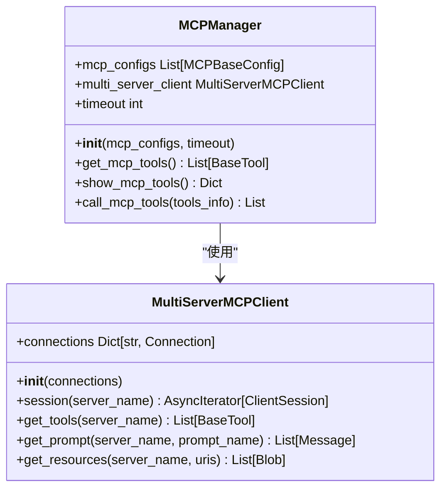
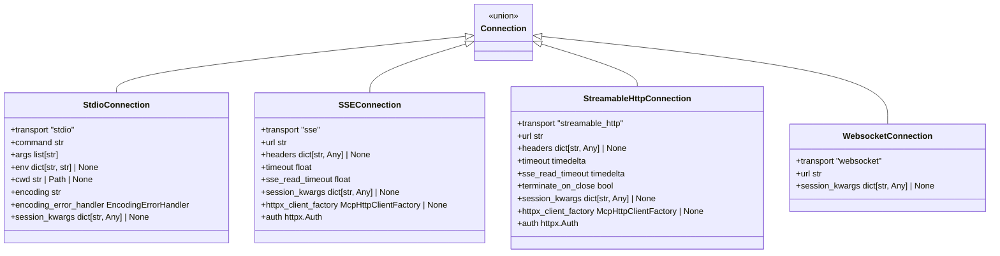
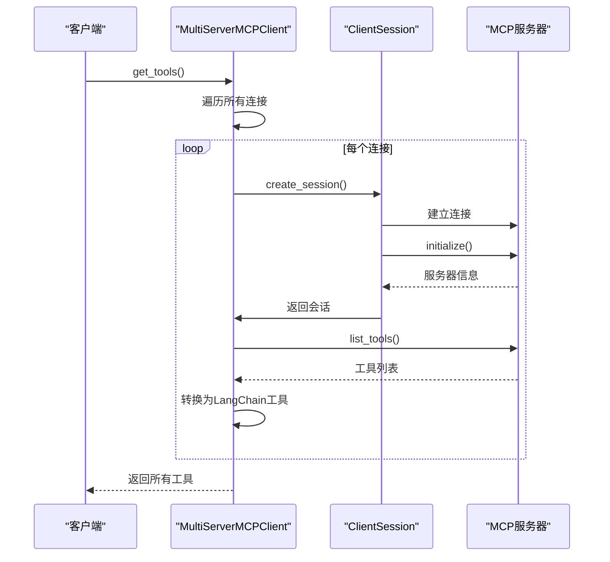
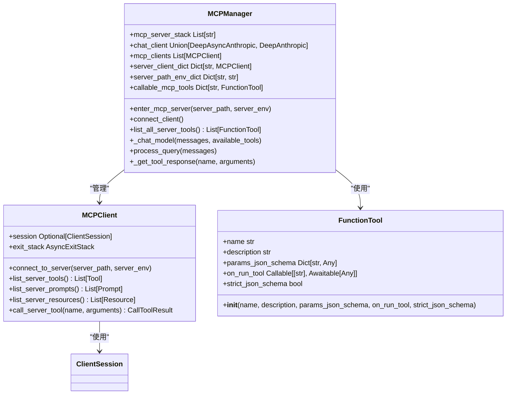

# MCP服务

<cite>
**本文档引用的文件**
- [manager.py](https://github.com/Shy2593666979/AgentChat/src/backend/agentchat/services/mcp/manager.py)
- [sessions.py](https://github.com/Shy2593666979/AgentChat/src/backend/agentchat/services/mcp/sessions.py)
- [multi_client.py](https://github.com/Shy2593666979/AgentChat/src/backend/agentchat/services/mcp/multi_client.py)
- [mcp_manager.py](https://github.com/Shy2593666979/AgentChat/src/backend/agentchat/services/mcp_openai/mcp_manager.py)
- [mcp_client.py](https://github.com/Shy2593666979/AgentChat/src/backend/agentchat/services/mcp_openai/mcp_client.py)
- [mcp_arxiv.py](https://github.com/Shy2593666979/AgentChat/src/backend/agentchat/mcp_servers/arxiv/mcp_arxiv.py)
- [mcp_weather.py](https://github.com/Shy2593666979/AgentChat/src/backend/agentchat/mcp_servers/weather/mcp_weather.py)
- [mcp_server.py](https://github.com/Shy2593666979/AgentChat/src/backend/agentchat/mcp_servers/lark_mcp/mcp_server.py)
- [main.py](https://github.com/Shy2593666979/AgentChat/src/backend/agentchat/mcp_servers/lark_mcp/main.py)
- [mcp_server.json](https://github.com/Shy2593666979/AgentChat/src/backend/agentchat/config/mcp_server.json)
</cite>

## 目录
1. [MCP服务概述](#mcp服务概述)
2. [MCP客户端管理](#mcp客户端管理)
3. [会话生命周期管理](#会话生命周期管理)
4. [多客户端连接支持](#多客户端连接支持)
5. [OpenAI兼容协议交互](#openai兼容协议交互)
6. [外部工具集成示例](#外部工具集成示例)
7. [MCP服务扩展指南](#mcp服务扩展指南)

## MCP服务概述

MCP（Modular Capability Provider）服务是一种模块化能力提供者架构，旨在通过标准化协议集成各种外部工具和服务。该架构允许系统动态加载和管理多个MCP服务器，为智能代理提供丰富的工具集。MCP服务的核心设计包括客户端管理、会话生命周期控制、多服务器连接支持以及与主流AI平台的兼容性。

MCP服务通过分层架构实现了灵活性和可扩展性，主要组件包括：
- **MCPManager**：负责MCP客户端的加载、初始化和工具调用管理
- **Sessions**：处理不同传输类型的会话创建和管理
- **MultiClient**：支持连接多个MCP服务器
- **MCP-OpenAI适配器**：实现与OpenAI兼容的协议交互

该服务架构支持多种传输协议，包括stdio、SSE（Server-Sent Events）、WebSocket和可流式HTTP，确保了与不同部署环境的兼容性。

## MCP客户端管理

MCP客户端管理的核心是`manager.py`文件中的`MCPManager`类，它负责MCP客户端的加载、初始化和会话生命周期管理。该类通过配置化的连接信息管理多个MCP服务器实例。

`MCPManager`的初始化过程接收一个MCP配置列表，将每个服务器的连接信息存储在`connection_info`字典中，并创建`MultiServerMCPClient`实例来管理这些连接。这种设计实现了配置与实现的分离，便于动态添加或移除MCP服务器。



**图示来源**
- [manager.py](https://github.com/Shy2593666979/AgentChat/src/backend/agentchat/services/mcp/manager.py#L13-L103)
- [multi_client.py](https://github.com/Shy2593666979/AgentChat/src/backend/agentchat/services/mcp/multi_client.py#L42-L226)

**本节来源**
- [manager.py](https://github.com/Shy2593666979/AgentChat/src/backend/agentchat/services/mcp/manager.py#L13-L103)

## 会话生命周期管理

会话管理是MCP服务的核心功能之一，由`sessions.py`文件实现。该模块提供了对不同MCP传输类型（stdio、SSE、WebSocket、可流式HTTP）的连接配置和会话管理。

会话管理模块定义了四种主要的连接类型：
- **StdioConnection**：用于通过标准输入/输出与MCP服务器通信
- **SSEConnection**：用于通过服务器发送事件（Server-Sent Events）与MCP服务器通信
- **StreamableHttpConnection**：用于通过可流式HTTP协议与MCP服务器通信
- **WebsocketConnection**：用于通过WebSocket协议与MCP服务器通信

每个连接类型都包含特定的配置参数，如传输类型、URL、超时设置等。核心的`create_session`函数作为异步上下文管理器，根据连接配置的传输类型创建相应的会话。



**图示来源**
- [sessions.py](https://github.com/Shy2593666979/AgentChat/src/backend/agentchat/services/mcp/sessions.py#L60-L177)

**本节来源**
- [sessions.py](https://github.com/Shy2593666979/AgentChat/src/backend/agentchat/services/mcp/sessions.py#L1-L412)

## 多客户端连接支持

`multi_client.py`文件实现了`MultiServerMCPClient`类，为系统提供了连接多个MCP服务器的能力。该类是MCP架构的关键组件，允许同时管理多个外部服务。

`MultiServerMCPClient`的核心功能包括：
- **会话管理**：通过`session()`方法为指定服务器创建和管理会话
- **工具获取**：通过`get_tools()`方法从一个或所有连接的服务器获取工具列表
- **提示词获取**：通过`get_prompt()`方法从指定服务器获取提示词
- **资源获取**：通过`get_resources()`方法从指定服务器获取资源

该类的设计采用了异步上下文管理器模式，确保会话的正确创建和清理。`get_tools()`方法支持并发获取多个服务器的工具，提高了系统响应速度。



**图示来源**
- [multi_client.py](https://github.com/Shy2593666979/AgentChat/src/backend/agentchat/services/mcp/multi_client.py#L42-L226)

**本节来源**
- [multi_client.py](https://github.com/Shy2593666979/AgentChat/src/backend/agentchat/services/mcp/multi_client.py#L42-L226)

## OpenAI兼容协议交互

`mcp_openai/`目录下的组件实现了与OpenAI兼容的MCP协议交互，使系统能够与遵循OpenAI API规范的AI模型进行通信。核心组件是`mcp_manager.py`中的`MCPManager`类。

该实现的主要特点包括：
- **多模型支持**：支持Anthropic和OpenAI客户端
- **工具集成**：能够将MCP服务器的工具注册为AI模型可用的函数工具
- **对话处理**：实现完整的对话循环，包括工具调用和结果处理

`MCPManager`通过`enter_mcp_server()`方法添加MCP服务器地址，然后通过`connect_client()`方法建立连接。`list_all_server_tools()`方法收集所有MCP服务器的可用工具，并将其转换为OpenAI兼容的函数工具格式。



**图示来源**
- [mcp_manager.py](https://github.com/Shy2593666979/AgentChat/src/backend/agentchat/services/mcp_openai/mcp_manager.py#L13-L118)
- [mcp_client.py](https://github.com/Shy2593666979/AgentChat/src/backend/agentchat/services/mcp_openai/mcp_client.py#L10-L53)

**本节来源**
- [mcp_manager.py](https://github.com/Shy2593666979/AgentChat/src/backend/agentchat/services/mcp_openai/mcp_manager.py#L13-L118)

## 外部工具集成示例

MCP架构通过具体的实现示例展示了外部工具的集成流程。以下是几个典型的MCP实现：

### Arxiv集成

`mcp_arxiv.py`文件展示了如何集成Arxiv学术论文搜索功能。该实现使用`langchain_community.utilities`中的`ArxivAPIWrapper`来查询学术论文。

```python
from mcp.server.fastmcp import FastMCP
from langchain_community.utilities import ArxivAPIWrapper

arxiv_wrapper = ArxivAPIWrapper()
mcp = FastMCP("MCP-Arxiv")

@mcp.tool()
def get_arxiv(query: str):
    """为用户提供Arxiv上的论文
    
    Args:
        query: 用户问题
    """
    docs = arxiv_wrapper.run(query)
    return docs
```

### 天气服务集成

`mcp_weather.py`文件实现了天气查询功能，通过调用外部天气API获取指定位置的天气信息。该实现展示了如何处理环境变量和API密钥。

```python
import os
import requests
from mcp.server import FastMCP
from dotenv import load_dotenv

load_dotenv()

mcp = FastMCP("MCP-Weather")
weather_api_key = os.getenv("weather_api_key")
weather_endpoint = os.getenv("weather_endpoint")

@mcp.tool()
def get_weather(location: str):
    """帮助用户想要查询的天气
    
    Args:
        location: 查询天气的位置
    """
    # 实现细节...
```

### 飞书集成

飞书（Lark）集成通过`lark_mcp/`目录实现，展示了更复杂的工具集注册模式。`mcp_server.py`文件通过`register_mcp_server()`函数集中注册多个工具。

```python
def register_mcp_server(mcp: FastMCP):
    # 用户管理
    mcp.tool(description=batch_get_user_info.__doc__)(batch_get_user_info)
    
    # 日程管理
    mcp.tool(description=create_calendar_event.__doc__)(create_calendar_event)
    # ...其他工具
```

这些示例展示了MCP工具集成的通用模式：
1. 创建`FastMCP`实例
2. 定义工具函数并使用`@mcp.tool()`装饰器注册
3. 在`if __name__ == "__main__":`块中启动服务器

**本节来源**
- [mcp_arxiv.py](https://github.com/Shy2593666979/AgentChat/src/backend/agentchat/mcp_servers/arxiv/mcp_arxiv.py#L1-L19)
- [mcp_weather.py](https://github.com/Shy2593666979/AgentChat/src/backend/agentchat/mcp_servers/weather/mcp_weather.py#L1-L63)
- [mcp_server.py](https://github.com/Shy2593666979/AgentChat/src/backend/agentchat/mcp_servers/lark_mcp/mcp_server.py#L1-L54)
- [main.py](https://github.com/Shy2593666979/AgentChat/src/backend/agentchat/mcp_servers/lark_mcp/main.py#L1-L31)

## MCP服务扩展指南

### 注册新的MCP服务器

要注册新的MCP服务器，需要在`config/mcp_server.json`文件中添加服务器配置。该文件是一个JSON数组，每个元素代表一个MCP服务器。

```json
{
  "server_name": "服务器名称",
  "url": "服务器URL",
  "type": "传输类型(sse/stdio/streamable-http)",
  "config": [],
  "params": {},
  "config_enabled": false,
  "logo_url": "服务器logo URL"
}
```

### 定义工具集

定义MCP工具集的基本步骤：
1. 创建新的Python文件或模块
2. 导入必要的依赖
3. 创建`FastMCP`实例
4. 使用`@mcp.tool()`装饰器定义工具函数
5. 在主程序块中启动服务器

工具函数的参数会自动转换为JSON Schema，文档字符串（docstring）中的`Args`部分会作为参数描述。

### 处理响应格式

MCP工具的响应格式需要遵循特定规范：
- 返回字符串或结构化数据
- 使用`CallToolResult`处理复杂响应
- 对于错误情况，抛出`ToolException`或返回错误信息

### 配置管理

MCP服务器支持环境变量配置，可以通过`os.getenv()`获取配置值。对于需要用户配置的参数，可以在`config`字段中定义配置项。

```python
weather_api_key = os.getenv("weather_api_key")
```

### 传输协议选择

根据部署需求选择合适的传输协议：
- **stdio**：适用于本地运行的服务器
- **sse**：适用于Web服务，支持服务器推送
- **streamable-http**：适用于需要流式响应的场景
- **websocket**：适用于双向通信需求

**本节来源**
- [mcp_server.json](https://github.com/Shy2593666979/AgentChat/src/backend/agentchat/config/mcp_server.json#L1-L40)
- [mcp_arxiv.py](https://github.com/Shy2593666979/AgentChat/src/backend/agentchat/mcp_servers/arxiv/mcp_arxiv.py#L1-L19)
- [mcp_weather.py](https://github.com/Shy2593666979/AgentChat/src/backend/agentchat/mcp_servers/weather/mcp_weather.py#L1-L63)
- [mcp_server.py](https://github.com/Shy2593666979/AgentChat/src/backend/agentchat/mcp_servers/lark_mcp/mcp_server.py#L1-L54)