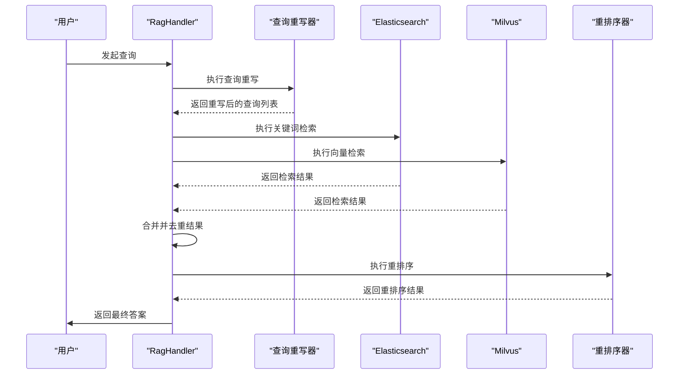
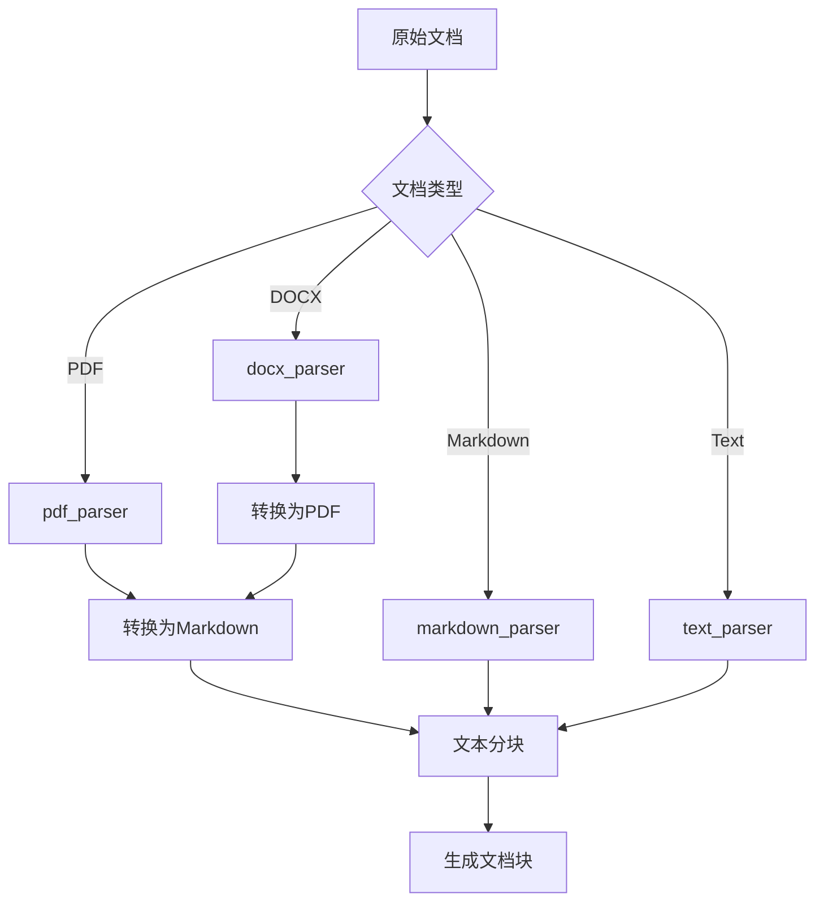
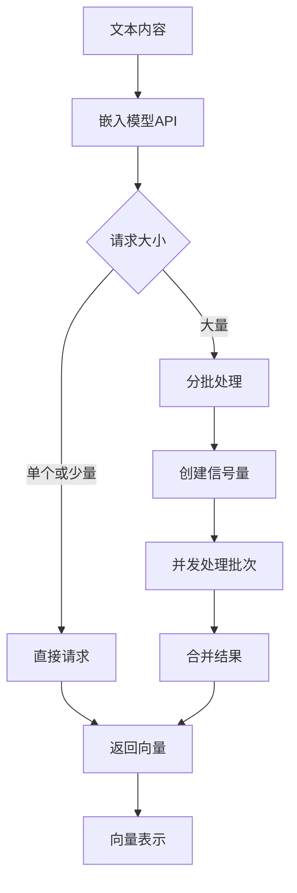
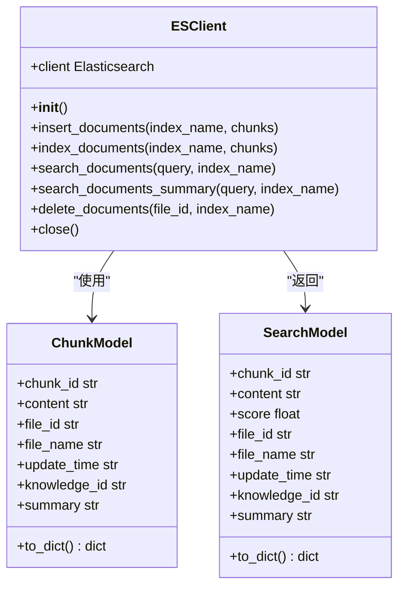
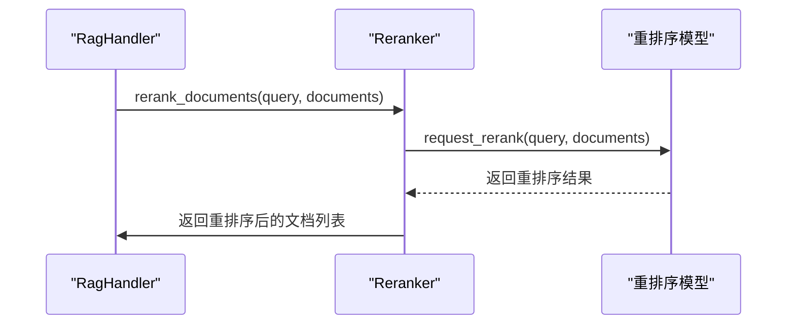

# RAG服务

## 目录
1. [RAG服务概述](#rag服务概述)
2. [核心工作流程](#核心工作流程)
3. [文档解析与分块](#文档解析与分块)
4. [向量化与嵌入模型](#向量化与嵌入模型)
5. [Elasticsearch语义搜索](#elasticsearch语义搜索)
6. [文档重排序机制](#文档重排序机制)
7. [知识库增强回答链路](#知识库增强回答链路)
8. [RAG优化建议](#rag优化建议)

## RAG服务概述

RAG（Retrieval-Augmented Generation）服务是AgentChat系统中的核心组件，负责将外部知识库与大语言模型相结合，实现基于知识库的增强式问答。该服务通过协调文档解析、向量化、检索与重排序等环节，为用户提供准确、可靠的回答。系统采用混合检索策略，结合Elasticsearch的关键词搜索和Milvus的向量语义搜索，通过重排序算法提升检索结果的相关性。

**Section sources**
- [rag_handler.py](https://github.com/Shy2593666979/AgentChat/src/backend/agentchat/services/rag_handler.py#L1-L152)
- [config.yaml](https://github.com/Shy2593666979/AgentChat/src/backend/agentchat/config.yaml#L1-L50)

## 核心工作流程

RAG服务的核心工作流程由`rag_handler.py`中的`RagHandler`类协调完成，主要包含查询重写、文档检索、重排序和结果拼接四个阶段。当用户发起查询时，系统首先通过查询重写模块生成多个相关查询，然后并行从Elasticsearch和Milvus中检索文档，对检索结果进行合并去重后，交由重排序模型进行相关性评分，最终返回最相关的文档内容。

**Diagram sources **
- [rag_handler.py](https://github.com/Shy2593666979/AgentChat/src/backend/agentchat/services/rag_handler.py#L12-L148)
- [retrieval.py](https://github.com/Shy2593666979/AgentChat/src/backend/agentchat/services/retrieval.py#L5-L46)

**Section sources**
- [rag_handler.py](https://github.com/Shy2593666979/AgentChat/src/backend/agentchat/services/rag_handler.py#L12-L148)
- [retrieval.py](https://github.com/Shy2593666979/AgentChat/src/backend/agentchat/services/retrieval.py#L5-L46)

## 文档解析与分块

文档解析与分块是RAG服务的基础环节，由`parser.py`中的`DocParser`类负责协调。系统支持多种文档格式的解析，包括PDF、DOCX、PPTX、Excel、Markdown和Text等。对于不同格式的文档，系统采用相应的解析策略，最终都将文档转换为统一的文本格式进行处理。

**Diagram sources **
- [parser.py](https://github.com/Shy2593666979/AgentChat/src/backend/agentchat/services/rag/parser.py#L13-L58)
- [doc_parser/pdf.py](https://github.com/Shy2593666979/AgentChat/src/backend/agentchat/services/rag/doc_parser/pdf.py#L18-L80)
- [doc_parser/docx.py](https://github.com/Shy2593666979/AgentChat/src/backend/agentchat/services/rag/doc_parser/docx.py#L5-L17)
- [doc_parser/markdown.py](https://github.com/Shy2593666979/AgentChat/src/backend/agentchat/services/rag/doc_parser/markdown.py#L8-L252)
- [doc_parser/text.py](https://github.com/Shy2593666979/AgentChat/src/backend/agentchat/services/rag/doc_parser/text.py#L8-L86)

**Section sources**
- [parser.py](https://github.com/Shy2593666979/AgentChat/src/backend/agentchat/services/rag/parser.py#L13-L58)
- [doc_parser/pdf.py](https://github.com/Shy2593666979/AgentChat/src/backend/agentchat/services/rag/doc_parser/pdf.py#L18-L80)
- [doc_parser/docx.py](https://github.com/Shy2593666979/AgentChat/src/backend/agentchat/services/rag/doc_parser/docx.py#L5-L17)

### PDF文档解析

PDF文档解析采用`pymupdf4llm`库将PDF转换为Markdown格式，同时提取文档中的图片并上传至阿里云OSS。在转换过程中，系统会保持文档的原始布局和格式，确保转换后的Markdown文件能够准确反映原始PDF的内容结构。转换完成后，系统会调用`markdown_parser`对Markdown文件进行进一步的分块处理。

**Section sources**
- [doc_parser/pdf.py](https://github.com/Shy2593666979/AgentChat/src/backend/agentchat/services/rag/doc_parser/pdf.py#L18-L80)

### DOCX文档解析

DOCX文档解析通过先将文档转换为PDF格式，然后复用PDF解析流程来实现。这种设计避免了重复开发文档解析逻辑，提高了代码的复用性。系统调用`convert_to_pdf`函数将DOCX文件转换为PDF，然后交由`pdf_parser`进行后续处理。这种方式确保了不同格式文档在处理流程上的一致性。

**Section sources**
- [doc_parser/docx.py](https://github.com/Shy2593666979/AgentChat/src/backend/agentchat/services/rag/doc_parser/docx.py#L5-L17)

### 文本与Markdown分块

文本和Markdown文档的分块策略有所不同。对于纯文本文件，系统采用基于换行符的分块方法，确保每个块的大小不超过配置的`chunk_size`，同时保留`overlap_size`的重叠部分以维持上下文连贯性。对于Markdown文件，系统会解析文档的标题结构，将每个标题下的内容作为一个逻辑单元进行分块，并在每个块中包含完整的标题路径，以保持文档的层次结构信息。

**Section sources**
- [doc_parser/text.py](https://github.com/Shy2593666979/AgentChat/src/backend/agentchat/services/rag/doc_parser/text.py#L8-L86)
- [doc_parser/markdown.py](https://github.com/Shy2593666979/AgentChat/src/backend/agentchat/services/rag/doc_parser/markdown.py#L8-L252)

## 向量化与嵌入模型

向量化是将文本内容转换为高维向量表示的过程，由`embedding.py`中的`get_embedding`函数实现。系统通过调用配置的嵌入模型API，将文档块和用户查询转换为向量，以便在向量数据库中进行相似性搜索。为了提高处理效率，系统对批量查询进行了优化，采用并发处理和批量请求的方式，有效降低了API调用的延迟。

**Diagram sources **
- [embedding.py](https://github.com/Shy2593666979/AgentChat/src/backend/agentchat/services/rag/embedding.py#L11-L43)

**Section sources**
- [embedding.py](https://github.com/Shy2593666979/AgentChat/src/backend/agentchat/services/rag/embedding.py#L11-L43)
- [config.yaml](https://github.com/Shy2593666979/AgentChat/src/backend/agentchat/config.yaml#L1-L50)

## Elasticsearch语义搜索

Elasticsearch集成通过`es_client.py`中的`ESClient`类实现，为系统提供高效的关键词搜索能力。当启用Elasticsearch时，系统会同时在Elasticsearch和Milvus中执行检索，然后合并结果。Elasticsearch主要用于精确匹配和关键词搜索，而Milvus则负责语义相似性搜索，两者结合可以提供更全面的检索结果。

**Diagram sources **
- [es_client.py](https://github.com/Shy2593666979/AgentChat/src/backend/agentchat/services/rag/es_client.py#L12-L199)
- [chunk.py](https://github.com/Shy2593666979/AgentChat/src/backend/agentchat/schema/chunk.py#L1-L20)
- [search.py](https://github.com/Shy2593666979/AgentChat/src/backend/agentchat/schema/search.py#L2-L23)

**Section sources**
- [es_client.py](https://github.com/Shy2593666979/AgentChat/src/backend/agentchat/services/rag/es_client.py#L12-L199)
- [chunk.py](https://github.com/Shy2593666979/AgentChat/src/backend/agentchat/schema/chunk.py#L1-L20)
- [search.py](https://github.com/Shy2593666979/AgentChat/src/backend/agentchat/schema/search.py#L2-L23)

## 文档重排序机制

文档重排序是提升检索结果质量的关键环节，由`rerank.py`中的`Reranker`类实现。系统将初步检索到的文档列表与原始查询一起发送给重排序模型，模型会为每个文档计算一个相关性分数。重排序模型能够更准确地理解查询与文档之间的语义关系，从而对检索结果进行重新排序，确保最相关的文档排在前面。

**Diagram sources **
- [rerank.py](https://github.com/Shy2593666979/AgentChat/src/backend/agentchat/services/rag/rerank.py#L9-L52)

**Section sources**
- [rerank.py](https://github.com/Shy2593666979/AgentChat/src/backend/agentchat/services/rag/rerank.py#L9-L52)
- [config.yaml](https://github.com/Shy2593666979/AgentChat/src/backend/agentchat/config.yaml#L1-L50)

## 知识库增强回答链路

知识库增强回答的完整链路展示了从用户提问到生成答案的全过程。当用户提出问题时，系统首先通过查询重写生成多个相关查询，然后在知识库中检索相关信息，对检索结果进行重排序后，将最相关的内容作为上下文提供给大语言模型，最终生成基于知识库的准确回答。

**Diagram sources **
- [rag_handler.py](https://github.com/Shy2593666979/AgentChat/src/backend/agentchat/services/rag_handler.py#L54-L145)
- [retrieval.py](https://github.com/Shy2593666979/AgentChat/src/backend/agentchat/services/retrieval.py#L37-L46)

**Section sources**
- [rag_handler.py](https://github.com/Shy2593666979/AgentChat/src/backend/agentchat/services/rag_handler.py#L54-L145)

## RAG优化建议

### 分块策略优化

合理的分块策略对RAG系统性能至关重要。对于技术文档和学术论文，建议采用较小的分块大小（256-512字符）以保持内容的精确性；对于小说和长篇文章，可以采用较大的分块大小（512-1024字符）以保持上下文连贯性。同时，应设置适当的重叠大小（128字符左右）以避免关键信息被切割。

**Section sources**
- [doc_parser/markdown.py](https://github.com/Shy2593666979/AgentChat/src/backend/agentchat/services/rag/doc_parser/markdown.py#L9-L12)
- [doc_parser/text.py](https://github.com/Shy2593666979/AgentChat/src/backend/agentchat/services/rag/doc_parser/text.py#L10-L11)

### 嵌入模型选择

嵌入模型的选择直接影响检索质量。对于中文场景，应优先选择在中文语料上训练过的嵌入模型。同时，需要考虑模型的维度和性能平衡，过高的维度会增加存储和计算成本，而过低的维度可能无法充分表达语义信息。建议通过A/B测试选择最适合业务场景的嵌入模型。

**Section sources**
- [embedding.py](https://github.com/Shy2593666979/AgentChat/src/backend/agentchat/services/rag/embedding.py#L7-L9)
- [config.yaml](https://github.com/Shy2593666979/AgentChat/src/backend/agentchat/config.yaml#L1-L50)

### 检索性能调优

检索性能调优可以从多个方面入手。首先，合理配置Elasticsearch和Milvus的索引参数，如分片数、副本数等。其次，优化查询重写策略，避免生成过多无关的查询变体。最后，通过缓存机制减少重复查询的处理时间，特别是对于高频查询可以设置专门的缓存策略。

**Section sources**
- [es_client.py](https://github.com/Shy2593666979/AgentChat/src/backend/agentchat/services/rag/es_client.py#L14-L19)
- [rag_handler.py](https://github.com/Shy2593666979/AgentChat/src/backend/agentchat/services/rag_handler.py#L28-L34)
- [config.yaml](https://github.com/Shy2593666979/AgentChat/src/backend/agentchat/config.yaml#L1-L50)
