# 服务层

## 目录
1. [概述](#概述)
2. [服务层架构](#服务层架构)
3. [核心业务服务模块](#核心业务服务模块)
4. [RAG服务集成](#rag服务集成)
5. [MCP客户端管理](#mcp客户端管理)
6. [内存服务](#内存服务)
7. [缓存服务](#缓存服务)
8. [调用链路分析](#调用链路分析)
9. [服务扩展指南](#服务扩展指南)
10. [总结](#总结)

## 概述

AgentChat服务层作为系统的核心协调模块，负责封装和管理各个业务领域的核心逻辑。服务层采用模块化设计，每个模块专注于特定的业务功能，通过统一的接口为API层提供服务支持。服务层不仅实现了业务逻辑的封装，还承担着系统组件间的协调者角色，确保各子系统能够高效协作。

服务层的主要职责包括：
- **业务逻辑封装**：将复杂的业务规则抽象为可复用的服务方法
- **组件协调**：连接API层与底层核心功能，充当系统的"粘合剂"
- **数据转换**：在不同数据格式间进行转换和标准化
- **权限控制**：实现用户权限验证和访问控制
- **错误处理**：统一的异常处理和错误响应机制

## 服务层架构

服务层采用分层架构设计，主要包含以下层次：

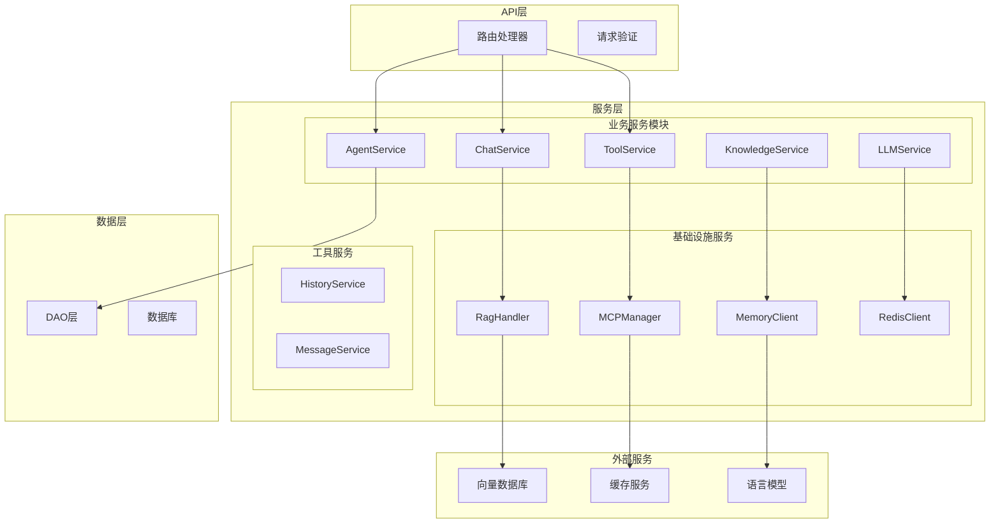

**图表来源**
- [agent.py](https://github.com/Shy2593666979/AgentChat/src/backend/agentchat/api/services/agent.py#L1-L143)
- [chat.py](https://github.com/Shy2593666979/AgentChat/src/backend/agentchat/api/services/chat.py#L1-L267)
- [rag_handler.py](https://github.com/Shy2593666979/AgentChat/src/backend/agentchat/services/rag_handler.py#L1-L152)

**章节来源**
- [agent.py](https://github.com/Shy2593666979/AgentChat/src/backend/agentchat/api/services/agent.py#L1-L143)
- [chat.py](https://github.com/Shy2593666979/AgentChat/src/backend/agentchat/api/services/chat.py#L1-L267)

## 核心业务服务模块

### AgentService - Agent生命周期管理

AgentService负责Agent的完整生命周期管理，包括创建、更新、删除和查询等操作。

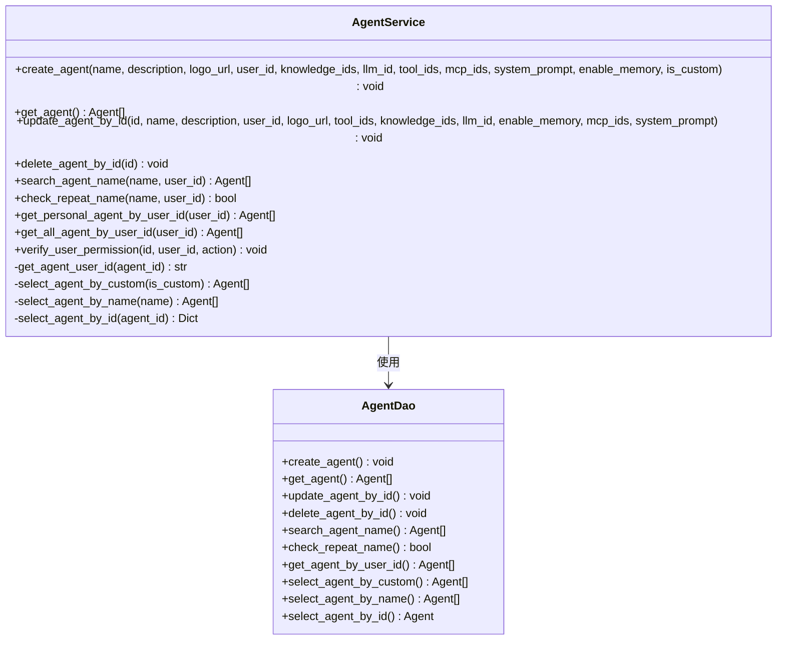

**图表来源**
- [agent.py](https://github.com/Shy2593666979/AgentChat/src/backend/agentchat/api/services/agent.py#L9-L143)

AgentService的核心功能包括：

1. **Agent创建管理**：支持自定义Agent和系统Agent的创建
2. **权限验证**：确保用户只能操作自己的Agent资源
3. **批量操作**：支持按用户ID获取所有相关Agent
4. **重复性检查**：防止创建同名Agent
5. **查询优化**：提供多种查询方式满足不同场景需求

**章节来源**
- [agent.py](https://github.com/Shy2593666979/AgentChat/src/backend/agentchat/api/services/agent.py#L1-L143)

### ChatService - 对话流程协调

ChatService是对话系统的核心协调器，负责整合各种服务组件，提供统一的对话处理能力。

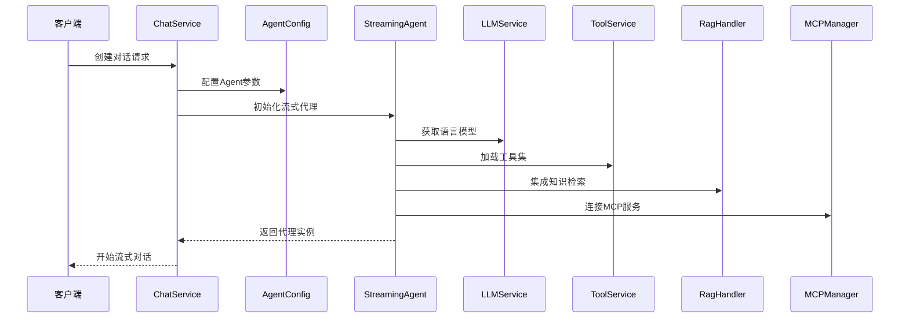

**图表来源**
- [chat.py](https://github.com/Shy2593666979/AgentChat/src/backend/agentchat/api/services/chat.py#L103-L267)

ChatService的关键特性：

1. **流式处理**：支持实时流式对话输出
2. **多模态集成**：整合工具、知识库和MCP服务
3. **中间件支持**：提供事件监听和模型调用监控
4. **并发处理**：支持多个工具同时执行
5. **错误恢复**：具备兜底机制处理模型异常

**章节来源**
- [chat.py](https://github.com/Shy2593666979/AgentChat/src/backend/agentchat/api/services/chat.py#L1-L267)

### ToolService - 工具调用管理

ToolService专门负责工具的生命周期管理和调用调度。

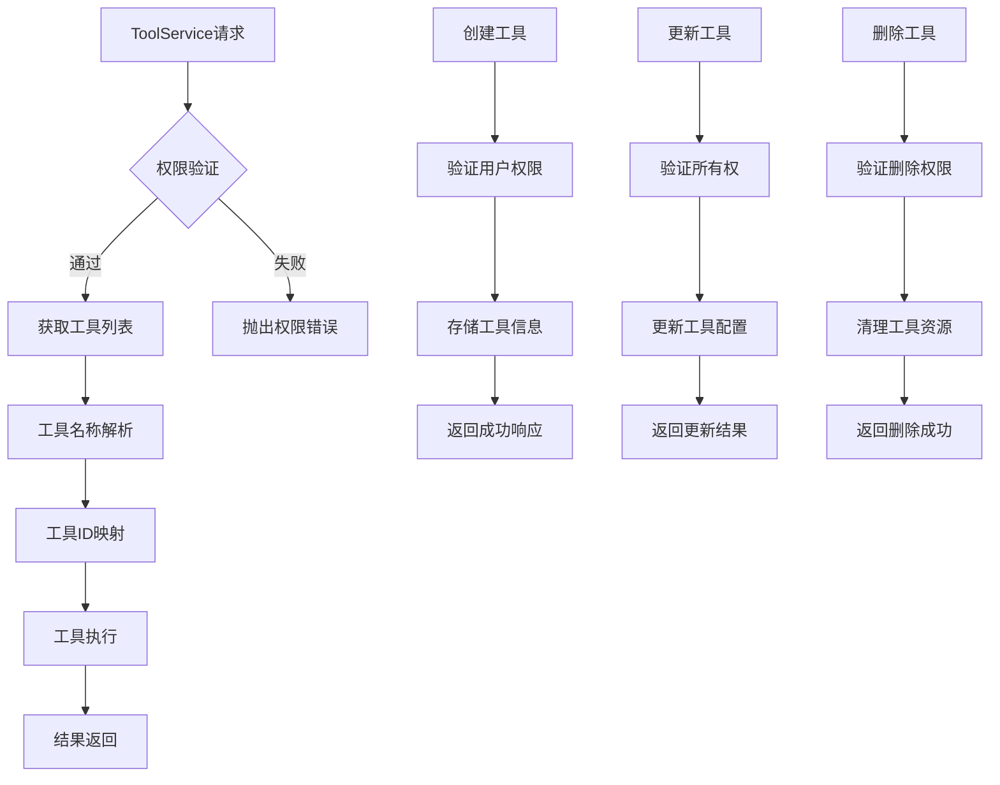

**图表来源**
- [tool.py](https://github.com/Shy2593666979/AgentChat/src/backend/agentchat/api/services/tool.py#L9-L124)

ToolService的功能特点：

1. **权限控制**：严格的用户权限验证机制
2. **工具发现**：支持按用户和系统级别查找工具
3. **批量操作**：提供工具ID和名称之间的相互转换
4. **数据标准化**：统一工具信息的数据格式
5. **系统集成**：与Agent系统无缝对接

**章节来源**
- [tool.py](https://github.com/Shy2593666979/AgentChat/src/backend/agentchat/api/services/tool.py#L1-L124)

### MCPChatService - MCP对话集成

MCPChatService专门处理MCP（Model Context Protocol）客户端的会话管理和服务集成。

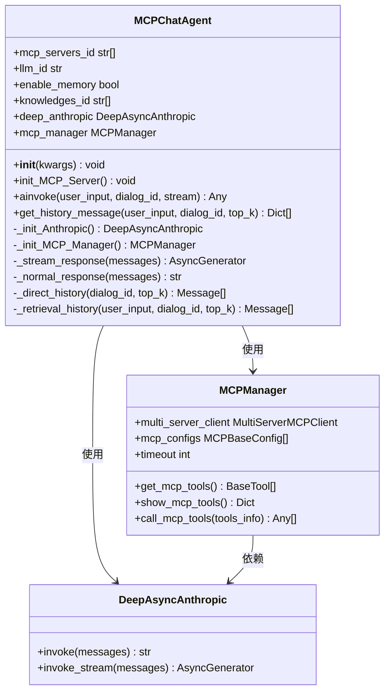

**图表来源**
- [mcp_chat.py](https://github.com/Shy2593666979/AgentChat/src/backend/agentchat/api/services/mcp_chat.py#L11-L85)
- [manager.py](https://github.com/Shy2593666979/AgentChat/src/backend/agentchat/services/mcp/manager.py#L13-L103)

**章节来源**
- [mcp_chat.py](https://github.com/Shy2593666979/AgentChat/src/backend/agentchat/api/services/mcp_chat.py#L1-L85)

## RAG服务集成

RagHandler是知识检索增强生成（RAG）系统的核心组件，负责整合向量数据库和全文搜索引擎。

### RAG处理流程

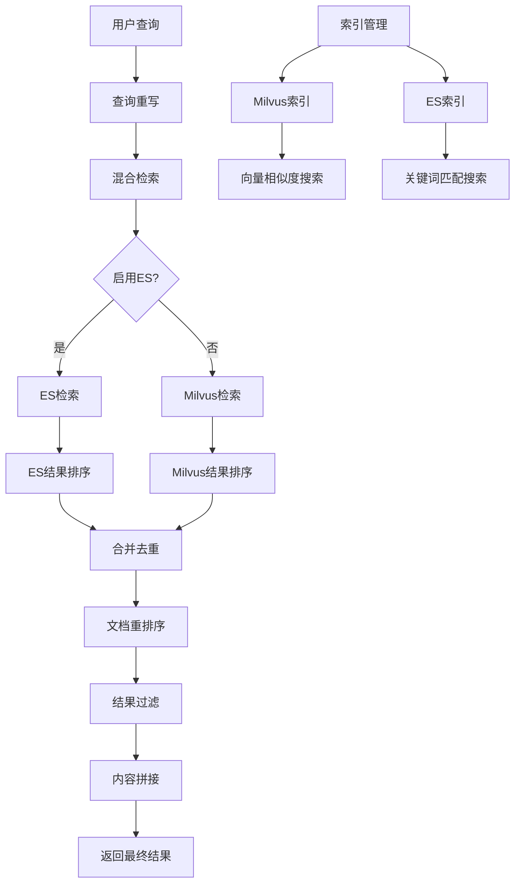

**图表来源**
- [rag_handler.py](https://github.com/Shy2593666979/AgentChat/src/backend/agentchat/services/rag_handler.py#L12-L152)
- [retrieval.py](https://github.com/Shy2593666979/AgentChat/src/backend/agentchat/services/retrieval.py#L5-L46)

RagHandler的核心功能：

1. **多源检索**：同时利用ES和Milvus进行知识检索
2. **查询重写**：智能改写查询以提高检索效果
3. **结果融合**：合并不同检索源的结果并去重
4. **重排序算法**：使用rerank模型优化检索结果
5. **索引管理**：支持文档的增删改查操作

**章节来源**
- [rag_handler.py](https://github.com/Shy2593666979/AgentChat/src/backend/agentchat/services/rag_handler.py#L1-L152)
- [retrieval.py](https://github.com/Shy2593666979/AgentChat/src/backend/agentchat/services/retrieval.py#L1-L46)

## MCP客户端管理

MCP（Model Context Protocol）管理器负责协调多个MCP服务器的连接和通信。

### MCP管理架构

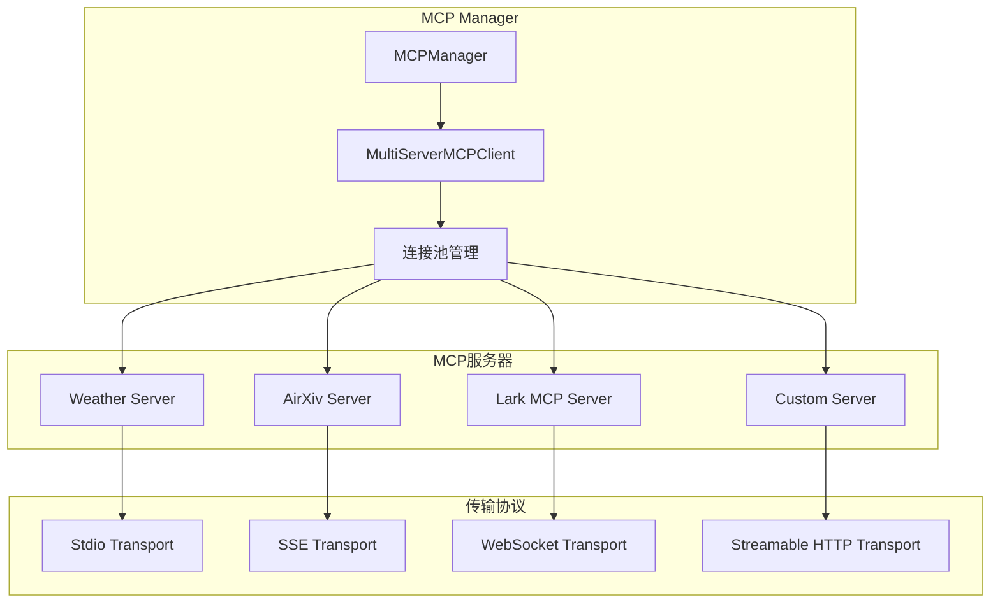

**图表来源**
- [manager.py](https://github.com/Shy2593666979/AgentChat/src/backend/agentchat/services/mcp/manager.py#L13-L103)
- [sessions.py](https://github.com/Shy2593666979/AgentChat/src/backend/agentchat/services/mcp/sessions.py#L1-L412)

MCPManager的关键特性：

1. **多服务器支持**：同时管理多个MCP服务器连接
2. **异步工具调用**：支持并发执行多个MCP工具
3. **传输协议适配**：支持多种MCP传输协议
4. **连接状态管理**：维护服务器连接的健康状态
5. **工具发现机制**：动态获取服务器提供的工具列表

**章节来源**
- [manager.py](https://github.com/Shy2593666979/AgentChat/src/backend/agentchat/services/mcp/manager.py#L1-L103)
- [sessions.py](https://github.com/Shy2593666979/AgentChat/src/backend/agentchat/services/mcp/sessions.py#L1-L412)

## 内存服务

MemoryClient提供了完整的记忆管理系统，支持语义记忆、情节记忆和程序记忆。

### 内存类型与管理

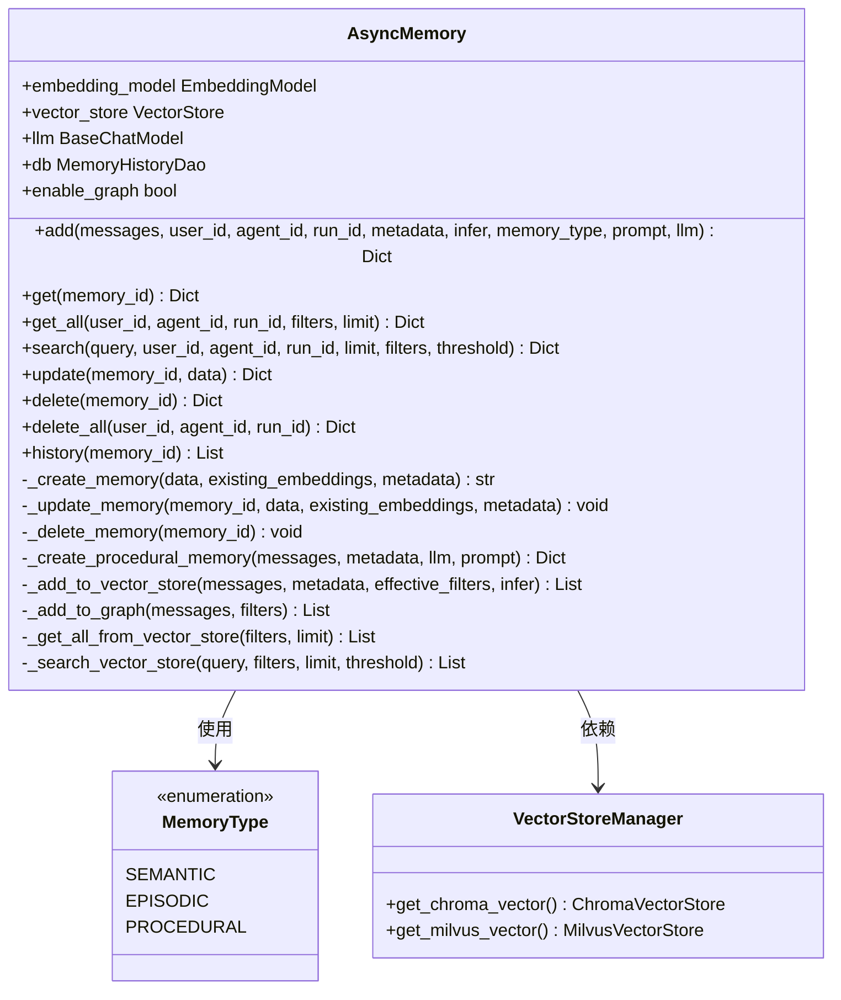

**图表来源**
- [client.py](https://github.com/Shy2593666979/AgentChat/src/backend/agentchat/services/memory/client.py#L118-L865)

MemoryClient的核心功能：

1. **多类型记忆**：支持语义、情节和程序三种记忆类型
2. **向量化存储**：使用嵌入模型将文本转换为向量存储
3. **智能推理**：自动从对话中提取新事实并更新记忆
4. **历史追踪**：记录记忆的变更历史
5. **关系图谱**：支持记忆间的关联关系建模

**章节来源**
- [client.py](https://github.com/Shy2593666979/AgentChat/src/backend/agentchat/services/memory/client.py#L1-L865)

## 缓存服务

RedisClient提供了高性能的缓存服务，主要用于会话状态管理和临时数据存储。

### 缓存服务功能

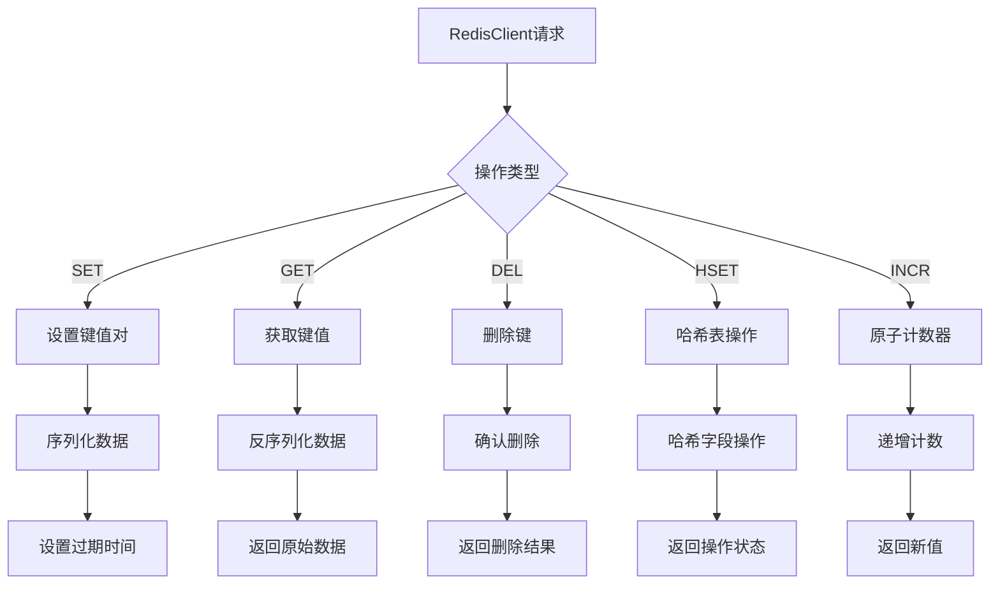

**图表来源**
- [redis.py](https://github.com/Shy2593666979/AgentChat/src/backend/agentchat/services/redis.py#L12-L115)

RedisClient的特点：

1. **多种数据结构**：支持字符串、哈希表、列表等多种数据类型
2. **自动序列化**：透明地处理Python对象的序列化和反序列化
3. **过期策略**：支持设置键的生存时间
4. **原子操作**：提供原子性的计数器操作
5. **连接池管理**：高效的连接池和资源管理

**章节来源**
- [redis.py](https://github.com/Shy2593666979/AgentChat/src/backend/agentchat/services/redis.py#L1-L115)

## 调用链路分析

服务层作为API接口与底层核心功能之间的桥梁，其调用链路体现了系统的整体架构设计。

### 典型调用流程

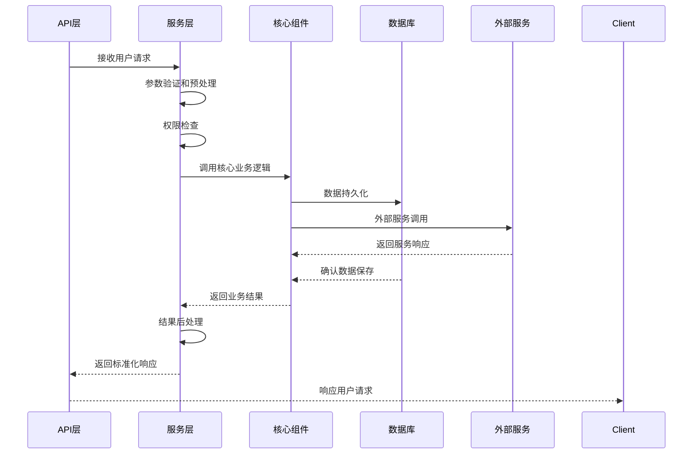

### 服务层职责映射

| 服务层模块 | 主要职责 | 协调的对象 |
|-----------|---------|-----------|
| AgentService | Agent生命周期管理 | AgentDao, 权限验证 |
| ChatService | 对话流程协调 | LLMService, ToolService, RagHandler, MCPManager |
| ToolService | 工具管理 | ToolDao, 权限控制 |
| KnowledgeService | 知识库管理 | KnowledgeDao, 文件处理 |
| LLMService | 模型管理 | 模型提供商API |
| HistoryService | 历史记录管理 | 数据库, 向量存储 |
| MessageService | 消息反馈管理 | 数据库 |
| MemoryClient | 记忆管理 | 向量数据库, 嵌入模型 |
| RedisClient | 缓存管理 | Redis服务器 |

**章节来源**
- [agent.py](https://github.com/Shy2593666979/AgentChat/src/backend/agentchat/api/services/agent.py#L1-L143)
- [chat.py](https://github.com/Shy2593666979/AgentChat/src/backend/agentchat/api/services/chat.py#L1-L267)
- [tool.py](https://github.com/Shy2593666979/AgentChat/src/backend/agentchat/api/services/tool.py#L1-L124)

## 服务扩展指南

### 添加新业务服务模块

要向服务层添加新的业务服务模块，需要遵循以下步骤：

#### 1. 创建服务类

```python
# 示例：创建一个新的服务类
class NewService:
    @classmethod
    async def create_new_resource(cls, user_id: str, data: Dict):
        # 1. 权限验证
        # 2. 参数验证
        # 3. 业务逻辑处理
        # 4. 数据持久化
        # 5. 返回结果
        pass
    
    @classmethod
    async def get_new_resources(cls, user_id: str, filters: Dict):
        # 实现资源查询功能
        pass
```

#### 2. 集成到现有架构

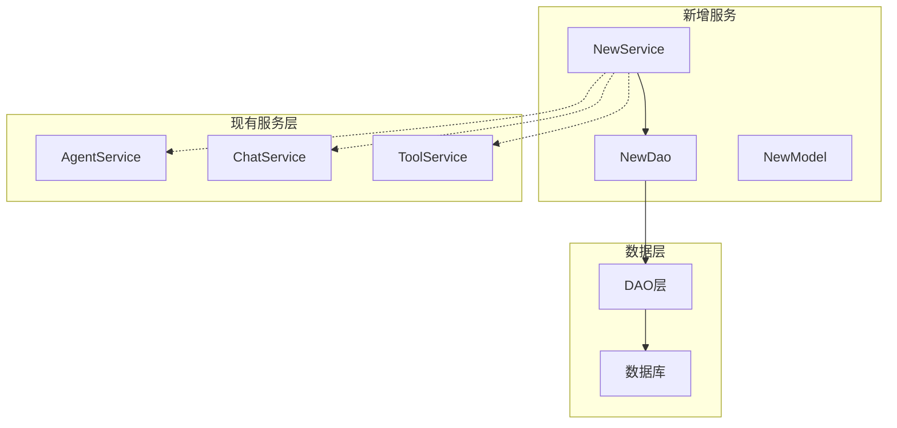

#### 3. 配置依赖注入

```python
# 在适当的位置注册新服务
class ServiceRegistry:
    @staticmethod
    def get_service(service_name: str):
        services = {
            'new_service': NewService,
            # 其他服务...
        }
        return services.get(service_name)
```

#### 4. 添加API路由

```python
# 在API层添加新的路由
router = APIRouter()

@router.post("/new-resources")
async def create_new_resource(
    user_id: str = Depends(get_current_user),
    data: NewResourceSchema = Body(...)
):
    return await NewService.create_new_resource(user_id, data)
```

### 扩展服务功能的最佳实践

1. **单一职责原则**：每个服务类只负责一个特定的业务领域
2. **依赖倒置**：通过接口或抽象基类定义依赖关系
3. **异常处理**：统一的异常处理和错误响应机制
4. **日志记录**：详细的日志记录便于调试和监控
5. **测试覆盖**：为每个服务方法编写单元测试

### 性能优化建议

1. **异步编程**：充分利用异步I/O提升并发性能
2. **连接池**：合理使用数据库和外部服务的连接池
3. **缓存策略**：对频繁访问的数据实施缓存
4. **批量操作**：减少数据库往返次数
5. **资源管理**：及时释放不再使用的资源

## 总结

AgentChat服务层通过模块化设计实现了高度的可维护性和可扩展性。各个服务模块各司其职，既保持了独立性又确保了良好的协作性。服务层作为系统的核心协调者，不仅封装了复杂的业务逻辑，还为上层API提供了简洁统一的接口。

### 关键优势

1. **清晰的职责分离**：每个服务模块专注于特定的业务功能
2. **强大的扩展性**：模块化设计便于添加新的业务功能
3. **高效的协作机制**：通过统一的接口实现组件间的协调
4. **完善的错误处理**：统一的异常处理确保系统的稳定性
5. **灵活的配置管理**：支持多种部署和运行时配置

### 技术特色

- **异步架构**：充分利用异步编程提升系统性能
- **多模态集成**：支持文本、图像等多种输入形式
- **智能记忆系统**：提供长期记忆和短期记忆管理
- **知识检索增强**：深度集成RAG技术提升对话质量
- **MCP协议支持**：原生支持Model Context Protocol

服务层的设计充分体现了现代软件架构的最佳实践，为构建高质量的AI对话系统奠定了坚实的基础。通过持续的优化和扩展，服务层将继续支撑AgentChat系统的发展和演进。
