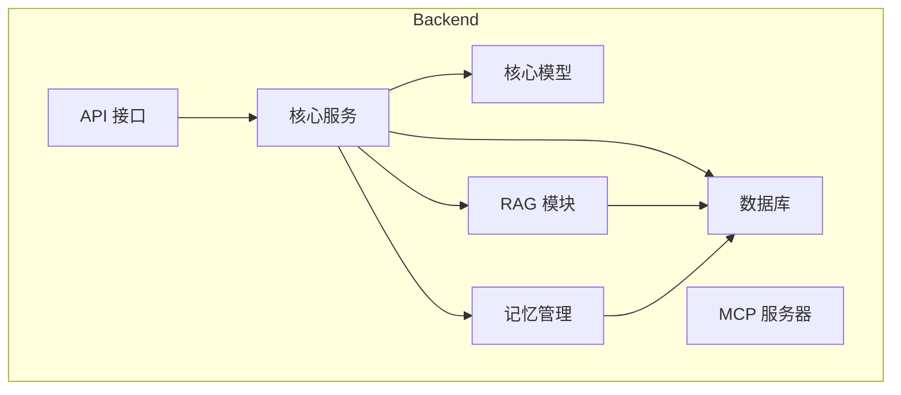
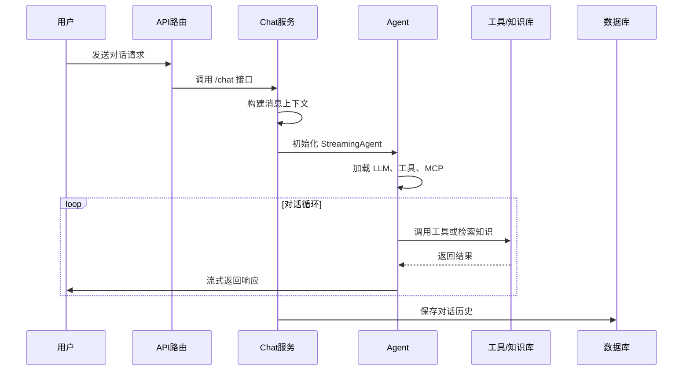
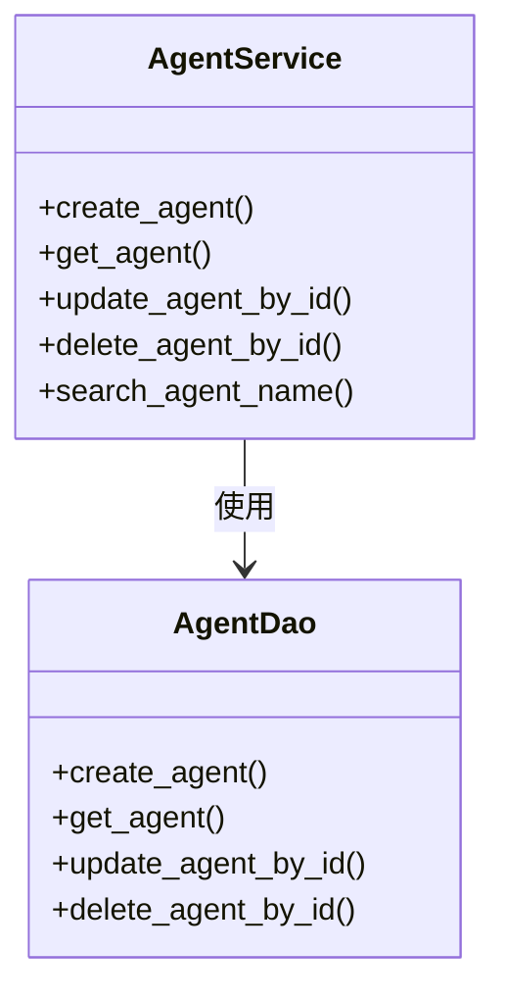
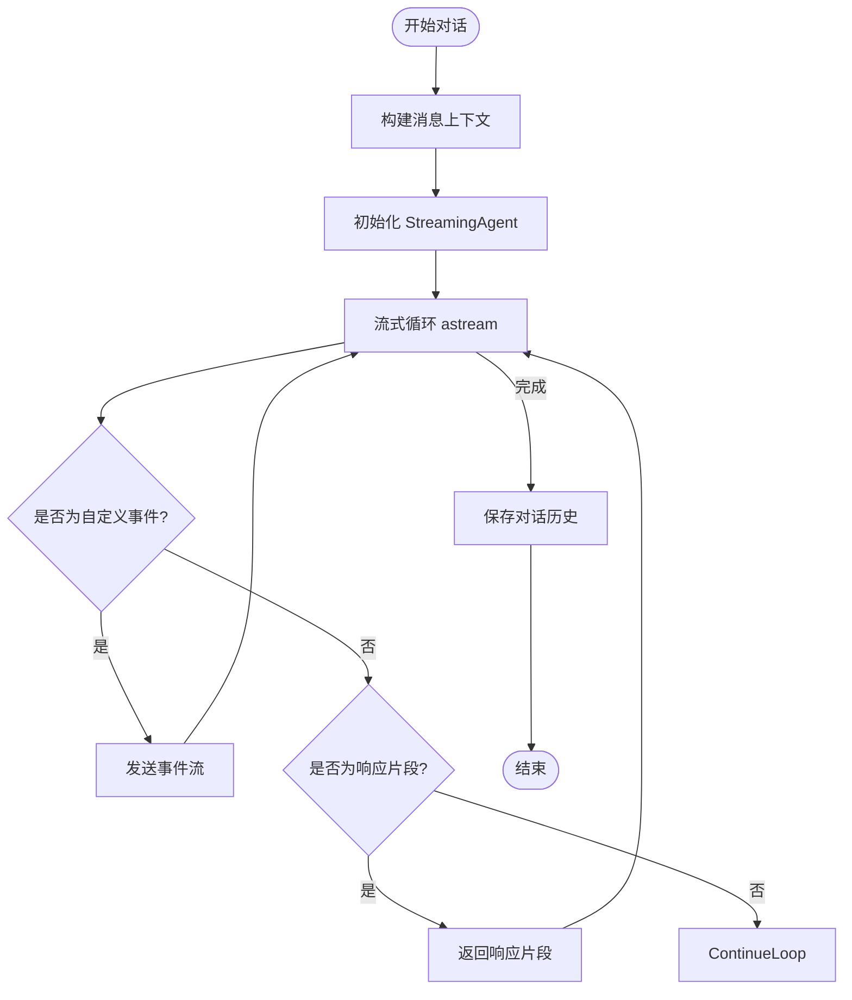
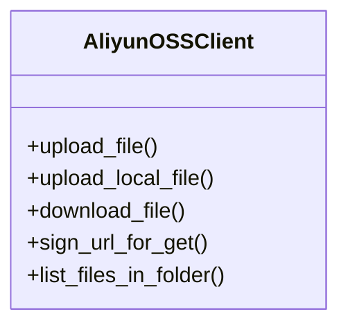
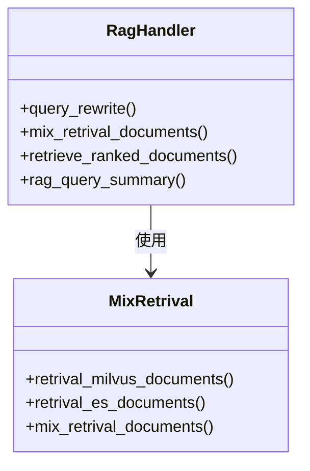
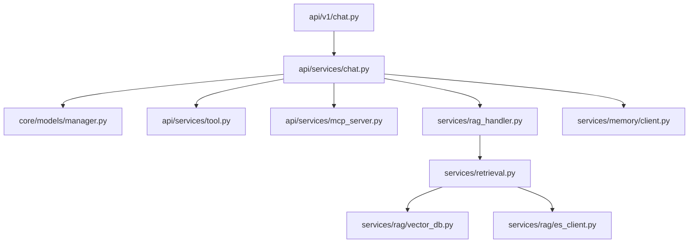

# 核心服务

## 目录
1. [引言](#引言)
2. [项目结构](#项目结构)
3. [核心组件](#核心组件)
4. [架构概述](#架构概述)
5. [详细组件分析](#详细组件分析)
6. [依赖分析](#依赖分析)
7. [性能考虑](#性能考虑)
8. [故障排除指南](#故障排除指南)
9. [结论](#结论)

## 引言
AgentChat 是一个基于智能体（Agent）的对话系统，支持多工具调用、知识检索、记忆管理与文件存储等核心功能。本文档深入解析其核心服务模块的实现机制，涵盖 Agent 的创建与配置、对话流程协调、工具调度、对象存储集成、知识检索能力以及各服务间的协作关系，并提供扩展指南。

## 项目结构
AgentChat 项目采用分层架构，主要分为前端（frontend）和后端（backend）。后端核心逻辑位于 `src/backend/agentchat` 目录下，包含 API 接口、核心模型、数据库访问、MCP 服务器、中间件、提示词、数据模型、服务实现等模块。核心服务逻辑集中在 `services` 目录下，如 `agent.py`、`chat.py`、`tool.py`、`aliyun_oss.py` 和 `retrieval.py`。

**图源**  
- [src/backend/agentchat/api/services](https://github.com/Shy2593666979/AgentChat/src/backend/agentchat/api/services)
- [src/backend/agentchat/services](https://github.com/Shy2593666979/AgentChat/src/backend/agentchat/services)

**本节来源**  
- [src/backend/agentchat](https://github.com/Shy2593666979/AgentChat/src/backend/agentchat)

## 核心组件
本系统的核心组件包括 Agent 管理、对话流处理、工具调度、对象存储和知识检索。`agent.py` 负责 Agent 的生命周期管理；`chat.py` 协调对话流程与上下文维护；`tool.py` 实现内置工具的调度；`aliyun_oss.py` 提供阿里云 OSS 集成；`retrieval.py` 支持混合检索能力。

**本节来源**  
- [src/backend/agentchat/api/services/agent.py](https://github.com/Shy2593666979/AgentChat/src/backend/agentchat/api/services/agent.py)
- [src/backend/agentchat/api/services/chat.py](https://github.com/Shy2593666979/AgentChat/src/backend/agentchat/api/services/chat.py)
- [src/backend/agentchat/api/services/tool.py](https://github.com/Shy2593666979/AgentChat/src/backend/agentchat/api/services/tool.py)
- [src/backend/agentchat/services/aliyun_oss.py](https://github.com/Shy2593666979/AgentChat/src/backend/agentchat/services/aliyun_oss.py)
- [src/backend/agentchat/services/retrieval.py](https://github.com/Shy2593666979/AgentChat/src/backend/agentchat/services/retrieval.py)

## 架构概述
系统采用微服务与模块化设计，用户请求通过 FastAPI 路由进入，由 `v1/chat.py` 处理，调用 `StreamingAgent` 执行对话逻辑。Agent 根据配置加载 LLM、工具和 MCP 服务，通过 `RagHandler` 进行知识检索，并利用 `memory_client` 管理长期记忆。文件上传则通过 `AliyunOSSClient` 与阿里云 OSS 交互。

**图源**  
- [src/backend/agentchat/api/v1/chat.py](https://github.com/Shy2593666979/AgentChat/src/backend/agentchat/api/v1/chat.py)
- [src/backend/agentchat/api/services/chat.py](https://github.com/Shy2593666979/AgentChat/src/backend/agentchat/api/services/chat.py)

## 详细组件分析

### Agent 管理分析
`AgentService` 类负责 Agent 的创建、查询、更新和删除。它通过 `AgentDao` 与数据库交互，实现对 Agent 元数据（如名称、描述、LLM、工具、知识库等）的持久化管理。API 层的 `v1/agent.py` 提供了 REST 接口，支持用户通过 HTTP 请求操作 Agent。

**图源**  
- [src/backend/agentchat/api/services/agent.py](https://github.com/Shy2593666979/AgentChat/src/backend/agentchat/api/services/agent.py)
- [src/backend/agentchat/database/dao/agent.py](https://github.com/Shy2593666979/AgentChat/src/backend/agentchat/database/dao/agent.py)

**本节来源**  
- [src/backend/agentchat/api/services/agent.py](https://github.com/Shy2593666979/AgentChat/src/backend/agentchat/api/services/agent.py)
- [src/backend/agentchat/api/v1/agent.py](https://github.com/Shy2593666979/AgentChat/src/backend/agentchat/api/v1/agent.py)

### 对话流程分析
`StreamingAgent` 是对话的核心执行者，它基于 LangGraph 构建，支持流式响应。`chat.py` 中的 `astream` 方法实现了流式生成，通过 `EmitEventAgentMiddleware` 监听工具调用事件，并将响应分块返回给前端。`v1/chat.py` 的 `WatchedStreamingResponse` 支持客户端断开连接时的优雅停止。

**图源**  
- [src/backend/agentchat/api/services/chat.py](https://github.com/Shy2593666979/AgentChat/src/backend/agentchat/api/services/chat.py)
- [src/backend/agentchat/api/v1/chat.py](https://github.com/Shy2593666979/AgentChat/src/backend/agentchat/api/v1/chat.py)

**本节来源**  
- [src/backend/agentchat/api/services/chat.py](https://github.com/Shy2593666979/AgentChat/src/backend/agentchat/api/services/chat.py)
- [src/backend/agentchat/api/v1/chat.py](https://github.com/Shy2593666979/AgentChat/src/backend/agentchat/api/v1/chat.py)

### 工具调度分析
工具调度由 `ToolService` 和 `AgentToolsWithName` 实现。`StreamingAgent` 在初始化时通过 `setup_tools` 方法加载配置的工具。工具以 LangChain `@tool` 装饰器定义，支持同步和异步调用。MCP 服务也被封装为工具，通过 `setup_mcp_agent_as_tools` 动态创建。

**本节来源**  
- [src/backend/agentchat/api/services/tool.py](https://github.com/Shy2593666979/AgentChat/src/backend/agentchat/api/services/tool.py)
- [src/backend/agentchat/tools](https://github.com/Shy2593666979/AgentChat/src/backend/agentchat/tools)

### 对象存储分析
`AliyunOSSClient` 封装了阿里云 OSS 的基本操作，包括文件上传、下载、删除和生成临时访问 URL。该服务通过 `app_settings` 加载配置，并使用 `oss2` SDK 与 OSS 服务交互，为系统提供可靠的文件存储能力。

**图源**  
- [src/backend/agentchat/services/aliyun_oss.py](https://github.com/Shy2593666979/AgentChat/src/backend/agentchat/services/aliyun_oss.py)

**本节来源**  
- [src/backend/agentchat/services/aliyun_oss.py](https://github.com/Shy2593666979/AgentChat/src/backend/agentchat/services/aliyun_oss.py)

### 知识检索分析
知识检索由 `retrieval.py` 和 `rag_handler.py` 共同实现。`MixRetrival` 类支持从 Milvus 和 Elasticsearch 混合检索文档。`RagHandler` 则封装了完整的 RAG 流程：查询重写、混合检索、结果去重与重排序，最终返回拼接的上下文信息供 LLM 使用。

**图源**  
- [src/backend/agentchat/services/retrieval.py](https://github.com/Shy2593666979/AgentChat/src/backend/agentchat/services/retrieval.py)
- [src/backend/agentchat/services/rag_handler.py](https://github.com/Shy2593666979/AgentChat/src/backend/agentchat/services/rag_handler.py)

**本节来源**  
- [src/backend/agentchat/services/retrieval.py](https://github.com/Shy2593666979/AgentChat/src/backend/agentchat/services/retrieval.py)
- [src/backend/agentchat/services/rag_handler.py](https://github.com/Shy2593666979/AgentChat/src/backend/agentchat/services/rag_handler.py)

## 依赖分析
系统依赖关系清晰，API 层依赖服务层，服务层依赖核心模型、数据库和外部服务。`chat.py` 依赖 `tool.py`、`mcp_server.py`、`rag_handler.py` 和 `memory/client.py`。`rag_handler.py` 依赖 `retrieval.py` 和向量数据库客户端。`aliyun_oss.py` 作为独立模块，仅依赖 `oss2` SDK 和配置。

**图源**  
- [src/backend/agentchat/api/services/chat.py](https://github.com/Shy2593666979/AgentChat/src/backend/agentchat/api/services/chat.py)
- [src/backend/agentchat/services/rag_handler.py](https://github.com/Shy2593666979/AgentChat/src/backend/agentchat/services/rag_handler.py)

**本节来源**  
- [src/backend/agentchat](https://github.com/Shy2593666979/AgentChat/src/backend/agentchat)

## 性能考虑
系统在性能方面进行了多项优化：使用异步 I/O 提高并发处理能力；通过向量数据库和 Elasticsearch 实现高效的知识检索；采用流式响应减少用户等待时间；利用内存客户端（memory_client）缓存和检索上下文，避免重复计算。建议在高并发场景下对数据库和向量库进行性能调优。

## 故障排除指南
常见问题包括：Agent 创建失败（检查名称重复）、对话流中断（检查网络和流式响应处理）、知识检索为空（检查知识库索引和查询重写）、文件上传失败（检查 OSS 配置和权限）。可通过日志（loguru）定位具体错误，检查相关服务的配置和依赖是否正常。

**本节来源**  
- [src/backend/agentchat/api/services/agent.py](https://github.com/Shy2593666979/AgentChat/src/backend/agentchat/api/services/agent.py)
- [src/backend/agentchat/api/services/chat.py](https://github.com/Shy2593666979/AgentChat/src/backend/agentchat/api/services/chat.py)
- [src/backend/agentchat/services/aliyun_oss.py](https://github.com/Shy2593666979/AgentChat/src/backend/agentchat/services/aliyun_oss.py)

## 结论
AgentChat 核心服务模块设计合理，功能完整，通过模块化和异步编程实现了高性能的智能对话系统。其灵活的 Agent 配置、强大的工具调度和知识检索能力，为构建复杂的 AI 应用提供了坚实基础。未来可进一步优化检索算法、增强记忆管理，并支持更多外部工具集成。
