# 记忆服务架构与实现文档

## 目录
1. [简介](#简介)
2. [项目结构](#项目结构)
3. [核心组件](#核心组件)
4. [架构概览](#架构概览)
5. [详细组件分析](#详细组件分析)
6. [向量数据库实现](#向量数据库实现)
7. [Redis缓存系统](#redis缓存系统)
8. [配置管理](#配置管理)
9. [性能优化策略](#性能优化策略)
10. [使用示例](#使用示例)
11. [故障排除指南](#故障排除指南)
12. [总结](#总结)

## 简介

记忆服务是AgentChat平台的核心组件之一，负责管理和维护用户的对话历史、个人偏好、知识记忆等信息。该服务采用模块化设计，支持多种向量数据库后端（Chroma和Milvus），并通过Redis提供高效的缓存机制，确保系统的高性能和可扩展性。

记忆服务的主要功能包括：
- 对话历史的向量化存储与检索
- 用户偏好的长期记忆管理
- 智能的事实提取与记忆更新
- 多模态内容（文本、图像）的记忆处理
- 高效的相似性搜索与匹配

## 项目结构

记忆服务的文件组织遵循清晰的分层架构：

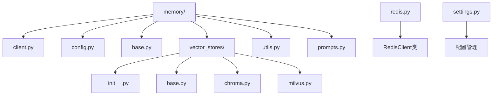

**图表来源**
- [client.py](https://github.com/Shy2593666979/AgentChat/tree/main/src/backend/agentchat/services/memory/client.py#L1-L50)
- [vector_stores/__init__.py](https://github.com/Shy2593666979/AgentChat/tree/main/src/backend/agentchat/services/memory/vector_stores/__init__.py#L1-L14)

**章节来源**
- [client.py](https://github.com/Shy2593666979/AgentChat/tree/main/src/backend/agentchat/services/memory/client.py#L1-L100)
- [config.py](https://github.com/Shy2593666979/AgentChat/tree/main/src/backend/agentchat/services/memory/config.py#L1-L15)

## 核心组件

记忆服务由以下核心组件构成：

### AsyncMemory类
主要的记忆管理类，继承自MemoryBase抽象基类，提供异步的内存操作接口。

### VectorStoreManager类  
向量数据库管理器，负责在Chroma和Milvus之间进行切换。

### RedisClient类  
Redis缓存客户端，提供会话上下文、用户配置和临时数据的缓存功能。

### MemoryItem模型  
定义记忆数据的标准结构，包含唯一标识符、记忆内容、元数据和时间戳。

**章节来源**
- [client.py](https://github.com/Shy2593666979/AgentChat/tree/main/src/backend/agentchat/services/memory/client.py#L118-L200)
- [config.py](https://github.com/Shy2593666979/AgentChat/tree/main/src/backend/agentchat/services/memory/config.py#L4-L15)

## 架构概览

记忆服务采用分层架构设计，确保各组件间的松耦合和高内聚：

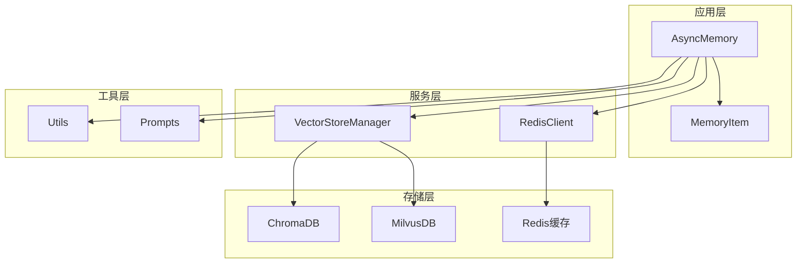

**图表来源**
- [client.py](https://github.com/Shy2593666979/AgentChat/tree/main/src/backend/agentchat/services/memory/client.py#L118-L130)
- [vector_stores/__init__.py](https://github.com/Shy2593666979/AgentChat/tree/main/src/backend/agentchat/services/memory/vector_stores/__init__.py#L4-L14)
- [redis.py](https://github.com/Shy2593666979/AgentChat/tree/main/src/backend/agentchat/services/redis.py#L12-L20)

## 详细组件分析

### AsyncMemory类详细分析

AsyncMemory类是记忆服务的核心控制器，提供了完整的记忆生命周期管理：

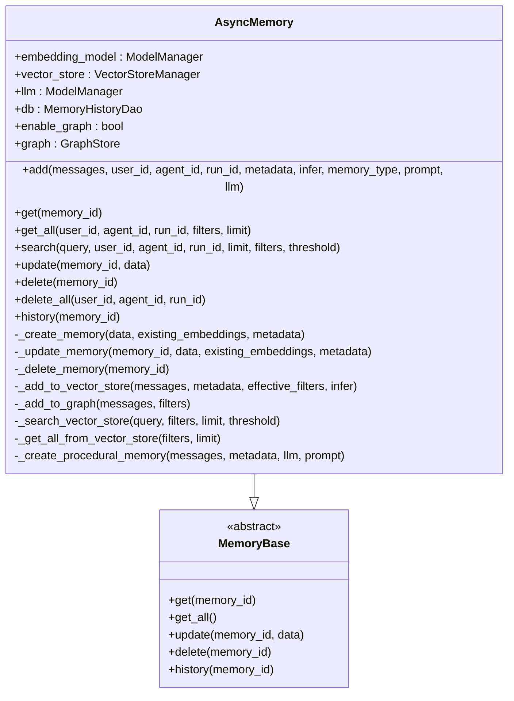

**图表来源**
- [client.py](https://github.com/Shy2593666979/AgentChat/tree/main/src/backend/agentchat/services/memory/client.py#L118-L865)
- [base.py](https://github.com/Shy2593666979/AgentChat/tree/main/src/backend/agentchat/services/memory/base.py#L4-L64)

#### 主要方法说明

| 方法 | 功能 | 参数 | 返回值 |
|------|------|------|--------|
| add | 添加新记忆 | messages, user_id, agent_id, run_id, metadata, infer, memory_type | 操作结果字典 |
| get | 获取指定记忆 | memory_id | 记忆对象或None |
| get_all | 获取所有记忆 | user_id, agent_id, run_id, filters, limit | 记忆列表 |
| search | 搜索相似记忆 | query, user_id, agent_id, run_id, limit, filters, threshold | 搜索结果 |
| update | 更新记忆内容 | memory_id, data | 更新成功消息 |
| delete | 删除指定记忆 | memory_id | 删除成功消息 |
| delete_all | 批量删除记忆 | user_id, agent_id, run_id | 删除成功消息 |

**章节来源**
- [client.py](https://github.com/Shy2593666979/AgentChat/tree/main/src/backend/agentchat/services/memory/client.py#L131-L865)

### MemoryItem模型分析

MemoryItem是记忆数据的标准结构定义：

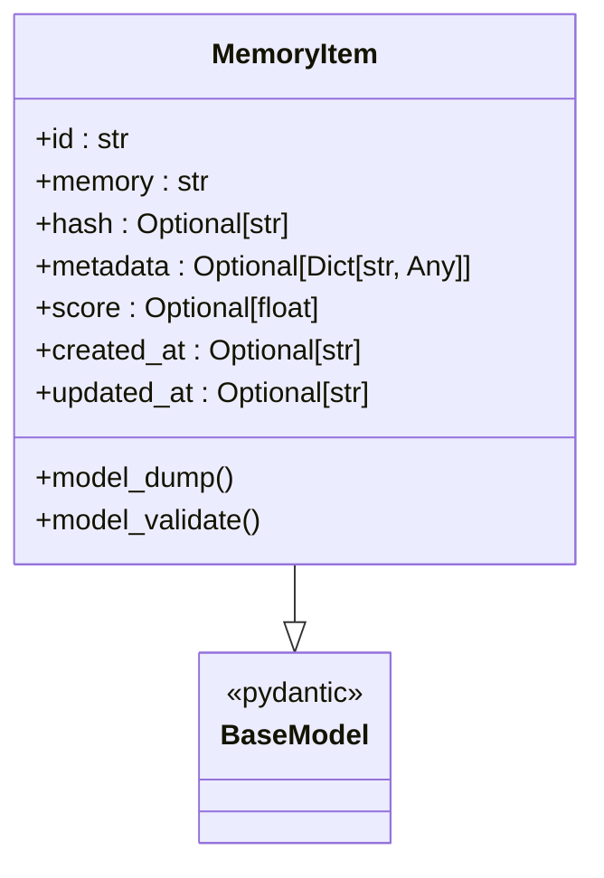

**图表来源**
- [config.py](https://github.com/Shy2593666979/AgentChat/tree/main/src/backend/agentchat/services/memory/config.py#L4-L15)

**章节来源**
- [config.py](https://github.com/Shy2593666979/AgentChat/tree/main/src/backend/agentchat/services/memory/config.py#L1-L15)

## 向量数据库实现

记忆服务支持两种主要的向量数据库后端：Chroma和Milvus。

### ChromaDB实现

ChromaDB是一个轻量级的向量数据库，适合开发和小规模部署：

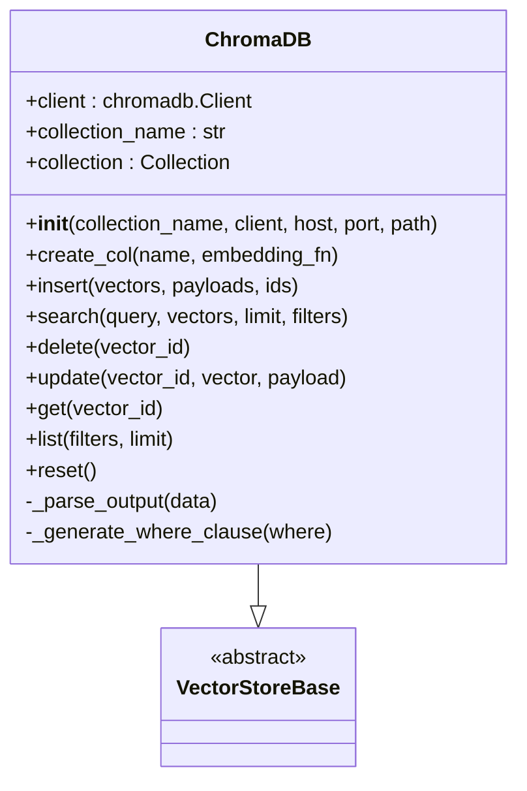

**图表来源**
- [chroma.py](https://github.com/Shy2593666979/AgentChat/tree/main/src/backend/agentchat/services/memory/vector_stores/chroma.py#L23-L255)

#### ChromaDB特性

| 特性 | 描述 | 配置选项 |
|------|------|----------|
| 存储类型 | 内存/本地文件 | persist_directory, is_persistent |
| 连接方式 | 本地/远程服务器 | host, port, chroma_server_host |
| 嵌入函数 | 自动处理 | embedding_function |
| 查询过滤 | 支持复杂条件 | where_clause |
| 性能特点 | 快速启动，适合开发 | 内存优先 |

**章节来源**
- [chroma.py](https://github.com/Shy2593666979/AgentChat/tree/main/src/backend/agentchat/services/memory/vector_stores/chroma.py#L24-L80)

### MilvusDB实现

Milvus是一个高性能的向量数据库，适合生产环境和大规模部署：

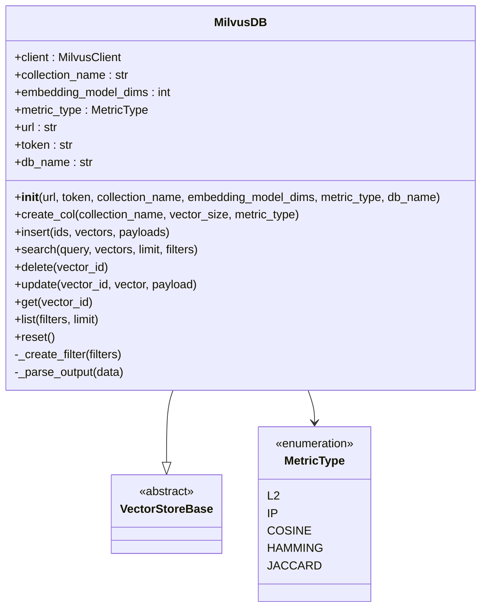

**图表来源**
- [milvus.py](https://github.com/Shy2593666979/AgentChat/tree/main/src/backend/agentchat/services/memory/vector_stores/milvus.py#L39-L262)

#### MilvusDB特性对比

| 特性 | ChromaDB | MilvusDB |
|------|----------|----------|
| 部署复杂度 | 低，单机部署 | 中等，需要独立服务 |
| 可扩展性 | 有限 | 高，支持分布式 |
| 性能 | 中等 | 高，优化的索引 |
| 功能丰富度 | 基础功能 | 完整企业级功能 |
| 社区支持 | 活跃社区 | 企业支持 |

**章节来源**
- [milvus.py](https://github.com/Shy2593666979/AgentChat/tree/main/src/backend/agentchat/services/memory/vector_stores/milvus.py#L40-L80)

### 向量存储管理器

VectorStoreManager提供统一的向量数据库访问接口：

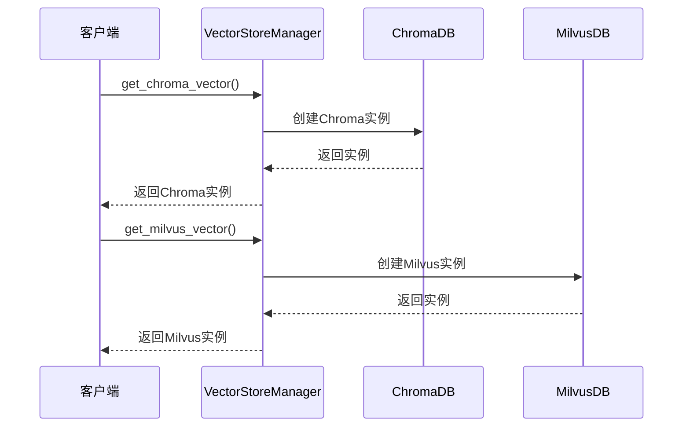

**图表来源**
- [__init__.py](https://github.com/Shy2593666979/AgentChat/tree/main/src/backend/agentchat/services/memory/vector_stores/__init__.py#L4-L14)

**章节来源**
- [__init__.py](https://github.com/Shy2593666979/AgentChat/tree/main/src/backend/agentchat/services/memory/vector_stores/__init__.py#L1-L14)

## Redis缓存系统

Redis缓存系统为记忆服务提供高性能的数据缓存能力：

### RedisClient类架构

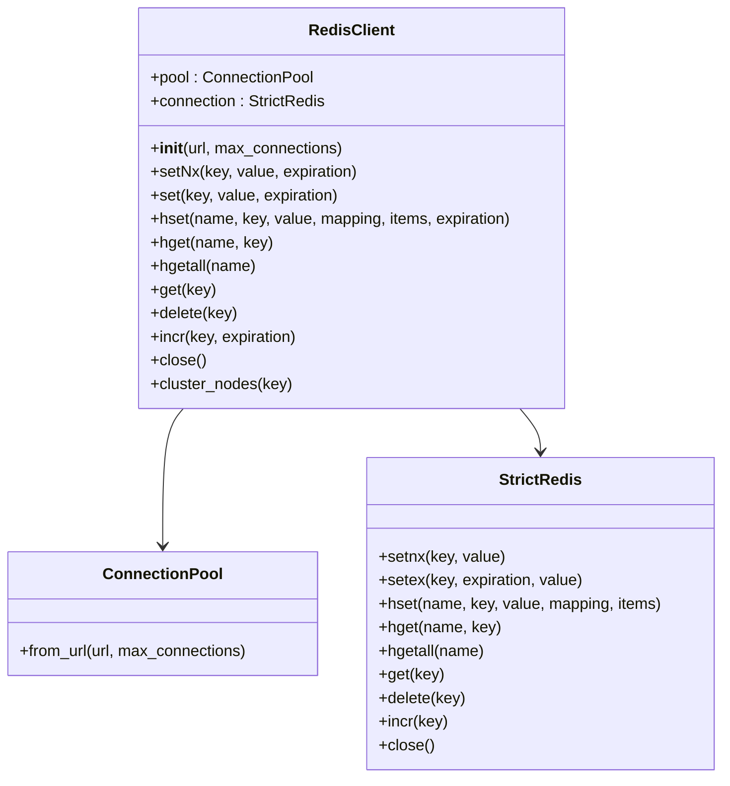

**图表来源**
- [redis.py](https://github.com/Shy2593666979/AgentChat/tree/main/src/backend/agentchat/services/redis.py#L12-L115)

### 缓存策略

| 缓存类型 | 键格式 | 过期时间 | 用途 |
|----------|--------|----------|------|
| 会话上下文 | `session:{session_id}` | 1小时 | 用户对话状态 |
| 用户配置 | `user_config:{user_id}` | 24小时 | 用户个性化设置 |
| 临时数据 | `temp:{uuid}` | 30分钟 | 临时计算结果 |
| 计数器 | `counter:{key}` | 永久 | 统计数据 |

**章节来源**
- [redis.py](https://github.com/Shy2593666979/AgentChat/tree/main/src/backend/agentchat/services/redis.py#L28-L115)

## 配置管理

记忆服务通过配置系统实现灵活的参数管理：

### 配置结构

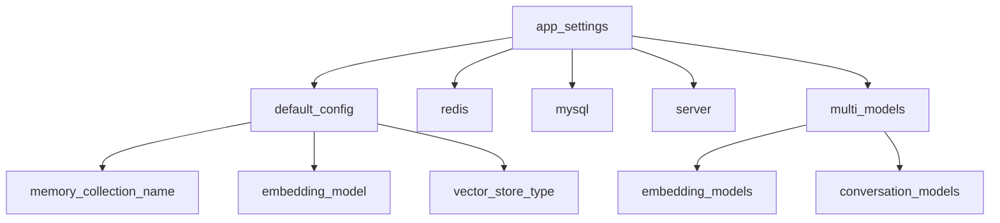

**图表来源**
- [settings.py](https://github.com/Shy2593666979/AgentChat/tree/main/src/backend/agentchat/settings.py#L8-L22)

### 可扩展性设计

记忆服务采用插件化的配置设计，支持：

1. **向量数据库切换**：通过配置文件动态选择Chroma或Milvus
2. **嵌入模型配置**：支持多种嵌入模型的配置和切换
3. **缓存策略定制**：不同场景下的缓存过期策略
4. **性能参数调优**：查询限制、相似度阈值等参数

**章节来源**
- [settings.py](https://github.com/Shy2593666979/AgentChat/tree/main/src/backend/agentchat/settings.py#L1-L62)

## 性能优化策略

### 索引策略

记忆服务采用多层次的索引优化策略：

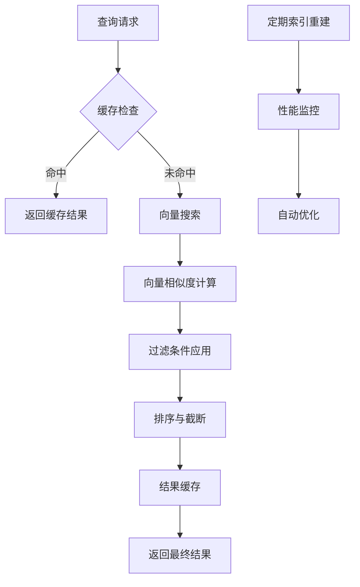

### 缓存失效机制

| 触发条件 | 失效范围 | 清理策略 |
|----------|----------|----------|
| 记忆更新 | 相关缓存键 | 精确清理 |
| 批量删除 | 全部相关缓存 | 范围清理 |
| 系统重启 | 所有缓存 | 全量清理 |
| 定时任务 | 过期缓存 | 异步清理 |

### 内存管理

1. **连接池管理**：Redis连接池避免频繁创建销毁
2. **批量操作**：向量插入和查询采用批量处理
3. **延迟加载**：按需加载向量数据库连接
4. **资源监控**：实时监控内存使用情况

## 使用示例

### 基本记忆操作

以下是记忆服务的基本使用示例：

#### 添加记忆
```python
# 异步添加对话记忆
memory = AsyncMemory()
result = await memory.add(
    messages="用户询问关于AI的信息",
    user_id="user_123",
    agent_id="agent_456",
    run_id="run_789",
    metadata={"topic": "AI", "priority": "high"}
)
```

#### 搜索记忆
```python
# 搜索相关记忆
results = await memory.search(
    query="人工智能",
    user_id="user_123",
    limit=10,
    threshold=0.7
)
```

#### 获取所有记忆
```python
# 获取用户的所有记忆
memories = await memory.get_all(
    user_id="user_123",
    agent_id="agent_456",
    limit=50
)
```

### 高级功能示例

#### 程序性记忆创建
```python
# 为特定对话创建程序性记忆
procedural_memory = await memory.add(
    messages=conversation_history,
    memory_type="procedural_memory",
    agent_id="agent_456"
)
```

#### 批量操作
```python
# 批量删除用户记忆
await memory.delete_all(user_id="user_123")

# 批量搜索多个主题
topics = ["AI", "机器学习", "深度学习"]
for topic in topics:
    results = await memory.search(query=topic, user_id="user_123")
```

**章节来源**
- [client.py](https://github.com/Shy2593666979/AgentChat/tree/main/src/backend/agentchat/services/memory/client.py#L131-L865)
- [test_chroma.py](https://github.com/Shy2593666979/AgentChat/tree/main/src/backend/agentchat/test/test_chroma.py#L268-L368)

## 故障排除指南

### 常见问题及解决方案

#### 向量数据库连接问题

| 问题症状 | 可能原因 | 解决方案 |
|----------|----------|----------|
| Chroma连接失败 | 本地服务未启动 | 检查Chroma服务状态 |
| Milvus连接超时 | 网络或配置错误 | 验证URL和认证信息 |
| 内存不足 | 向量数量过多 | 调整批处理大小 |
| 索引损坏 | 异常关闭导致 | 重置向量集合 |

#### Redis缓存问题

| 问题症状 | 可能原因 | 解决方案 |
|----------|----------|----------|
| 缓存写入失败 | 连接池耗尽 | 增加最大连接数 |
| 数据序列化错误 | 对象不可pickle | 检查数据类型兼容性 |
| 缓存穿透 | 键不存在且无缓存 | 实现空值缓存 |
| 缓存雪崩 | 大量键同时过期 | 设置随机过期时间 |

#### 性能问题诊断

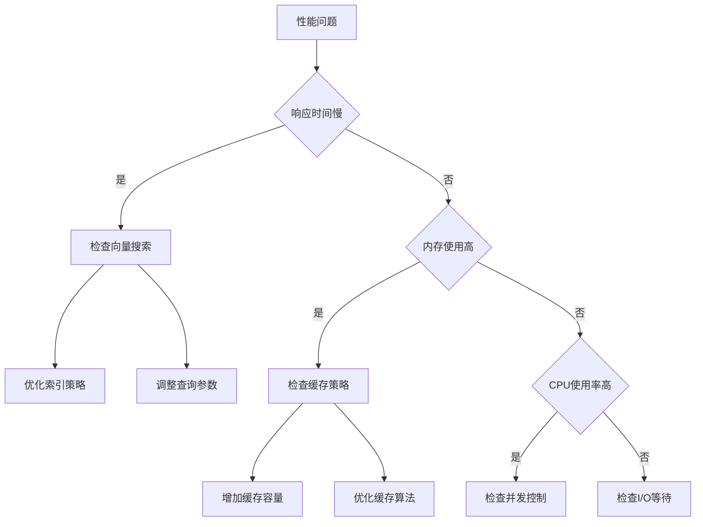

### 监控指标

关键性能指标监控：

1. **响应时间**：记忆操作的平均响应时间
2. **吞吐量**：每秒处理的记忆请求数
3. **错误率**：各类操作的失败比例
4. **缓存命中率**：Redis缓存的有效利用率
5. **内存使用率**：向量数据库的内存占用

**章节来源**
- [redis.py](https://github.com/Shy2593666979/AgentChat/tree/main/src/backend/agentchat/services/redis.py#L12-L115)
- [chroma.py](https://github.com/Shy2593666979/AgentChat/tree/main/src/backend/agentchat/services/memory/vector_stores/chroma.py#L227-L255)

## 总结

AgentChat的记忆服务通过精心设计的架构实现了高效、可扩展的记忆管理能力。其主要优势包括：

### 技术优势
1. **多后端支持**：Chroma和Milvus的无缝切换
2. **异步架构**：充分利用异步IO提升性能
3. **模块化设计**：清晰的职责分离和接口定义
4. **缓存集成**：Redis缓存显著提升响应速度

### 功能特性
1. **智能记忆提取**：基于LLM的事实提取和记忆更新
2. **多模态支持**：文本、图像等多种内容的记忆
3. **语义搜索**：基于向量相似度的智能检索
4. **生命周期管理**：完整的记忆创建、更新、删除流程

### 扩展性考虑
1. **插件化架构**：易于添加新的向量数据库支持
2. **配置驱动**：通过配置文件灵活调整行为
3. **监控友好**：内置性能监控和日志记录
4. **容错机制**：完善的异常处理和恢复策略

记忆服务为AgentChat平台提供了坚实的知识基础，支撑着智能对话、个性化推荐和长期记忆等功能的实现。通过持续的优化和扩展，该服务将继续为用户提供更加智能和个性化的交互体验。
