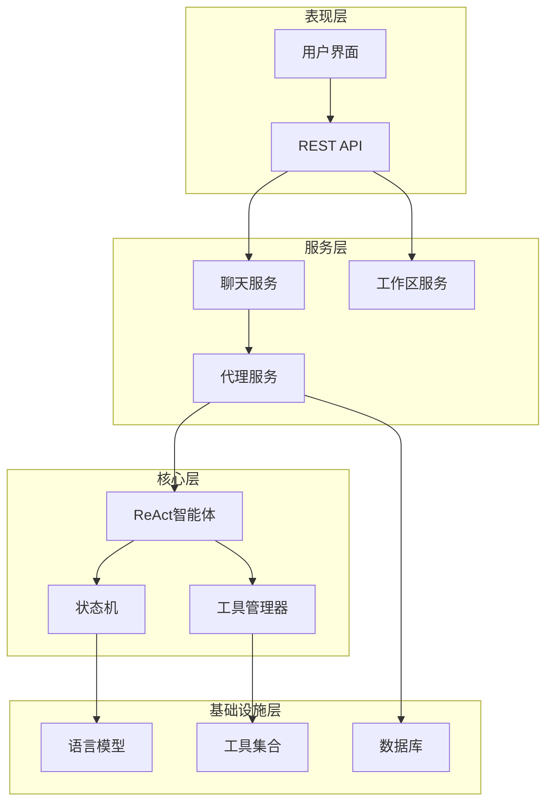
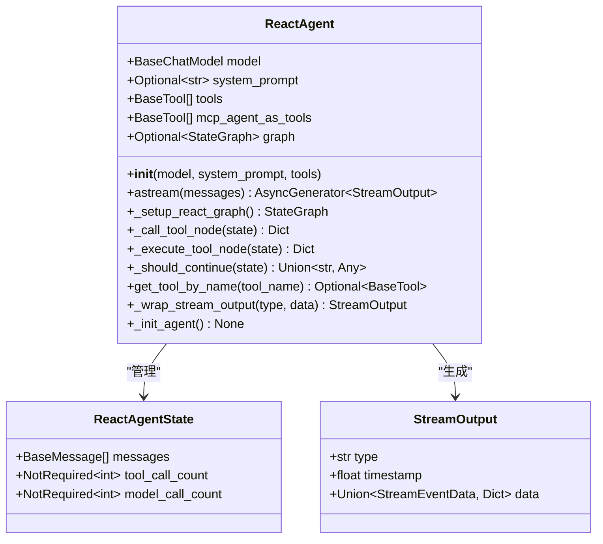
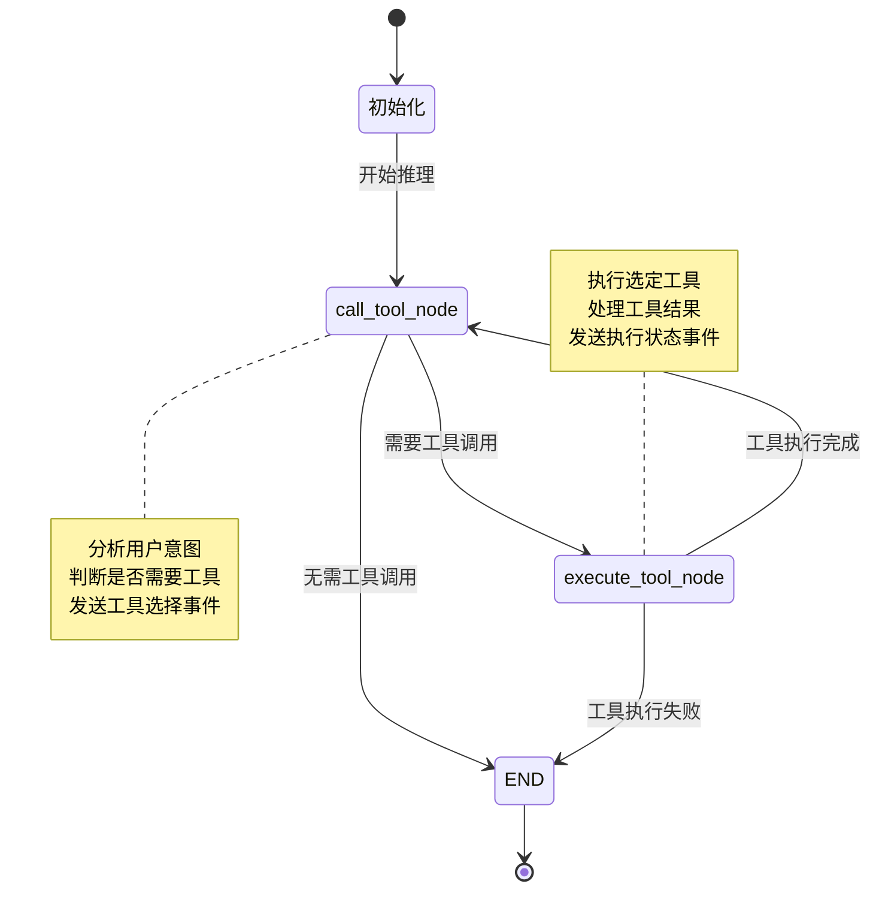
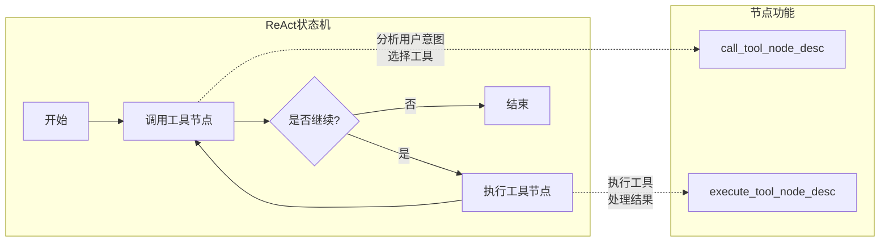
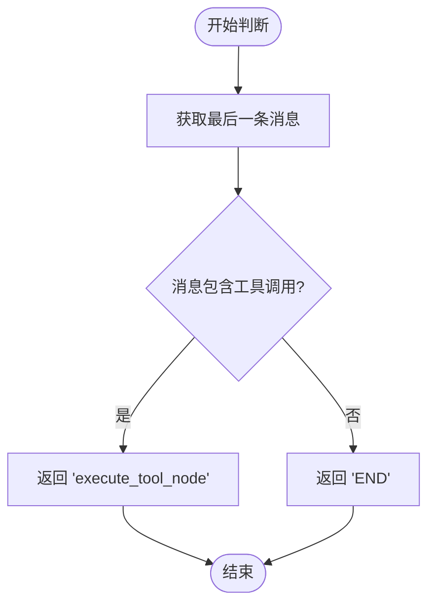
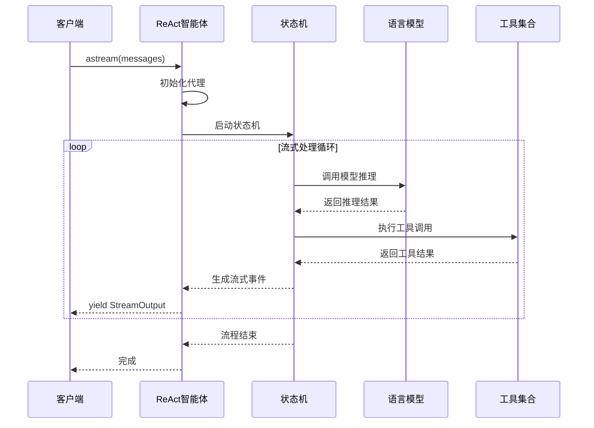
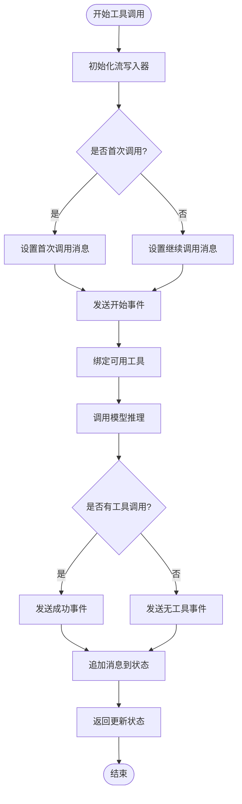
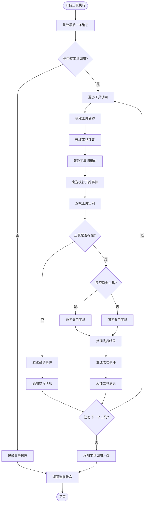
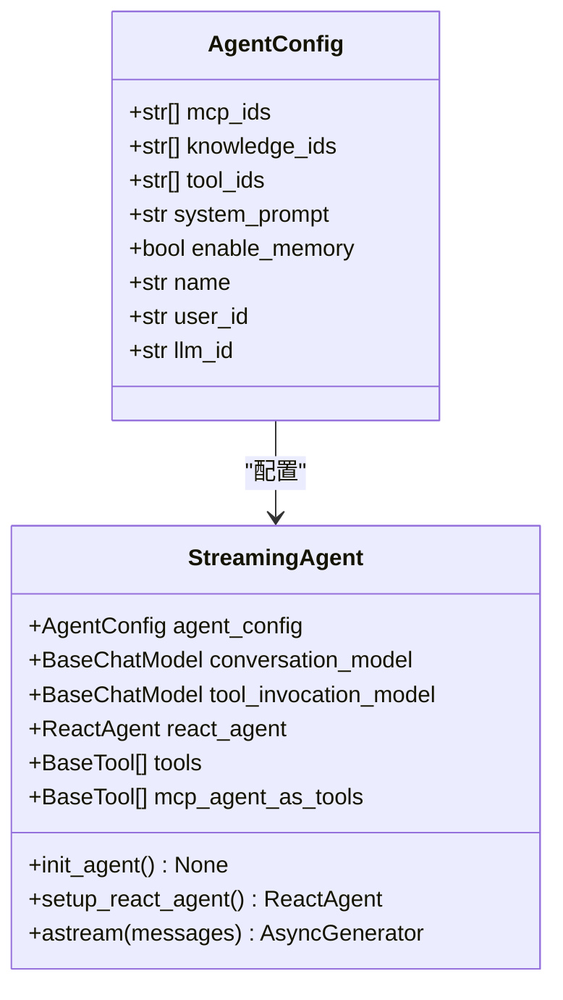

# ReAct智能体深度解析

## 目录
1. [简介](#简介)
2. [项目架构概览](#项目架构概览)
3. [核心组件分析](#核心组件分析)
4. [ReactAgentState状态管理](#reactagentstate状态管理)
5. [LangGraph状态机实现](#langgraph状态机实现)
6. [流式输出机制](#流式输出机制)
7. [工具集成与执行](#工具集成与执行)
8. [配置与集成](#配置与集成)
9. [最佳实践指南](#最佳实践指南)
10. [总结](#总结)

## 简介

ReAct（Reasoning & Acting）智能体是一种基于推理与行动相结合的智能代理系统，采用LangGraph框架构建状态机来实现复杂的对话和工具调用流程。该系统支持流式输出、多工具协作、条件决策等高级功能，广泛应用于各种工作区代理中。

ReAct智能体的核心设计理念是将大语言模型的推理能力与外部工具的执行能力有机结合，在保证用户体验的同时实现复杂任务的自动化处理。

## 项目架构概览

ReAct智能体系统采用分层架构设计，主要包含以下几个层次：

**图表来源**
- [react_agent.py](https://github.com/Shy2593666979/AgentChat/tree/main/src/backend/agentchat/core/agents/react_agent.py#L39-L80)
- [chat.py](https://github.com/Shy2593666979/AgentChat/tree/main/src/backend/agentchat/api/services/chat.py#L103-L170)

**章节来源**
- [react_agent.py](https://github.com/Shy2593666979/AgentChat/tree/main/src/backend/agentchat/core/agents/react_agent.py#L1-L50)
- [chat.py](https://github.com/Shy2593666979/AgentChat/tree/main/src/backend/agentchat/api/services/chat.py#L1-L50)

## 核心组件分析

### ReactAgent类设计

ReactAgent是ReAct智能体的核心类，负责协调整个推理与行动流程。其设计遵循单一职责原则，主要承担以下职责：

**图表来源**
- [react_agent.py](https://github.com/Shy2593666979/AgentChat/tree/main/src/backend/agentchat/core/agents/react_agent.py#L31-L57)
- [react_agent.py](https://github.com/Shy2593666979/AgentChat/tree/main/src/backend/agentchat/core/agents/react_agent.py#L24-L35)

### 状态类型优化

ReactAgentState继承自MessagesState，通过类型注解增强了类型安全性：

- **messages**: 继承自MessagesState的基础消息列表
- **tool_call_count**: 可选字段，记录工具调用次数
- **model_call_count**: 可选字段，记录模型调用次数

这种设计使得状态管理更加清晰，同时提供了良好的类型检查支持。

**章节来源**
- [react_agent.py](https://github.com/Shy2593666979/AgentChat/tree/main/src/backend/agentchat/core/agents/react_agent.py#L31-L35)

## ReactAgentState状态管理

### 状态结构设计

ReactAgentState采用了精心设计的状态结构来支持ReAct流程的各个阶段：

**图表来源**
- [react_agent.py](https://github.com/Shy2593666979/AgentChat/tree/main/src/backend/agentchat/core/agents/react_agent.py#L82-L96)

### 状态流转机制

状态流转遵循严格的控制流，确保每个阶段都有明确的输入和输出：

1. **初始化阶段**: 设置初始状态，包括消息列表和计数器
2. **工具调用决策**: 分析当前消息，判断是否需要调用工具
3. **工具执行**: 执行选定的工具，处理返回结果
4. **循环迭代**: 根据执行结果决定是否继续循环
5. **结束阶段**: 返回最终结果或终止流程

**章节来源**
- [react_agent.py](https://github.com/Shy2593666979/AgentChat/tree/main/src/backend/agentchat/core/agents/react_agent.py#L82-L96)

## LangGraph状态机实现

### 节点与边的设计

LangGraph状态机采用节点-边模型来实现ReAct流程：

**图表来源**
- [react_agent.py](https://github.com/Shy2593666979/AgentChat/tree/main/src/backend/agentchat/core/agents/react_agent.py#L88-L94)

### _setup_react_graph()方法详解

该方法负责构建完整的状态机图，定义了所有节点和连接关系：

#### 节点定义
- **call_tool_node**: 负责分析用户输入并决定是否需要调用工具
- **execute_tool_node**: 负责执行选定的工具并处理返回结果

#### 边和条件边
- **START → call_tool_node**: 流程入口
- **call_tool_node → execute_tool_node**: 当需要工具调用时的条件跳转
- **call_tool_node → END**: 当不需要工具调用时的直接结束
- **execute_tool_node → call_tool_node**: 工具执行完成后回到决策阶段

**章节来源**
- [react_agent.py](https://github.com/Shy2593666979/AgentChat/tree/main/src/backend/agentchat/core/agents/react_agent.py#L82-L96)

### _should_continue()条件边逻辑

条件边决定了流程的走向，其实现逻辑简洁而高效：

**图表来源**
- [react_agent.py](https://github.com/Shy2593666979/AgentChat/tree/main/src/backend/agentchat/core/agents/react_agent.py#L100-L108)

这个条件判断逻辑的关键在于：
1. 检查最后一条消息是否包含tool_calls
2. 如果有工具调用，继续执行工具节点
3. 如果没有工具调用，直接结束流程

**章节来源**
- [react_agent.py](https://github.com/Shy2593666979/AgentChat/tree/main/src/backend/agentchat/core/agents/react_agent.py#L100-L108)

## 流式输出机制

### _astream()主方法实现

流式输出是ReAct智能体的重要特性，通过异步生成器实现实时响应：

**图表来源**
- [react_agent.py](https://github.com/Shy2593666979/AgentChat/tree/main/src/backend/agentchat/core/agents/react_agent.py#L230-L279)

### 流式事件类型

系统定义了两种主要的流式事件类型：

1. **event事件**: 用于发送状态变更和进度信息
2. **response_chunk事件**: 用于传输模型生成的内容片段

每种事件都包含统一的时间戳结构，便于客户端处理和显示。

**章节来源**
- [react_agent.py](https://github.com/Shy2593666979/AgentChat/tree/main/src/backend/agentchat/core/agents/react_agent.py#L24-L35)

### 错误处理与兜底机制

流式输出包含了完善的错误处理机制：

- **异常捕获**: 捕获整个执行过程中的异常
- **错误信息**: 当出现错误时，发送包含错误信息的响应块
- **用户友好**: 提供友好的错误提示，避免暴露技术细节

**章节来源**
- [react_agent.py](https://github.com/Shy2593666979/AgentChat/tree/main/src/backend/agentchat/core/agents/react_agent.py#L269-L278)

## 工具集成与执行

### _call_tool_node节点实现

call_tool_node是ReAct流程中的关键节点，负责工具选择和决策：

**图表来源**
- [react_agent.py](https://github.com/Shy2593666979/AgentChat/tree/main/src/backend/agentchat/core/agents/react_agent.py#L110-L153)

### _execute_tool_node节点实现

execute_tool_node负责实际的工具执行和结果处理：

**图表来源**
- [react_agent.py](https://github.com/Shy2593666979/AgentChat/tree/main/src/backend/agentchat/core/agents/react_agent.py#L155-L226)

### 工具执行的错误处理

工具执行过程包含了全面的错误处理机制：

1. **工具查找**: 确保工具存在，不存在时返回错误信息
2. **异步处理**: 自动区分同步和异步工具调用
3. **异常捕获**: 捕获工具执行过程中的所有异常
4. **错误报告**: 发送详细的错误事件，包含错误信息
5. **状态恢复**: 即使出现错误，也能保证状态的一致性

**章节来源**
- [react_agent.py](https://github.com/Shy2593666979/AgentChat/tree/main/src/backend/agentchat/core/agents/react_agent.py#L155-L226)

## 配置与集成

### AgentConfig配置系统

AgentConfig提供了灵活的配置机制，支持多种Agent类型的统一管理：

**图表来源**
- [chat.py](https://github.com/Shy2593666979/AgentChat/tree/main/src/backend/agentchat/api/services/chat.py#L33-L42)
- [chat.py](https://github.com/Shy2593666979/AgentChat/tree/main/src/backend/agentchat/api/services/chat.py#L103-L170)

### setup_react_agent()方法

该方法展示了如何将ReAct智能体集成到更复杂的系统中：

1. **模型配置**: 设置对话模型和工具调用模型
2. **工具加载**: 加载插件工具和MCP工具
3. **中间件配置**: 设置事件中间件和工具选择中间件
4. **状态管理**: 配置流式状态schema

**章节来源**
- [chat.py](https://github.com/Shy2593666979/AgentChat/tree/main/src/backend/agentchat/api/services/chat.py#L162-L168)

### 工作区代理集成

ReAct智能体在不同工作区代理中的应用展示了其通用性和灵活性：

#### SimpleAgent集成
- **特点**: 轻量级，专注于工具调用
- **应用场景**: 通用工作区，基础功能需求
- **集成方式**: 直接使用ReactAgent核心功能

#### WeChatAgent集成
- **特点**: 支持微信公众号特定功能
- **应用场景**: 微信客服、公众号对话
- **特殊功能**: 知识库检索、会话管理

**章节来源**
- [simple_agent.py](https://github.com/Shy2593666979/AgentChat/tree/main/src/backend/agentchat/services/workspace/simple_agent.py#L101-L106)
- [wechat_agent.py](https://github.com/Shy2593666979/AgentChat/tree/main/src/backend/agentchat/services/workspace/wechat_agent.py#L104-L109)

## 最佳实践指南

### 工具集成最佳实践

1. **工具分类**: 将工具分为插件工具和MCP工具两类
2. **异步支持**: 确保工具支持异步调用以提高性能
3. **错误处理**: 为每个工具提供详细的错误处理逻辑
4. **参数验证**: 在工具调用前验证参数的有效性

### 提示词配置最佳实践

1. **系统提示词**: 使用专门的系统提示词引导模型行为
2. **工具调用提示词**: 提供清晰的工具调用指导
3. **错误恢复提示词**: 指导模型在遇到错误时的处理方式

### 错误处理最佳实践

1. **分层错误处理**: 在不同层级设置相应的错误处理机制
2. **用户友好提示**: 提供清晰、友好的错误信息
3. **日志记录**: 完善的日志记录有助于问题诊断
4. **优雅降级**: 在部分功能失效时提供替代方案

### 性能优化最佳实践

1. **延迟初始化**: 使用延迟初始化减少启动时间
2. **资源管理**: 合理管理工具和模型资源
3. **并发控制**: 适当控制并发工具调用的数量
4. **缓存策略**: 对频繁访问的数据实施缓存

**章节来源**
- [react_agent.py](https://github.com/Shy2593666979/AgentChat/tree/main/src/backend/agentchat/core/agents/react_agent.py#L68-L71)
- [chat.py](https://github.com/Shy2593666979/AgentChat/tree/main/src/backend/agentchat/api/services/chat.py#L140-L148)

## 总结

ReAct智能体代表了现代AI代理系统的发展方向，通过将推理能力与工具执行能力有机结合，实现了复杂任务的自动化处理。其核心优势包括：

1. **模块化设计**: 清晰的组件分离和职责划分
2. **流式处理**: 实时响应和用户体验优化
3. **工具集成**: 灵活的工具生态系统
4. **状态管理**: 稳健的状态流转和持久化
5. **错误处理**: 完善的异常处理和恢复机制

通过深入理解ReAct智能体的实现原理和架构设计，开发者可以更好地利用这一强大的工具来构建自己的AI代理系统，实现从简单问答到复杂任务自动化的能力跨越。
