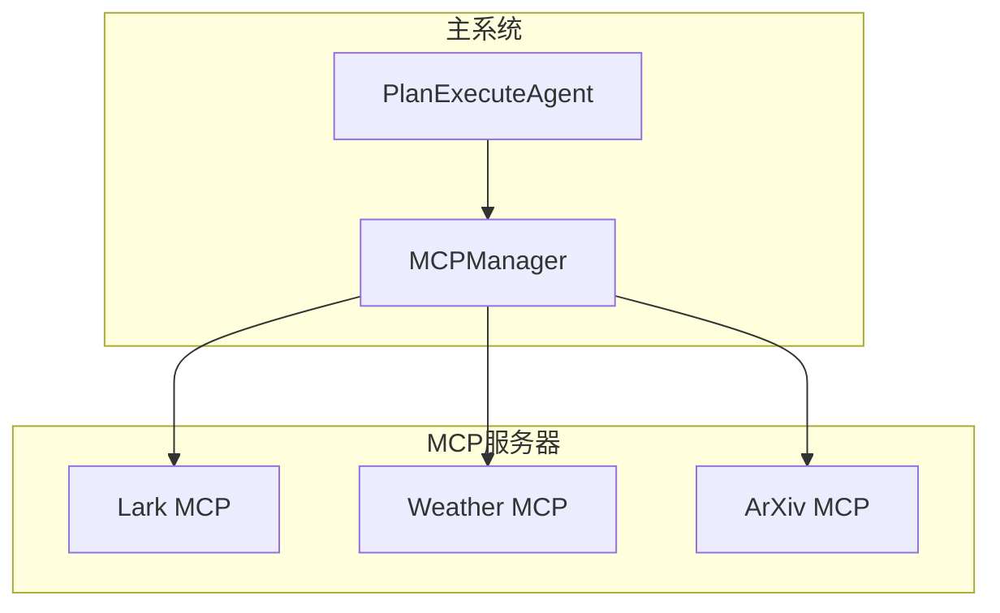
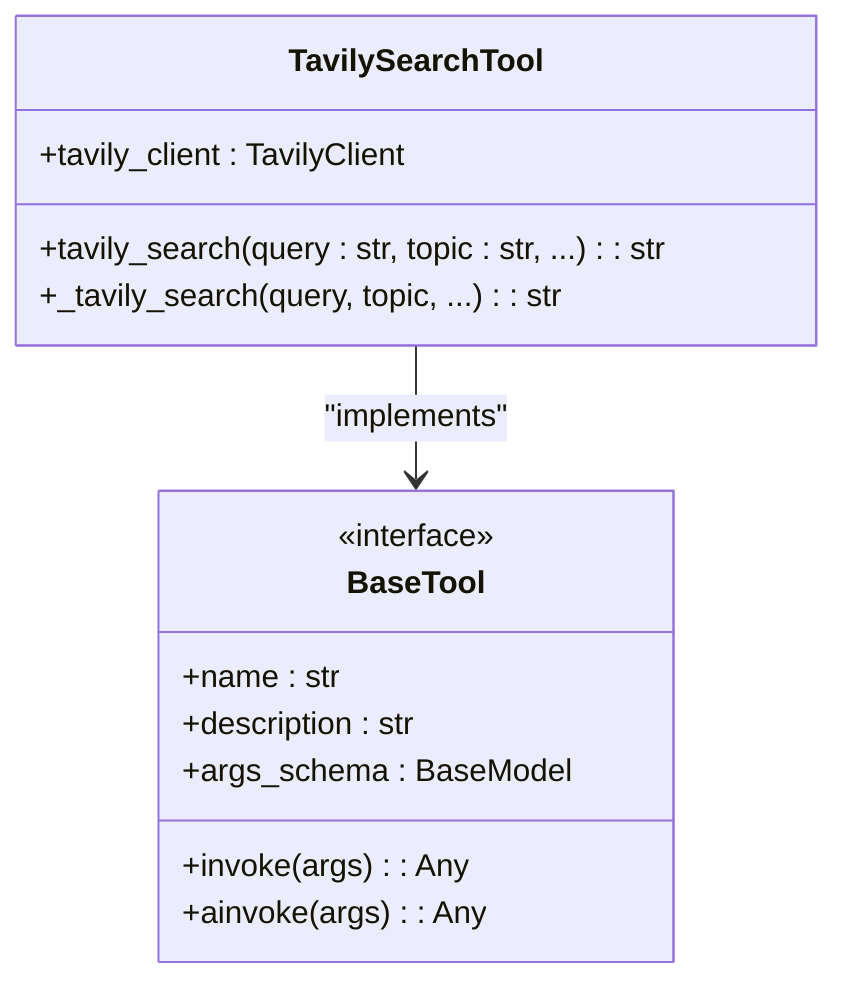

# 核心功能层

## 目录
1. [引言](#引言)
2. [ReAct智能体：Thought/Action/Observation循环](#react智能体thoughtactionobservation循环)
3. [计划-执行智能体：复杂目标分解与协调](#计划-执行智能体复杂目标分解与协调)
4. [大语言模型统一管理机制](#大语言模型统一管理机制)
5. [MCP插件化架构与协议集成](#mcp插件化架构与协议集成)
6. [内置工具实现与集成](#内置工具实现与集成)
7. [提示词工程的核心作用](#提示词工程的核心作用)
8. [开发者指南：自定义Agent与工具集成](#开发者指南自定义agent与工具集成)

## 引言
AgentChat是一个先进的智能对话系统，其核心功能层通过多种智能体（Agent）模式、灵活的工具集成和强大的提示工程，实现了复杂任务的自动化处理。本系统采用模块化设计，核心功能分布在`core/agents`、`core/models`、`mcp_servers`和`tools`等目录中。系统通过ReAct和Plan-Execute两种主要的智能体模式，分别处理即时性任务和复杂规划性任务。同时，系统通过MCP（Model Context Protocol）协议实现了插件化架构，允许外部服务以独立进程的方式扩展系统能力。本技术文档将深入剖析这些核心功能模块的实现原理与架构设计。

## ReAct智能体：Thought/Action/Observation循环

ReAct智能体（`react_agent.py`）是AgentChat中最基础的智能体实现，它基于LangGraph框架，通过“思考-行动-观察”（Thought/Action/Observation）的循环来执行任务。该模式的核心在于将大语言模型（LLM）的推理能力与外部工具的执行能力紧密结合，形成一个动态的决策与执行闭环。

智能体的工作流程始于用户输入。系统首先将用户消息与系统提示词（System Prompt）结合，形成完整的上下文。然后，智能体进入一个由`call_tool_node`和`execute_tool_node`两个节点构成的循环图。在`call_tool_node`中，模型被绑定所有可用工具，并被提示分析是否需要调用工具。如果模型决定调用工具，它会生成一个包含工具名称和参数的`tool_calls`。随后，流程进入`execute_tool_node`，系统会查找并执行对应的工具函数，将执行结果（Observation）作为`ToolMessage`添加回消息历史。这个新的观察结果会再次输入到`call_tool_node`，模型基于更新后的上下文进行下一轮推理，决定是继续调用其他工具还是直接生成最终回复。

该实现的关键优势在于其流式输出（streaming）支持。通过LangGraph的`custom`流模式，智能体可以在工具选择、执行开始、执行结束等关键节点实时发送自定义事件，为前端提供丰富的状态反馈，极大地提升了用户体验。

**Section sources**
- [react_agent.py](https://github.com/Shy2593666979/AgentChat/tree/main/src/backend/agentchat/core/agents/react_agent.py#L39-L279)

## 计划-执行智能体：复杂目标分解与协调

计划-执行智能体（`plan_execute_agent.py`）是为处理复杂、多步骤任务而设计的高级智能体。与ReAct的即时决策不同，该模式采用“先规划，后执行”的策略。其核心流程分为两个阶段：规划阶段和执行阶段。

在规划阶段，智能体利用一个结构化响应代理（`structured_response_agent.py`），根据用户问题和可用工具的信息，生成一个详细的执行计划。这个计划以JSON格式表示，定义了任务的多个步骤（step），每个步骤可以包含一个或多个并行或串行调用的工具。该过程由`PLAN_CALL_TOOL_PROMPT`提示词驱动，它指导模型分析任务依赖关系，明确每个工具调用的参数来源（来自用户输入或前序工具的输出）。如果模型发现缺少必要参数，它会计划调用`request_missing_param`工具来向用户询问。

在执行阶段，智能体按计划的步骤顺序调用工具。对于每个步骤，系统会构造一个专门的提示词（`SINGLE_PLAN_CALL_PROMPT`），指导模型执行该步骤的工具调用。工具的执行由`_execute_tool`方法处理，它能区分内置工具和MCP工具，并正确处理同步和异步调用。执行结果被收集起来，最终与原始用户消息合并，输入到对话模型中生成最终的、连贯的自然语言回复。

这种分离式设计使得系统能够处理高度复杂的任务，如“先搜索北京的天气，再根据天气情况推荐合适的户外活动”，并能有效管理工具间的依赖关系。

**Section sources**
- [plan_execute_agent.py](https://github.com/Shy2593666979/AgentChat/tree/main/src/backend/agentchat/core/agents/plan_execute_agent.py#L18-L238)
- [structured_response_agent.py](https://github.com/Shy2593666979/AgentChat/tree/main/src/backend/agentchat/core/agents/structured_response_agent.py#L1-L21)
- [chat.py](https://github.com/Shy2593666979/AgentChat/tree/main/src/backend/agentchat/prompts/chat.py#L104-L216)
- [schema/chat.py](https://github.com/Shy2593666979/AgentChat/tree/main/src/backend/agentchat/schema/chat.py#L1-L30)

## 大语言模型统一管理机制

`core/models/manager.py`文件中的`ModelManager`类是整个系统的大语言模型（LLM）中枢。它采用工厂模式，为系统中不同功能需求提供统一的、可配置的模型实例。

`ModelManager`通过一系列类方法（`@classmethod`）来获取不同用途的模型：
- `get_tool_invocation_model`: 用于工具调用决策的模型。
- `get_conversation_model`: 用于生成最终自然语言回复的模型。
- `get_reasoning_model`: 用于复杂推理任务的专用模型。
- `get_embedding_model`: 用于生成文本嵌入向量的模型。

所有模型的配置（如模型名称、API密钥、基础URL）都集中存储在`settings.py`的`app_settings`中。`ModelManager`在创建模型实例时，会从`app_settings`中读取相应的配置，确保了配置的集中化和灵活性。这种设计使得系统可以轻松地在不同LLM提供商（如OpenAI、阿里云通义千问）之间切换，而无需修改业务逻辑代码，极大地提高了系统的可维护性和可扩展性。

**Section sources**
- [manager.py](https://github.com/Shy2593666979/AgentChat/tree/main/src/backend/agentchat/core/models/manager.py#L10-L63)
- [settings.py](https://github.com/Shy2593666979/AgentChat/tree/main/src/backend/agentchat/settings.py#L1-L62)

## MCP插件化架构与协议集成

MCP（Model Context Protocol）是AgentChat实现插件化架构的核心。`mcp_servers`目录下的各个子目录（如`lark_mcp`、`weather`、`arxiv`）都是独立的MCP服务器，它们通过标准的MCP协议与主系统通信，从而扩展了系统的能力。

每个MCP服务器都是一个独立的Python应用，基于`FastMCP`框架开发。例如，`lark_mcp`服务器通过飞书API提供了日历、文档、消息等企业级功能；`weather`服务器通过第三方天气API提供天气查询；`arxiv`服务器则利用`langchain_community`的`ArxivAPIWrapper`提供学术论文搜索。

这些服务器通过`@mcp.tool()`装饰器来注册工具。主系统通过`services/mcp/manager.py`中的`MCPManager`类来管理这些外部服务。`MCPManager`在初始化时会根据配置连接到各个MCP服务器，并通过`get_mcp_tools`方法动态获取所有可用的MCP工具列表。这些工具随后被注入到`PlanExecuteAgent`等智能体中，使其能够像调用本地工具一样调用这些远程服务。

MCP服务器支持多种传输协议（如stdio、sse），这使得它们可以灵活地以子进程或独立服务的方式运行，实现了功能的解耦和高可用性。

**Diagram sources**
- [mcp_servers/README.md](https://github.com/Shy2593666979/AgentChat/tree/main/src/backend/agentchat/mcp_servers/README.md#L1-L136)
- [mcp_weather.py](https://github.com/Shy2593666979/AgentChat/tree/main/src/backend/agentchat/mcp_servers/weather/mcp_weather.py#L1-L63)
- [mcp_arxiv.py](https://github.com/Shy2593666979/AgentChat/tree/main/src/backend/agentchat/mcp_servers/arxiv/mcp_arxiv.py#L1-L19)
- [mcp_server.py](https://github.com/Shy2593666979/AgentChat/tree/main/src/backend/agentchat/mcp_servers/lark_mcp/mcp_server.py)
- [manager.py](https://github.com/Shy2593666979/AgentChat/tree/main/src/backend/agentchat/services/mcp/manager.py#L13-L103)

## 内置工具实现与集成

系统内置的工具位于`tools/`目录下，每个工具通常由一个`action.py`文件实现。以`Tavily`搜索工具为例，其实现非常简洁。

在`tools/web_search/tavily_search/action.py`中，首先导入`TavilyClient`并使用`app_settings`中的API密钥进行初始化。然后，使用`@tool`装饰器定义一个名为`web_search`的工具函数。该装饰器会自动将此函数包装成一个`BaseTool`实例，使其可以被LangChain框架识别和调用。函数的参数（如`query`, `topic`）和文档字符串（docstring）会被自动解析为工具的输入模式（schema）。

所有内置工具在`tools/__init__.py`中被集中导入和注册。该文件定义了`AgentTools`列表和`AgentToolsWithName`字典，将所有工具实例化并按名称组织。当创建智能体时，开发者只需将这些预定义的工具列表传递给智能体的构造函数，即可完成工具的集成。

**Diagram sources**
- [action.py](https://github.com/Shy2593666979/AgentChat/tree/main/src/backend/agentchat/tools/web_search/tavily_search/action.py#L1-L40)
- [tools/__init__.py](https://github.com/Shy2593666979/AgentChat/tree/main/src/backend/agentchat/tools/__init__.py#L1-L48)

## 提示词工程的核心作用

提示词（Prompts）是驱动AgentChat智能体行为的核心。`prompts/`目录下的提示词模板通过精心设计的指令，精确地控制了大语言模型的输出格式和行为逻辑。

例如，`react_agent.py`使用的`DEFAULT_CALL_PROMPT`详细规定了模型在分析用户请求时应遵循的流程，包括需求理解、工具匹配、依赖分析和调用决策。而`plan_execute_agent.py`则依赖于更复杂的提示词链：
- `PLAN_CALL_TOOL_PROMPT`：强制模型以JSON格式输出一个结构化的执行计划，明确了每个步骤的工具、参数和推理过程。
- `SINGLE_PLAN_CALL_PROMPT`：指导模型在执行计划的每一步时，如何调用具体的工具。
- `FIX_JSON_PROMPT`：作为一个“修复专家”，专门用于修复因模型输出不规范而导致的JSON解析错误，确保了系统的鲁棒性。

这些提示词不仅仅是简单的指令，更是系统架构的一部分。它们定义了智能体的“人格”和“工作流程”，是实现可靠、可预测的AI行为的关键。

**Section sources**
- [chat.py](https://github.com/Shy2593666979/AgentChat/tree/main/src/backend/agentchat/prompts/chat.py#L1-L216)

## 开发者指南：自定义Agent与工具集成

开发者可以轻松地在AgentChat框架中开发自定义智能体或集成新工具。

**自定义Agent**：要创建新的智能体，可以继承`ReactAgent`或`PlanExecuteAgent`，或直接使用LangGraph构建全新的状态机。关键在于定义清晰的节点（Node）和边（Edge），并利用`get_stream_writer`实现流式事件输出。

**集成新工具**：
1.  **内置工具**：在`tools/`目录下创建新子目录，编写`action.py`文件，使用`@tool`装饰器定义函数，并在`tools/__init__.py`中注册。
2.  **MCP插件**：创建一个独立的Python项目，使用`FastMCP`框架，通过`@mcp.tool()`注册工具函数。主系统通过配置即可连接并使用该服务。

通过这种灵活的架构，AgentChat能够持续扩展，适应不断变化的应用需求。

**Section sources**
- [react_agent.py](https://github.com/Shy2593666979/AgentChat/tree/main/src/backend/agentchat/core/agents/react_agent.py#L39-L279)
- [plan_execute_agent.py](https://github.com/Shy2593666979/AgentChat/tree/main/src/backend/agentchat/core/agents/plan_execute_agent.py#L18-L238)
- [action.py](https://github.com/Shy2593666979/AgentChat/tree/main/src/backend/agentchat/tools/web_search/tavily_search/action.py#L1-L40)
- [mcp_servers/README.md](https://github.com/Shy2593666979/AgentChat/tree/main/src/backend/agentchat/mcp_servers/README.md#L1-L136)
