# 统一模型管理器

## 目录
1. [简介](#简介)
2. [系统架构概览](#系统架构概览)
3. [ModelManager核心组件](#modelmanager核心组件)
4. [模型实例化与配置](#模型实例化与配置)
5. [生命周期管理](#生命周期管理)
6. [前端配置集成](#前端配置集成)
7. [智能体集成方式](#智能体集成方式)
8. [性能优化策略](#性能优化策略)
9. [配置指南](#配置指南)
10. [故障排除](#故障排除)
11. [总结](#总结)

## 简介

ModelManager是AgentChat系统中的核心模型管理组件，负责统一管理各种大语言模型（LLM）的实例化、配置和生命周期。它通过类方法提供了标准化的接口，从配置中心加载模型参数，处理模型的初始化、缓存和复用，确保系统资源的高效利用。

ModelManager的设计理念是提供一个集中化的模型管理入口，支持多种类型的模型（对话模型、工具调用模型、推理模型、嵌入模型等），并通过配置驱动的方式实现灵活的模型切换和扩展。

## 系统架构概览

ModelManager在整个系统架构中扮演着关键的桥梁角色，连接前端配置、后端服务和具体的大语言模型实现。

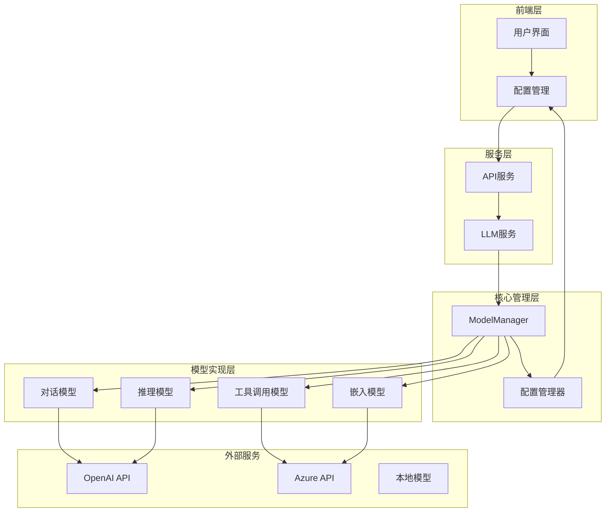

**图表来源**
- [manager.py](https://github.com/Shy2593666979/AgentChat/src/backend/agentchat/core/models/manager.py#L10-L62)
- [settings.py](https://github.com/Shy2593666979/AgentChat/src/backend/agentchat/settings.py#L8-L24)

## ModelManager核心组件

ModelManager采用类方法设计，提供了多个专门的模型获取方法，每个方法对应特定的使用场景。

### 类结构设计

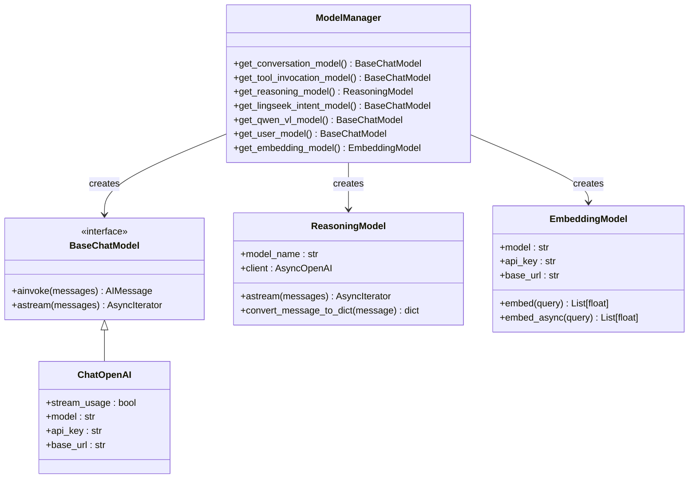

**图表来源**
- [manager.py](https://github.com/Shy2593666979/AgentChat/src/backend/agentchat/core/models/manager.py#L10-L62)
- [reason_model.py](https://github.com/Shy2593666979/AgentChat/src/backend/agentchat/core/models/reason_model.py#L12-L77)
- [embedding.py](https://github.com/Shy2593666979/AgentChat/src/backend/agentchat/core/models/embedding.py#L7-L60)

**章节来源**
- [manager.py](https://github.com/Shy2593666979/AgentChat/src/backend/agentchat/core/models/manager.py#L10-L62)

## 模型实例化与配置

ModelManager通过类方法实现了多种模型的标准化实例化过程，每种模型都有其特定的配置要求和使用场景。

### 对话模型实例化

对话模型主要用于常规的聊天交互，具有流式输出和使用统计功能：

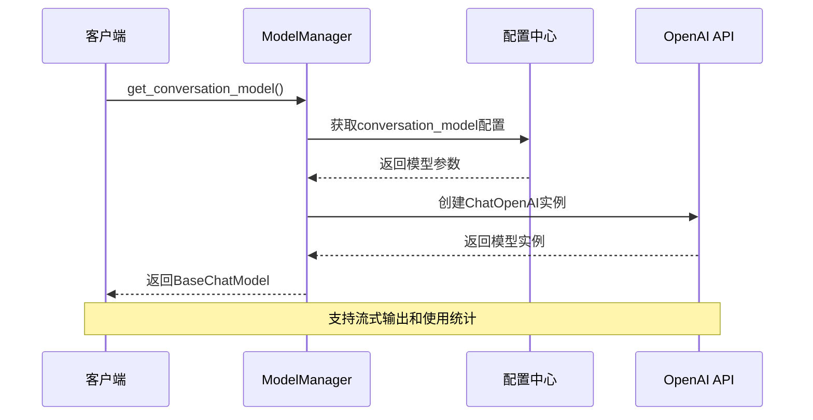

**图表来源**
- [manager.py](https://github.com/Shy2593666979/AgentChat/src/backend/agentchat/core/models/manager.py#L21-L26)

### 工具调用模型实例化

工具调用模型专门用于函数调用和工具执行：

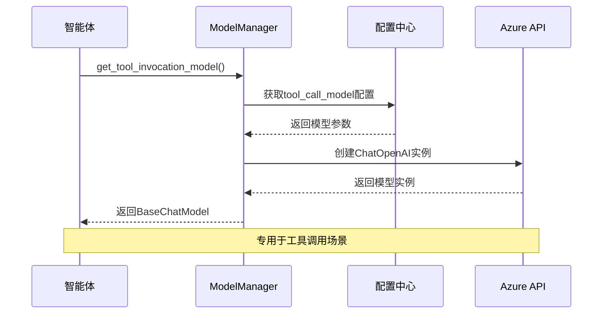

**图表来源**
- [manager.py](https://github.com/Shy2593666979/AgentChat/src/backend/agentchat/core/models/manager.py#L13-L18)

### 推理模型实例化

推理模型用于复杂的逻辑推理和思考过程：

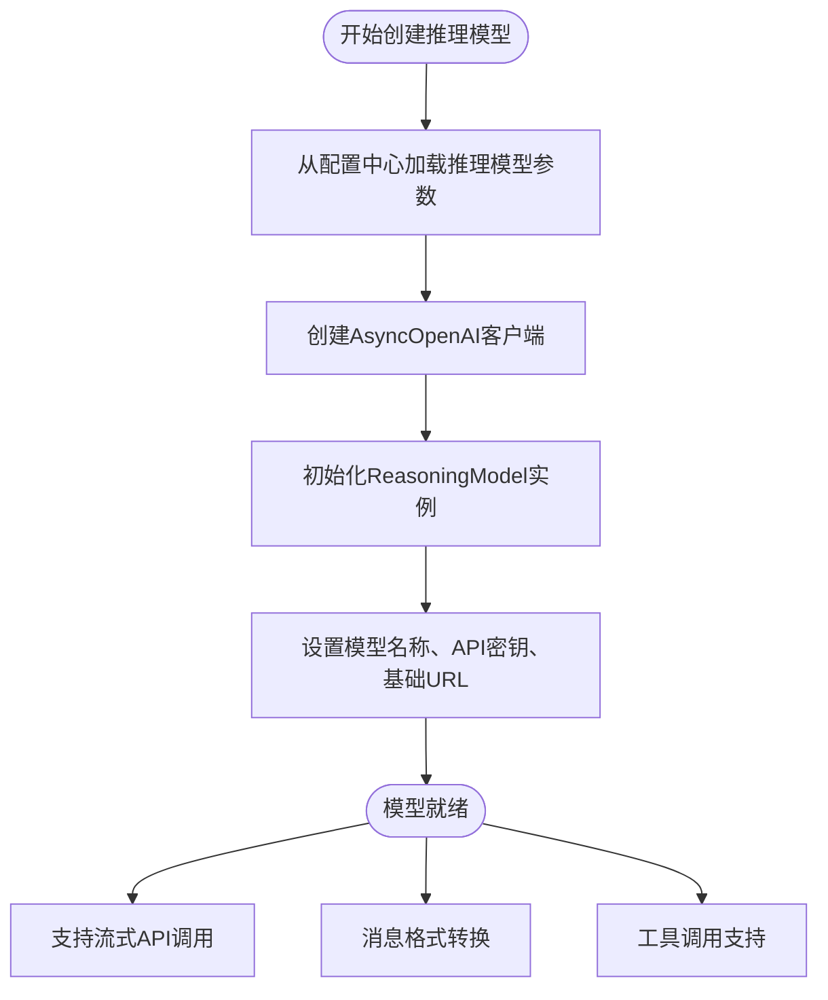

**图表来源**
- [manager.py](https://github.com/Shy2593666979/AgentChat/src/backend/agentchat/core/models/manager.py#L29-L32)
- [reason_model.py](https://github.com/Shy2593666979/AgentChat/src/backend/agentchat/core/models/reason_model.py#L12-L16)

**章节来源**
- [manager.py](https://github.com/Shy2593666979/AgentChat/src/backend/agentchat/core/models/manager.py#L13-L62)
- [reason_model.py](https://github.com/Shy2593666979/AgentChat/src/backend/agentchat/core/models/reason_model.py#L12-L77)

## 生命周期管理

ModelManager通过配置驱动的方式实现模型的生命周期管理，包括初始化、使用和销毁阶段。

### 配置加载机制

系统通过app_settings从配置文件中加载模型配置：

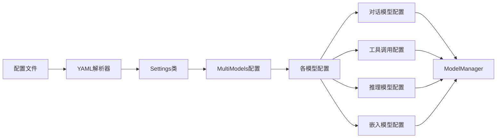

**图表来源**
- [settings.py](https://github.com/Shy2593666979/AgentChat/src/backend/agentchat/settings.py#L26-L61)
- [common.py](https://github.com/Shy2593666979/AgentChat/src/backend/agentchat/schema/common.py#L33-L46)

### 模型参数配置表

| 模型类型 | 配置字段 | 必填 | 默认值 | 说明 |
|---------|---------|------|--------|------|
| 对话模型 | model_name | 是 | - | 用于常规聊天交互 |
| 对话模型 | api_key | 是 | - | API密钥认证 |
| 对话模型 | base_url | 是 | - | API基础URL |
| 工具调用模型 | model_name | 是 | - | 用于函数调用 |
| 工具调用模型 | api_key | 是 | - | API密钥认证 |
| 工具调用模型 | base_url | 是 | - | API基础URL |
| 推理模型 | model_name | 是 | - | 复杂推理任务 |
| 推理模型 | api_key | 是 | - | API密钥认证 |
| 推理模型 | base_url | 是 | - | API基础URL |
| 嵌入模型 | model_name | 是 | - | 文本向量化 |
| 嵌入模型 | api_key | 是 | - | API密钥认证 |
| 嵌入模型 | base_url | 是 | - | API基础URL |

**章节来源**
- [settings.py](https://github.com/Shy2593666979/AgentChat/src/backend/agentchat/settings.py#L26-L61)
- [common.py](https://github.com/Shy2593666979/AgentChat/src/backend/agentchat/schema/common.py#L28-L46)
- [config.yaml](https://github.com/Shy2593666979/AgentChat/src/backend/agentchat/config.yaml#L19-L56)

## 前端配置集成

ModelManager通过服务层与前端配置系统紧密集成，实现了从用户配置到模型实例的完整链路。

### 配置服务架构

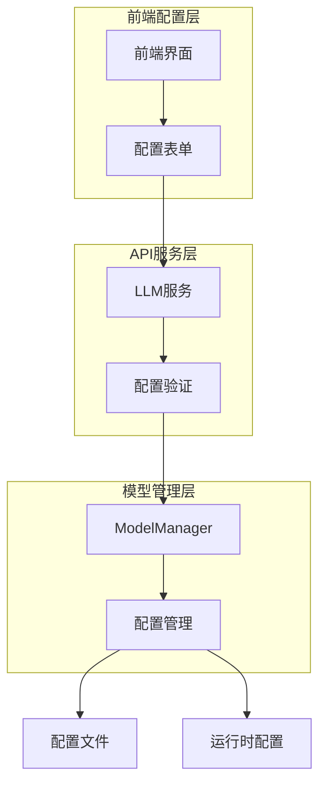

**图表来源**
- [llm.py](https://github.com/Shy2593666979/AgentChat/src/backend/agentchat/api/services/llm.py#L10-L292)

### 配置更新流程

当用户通过前端修改模型配置时，系统会按照以下流程处理：

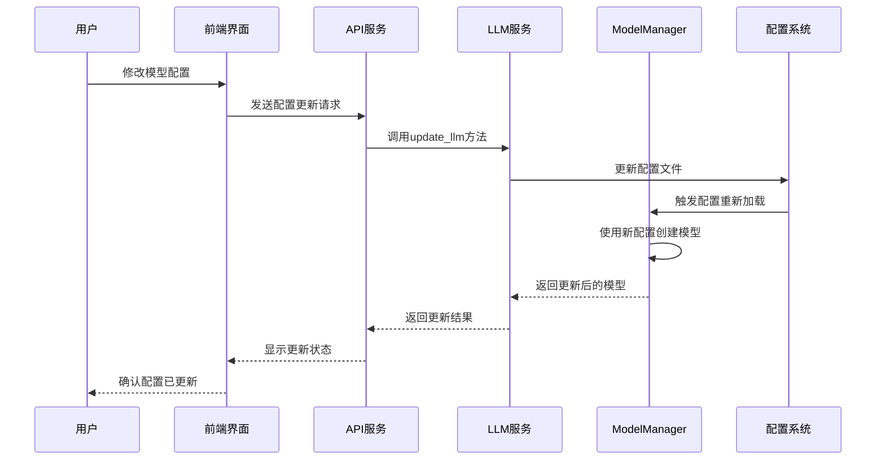

**图表来源**
- [llm.py](https://github.com/Shy2593666979/AgentChat/src/backend/agentchat/api/services/llm.py#L44-L49)

**章节来源**
- [llm.py](https://github.com/Shy2593666979/AgentChat/src/backend/agentchat/api/services/llm.py#L10-L292)

## 智能体集成方式

ModelManager在不同的智能体中以不同的方式被集成，满足各自的特定需求。

### PlanExecuteAgent集成

PlanExecuteAgent是系统中最复杂的智能体之一，充分利用了ModelManager提供的多种模型：

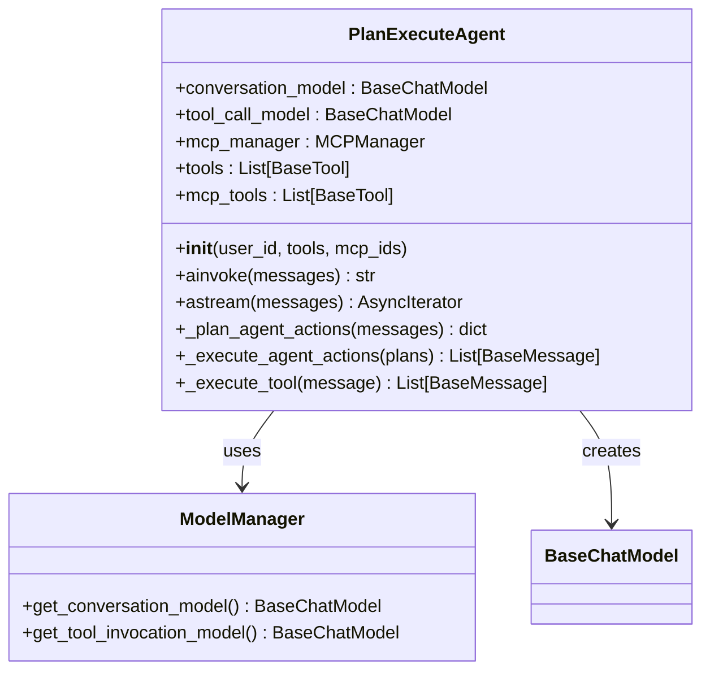

**图表来源**
- [plan_execute_agent.py](https://github.com/Shy2593666979/AgentChat/src/backend/agentchat/core/agents/plan_execute_agent.py#L17-L238)
- [manager.py](https://github.com/Shy2593666979/AgentChat/src/backend/agentchat/core/models/manager.py#L10-L62)

### 智能体使用模型的场景

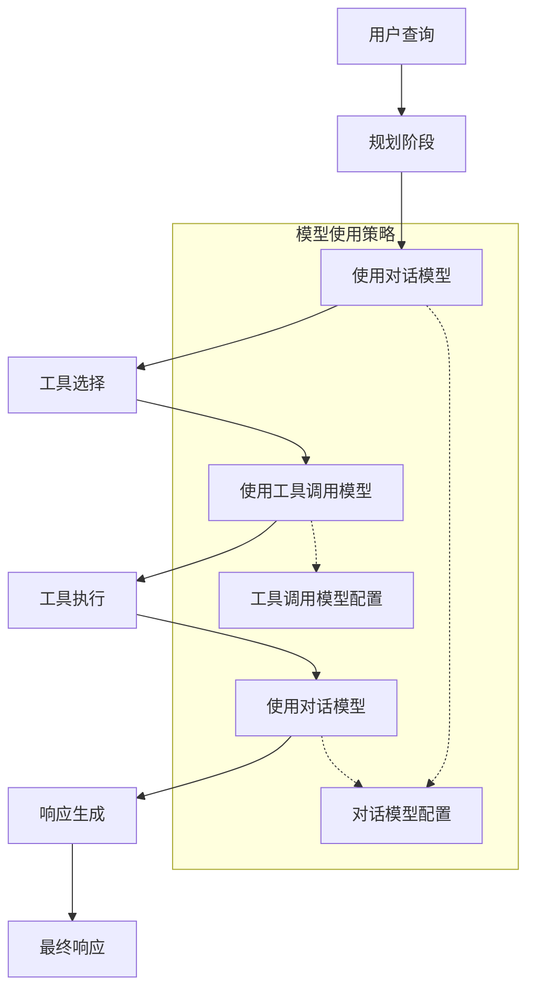

**图表来源**
- [plan_execute_agent.py](https://github.com/Shy2593666979/AgentChat/src/backend/agentchat/core/agents/plan_execute_agent.py#L80-L82)
- [plan_execute_agent.py](https://github.com/Shy2593666979/AgentChat/src/backend/agentchat/core/agents/plan_execute_agent.py#L214-L224)

### 不同智能体的模型使用模式

| 智能体类型 | 主要使用的模型 | 使用场景 | 配置特点 |
|-----------|---------------|----------|----------|
| PlanExecuteAgent | 对话模型、工具调用模型 | 复杂任务规划和执行 | 分别配置，支持异步调用 |
| StructuredResponseAgent | 对话模型 | 结构化响应生成 | 单一模型，专注格式化 |
| MCPAgent | 对话模型、推理模型 | MCP协议工具执行 | 支持多模型协作 |
| CodeActAgent | 对话模型、推理模型 | 代码生成和调试 | 强调推理能力 |

**章节来源**
- [plan_execute_agent.py](https://github.com/Shy2593666979/AgentChat/src/backend/agentchat/core/agents/plan_execute_agent.py#L71-L82)
- [plan_execute_agent.py](https://github.com/Shy2593666979/AgentChat/src/backend/agentchat/core/agents/plan_execute_agent.py#L193-L225)

## 性能优化策略

ModelManager采用了多种性能优化策略，确保模型调用的高效性和系统的稳定性。

### 流式输出优化

所有对话模型都启用了流式输出功能，减少用户等待时间：

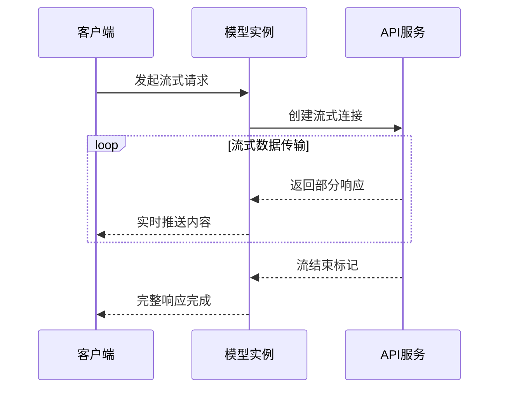

**图表来源**
- [manager.py](https://github.com/Shy2593666979/AgentChat/src/backend/agentchat/core/models/manager.py#L23-L26)

### 异步处理优化

对于嵌入模型，系统实现了高效的异步批量处理：

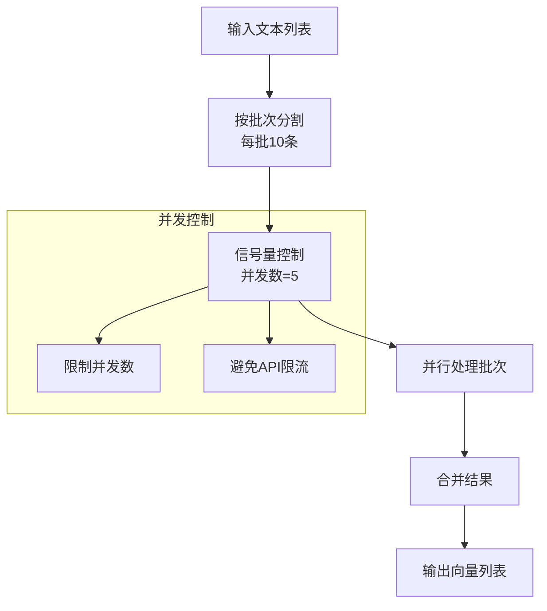

**图表来源**
- [embedding.py](https://github.com/Shy2593666979/AgentChat/src/backend/agentchat/core/models/embedding.py#L27-L59)

### 使用统计与监控

系统集成了详细的使用统计功能，帮助优化模型性能：

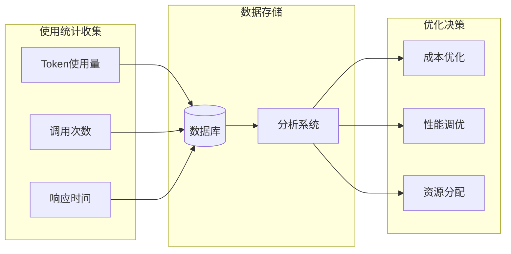

**图表来源**
- [usage_stats.py](https://github.com/Shy2593666979/AgentChat/src/backend/agentchat/api/services/usage_stats.py#L9-L31)

**章节来源**
- [embedding.py](https://github.com/Shy2593666979/AgentChat/src/backend/agentchat/core/models/embedding.py#L27-L59)
- [usage_stats.py](https://github.com/Shy2593666979/AgentChat/src/backend/agentchat/api/services/usage_stats.py#L9-L134)

## 配置指南

### 添加新模型支持

要为系统添加新的模型支持，需要按照以下步骤操作：

#### 1. 更新配置结构

在`common.py`中添加新的模型配置项：

```python
# 在MultiModels类中添加新模型
class MultiModels(BaseModel):
    # ... 现有模型配置
    new_model: ModelConfig = Field(default_factory=ModelConfig)
```

#### 2. 更新ModelManager

在`manager.py`中添加对应的获取方法：

```python
@classmethod
def get_new_model(cls, **kwargs) -> BaseChatModel:
    return ChatOpenAI(
        stream_usage=True,
        model=app_settings.multi_models.new_model.model_name,
        api_key=app_settings.multi_models.new_model.api_key,
        base_url=app_settings.multi_models.new_model.base_url)
```

#### 3. 更新配置文件

在`config.yaml`中添加新模型的配置：

```yaml
multi_models:
  new_model:
    api_key: "your-api-key"
    base_url: "https://api.example.com/v1"
    model_name: "new-model-name"
```

### 性能调优建议

#### 1. 模型选择策略

| 场景 | 推荐模型 | 配置要点 |
|------|---------|----------|
| 快速回复 | 对话模型 | 启用流式输出 |
| 工具调用 | 工具调用模型 | 专用模型，高精度 |
| 复杂推理 | 推理模型 | 专用推理能力 |
| 文本向量 | 嵌入模型 | 批量处理优化 |

#### 2. 并发控制优化

对于高并发场景，建议：

```python
# 在embedding.py中调整并发参数
semaphore = asyncio.Semaphore(10)  # 根据API限制调整
```

#### 3. 缓存策略

实现模型实例缓存，避免重复创建：

```python
# 在manager.py中添加缓存
@classmethod
def get_cached_model(cls, model_type: str, **kwargs):
    cache_key = f"{model_type}_{hash(kwargs)}"
    if cache_key not in cls._model_cache:
        cls._model_cache[cache_key] = cls._create_model(model_type, **kwargs)
    return cls._model_cache[cache_key]
```

**章节来源**
- [common.py](https://github.com/Shy2593666979/AgentChat/src/backend/agentchat/schema/common.py#L33-L46)
- [manager.py](https://github.com/Shy2593666979/AgentChat/src/backend/agentchat/core/models/manager.py#L10-L62)
- [config.yaml](https://github.com/Shy2593666979/AgentChat/src/backend/agentchat/config.yaml#L19-L56)

## 故障排除

### 常见问题及解决方案

#### 1. 配置加载失败

**问题症状**：模型无法创建，出现配置相关错误

**排查步骤**：
```python
# 检查配置文件语法
try:
    with open('config.yaml', 'r', encoding='utf-8') as f:
        config = yaml.safe_load(f)
except Exception as e:
    print(f"配置文件加载失败: {e}")

# 验证配置完整性
required_fields = ['model_name', 'api_key', 'base_url']
for field in required_fields:
    if not getattr(app_settings.multi_models.conversation_model, field):
        print(f"缺少必需字段: {field}")
```

#### 2. API调用失败

**问题症状**：模型实例化成功但API调用失败

**排查步骤**：
```python
# 测试API连通性
async def test_api_connection():
    try:
        client = AsyncOpenAI(
            api_key=app_settings.multi_models.conversation_model.api_key,
            base_url=app_settings.multi_models.conversation_model.base_url
        )
        response = await client.models.list()
        print("API连接成功")
    except Exception as e:
        print(f"API连接失败: {e}")
```

#### 3. 性能问题

**问题症状**：模型响应缓慢或超时

**优化措施**：
- 检查网络连接质量
- 调整并发连接数
- 启用适当的缓存策略
- 监控API使用配额

### 调试工具

系统提供了多种调试工具帮助诊断问题：

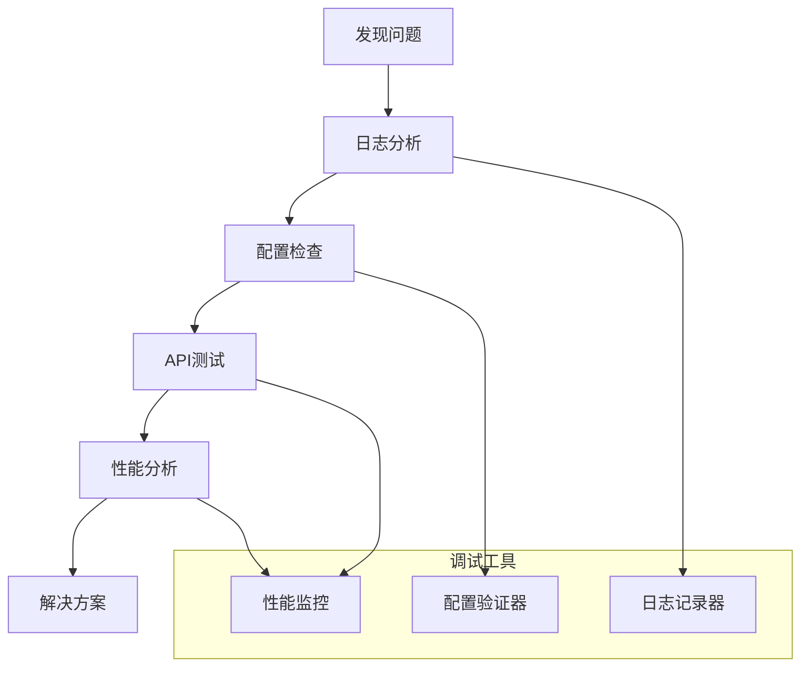

**章节来源**
- [settings.py](https://github.com/Shy2593666979/AgentChat/src/backend/agentchat/settings.py#L26-L61)
- [manager.py](https://github.com/Shy2593666979/AgentChat/src/backend/agentchat/core/models/manager.py#L13-L62)

## 总结

ModelManager作为AgentChat系统的核心组件，成功实现了以下目标：

### 核心优势

1. **统一管理**：通过单一接口管理多种类型的模型，简化了系统的复杂性
2. **配置驱动**：基于配置文件的模型管理，支持灵活的模型切换和扩展
3. **性能优化**：实现了流式输出、异步处理和使用统计等性能优化特性
4. **易于扩展**：清晰的架构设计使得添加新模型变得简单直观

### 设计亮点

- **模块化设计**：每个模型类型都有专门的处理逻辑
- **配置中心**：统一的配置管理，便于维护和扩展
- **类型安全**：使用Pydantic模型确保配置的类型安全
- **异步支持**：全面支持异步操作，提高系统响应性

### 应用价值

ModelManager不仅为当前的智能体提供了稳定的模型服务，更为系统的未来发展奠定了坚实的基础。其设计原则和实现方式可以作为其他类似系统的重要参考，展示了如何构建一个既灵活又可靠的模型管理系统。

通过合理的配置管理和性能优化，ModelManager确保了AgentChat系统能够高效、稳定地服务于各种复杂的AI应用场景，为用户提供优质的智能体验。
