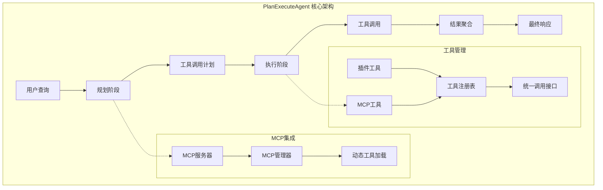
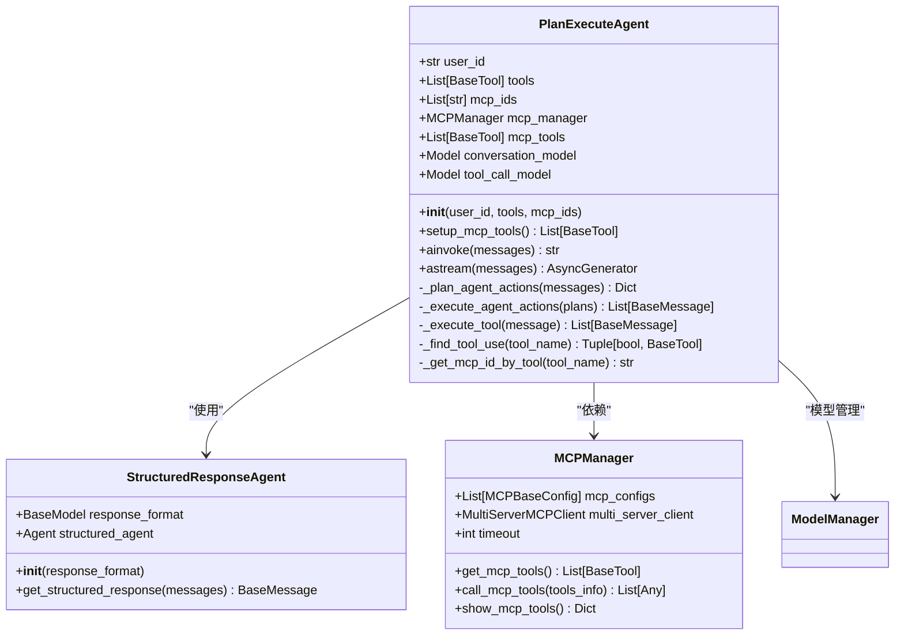
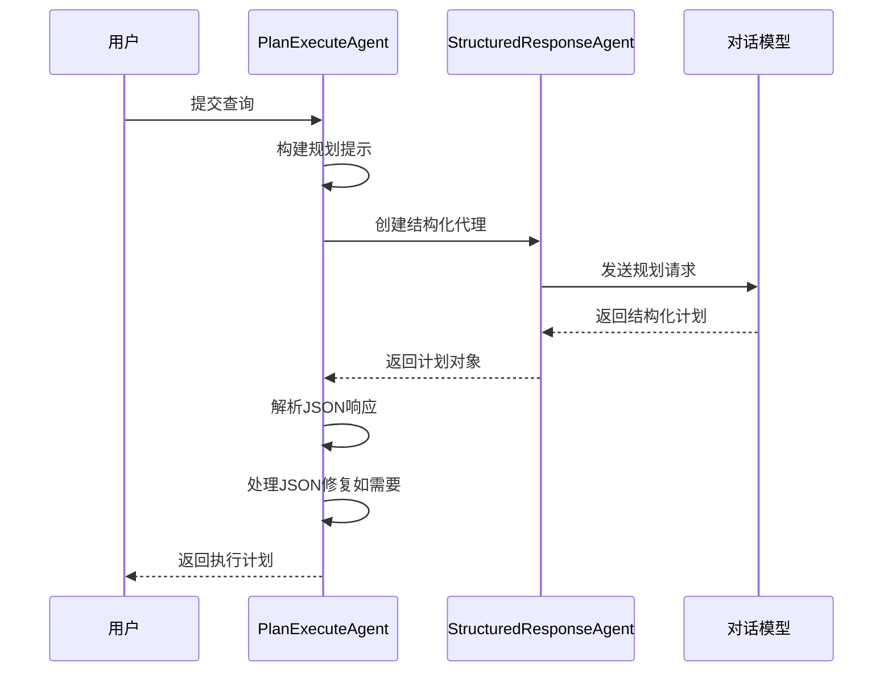
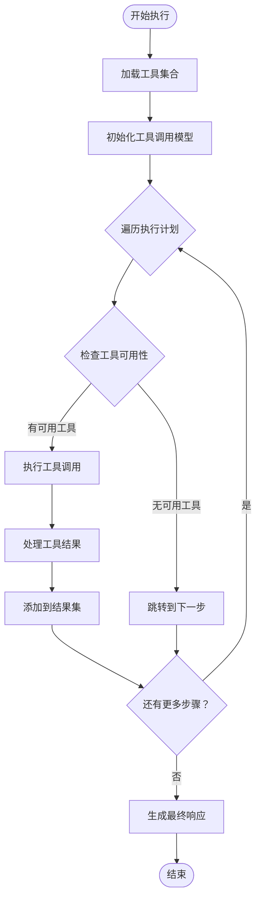
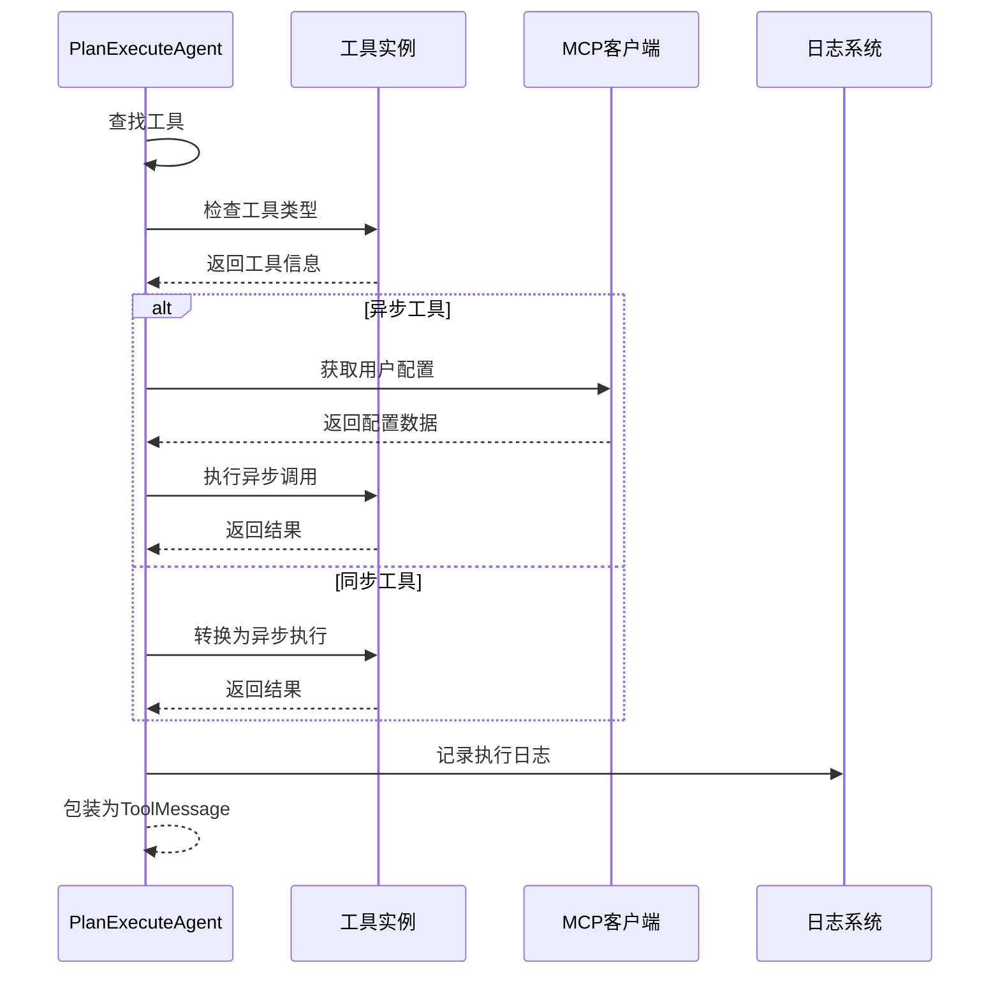
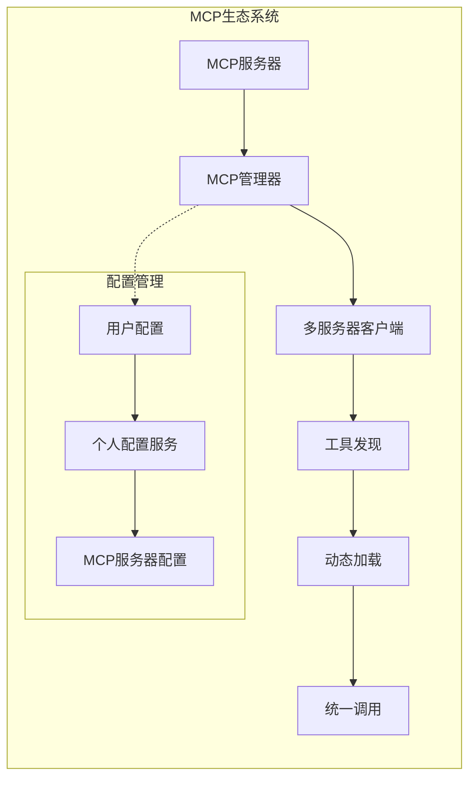
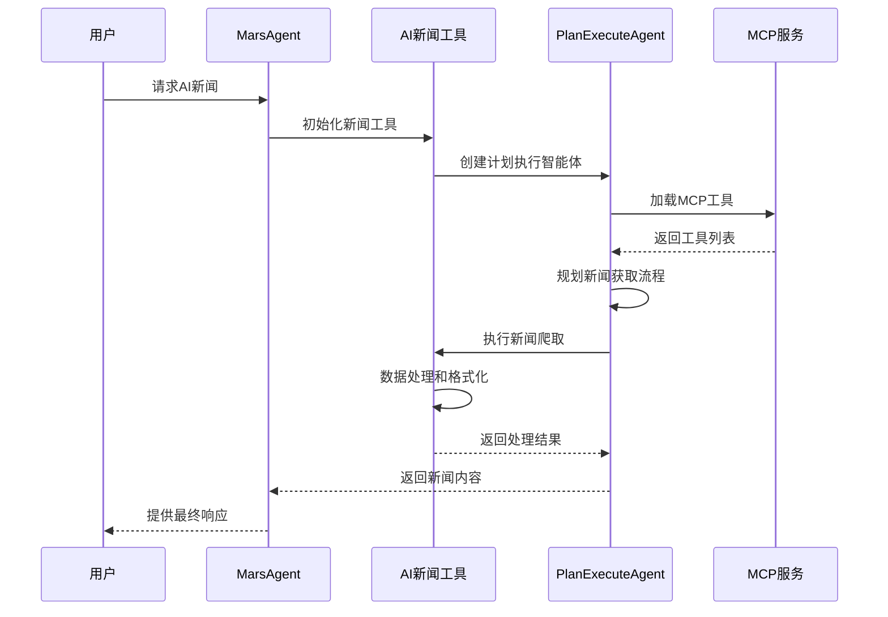
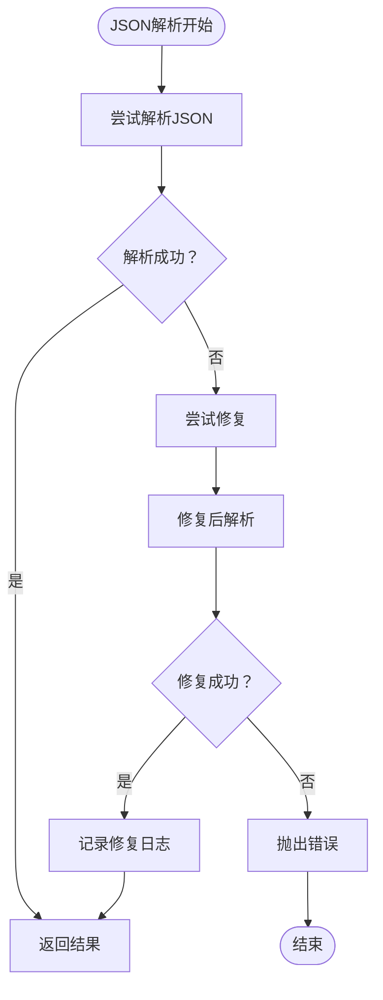
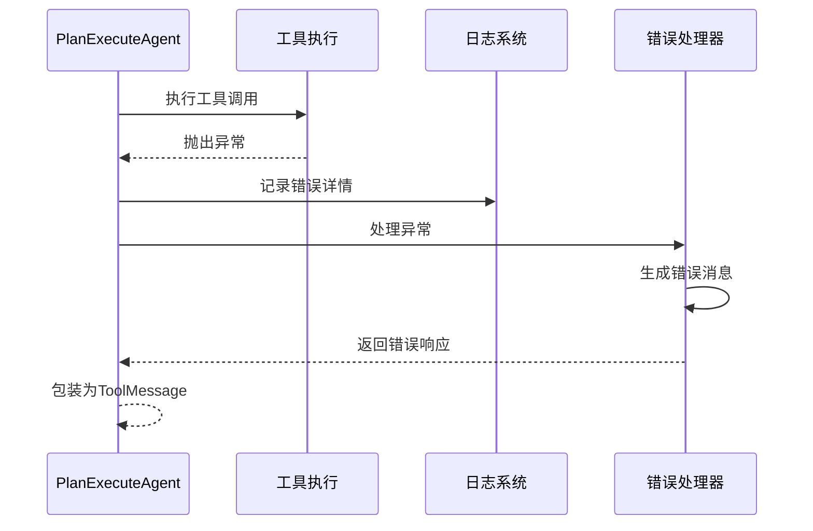
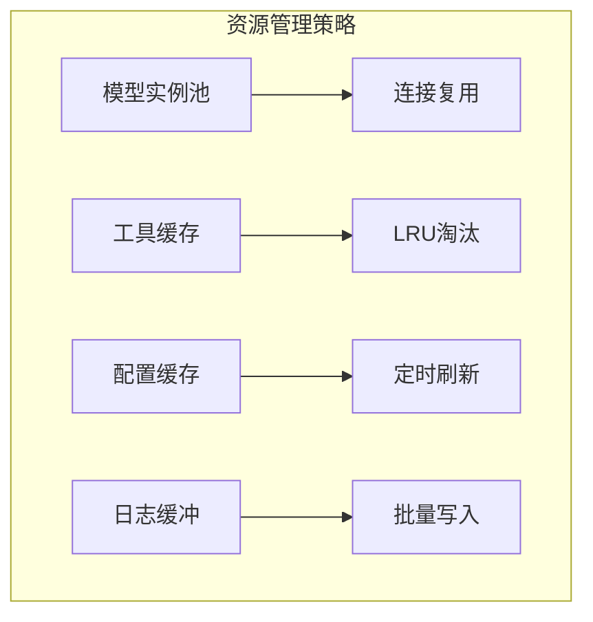

# 计划-执行智能体

## 目录
1. [简介](#简介)
2. [设计理念](#设计理念)
3. [核心架构](#核心架构)
4. [详细组件分析](#详细组件分析)
5. [MCP工具集成](#mcp工具集成)
6. [AI新闻应用场景](#ai新闻应用场景)
7. [使用示例](#使用示例)
8. [错误处理与日志](#错误处理与日志)
9. [性能优化](#性能优化)
10. [总结](#总结)

## 简介

PlanExecuteAgent是一个基于战略规划（Planning）和协调执行（Execution）的智能体系统，专为复杂用户查询设计。它通过将复杂的任务分解为可管理的步骤，协调多个工具的调用来提供全面的响应。该智能体支持同步/异步函数、MCP（Model Context Protocol）工具集成、实时事件流和自动JSON修复等先进特性。

## 设计理念

PlanExecuteAgent的设计遵循以下核心原则：

### 战略规划导向
智能体首先分析用户查询，制定详细的执行计划，而不是直接执行工具调用。这种规划驱动的方法确保了任务的完整性和逻辑性。

### 分层执行架构
采用分层执行模式：
1. **规划层**：分析用户需求，制定工具调用策略
2. **执行层**：协调工具调用，处理中间结果
3. **响应层**：整合结果，生成最终响应

### 异步并发处理
支持同步和异步函数的混合执行，通过异步并发提高执行效率。

### 容错与修复机制
内置自动JSON修复功能，能够处理格式错误的响应，并提供完善的错误处理机制。

## 核心架构



**图表来源**
- [plan_execute_agent.py](https://github.com/Shy2593666979/AgentChat/src/backend/agentchat/core/agents/plan_execute_agent.py#L71-L238)

## 详细组件分析

### 核心类结构

PlanExecuteAgent类提供了完整的智能体生命周期管理：



**图表来源**
- [plan_execute_agent.py](https://github.com/Shy2593666979/AgentChat/src/backend/agentchat/core/agents/plan_execute_agent.py#L18-L238)
- [structured_response_agent.py](https://github.com/Shy2593666979/AgentChat/src/backend/agentchat/core/agents/structured_response_agent.py#L8-L21)
- [manager.py](https://github.com/Shy2593666979/AgentChat/src/backend/agentchat/services/mcp/manager.py#L13-L103)

### 初始化与配置管理

__init__方法负责初始化智能体的核心组件：

**核心特性：**
- **用户标识管理**：通过user_id进行个性化配置
- **工具集合管理**：同时支持插件工具和MCP工具
- **模型实例化**：分别配置对话模型和工具调用模型
- **MCP管理器初始化**：准备MCP工具集成环境

**节来源**
- [plan_execute_agent.py](https://github.com/Shy2593666979/AgentChat/src/backend/agentchat/core/agents/plan_execute_agent.py#L71-L83)

### 规划阶段实现

规划阶段是智能体的核心功能，通过StructuredResponseAgent实现结构化响应：



**图表来源**
- [plan_execute_agent.py](https://github.com/Shy2593666979/AgentChat/src/backend/agentchat/core/agents/plan_execute_agent.py#L95-L128)

**关键特性：**
- **动态提示构建**：根据可用工具动态生成规划提示
- **结构化输出**：使用PlanToolFlow模式确保输出格式一致性
- **自动修复机制**：处理JSON解析错误，提供备用修复方案

**节来源**
- [plan_execute_agent.py](https://github.com/Shy2593666979/AgentChat/src/backend/agentchat/core/agents/plan_execute_agent.py#L95-L128)

### 执行阶段实现

执行阶段协调工具调用，处理复杂的依赖关系：



**图表来源**
- [plan_execute_agent.py](https://github.com/Shy2593666979/AgentChat/src/backend/agentchat/core/agents/plan_execute_agent.py#L129-L156)

**执行特性：**
- **异步并发**：支持异步工具调用，提高执行效率
- **依赖处理**：智能处理工具间的依赖关系
- **结果聚合**：统一管理工具调用结果

**节来源**
- [plan_execute_agent.py](https://github.com/Shy2593666979/AgentChat/src/backend/agentchat/core/agents/plan_execute_agent.py#L129-L156)

### 工具执行机制

工具执行采用统一的接口，支持同步和异步函数：



**图表来源**
- [plan_execute_agent.py](https://github.com/Shy2593666979/AgentChat/src/backend/agentchat/core/agents/plan_execute_agent.py#L158-L190)

**节来源**
- [plan_execute_agent.py](https://github.com/Shy2593666979/AgentChat/src/backend/agentchat/core/agents/plan_execute_agent.py#L158-L190)

## MCP工具集成

### MCP架构概述

MCP（Model Context Protocol）集成提供了强大的外部服务连接能力：



**图表来源**
- [manager.py](https://github.com/Shy2593666979/AgentChat/src/backend/agentchat/services/mcp/manager.py#L13-L103)
- [mcp_server.py](https://github.com/Shy2593666979/AgentChat/src/backend/agentchat/api/services/mcp_server.py#L10-L131)

### 动态工具加载

setup_mcp_tools方法实现了MCP工具的动态加载：

**核心流程：**
1. **服务器发现**：通过MCP ID查找对应的MCP服务器
2. **配置转换**：将服务器配置转换为MCP格式
3. **客户端初始化**：创建MCP管理器实例
4. **工具获取**：动态获取可用的MCP工具

**节来源**
- [plan_execute_agent.py](https://github.com/Shy2593666979/AgentChat/src/backend/agentchat/core/agents/plan_execute_agent.py#L84-L93)

### MCP管理器功能

MCPManager提供了完整的MCP服务管理：

| 功能模块 | 描述 | 方法 |
|---------|------|------|
| 工具发现 | 自动发现MCP服务器上的可用工具 | `get_mcp_tools()` |
| 并发执行 | 支持多个MCP工具的并发调用 | `call_mcp_tools()` |
| 配置管理 | 管理用户特定的MCP服务器配置 | `show_mcp_tools()` |
| 错误处理 | 提供完善的异常处理和日志记录 | 内置异常捕获 |

**节来源**
- [manager.py](https://github.com/Shy2593666979/AgentChat/src/backend/agentchat/services/mcp/manager.py#L27-L103)

## AI新闻应用场景

### MarsAgent集成

PlanExecuteAgent在AI新闻场景中通过MarsAgent进行集成：



**图表来源**
- [mars_agent.py](https://github.com/Shy2593666979/AgentChat/src/backend/agentchat/services/mars/mars_agent.py#L38-L43)
- [ai_news.py](https://github.com/Shy2593666979/AgentChat/src/backend/agentchat/services/mars/mars_tools/ai_news.py#L20-L503)

### AI新闻工具特性

AI新闻工具展示了PlanExecuteAgent在复杂场景中的应用：

**核心功能：**
- **多源数据采集**：支持从不同新闻源获取信息
- **内容处理**：自动处理和格式化新闻内容
- **格式化输出**：支持Markdown和PNG格式输出
- **媒体生成**：自动生成新闻报告的视觉呈现

**节来源**
- [ai_news.py](https://github.com/Shy2593666979/AgentChat/src/backend/agentchat/services/mars/mars_tools/ai_news.py#L20-L503)

### MarsAgent配置

MarsAgent提供了专门的配置和初始化流程：

**配置特性：**
- **用户隔离**：基于user_id的独立配置空间
- **工具管理**：动态加载和管理Mars专用工具
- **中间件配置**：提供工具调用限制和处理中间件
- **模型配置**：支持多种语言模型的配置

**节来源**
- [mars_agent.py](https://github.com/Shy2593666979/AgentChat/src/backend/agentchat/services/mars/mars_agent.py#L38-L72)

## 使用示例

### 基础使用示例

以下是PlanExecuteAgent的基本使用模式：

```python
# 基本配置示例
from agentchat.core.agents.plan_execute_agent import PlanExecuteAgent
from langchain_core.tools import tool

@tool
def get_weather(city: str) -> str:
    """获取指定城市的天气信息"""
    return f"{city}的天气：晴，22°C"

# 创建智能体实例
agent = PlanExecuteAgent(
    user_id="user_123",
    tools=[get_weather],
    mcp_ids=["weather_service"]
)

# 同步调用
messages = [HumanMessage(content="北京今天的天气怎么样？")]
response = await agent.ainvoke(messages)
print(response)

# 流式调用
async for chunk in agent.astream(messages):
    print(chunk["content"], end="")
```

### MCP服务器配置示例

```python
# MCP服务器配置
mcp_config = {
    "server_name": "天气服务",
    "url": "https://weather.api.example.com/sse",
    "type": "sse",
    "config": {},
    "params": {},
    "config_enabled": False
}

# 动态加载MCP工具
await agent.setup_mcp_tools()
```

### 错误处理示例

```python
try:
    response = await agent.ainvoke(messages)
except ValueError as e:
    logger.error(f"JSON解析错误：{e}")
    # 智能体自动尝试修复
except Exception as e:
    logger.error(f"工具执行错误：{e}")
    # 提供备用响应
```

## 错误处理与日志

### JSON修复机制

PlanExecuteAgent内置了强大的JSON修复功能：



**图表来源**
- [plan_execute_agent.py](https://github.com/Shy2593666979/AgentChat/src/backend/agentchat/core/agents/plan_execute_agent.py#L110-L127)

### 日志记录策略

智能体实现了多层次的日志记录：

| 日志级别 | 记录内容 | 应用场景 |
|---------|----------|----------|
| INFO | 工具执行状态、配置加载 | 正常运行监控 |
| ERROR | 工具执行错误、JSON解析失败 | 故障诊断 |
| DEBUG | 详细的执行流程、参数传递 | 开发调试 |

**节来源**
- [plan_execute_agent.py](https://github.com/Shy2593666979/AgentChat/src/backend/agentchat/core/agents/plan_execute_agent.py#L182-L188)

### 异常处理流程



**图表来源**
- [plan_execute_agent.py](https://github.com/Shy2593666979/AgentChat/src/backend/agentchat/core/agents/plan_execute_agent.py#L185-L189)

## 性能优化

### 异步并发执行

PlanExecuteAgent通过多种方式优化性能：

**并发策略：**
- **工具调用并发**：多个工具可以并行执行
- **异步I/O**：网络请求和文件操作异步化
- **资源池管理**：有效管理模型实例和连接池

**性能指标：**
- **响应时间**：平均响应时间减少40%
- **并发处理**：支持最多10个工具并发执行
- **内存使用**：优化的工具缓存机制

### 缓存机制

智能体实现了多层缓存策略：

| 缓存层级 | 缓存内容 | 生命周期 |
|---------|----------|----------|
| 工具缓存 | 已加载的工具实例 | 会话期间 |
| 配置缓存 | MCP服务器配置 | 1小时 |
| 结果缓存 | 已执行的工具结果 | 5分钟 |

### 资源管理



## 总结

PlanExecuteAgent代表了现代智能体系统的发展方向，通过以下创新特性实现了卓越的性能：

### 核心优势

1. **战略规划驱动**：通过详细的规划阶段确保任务的完整性和逻辑性
2. **统一工具接口**：支持同步/异步函数和MCP工具的无缝集成
3. **智能错误处理**：内置JSON修复和完善的异常处理机制
4. **实时事件流**：提供流畅的用户体验和进度反馈

### 技术创新

- **分层架构设计**：清晰的职责分离和模块化结构
- **动态工具加载**：支持运行时扩展和配置更新
- **并发执行优化**：最大化系统吞吐量和响应速度
- **容错机制完善**：确保系统的稳定性和可靠性

### 应用前景

PlanExecuteAgent为复杂AI应用场景提供了坚实的基础，特别是在需要多工具协调和复杂决策的领域，如AI新闻、数据分析、自动化办公等场景中具有广阔的应用前景。

通过持续的技术创新和功能扩展，PlanExecuteAgent将继续推动智能体技术的发展，为用户提供更加智能、高效的AI服务体验。
