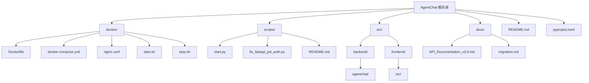
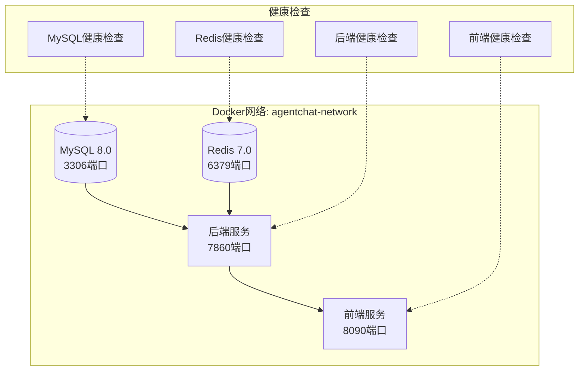
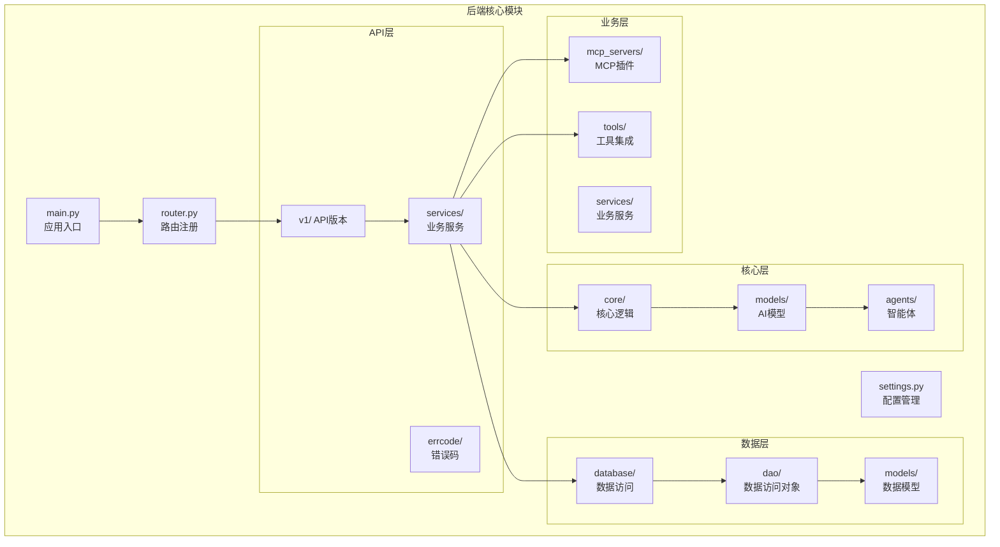
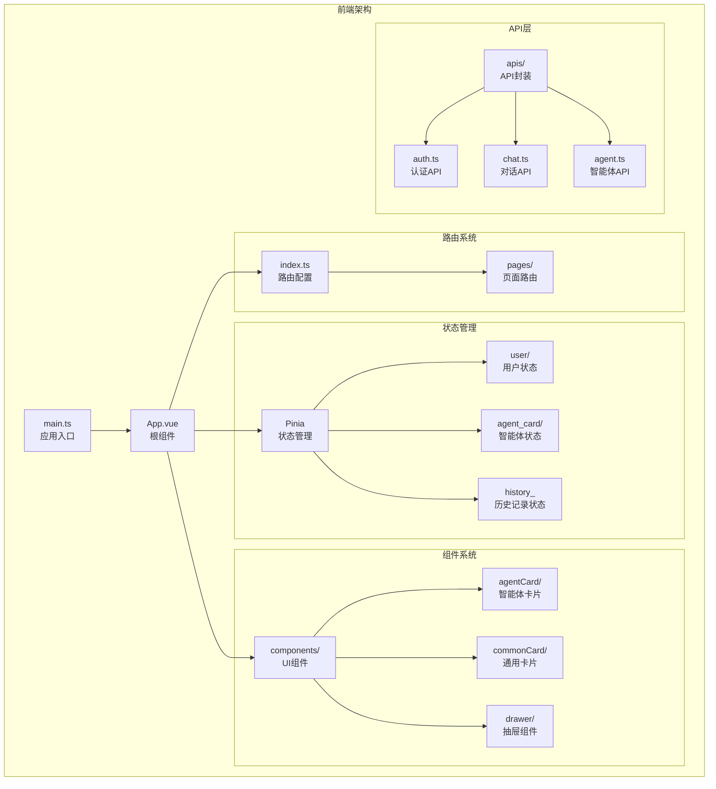
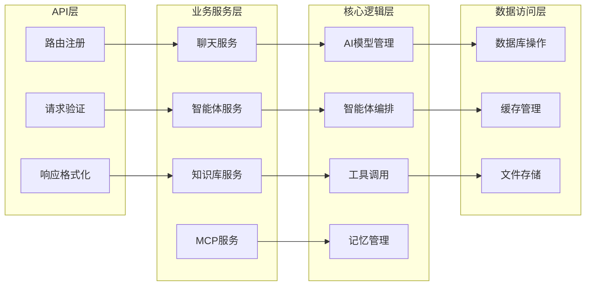
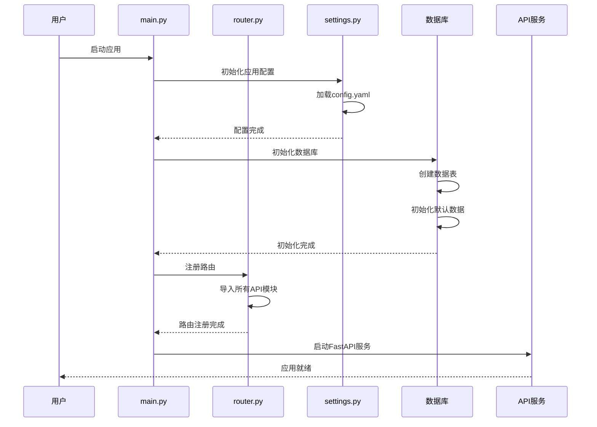
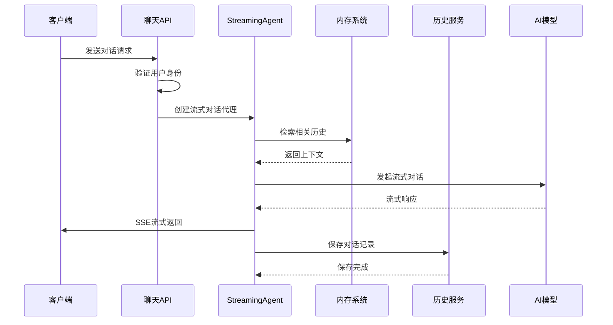

# AgentChat项目目录结构全面解析

<cite>
**本文档引用的文件**
- [README.md](https://github.com/Shy2593666979/AgentChat/README.md)
- [docker/Dockerfile](https://github.com/Shy2593666979/AgentChat/docker/Dockerfile)
- [docker/docker-compose.yml](https://github.com/Shy2593666979/AgentChat/docker/docker-compose.yml)
- [scripts/start.py](https://github.com/Shy2593666979/AgentChat/scripts/start.py)
- [scripts/fix_fastapi_jwt_auth.py](https://github.com/Shy2593666979/AgentChat/scripts/fix_fastapi_jwt_auth.py)
- [src/backend/agentchat/main.py](https://github.com/Shy2593666979/AgentChat/src/backend/agentchat/main.py)
- [src/backend/agentchat/api/router.py](https://github.com/Shy2593666979/AgentChat/src/backend/agentchat/api/router.py)
- [src/backend/agentchat/settings.py](https://github.com/Shy2593666979/AgentChat/src/backend/agentchat/settings.py)
- [src/backend/agentchat/core/models/manager.py](https://github.com/Shy2593666979/AgentChat/src/backend/agentchat/core/models/manager.py)
- [src/backend/agentchat/database/session.py](https://github.com/Shy2593666979/AgentChat/src/backend/agentchat/database/session.py)
- [src/backend/agentchat/tools/__init__.py](https://github.com/Shy2593666979/AgentChat/src/backend/agentchat/tools/__init__.py)
- [src/frontend/src/main.ts](https://github.com/Shy2593666979/AgentChat/src/frontend/src/main.ts)
- [src/frontend/src/router/index.ts](https://github.com/Shy2593666979/AgentChat/src/frontend/src/router/index.ts)
- [src/frontend/src/store/user/index.ts](https://github.com/Shy2593666979/AgentChat/src/frontend/src/store/user/index.ts)
- [src/backend/agentchat/api/v1/chat.py](https://github.com/Shy2593666979/AgentChat/src/backend/agentchat/api/v1/chat.py)
</cite>

## 目录

1. [项目概述](#项目概述)
2. [根目录结构](#根目录结构)
3. [Docker容器化配置](#docker容器化配置)
4. [脚本工具集](#脚本工具集)
5. [后端架构详解](#后端架构详解)
6. [前端架构详解](#前端架构详解)
7. [核心模块功能边界](#核心模块功能边界)
8. [代码执行流程](#代码执行流程)
9. [部署与启动指南](#部署与启动指南)
10. [总结](#总结)

## 项目概述

AgentChat是一个现代化的智能对话系统，基于大语言模型构建，采用前后端分离架构。项目支持多Agent协作、知识库检索、工具调用、MCP服务器集成等高级功能，具有完整的容器化部署能力和丰富的功能模块。

**项目特色：**
- 🤖 **多模型支持**：集成OpenAI、DeepSeek、Qwen等主流大语言模型
- 🧠 **智能Agent**：支持多Agent协作，具备推理和决策能力
- 📚 **知识库检索**：RAG技术实现精准知识检索和问答
- 🔧 **工具生态**：内置多种实用工具，支持自定义扩展
- 🌐 **MCP集成**：支持Model Context Protocol服务器
- 💬 **实时对话**：流式响应，提供流畅的对话体验

## 根目录结构



**图表来源**
- [README.md](https://github.com/Shy2593666979/AgentChat/README.md#L360-L506)
- [docker/Dockerfile](https://github.com/Shy2593666979/AgentChat/docker/Dockerfile#L1-L39)
- [scripts/start.py](https://github.com/Shy2593666979/AgentChat/scripts/start.py#L1-L125)

**章节来源**
- [README.md](https://github.com/Shy2593666979/AgentChat/README.md#L360-L506)

## Docker容器化配置

### Dockerfile配置

Dockerfile负责构建后端服务的基础镜像，包含Python 3.12环境、系统依赖和项目代码。

**主要特性：**
- 基于Python 3.12-slim镜像
- 安装必要的系统依赖（gcc、g++、curl、git）
- 配置工作目录和环境变量
- 集成FastAPI-JWT-Auth兼容性修复
- 暴露7860端口供FastAPI服务使用

### Docker Compose编排

docker-compose.yml定义了完整的微服务架构：



**图表来源**
- [docker/docker-compose.yml](https://github.com/Shy2593666979/AgentChat/docker/docker-compose.yml#L1-L126)

**章节来源**
- [docker/Dockerfile](https://github.com/Shy2593666979/AgentChat/docker/Dockerfile#L1-L39)
- [docker/docker-compose.yml](https://github.com/Shy2593666979/AgentChat/docker/docker-compose.yml#L1-L126)

## 脚本工具集

### 启动脚本（start.py）

start.py提供了完整的项目启动流程，支持依赖安装和前后端服务并发启动。

**启动流程：**
1. **依赖检测**：在项目根目录查找requirements.txt文件
2. **依赖安装**：使用pip安装Python依赖包
3. **服务启动**：
   - 后端服务：在src/backend目录下启动FastAPI应用
   - 前端服务：在src/frontend目录下启动Vite开发服务器

### JWT认证修复脚本（fix_fastapi_jwt_auth.py）

解决fastapi-jwt-auth库与Pydantic 2.x版本的兼容性问题。

**修复内容：**
- 替换旧版Pydantic字段类型为Pydantic 2兼容版本
- 添加StrictBool、StrictInt、StrictStr等严格类型
- 更新验证器函数和配置类结构
- 提供自动备份和恢复机制

**章节来源**
- [scripts/start.py](https://github.com/Shy2593666979/AgentChat/scripts/start.py#L1-L125)
- [scripts/fix_fastapi_jwt_auth.py](https://github.com/Shy2593666979/AgentChat/scripts/fix_fastapi_jwt_auth.py#L1-L196)

## 后端架构详解

### 整体架构



**图表来源**
- [src/backend/agentchat/main.py](https://github.com/Shy2593666979/AgentChat/src/backend/agentchat/main.py#L1-L108)
- [src/backend/agentchat/api/router.py](https://github.com/Shy2593666979/AgentChat/src/backend/agentchat/api/router.py#L1-L28)
- [src/backend/agentchat/settings.py](https://github.com/Shy2593666979/AgentChat/src/backend/agentchat/settings.py#L1-L62)

### 主要子模块功能

#### API模块（api/）
- **router.py**：统一路由注册中心，包含所有API端点
- **v1/**：API版本1的完整接口实现
- **services/**：各业务领域的API服务封装
- **errcode/**：统一错误码和异常处理

#### 核心模块（core/）
- **agents/**：智能体实现（CodeAct、MCP、PlanExecute等）
- **models/**：AI模型管理和服务
- **callbacks/**：事件回调机制

#### 数据库模块（database/）
- **session.py**：数据库连接和会话管理
- **dao/**：数据访问对象，实现CRUD操作
- **models/**：数据模型定义
- **init_data.py**：数据库初始化脚本

#### MCP服务器模块（mcp_servers/）
- **weather/**：天气查询MCP服务
- **arxiv/**：学术论文MCP服务
- **lark_mcp/**：飞书办公MCP服务

#### 工具模块（tools/）
- **web_search/**：网络搜索工具
- **get_weather/**：天气查询工具
- **text2image/**：文生图工具
- **convert_to_pdf/**：格式转换工具

**章节来源**
- [src/backend/agentchat/main.py](https://github.com/Shy2593666979/AgentChat/src/backend/agentchat/main.py#L1-L108)
- [src/backend/agentchat/api/router.py](https://github.com/Shy2593666979/AgentChat/src/backend/agentchat/api/router.py#L1-L28)
- [src/backend/agentchat/settings.py](https://github.com/Shy2593666979/AgentChat/src/backend/agentchat/settings.py#L1-L62)

## 前端架构详解

### 前端技术栈



**图表来源**
- [src/frontend/src/main.ts](https://github.com/Shy2593666979/AgentChat/src/frontend/src/main.ts#L1-L18)
- [src/frontend/src/router/index.ts](https://github.com/Shy2593666979/AgentChat/src/frontend/src/router/index.ts#L1-L255)
- [src/frontend/src/store/user/index.ts](https://github.com/Shy2593666979/AgentChat/src/frontend/src/store/user/index.ts#L1-L83)

### 前端模块组织

#### 源代码结构（src/）
- **main.ts**：Vue应用入口点，初始化Pinia和路由
- **App.vue**：根组件，定义全局布局
- **router/**：Vue Router配置，支持嵌套路由和权限控制
- **store/**：Pinia状态管理，包括用户、智能体、历史记录状态
- **components/**：可复用UI组件库
- **pages/**：页面级组件，按功能模块组织
- **apis/**：API接口封装，统一HTTP请求处理

#### 页面路由结构
- **workspace/**：工作区管理页面
- **agent/**：智能体管理页面
- **knowledge/**：知识库管理页面
- **tool/**：工具管理页面
- **mcp-server/**：MCP服务器管理页面
- **configuration/**：系统配置页面

**章节来源**
- [src/frontend/src/main.ts](https://github.com/Shy2593666979/AgentChat/src/frontend/src/main.ts#L1-L18)
- [src/frontend/src/router/index.ts](https://github.com/Shy2593666979/AgentChat/src/frontend/src/router/index.ts#L1-L255)
- [src/frontend/src/store/user/index.ts](https://github.com/Shy2593666979/AgentChat/src/frontend/src/store/user/index.ts#L1-L83)

## 核心模块功能边界

### 后端核心模块边界



**图表来源**
- [src/backend/agentchat/api/v1/chat.py](https://github.com/Shy2593666979/AgentChat/src/backend/agentchat/api/v1/chat.py#L1-L122)
- [src/backend/agentchat/core/models/manager.py](https://github.com/Shy2593666979/AgentChat/src/backend/agentchat/core/models/manager.py#L1-L63)
- [src/backend/agentchat/database/session.py](https://github.com/Shy2593666979/AgentChat/src/backend/agentchat/database/session.py#L1-L36)

### 工具模块边界

工具模块提供了丰富的功能扩展能力：

| 工具分类 | 主要工具 | 功能描述 |
|---------|---------|---------|
| **通信工具** | send_email | 邮件发送功能 |
| **信息检索** | web_search | Google/Tavily搜索 |
| **学术工具** | arxiv | 学术论文查询 |
| **生活服务** | get_weather | 天气信息查询 |
| **文档处理** | convert_to_pdf/docx | 格式转换 |
| **图像处理** | text2image/image2text | 图像生成和识别 |
| **网络工具** | crawl_web | 网页爬取 |

**章节来源**
- [src/backend/agentchat/tools/__init__.py](https://github.com/Shy2593666979/AgentChat/src/backend/agentchat/tools/__init__.py#L1-L48)

## 代码执行流程

### 应用启动流程



**图表来源**
- [src/backend/agentchat/main.py](https://github.com/Shy2593666979/AgentChat/src/backend/agentchat/main.py#L66-L75)
- [src/backend/agentchat/settings.py](https://github.com/Shy2593666979/AgentChat/src/backend/agentchat/settings.py#L26-L62)

### 对话处理流程



**图表来源**
- [src/backend/agentchat/api/v1/chat.py](https://github.com/Shy2593666979/AgentChat/src/backend/agentchat/api/v1/chat.py#L49-L122)

**章节来源**
- [src/backend/agentchat/main.py](https://github.com/Shy2593666979/AgentChat/src/backend/agentchat/main.py#L66-L75)
- [src/backend/agentchat/api/v1/chat.py](https://github.com/Shy2593666979/AgentChat/src/backend/agentchat/api/v1/chat.py#L49-L122)

## 部署与启动指南

### Docker部署

**快速部署步骤：**
1. 克隆项目：`git clone https://github.com/Shy2593666979/AgentChat.git`
2. 配置API密钥：复制配置文件并填写API密钥
3. 启动服务：`docker-compose up --build -d`

**服务访问：**
- 前端界面：`http://localhost:8090`
- 后端API：`http://localhost:7860`
- API文档：`http://localhost:7860/docs`

### 本地开发部署

**后端环境：**
```bash
# 安装依赖
pip install -r requirements.txt

# 启动后端服务
cd src/backend
uvicorn agentchat.main:app --port 7860 --host 0.0.0.0
```

**前端环境：**
```bash
# 安装依赖
cd src/frontend
npm install

# 启动前端服务
npm run dev
```

**章节来源**
- [scripts/start.py](https://github.com/Shy2593666979/AgentChat/scripts/start.py#L1-L125)
- [docker/docker-compose.yml](https://github.com/Shy2593666979/AgentChat/docker/docker-compose.yml#L50-L126)

## 总结

AgentChat项目展现了现代Web应用的最佳实践，通过清晰的模块化设计实现了高度的可维护性和扩展性：

### 架构优势
- **前后端分离**：Vue 3 + FastAPI的现代化技术栈
- **模块化设计**：清晰的功能边界和职责划分
- **容器化部署**：Docker支持，便于开发和生产环境部署
- **工具生态**：丰富的内置工具和MCP协议支持

### 开发友好性
- **完善的文档**：详细的API文档和开发指南
- **自动化脚本**：简化部署和依赖管理
- **类型安全**：TypeScript和Pydantic提供强类型支持
- **状态管理**：Pinia和Context实现高效的状态管理

### 扩展能力
- **插件化架构**：MCP服务器和工具系统的可扩展设计
- **多模型支持**：灵活的AI模型集成机制
- **知识库系统**：RAG技术实现的知识检索增强

这个项目为AI对话系统的开发提供了完整的解决方案，无论是学习还是实际应用都具有很高的参考价值。